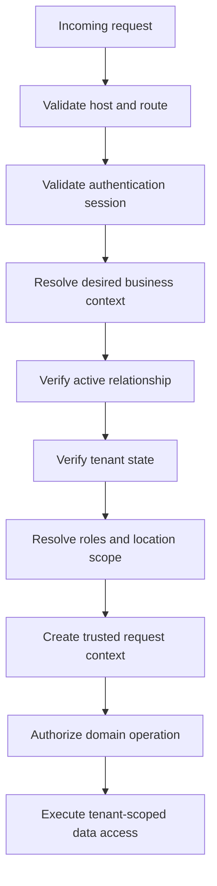

# Multi-Tenant Security Model

Status: Authoritative architecture foundation specification  
Audience: Engineering, security, data, QA, platform operations, support, and implementation partners  
MVP architecture: Shared application and PostgreSQL database with enforced row-level tenant isolation

## 1. Purpose

PetCare serves independent pet-care businesses from shared application infrastructure. Each business is a tenant. This document defines how the platform prevents one tenant from reading, changing, inferring, corrupting, or exhausting another tenant’s data and resources.

Tenant isolation is a system property, not a query convention. Every request path, background process, storage operation, integration, report, search result, log, cache, and administrative action must preserve it.

## 2. Security objective

For any tenant-owned operation:

```text
Authenticated actor
  + trusted tenant context
  + active tenant relationship
  + allowed permission and scope
  + resource belongs to tenant
  + domain policy permits action
  = allowed operation
```

Failure of any required condition results in denial. Client-supplied tenant IDs, record IDs, URLs, hidden controls, and cached claims never establish authorization by themselves.

## 3. Threats in scope

- Cross-tenant reads or writes caused by missing filters.
- Insecure direct object references using another tenant’s record ID.
- Tenant-context injection through headers, paths, forms, or query parameters.
- Stale or forged claims after membership, role, or tenant changes.
- Storage path guessing and signed-link leakage.
- Shared cache keys returning another tenant’s content.
- Queue jobs executing without tenant or actor context.
- Search indexes, analytics, exports, reports, and logs leaking tenant data.
- Webhook events routed to the wrong tenant.
- Platform support access that silently becomes unrestricted impersonation.
- Service credentials bypassing row-level security.
- Foreign-key, unique-constraint, timing, count, and error-message inference.
- Tenant onboarding, suspension, export, retention, and deletion mistakes.
- Noisy-neighbor resource exhaustion.
- Custom domain or host-header confusion selecting the wrong tenant.
- AI retrieval, prompts, files, or conversation memory crossing tenant boundaries.

## 4. Tenancy model

### 4.1 Tenant definition

The security tenant is a `Business`. A business may contain multiple locations. Locations are scopes within a tenant, not separate security tenants.

```text
Platform
└── Business tenant
    ├── Locations
    ├── Staff memberships and roles
    ├── Customers and households
    ├── Pets
    ├── Services, pricing, and policies
    ├── Bookings and operations
    ├── Financial records
    ├── Website and communications
    └── Documents and media
```

One identity may relate to multiple businesses. Those relationships remain independent.

### 4.2 Isolation strategy

MVP uses:

- One application deployment per environment.
- One primary PostgreSQL database per environment.
- Shared tenant-owned tables with a mandatory `business_id`.
- PostgreSQL row-level security for tenant-owned data exposed through application/database APIs.
- Server-side domain authorization in addition to RLS.
- Tenant-aware storage metadata and object paths.

Separate databases or schemas may be introduced for contractual, regulatory, scale, residency, or enterprise requirements. That is a later architecture decision, not an MVP assumption.

## 5. Data classification by ownership

Every table, object, index, event, and file must have one declared ownership class.

| Class | Example | Required isolation |
|---|---|---|
| Platform-global public | Breed reference list, public feature metadata | Readable according to public policy; no tenant secrets |
| Platform-global restricted | Plans, platform operators, system configuration | Platform authorization only |
| Tenant-owned | Customers, pets, bookings, invoices | Mandatory `business_id` and tenant policies |
| Tenant-and-location-owned | Kennels, shifts, occupancy, local inventory | Mandatory `business_id` and `location_id` |
| Relationship-owned | Customer household access, staff membership | Tenant plus authenticated relationship policy |
| Derived tenant data | Reports, search entries, aggregates, AI embeddings | Same or stricter tenant classification as source |
| Cross-tenant platform aggregate | De-identified product analytics | Platform-only; minimum aggregation and privacy rules |

Unclassified persistent data is prohibited.

## 6. Tenant identifiers

- `business_id` is an immutable, non-meaningful identifier.
- Tenant IDs are not sequential public references.
- Tenant-owned primary keys remain globally unique, but global uniqueness does not grant access.
- Public slugs and custom domains resolve to an internal tenant ID through a trusted mapping.
- Renaming a business or changing a domain does not change `business_id`.
- Client requests may include a desired business context, but the server validates it against authenticated relationships and host routing.
- An object’s stored `business_id` is authoritative; a request cannot move it to another tenant.

## 7. Trusted tenant-context resolution

### 7.1 Resolution order



### 7.2 Trusted request context

The server establishes an immutable context containing at least:

- Correlation ID.
- Authenticated identity ID or anonymous actor classification.
- Effective `business_id`.
- Tenant lifecycle state.
- Membership/customer relationship reference.
- Effective permissions.
- Authorized location scope.
- Session assurance and step-up state.
- Portal and client type.
- Support-session reference when applicable.

Domain code receives this context from trusted middleware, not arbitrary request parameters.

### 7.3 Anonymous public requests

Public website and booking requests resolve tenant context through an allowlisted canonical hostname or trusted platform subdomain mapping. Protections include:

- Normalize and validate the host.
- Reject unrecognized hosts rather than defaulting to another tenant.
- Do not trust forwarding headers except from configured infrastructure.
- Bind public configuration and booking actions to the resolved tenant.
- Re-resolve tenant ownership when a public ID is submitted.
- Prevent custom-domain claims until ownership verification completes.

## 8. Database invariants

### 8.1 Tenant keys

Every tenant-owned table must:

- Include `business_id uuid NOT NULL`.
- Reference the business table where lifecycle rules permit.
- Include `location_id` when location ownership is inherent.
- Prevent `business_id` updates after creation.
- Carry tenant-aware indexes for common access paths.
- Use tenant-aware uniqueness constraints.

Examples:

```sql
UNIQUE (business_id, public_slug)
INDEX (business_id, status, created_at)
INDEX (business_id, location_id, service_date)
```

A unique constraint on `email` or `pet_name` across the entire platform is normally incorrect and may create cross-tenant inference.

### 8.2 Relationship integrity

Foreign keys between tenant-owned records must prevent cross-tenant relationships. Preferred approaches include:

- Composite references containing `business_id` and record ID.
- Constraint triggers for complex relationships.
- Trusted domain functions that validate both records under one transaction.

Checking only the referenced record ID is insufficient.

### 8.3 Immutable tenant ownership

Ordinary updates cannot change a tenant-owned row’s `business_id`. Cross-tenant transfer is not a normal business workflow. If a future migration requires it, use a reviewed offline migration with full dependency, audit, payment, storage, and retention handling.

## 9. PostgreSQL row-level security

### 9.1 Baseline

RLS is enabled on tenant-owned tables exposed to application roles. Policies default to denial when no approved condition matches.

PostgreSQL table owners and roles with `BYPASSRLS` can bypass normal policies. Therefore:

- Runtime application connections do not own tables.
- Runtime roles do not receive `BYPASSRLS` or superuser privileges.
- Migration ownership and runtime access use distinct roles.
- `FORCE ROW LEVEL SECURITY` is considered for tenant tables where owner behavior could otherwise weaken testing or execution.
- Service-role or elevated database credentials never reach browsers or untrusted clients.

### 9.2 Policy structure

Policies distinguish reading existing rows from creating or changing rows:

- `USING` constrains visible or target rows.
- `WITH CHECK` constrains inserted or resulting rows.
- Command-specific policies are preferred when read and write requirements differ.
- Policy composition is reviewed because permissive policies combine differently from restrictive policies.

Conceptual example:

```sql
ALTER TABLE booking ENABLE ROW LEVEL SECURITY;

CREATE POLICY booking_tenant_select
ON booking FOR SELECT
USING (business_id = app.current_business_id());

CREATE POLICY booking_tenant_insert
ON booking FOR INSERT
WITH CHECK (business_id = app.current_business_id());

CREATE POLICY booking_tenant_update
ON booking FOR UPDATE
USING (business_id = app.current_business_id())
WITH CHECK (business_id = app.current_business_id());
```

The final implementation must also evaluate membership, customer relationship, location scope, and domain permission where appropriate.

### 9.3 Policy inputs

- `auth.uid()` or equivalent trusted identity claims may identify the actor.
- User-editable metadata must not contain authoritative roles, tenant access, or location scopes.
- JWT authorization data may become stale; high-risk mutations and current relationship checks use authoritative database state.
- Large or frequently changing permission sets should be resolved through indexed database relationships rather than trusted solely from token payloads.
- Policy helper functions must be schema-qualified, reviewed for execution privileges, and protected from unsafe search paths.

### 9.4 Defense in depth

RLS does not replace domain authorization. Domain services still validate:

- Permission to perform the action.
- Record lifecycle and policy.
- Location and assignment restrictions.
- Financial, safety, consent, and approval conditions.
- Field-level response policy.

Domain checks without RLS are also insufficient for tenant-owned application tables.

### 9.5 RLS coverage inventory

CI must maintain or generate an inventory of:

- Tenant-owned tables.
- Whether RLS is enabled and forced where required.
- Applicable policies by command and role.
- Tables intentionally exempt and their rationale.
- Functions with security-definer or elevated behavior.

A tenant-owned table without reviewed isolation is a release blocker.

## 10. Query and repository requirements

- Repository methods require trusted tenant context.
- Object lookups scope by both `business_id` and object ID, even when RLS also applies.
- Generic `findById(id)` accessors are prohibited for tenant-owned data unless tenant scope is intrinsically enforced.
- Joins validate tenant compatibility.
- Bulk updates and deletes require tenant predicates and policy checks.
- Counts, `exists`, aggregates, and uniqueness checks are tenant-scoped.
- Database errors are translated so they do not reveal another tenant’s data.
- Raw SQL requires security review and tenant-isolation tests.

## 11. Identity, sessions, and context switching

- One identity may have independent memberships in multiple businesses.
- The active tenant is explicit in the session/application context.
- Switching tenants revalidates relationships and rotates or refreshes effective context.
- Cached pages, client stores, query caches, downloads, browser history state, and real-time subscriptions from the prior tenant are cleared or segregated.
- Permission, scope, tenant-state, and membership changes take effect on subsequent authorization decisions.
- Sensitive changes revoke or rotate sessions according to IAM policy.
- Tenant context is never inferred solely from the last visited business stored in a client cookie.

## 12. API isolation

- Every protected endpoint declares whether it is platform-global, tenant-scoped, location-scoped, customer-relationship-scoped, or public tenant-scoped.
- Tenant context is resolved before request-body validation that could disclose tenant data.
- Request body `business_id` values are ignored, rejected, or verified against trusted context according to the contract.
- Response serializers apply field policy after row authorization.
- Pagination cursors are signed or opaque and bound to tenant, filter, and sort context.
- Idempotency keys are namespaced by tenant and operation.
- Batch APIs reject mixed-tenant object sets atomically.
- Error behavior avoids distinguishing unauthorized from nonexistent protected resources when that distinction would enable enumeration.

## 13. Object storage and media

### 13.1 Storage model

- Public website media and private operational/customer files use separate buckets or access classes.
- Private object metadata includes `business_id`, classification, owner record, uploader, and retention policy.
- Paths include trusted tenant scope and non-guessable object IDs.
- Filename and path obscurity are not authorization.
- Storage RLS or server-side authorization governs list, upload, read, replace, and delete operations.

### 13.2 Signed access

- Signed URLs are short-lived and purpose-limited.
- The server reauthorizes before issuing a URL.
- URLs are not written to analytics, logs, support tickets, or notification previews.
- Revoking membership prevents new issuance.
- Highly sensitive content may require proxy delivery or stronger revocation controls.
- Image transformations and derivatives inherit source tenant and classification.

### 13.3 Upload protections

- Upload destinations are selected by trusted server policy.
- File type, size, malware, and content checks occur before the object becomes broadly accessible.
- Quarantine areas remain tenant-scoped.
- Client-provided metadata cannot change tenant ownership.
- Orphaned multipart uploads and failed scans are cleaned up safely.

Supabase service keys can bypass storage RLS and therefore are restricted to reviewed server processes.

## 14. Cache and edge isolation

- Cache keys include environment, tenant ID, authorization class, locale, and relevant field/scope version.
- Customer-specific data includes identity or relationship scope where needed.
- Public tenant pages vary by validated host and tenant mapping.
- Private responses use appropriate cache-control headers and must not enter shared public caches.
- CDN purge and revalidation target the correct tenant namespace.
- Cache payloads retain tenant metadata for validation on retrieval.
- Permission and membership changes invalidate affected private caches.
- Browser caches must not expose the previous tenant after context switch or logout.

Example namespace:

```text
env:{environment}:tenant:{business_id}:location:{scope}:resource:{type}:{id}:v:{policy_version}
```

## 15. Background jobs and schedulers

Every tenant job includes:

- `business_id`.
- Location scope where applicable.
- Initiating actor or system actor.
- Requested capability and domain operation.
- Correlation and idempotency keys.
- Authorization strategy: snapshot or reauthorize at execution.
- Data classification and retention.

### 15.1 Execution rules

- Workers reject jobs missing required tenant context.
- Sensitive mutations, exports, and communications reauthorize current access at execution.
- Queue names alone do not provide isolation.
- Retry and dead-letter records preserve tenant context.
- Job deduplication is tenant-namespaced.
- One tenant’s failed job cannot block the global queue indefinitely.
- Operator replay tools require explicit tenant and job selection with audit.

## 16. Events, webhooks, and real-time channels

- Domain events carry tenant ID and globally unique event ID.
- Event consumers verify tenant compatibility before mutation.
- Topic and subscription authorization is tenant-scoped.
- Real-time channels are authorized at subscribe time and re-evaluated after session or membership changes.
- Webhook endpoints map provider accounts or signed endpoint secrets to one trusted tenant.
- Provider payload metadata is not accepted as the sole tenant mapping.
- Stripe connected-account events validate account ownership and event signatures.
- Duplicate and out-of-order events are handled idempotently within the tenant namespace.
- Outbound webhook subscriptions cannot target data outside the owning tenant.

## 17. Search isolation

- Every indexed tenant document carries `business_id`, location scope, visibility class, and source authorization version where needed.
- Search filters tenant and permission scope before hits, snippets, facets, and totals are produced.
- Autocomplete and spelling suggestions must not learn from or reveal unauthorized tenant content.
- Indexing and deletion events are tenant-scoped and idempotent.
- Reindex jobs cannot accidentally omit tenant filters.
- Removed access prevents result retrieval even if an index entry is stale.
- Search logs avoid raw sensitive queries and cross-tenant operator visibility.

## 18. Reporting, analytics, and exports

### 18.1 Tenant reporting

- Report queries apply tenant, location, role, and field policies before aggregation.
- Drill-down cannot expose records excluded from the aggregate’s authorized scope.
- Saved reports store tenant ownership and reauthorize on every run.
- Scheduled reports validate recipients and access at delivery time.
- Export files inherit tenant classification, use expiring download access, and are audited.

### 18.2 Platform analytics

Cross-tenant product analytics must:

- Use a separate controlled pipeline and platform-only access.
- Minimize or de-identify customer, pet, employee, and business data.
- Apply aggregation thresholds where tenant inference is possible.
- Exclude raw message, medical, incident, document, and payment content unless explicitly governed.
- Respect tenant lifecycle, consent, legal, and retention policies.
- Never provide one tenant with another tenant’s benchmarks unless the result meets approved aggregation and anonymity rules.

## 19. AI and retrieval isolation

- Every AI request carries trusted tenant, actor, purpose, and data classification.
- Retrieval filters tenant and user scope before content reaches the model.
- Vector stores, embeddings, files, threads, tool results, and conversation memory are tenant-namespaced.
- Prompt caching cannot reuse private tenant content across tenants.
- Model providers receive the minimum necessary data under approved retention settings.
- AI tool calls reauthorize each underlying action; the model cannot grant itself access.
- Generated answers cite or link only to records the current actor may access.
- AI logs and evaluation datasets redact tenant-sensitive content.
- Disabled AI features fail closed without affecting core operations.

## 20. Logs, traces, metrics, and error reporting

- Structured telemetry includes tenant ID as a controlled field, not embedded in free text.
- Credentials, tokens, signed URLs, payment details, raw health notes, message content, and documents are not logged.
- Support tools filter tenant data according to operator role and support session.
- Error reports avoid attaching full request bodies or database rows.
- Trace baggage containing tenant context is accepted only from trusted internal boundaries.
- Metrics labels avoid customer, pet, email, booking, or other high-cardinality sensitive values.
- Tenant-level operational metrics are retained according to policy and access-controlled.
- Security monitoring alerts on cross-tenant denials and anomalous tenant-context changes.

## 21. Platform administration and support access

Platform operator access is separate from tenant membership.

### 21.1 Support session requirements

- Explicit tenant selection.
- Approved reason or support case.
- Time-limited scope.
- Strong authentication and step-up.
- Least-privilege capability selection.
- Persistent visual support-mode indicator.
- Full audit of reads, changes, exports, and session termination according to policy.
- Optional tenant notification for defined access classes.

### 21.2 Prohibited behavior

- Unlogged impersonation.
- A universal support tenant membership.
- Browsing across tenants from one tenant session.
- Using runtime service keys in ordinary support tools.
- Direct database edits as routine support remediation.
- Copying tenant data into tickets or chat without approved minimization.

## 22. Secrets and external credentials

- Platform credentials and tenant-specific credentials are classified separately.
- Tenant connector secrets are encrypted, access-controlled, and referenced by opaque IDs.
- Secret reads require tenant scope and are never returned to clients after storage.
- Logs display safe fingerprints or last-four identifiers only when useful.
- Rotation and revocation preserve tenant mapping.
- A tenant cannot choose or overwrite another tenant’s secret identifier.
- Shared platform service keys are restricted to server environments and smallest possible capability.
- Service-role and database-owner credentials are unavailable to browser bundles, previews, and untrusted build logs.

## 23. Rate limits, quotas, and noisy neighbors

- Rate limits consider IP, identity, tenant, endpoint, and risk.
- Expensive exports, media processing, AI, communications, search, and reports have tenant budgets.
- Queue concurrency prevents one tenant from monopolizing workers.
- Storage and bandwidth usage is measured per tenant.
- Quota errors disclose only the current tenant’s limits.
- Safety-critical operational writes retain priority over optional marketing or AI workloads.
- Abuse response can throttle or suspend one tenant without affecting others.

## 24. Tenant lifecycle security

### 24.1 Provisioning

- Business creation is idempotent.
- Initial owner assignment is explicit and audited.
- Default policies deny access until required records exist.
- Custom domains and payment accounts require verified ownership/linkage.
- Seed data is copied without shared mutable tenant records unless intentionally platform-global.

### 24.2 Suspension

- New privileged and business operations stop according to suspension reason.
- Customer-facing behavior follows defined policy rather than exposing platform billing details.
- Sessions and jobs refresh tenant state.
- Data remains isolated and retained.
- Webhooks and scheduled communications are paused or allowed by explicit category.

### 24.3 Reactivation

- Security posture, owner access, domains, payments, integrations, queues, and pending jobs are revalidated.
- Missed jobs do not all execute blindly.
- Access is restored through controlled state transition and audit.

### 24.4 Offboarding and deletion

- Export verifies tenant ownership and authorized requester.
- Retention class is calculated per data category.
- Legal and financial holds override deletion only as documented.
- Search, cache, analytics, backups, storage derivatives, AI indexes, and integration data are included in the deletion plan.
- Deletion uses tombstones or irreversible tenant identifiers where needed to prevent late event resurrection.
- Completion produces an auditable certificate or internal record without retaining deleted sensitive content.

## 25. Backup, restore, and disaster recovery

- Backups preserve all tenant data and encryption requirements.
- Backup jobs use controlled elevated roles and verify they did not silently omit RLS-filtered rows.
- Restore testing confirms tenant isolation after recovery.
- Tenant-specific restore is not promised until a tested selective-recovery process exists.
- Copying production data to lower environments requires approved de-identification and access controls.
- Disaster-recovery credentials and storage are separated from runtime credentials.
- Restored queues and webhooks prevent duplicate tenant actions.

## 26. Development and environment isolation

- Production, staging, test, and local environments use separate projects, databases, keys, storage, and domains.
- Production secrets and customer data are prohibited in local development.
- Seed fixtures include at least two tenants with deliberately similar record IDs and names.
- Tests must fail when tenant context is absent.
- Preview deployments use synthetic or approved nonproduction data.
- Developer elevated access is time-bound, auditable, and unavailable through the ordinary application session.
- Database consoles and administrative tools require strong authentication and least privilege.

## 27. Security testing strategy

### 27.1 Required automated tests

- Every tenant-owned table has a tenant key.
- Every applicable table has RLS enabled and reviewed policies.
- Anonymous, authenticated, service, migration, and application roles receive expected results.
- Tenant A cannot select, insert into, update, or delete Tenant B data.
- `WITH CHECK` prevents changing tenant ownership.
- Cross-tenant foreign keys and associations fail.
- Counts, existence checks, search totals, and uniqueness errors do not leak.
- Storage list, read, upload, replace, transform, and delete are isolated.
- Jobs, cache keys, webhooks, real-time channels, reports, and exports retain tenant context.
- Role, membership, location, and tenant-state changes invalidate access.

### 27.2 Adversarial scenarios

Testers must attempt:

- Substitute another tenant’s object ID.
- Change host, path, query, header, body, JWT metadata, or cursor tenant value.
- Replay an old signed URL or webhook.
- Use stale browser caches after tenant switch.
- Subscribe to another tenant’s real-time topic.
- Trigger a job with missing or altered tenant context.
- Poison shared cache or idempotency keys.
- Infer records through timing, error, uniqueness, or count differences.
- Use support tooling outside an approved support session.
- Retrieve cross-tenant content through AI search or conversation memory.

### 27.3 Manual review

Security review is required for:

- New tenant-owned tables or storage classes.
- New elevated functions, service-role usage, or security-definer SQL.
- New caches, queues, indexes, analytics pipelines, AI stores, or integrations.
- Custom domain and host-routing changes.
- Platform support tooling.
- Tenant export, merge, migration, or deletion workflows.

## 28. Release gates

Release is blocked by:

- Tenant-owned persistence without a declared owner and tenant key.
- Missing or untested RLS on an applicable table.
- Browser exposure of service-role, database-owner, or provider secret credentials.
- Any demonstrated cross-tenant read, write, count, inference, cache, storage, search, or event leak.
- A background job that can run without tenant context.
- A platform support path without audit and expiry.
- An export, report, AI retrieval, or webhook flow without tenant-scoped tests.
- Custom host resolution that defaults ambiguously.
- Production data copied to an uncontrolled environment.

## 29. Incident response

A suspected cross-tenant event is high severity until disproven.

Immediate actions include:

1. Preserve evidence and correlation references.
2. Stop the affected route, job, credential, cache, index, or integration.
3. Identify affected tenants and data classifications.
4. Revoke exposed URLs, sessions, keys, and queued work where necessary.
5. Validate whether access was attempted, returned, downloaded, changed, or propagated.
6. Follow legal, contractual, and tenant-notification requirements.
7. Correct the root cause and related systemic patterns.
8. Add regression tests across every comparable boundary.

Do not silently fix a cross-tenant issue without security incident review.

## 30. Acceptance criteria

### MTS-AC-001: Direct object isolation

**Given** authenticated staff from Business A knows a booking ID from Business B  
**When** they request it through any supported route or API  
**Then** no booking data, count, name, location, or status is returned and the attempt is security-observable.

### MTS-AC-002: Write ownership enforcement

**Given** a Business A request submits Business B’s pet ID  
**When** it attempts to create a booking  
**Then** the association fails atomically and no cross-tenant row is created.

### MTS-AC-003: Tenant switch clearing

**Given** one identity belongs to Businesses A and B  
**When** it switches to Business B  
**Then** A’s cached pages, search results, notifications, subscriptions, and downloads are no longer displayed or reused.

### MTS-AC-004: Storage isolation

**Given** a user from Business A obtains or guesses Business B’s object path  
**When** they list, download, transform, replace, or delete the object  
**Then** storage policy denies the action and no signed URL is issued.

### MTS-AC-005: Job context

**Given** a worker receives a tenant job without valid `business_id` and actor context  
**When** execution begins  
**Then** the worker rejects the job before reading or mutating tenant data.

### MTS-AC-006: Search isolation

**Given** Business B has a pet matching Business A’s query  
**When** an A user searches  
**Then** B’s result, snippet, suggestion, facet, and contribution to total count are absent.

### MTS-AC-007: Stale permission

**Given** a staff membership is revoked while a session and real-time connection are active  
**When** the user makes another request or receives an update  
**Then** access is denied, subscriptions end, and cached private data is cleared according to policy.

### MTS-AC-008: Support session

**Given** a platform operator has no active support session for Business A  
**When** they attempt to access A’s tenant data  
**Then** platform identity alone does not grant access.

### MTS-AC-009: AI retrieval

**Given** semantically similar documents exist in two businesses  
**When** Business A invokes an AI assistant  
**Then** retrieval, prompt context, tool calls, response citations, and memory contain only A-authorized information.

### MTS-AC-010: Tenant offboarding

**Given** an approved tenant deletion completes  
**When** caches, search, storage derivatives, AI indexes, jobs, analytics, and late webhooks are checked  
**Then** deleted tenant data is absent or retained only under documented hold, and late events cannot recreate it.

## 31. Definition of done

A tenant-aware feature is complete only when:

- Ownership classification is declared.
- Tenant and location keys are modeled correctly.
- RLS and domain authorization are implemented and tested.
- Cross-tenant relationships are structurally prevented.
- API, storage, cache, job, event, search, export, log, and AI paths are assessed.
- Service credentials and elevated functions are reviewed.
- Tenant switch and access revocation behavior are tested.
- Audit and incident signals are defined.
- Two-tenant adversarial fixtures pass.
- Documentation and threat model are updated.

## 32. Open decisions

- Final database runtime and migration role design.
- Whether `FORCE ROW LEVEL SECURITY` applies to every tenant table or a reviewed subset.
- Trusted transaction-context mechanism for server-only operations.
- Initial cache technology and invalidation strategy.
- Queue implementation and tenant-fair concurrency controls.
- Tenant-specific encryption requirements and enterprise tiers.
- Regional data residency roadmap.
- Aggregate threshold for cross-tenant benchmarking.
- Selective tenant restore capability and service-level commitment.
- Tenant-visible support-session audit detail.

## 33. Related PetCare specifications

- [Architecture overview](overview.md)
- [Technology stack](technology-stack.md)
- [Identity and Access Management](../domains/identity-access/README.md)
- [Platform Administration](../domains/platform-administration/README.md)
- [Role and permission presentation model](../ux/role-permission-presentation-model.md)
- [Reporting domain](../domains/reporting/README.md)
- [Website and Content domain](../domains/website-content/README.md)
- [Requirements traceability](../requirements/traceability.md)

## 34. Authoritative external references

- [PostgreSQL row security policies](https://www.postgresql.org/docs/current/ddl-rowsecurity.html)
- [PostgreSQL `CREATE POLICY`](https://www.postgresql.org/docs/current/sql-createpolicy.html)
- [Supabase row-level security](https://supabase.com/docs/guides/database/postgres/row-level-security)
- [Supabase storage access control](https://supabase.com/docs/guides/storage/security/access-control)
- [Supabase securing data](https://supabase.com/docs/guides/database/secure-data)
- [OWASP Multi-Tenant Security Cheat Sheet](https://cheatsheetseries.owasp.org/cheatsheets/Multi_Tenant_Security_Cheat_Sheet.html)

