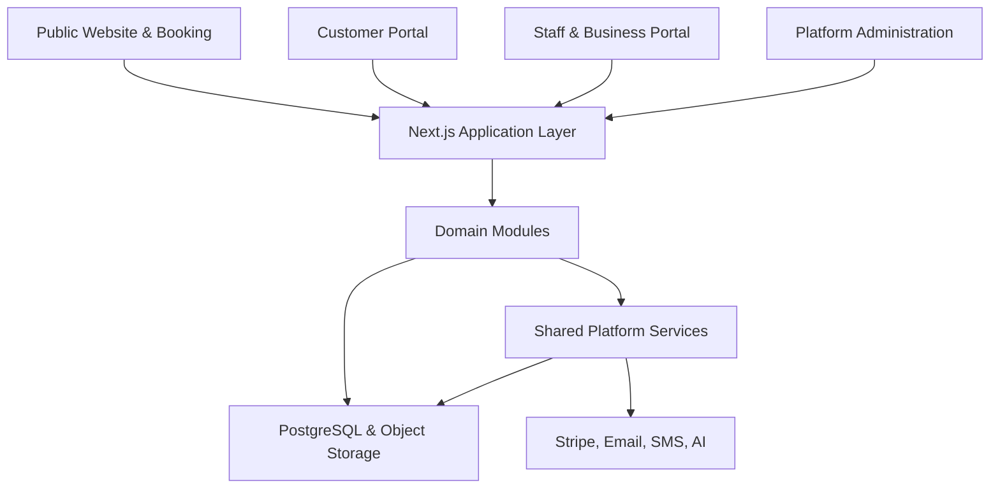

# Architecture Overview

## Architectural style

Start as a **modular monolith**: one deployable web platform with clearly separated domain modules and shared platform capabilities. This keeps development and operations manageable for a solo founder while preserving boundaries that can be separated later if scale requires it.

## Major layers

## Initial domain boundaries

- Business configuration
- Identity and access
- Customers and households
- Pets and eligibility
- Services, resources, and capacity
- Booking and waitlists
- Pricing and policy snapshots
- Invoices and payments
- Operations and pet-care timelines
- Communications
- Reporting
- Website content
- Platform administration

## Shared platform capabilities

- Authentication and authorization
- Tenant context enforcement
- Audit logging
- Document and media storage
- Notifications
- Background jobs
- Search
- Feature flags
- Observability
- AI gateway with tenant controls and cost limits

## Multi-tenancy

Every business-owned record must carry a tenant identifier, normally `business_id`. Location-scoped data also carries `location_id`. Authorization and database policies must enforce tenant boundaries; filtering only in the user interface is not sufficient.

## Data principles

- PostgreSQL is the transactional source of truth.
- Prices, policies, and agreements used by confirmed bookings are snapshotted.
- Financial and safety-critical history is append-only or revisioned.
- Soft deletion or archival is preferred when records have operational or financial history.
- Personally identifiable and health-related pet information receives explicit access controls and audit coverage.

## Reliability principles

- Booking, check-in, medication recording, payment callbacks, and checkout must be idempotent where retries are possible.
- External integrations are isolated behind adapters.
- Core workflows continue safely when nonessential AI or marketing services are unavailable.
- Payment and notification webhooks are verified, persisted, and processed asynchronously.
