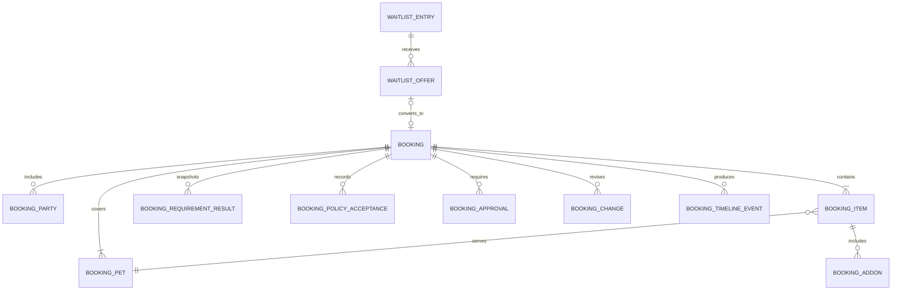
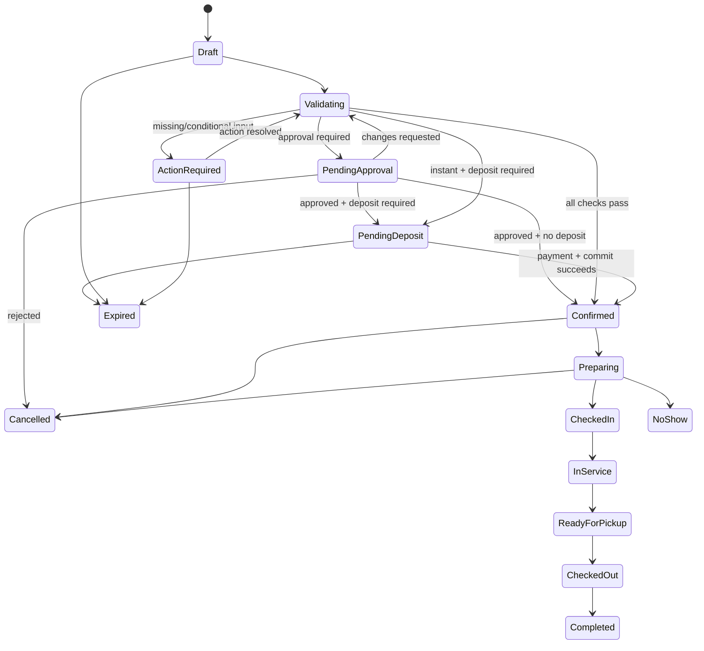
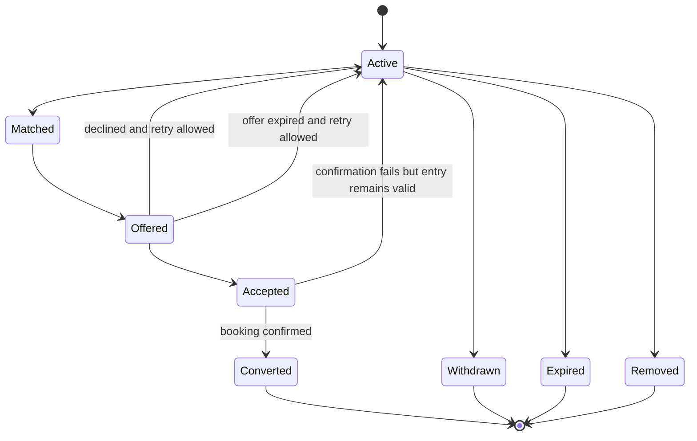
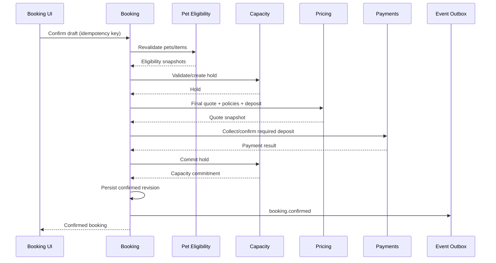

# Booking and Waitlist Domain

- **Domain prefix:** `BOOK`
- **Status:** In progress
- **MVP priority:** P0
- **Primary experiences:** Public Booking, Customer Portal, Staff Portal, and Business Portal

## Purpose

The Booking and Waitlist Domain owns the customer transaction from initial draft through confirmation, change, cancellation, operational handoff, completion, or no-show. It combines customers, pets, service items, schedules, eligibility decisions, capacity commitments, quotes, policy acknowledgements, deposits, approvals, and communications through references and immutable snapshots.

The Waitlist is part of this domain because it represents unmet booking demand and its conversion into a booking when capacity becomes available.

## Goals

- Provide one coherent booking model for boarding, daycare, and grooming.
- Support multiple pets and multiple compatible service items.
- Prevent confirmation until all mandatory checks pass.
- Preserve exactly what the customer selected, accepted, and paid for.
- Make staff-created and customer-created bookings follow the same rules.
- Handle modifications without losing history or original capacity prematurely.
- Convert waitlist demand fairly and transparently.
- Give customers and staff clear status, next actions, and reasons.

## Domain boundaries

### Owns

- Booking identity, channel, source, status, and lifecycle
- Booking parties and authority snapshots
- Booking items and requested schedules
- Pet, service, eligibility, quote, capacity, and policy snapshots/references
- Intake answers, acknowledgements, and signatures linked to the booking
- Approval requests and decisions
- Modification, cancellation, and no-show records
- Recurrence request and occurrence relationships
- Waitlist entries, offers, responses, expiration, and conversion
- Booking activity timeline

### Does not own

- Customer or pet master data
- Service definitions
- Eligibility rules/evidence
- Availability calculation, holds, commitments, or resource assignments
- Price calculation, invoices, payments, refunds, or accounting
- Check-in, care delivery, checkout, incidents, or report cards
- Message delivery infrastructure

## Booking model

## Booking statuses

- `draft`
- `validating`
- `action_required`
- `pending_approval`
- `pending_deposit`
- `confirmed`
- `preparing`
- `checked_in`
- `in_service`
- `ready_for_pickup`
- `checked_out`
- `completed`
- `cancelled`
- `no_show`
- `expired`

Payment/refund states are referenced separately and do not overload booking status.

## Functional requirements

### Draft and booking construction

| ID          | Priority | Requirement                                                                                                         | Status   |
| ----------- | -------: | ------------------------------------------------------------------------------------------------------------------- | -------- |
| BOOK-FR-001 |       P0 | The platform shall create a booking draft from public, portal, staff, API, import, or waitlist-conversion channels. | Accepted |
| BOOK-FR-002 |       P0 | Every booking shall belong to one business and one fulfillment location.                                            | Accepted |
| BOOK-FR-003 |       P0 | A booking shall identify its initiating customer and snapshotted booking authority.                                 | Accepted |
| BOOK-FR-004 |       P0 | A booking shall contain at least one pet and one service item before validation.                                    | Accepted |
| BOOK-FR-005 |       P0 | A booking may contain multiple pets and compatible primary services/add-ons.                                        | Accepted |
| BOOK-FR-006 |       P0 | Each service item shall reference one pet, one service version/variant, and its requested interval.                 | Accepted |
| BOOK-FR-007 |       P0 | The draft shall preserve progress across session interruption until expiration or deletion.                         | Accepted |
| BOOK-FR-008 |       P0 | Booking construction shall enforce service combination, add-on, channel, and location rules from Service Catalog.   | Accepted |
| BOOK-FR-009 |       P1 | Staff shall duplicate an eligible historical booking into a new draft using current rules and data.                 | Proposed |

### Validation and confirmation

| ID          | Priority | Requirement                                                                                                                                      | Status   |
| ----------- | -------: | ------------------------------------------------------------------------------------------------------------------------------------------------ | -------- |
| BOOK-FR-010 |       P0 | The domain shall orchestrate customer-authority, pet-eligibility, service, capacity, pricing, document, policy, and payment prerequisite checks. | Accepted |
| BOOK-FR-011 |       P0 | Validation results shall identify passed, failed, conditional, pending, and overridden checks.                                                   | Accepted |
| BOOK-FR-012 |       P0 | Customer-visible failures shall include safe remediation and preserve internal-only details.                                                     | Accepted |
| BOOK-FR-013 |       P0 | The domain shall obtain a current quote and applicable deposit/policy references before confirmation.                                            | Accepted |
| BOOK-FR-014 |       P0 | The domain shall secure valid capacity holds before collecting a deposit intended to confirm the booking.                                        | Accepted |
| BOOK-FR-015 |       P0 | Required intake answers, waivers, and acknowledgements shall be complete before confirmation unless explicitly deferred to staff review.         | Accepted |
| BOOK-FR-016 |       P0 | Request-only services shall enter pending approval rather than confirm automatically.                                                            | Accepted |
| BOOK-FR-017 |       P0 | Deposit-required bookings shall enter pending deposit until the payment succeeds.                                                                | Accepted |
| BOOK-FR-018 |       P0 | Confirmation shall atomically finalize booking state, capacity commitments, quote/policy snapshots, and payment reference.                       | Accepted |
| BOOK-FR-019 |       P0 | Confirmation shall generate a human-friendly booking number unique within the business.                                                          | Accepted |
| BOOK-FR-020 |       P0 | Confirmation shall emit an event for transactional communications and operational preparation.                                                   | Accepted |

### Approval and action-required workflows

| ID          | Priority | Requirement                                                                                                                                | Status   |
| ----------- | -------: | ------------------------------------------------------------------------------------------------------------------------------------------ | -------- |
| BOOK-FR-021 |       P0 | Validation shall create action-required items for missing documents, pending vaccine review, intake questions, payment, or manager review. | Accepted |
| BOOK-FR-022 |       P0 | Each action shall have owner audience, due time, status, blocking effect, and resolution reference.                                        | Accepted |
| BOOK-FR-023 |       P0 | Authorized staff shall approve, reject, or request changes with reason and audit history.                                                  | Accepted |
| BOOK-FR-024 |       P0 | Approval cannot override non-overrideable safety, capacity, or payment requirements.                                                       | Accepted |
| BOOK-FR-025 |       P0 | Expired unresolved actions shall move the booking to the configured expired or cancelled outcome and release holds.                        | Accepted |

### Modification and rescheduling

| ID          | Priority | Requirement                                                                                                                  | Status   |
| ----------- | -------: | ---------------------------------------------------------------------------------------------------------------------------- | -------- |
| BOOK-FR-026 |       P0 | Authorized customers and staff shall request changes permitted by service, status, time, and policy.                         | Accepted |
| BOOK-FR-027 |       P0 | A modification shall create a proposed revision rather than mutate the confirmed booking in place.                           | Accepted |
| BOOK-FR-028 |       P0 | The proposed revision shall re-evaluate eligibility, service compatibility, capacity, pricing, deposit impact, and policies. | Accepted |
| BOOK-FR-029 |       P0 | Existing capacity shall remain protected until replacement capacity is secured or cancellation is explicitly accepted.       | Accepted |
| BOOK-FR-030 |       P0 | Material price or policy differences shall require customer or authorized staff acceptance.                                  | Accepted |
| BOOK-FR-031 |       P0 | A successful revision shall preserve before/after snapshots, actor, reason, financial impact, and capacity changes.          | Accepted |
| BOOK-FR-032 |       P0 | The platform shall support adding/removing allowed pets, services, add-ons, and schedule segments.                           | Accepted |
| BOOK-FR-033 |       P1 | Staff shall split or combine booking items while preserving customer-facing clarity and audit history.                       | Proposed |

### Cancellation, expiration, and no-show

| ID          | Priority | Requirement                                                                                                              | Status   |
| ----------- | -------: | ------------------------------------------------------------------------------------------------------------------------ | -------- |
| BOOK-FR-034 |       P0 | Authorized customers and staff shall cancel all or permitted portions of a booking.                                      | Accepted |
| BOOK-FR-035 |       P0 | Cancellation shall request policy-based financial outcomes from Pricing/Payments before final customer confirmation.     | Accepted |
| BOOK-FR-036 |       P0 | Cancellation shall release future capacity and create waitlist-availability signals after the state change is committed. | Accepted |
| BOOK-FR-037 |       P0 | A cancellation shall store initiator, reason, scope, timestamp, effective policy snapshot, and financial references.     | Accepted |
| BOOK-FR-038 |       P0 | Unconfirmed drafts, holds, actions, approvals, and offers shall expire according to configured deadlines.                | Accepted |
| BOOK-FR-039 |       P0 | Authorized staff shall mark an expected arrival as no-show with reason and policy reference.                             | Accepted |
| BOOK-FR-040 |       P0 | Cancelled, expired, and no-show bookings shall remain searchable and auditable.                                          | Accepted |

### Recurring bookings

| ID          | Priority | Requirement                                                                                                            | Status   |
| ----------- | -------: | ---------------------------------------------------------------------------------------------------------------------- | -------- |
| BOOK-FR-041 |       P0 | The platform shall support configured recurring daycare and grooming request patterns.                                 | Accepted |
| BOOK-FR-042 |       P0 | A recurrence definition shall generate independently validated booking occurrences.                                    | Accepted |
| BOOK-FR-043 |       P0 | Customers/staff shall modify one occurrence, this and future occurrences, or the recurrence definition when permitted. | Accepted |
| BOOK-FR-044 |       P0 | Failure of one occurrence shall not silently cancel unrelated confirmed occurrences.                                   | Accepted |
| BOOK-FR-045 |       P1 | A recurrence shall support pause/resume and a defined end condition.                                                   | Proposed |

### Waitlist

| ID          | Priority | Requirement                                                                                                                                  | Status   |
| ----------- | -------: | -------------------------------------------------------------------------------------------------------------------------------------------- | -------- |
| BOOK-FR-046 |       P0 | When capacity is unavailable, eligible demand shall be convertible into a waitlist entry.                                                    | Accepted |
| BOOK-FR-047 |       P0 | A waitlist entry shall capture customer, pets, services, preferred interval, acceptable alternatives, location, flexibility, and expiration. | Accepted |
| BOOK-FR-048 |       P0 | A waitlist entry shall preserve eligibility and requirement status while allowing revalidation before offer.                                 | Accepted |
| BOOK-FR-049 |       P0 | Businesses shall configure manual promotion or rule-based offer sequencing.                                                                  | Accepted |
| BOOK-FR-050 |       P0 | The system shall match newly available capacity against compatible active entries.                                                           | Accepted |
| BOOK-FR-051 |       P0 | A waitlist offer shall include offered interval/service, capacity hold, deadline, status, and delivery references.                           | Accepted |
| BOOK-FR-052 |       P0 | Accepting an offer shall revalidate eligibility, quote, policies, and payment before confirmation.                                           | Accepted |
| BOOK-FR-053 |       P0 | Declined or expired offers shall release the hold and permit the next eligible offer.                                                        | Accepted |
| BOOK-FR-054 |       P0 | Staff shall see why an entry was matched, skipped, promoted, expired, or removed.                                                            | Accepted |
| BOOK-FR-055 |       P0 | Customers shall view and withdraw their active waitlist entries.                                                                             | Accepted |
| BOOK-FR-056 |       P1 | Membership or VIP priority may be applied only through transparent business-configured rules.                                                | Proposed |

### Timeline and customer visibility

| ID          | Priority | Requirement                                                                                                                              | Status   |
| ----------- | -------: | ---------------------------------------------------------------------------------------------------------------------------------------- | -------- |
| BOOK-FR-057 |       P0 | Every booking shall expose an immutable chronological timeline of material actions and state changes.                                    | Accepted |
| BOOK-FR-058 |       P0 | Customer views shall show current status, next required action, schedule, pets, services, totals references, policies, and contact path. | Accepted |
| BOOK-FR-059 |       P0 | Internal notes and review details shall remain separate from customer-visible messages.                                                  | Accepted |
| BOOK-FR-060 |       P0 | Staff shall search and filter bookings by number, customer, pet, status, service, date, location, action required, and source.           | Accepted |

## Booking lifecycle

## Waitlist lifecycle

## Business rules

| ID          | Priority | Rule                                                                                                                                                                           |
| ----------- | -------: | ------------------------------------------------------------------------------------------------------------------------------------------------------------------------------ |
| BOOK-BR-001 |       P0 | A confirmed booking must reference validated customer authority, at least one pet/item, current quote, capacity commitment, applicable policies, and required payment outcome. |
| BOOK-BR-002 |       P0 | Staff-created bookings follow the same safety, eligibility, capacity, pricing, policy, and audit rules as customer bookings.                                                   |
| BOOK-BR-003 |       P0 | Booking status and payment status are separate state machines.                                                                                                                 |
| BOOK-BR-004 |       P0 | Confirmed booking snapshots are immutable; corrections and changes create revisions.                                                                                           |
| BOOK-BR-005 |       P0 | A customer cannot confirm services for a pet without effective booking authority.                                                                                              |
| BOOK-BR-006 |       P0 | Capacity is never assumed from a prior search; final confirmation requires a valid hold or transactional commitment.                                                           |
| BOOK-BR-007 |       P0 | A successful deposit cannot leave the booking without capacity; compensation/recovery must be deterministic if distributed steps fail.                                         |
| BOOK-BR-008 |       P0 | Policy, service, price, eligibility, authority, and requirement snapshots remain interpretable after source configuration changes.                                             |
| BOOK-BR-009 |       P0 | Modifications never destroy the previously confirmed revision.                                                                                                                 |
| BOOK-BR-010 |       P0 | Cancellation and no-show financial outcomes are calculated from the accepted policy snapshot unless an authorized override is recorded.                                        |
| BOOK-BR-011 |       P0 | Booking cancellation releases capacity only after cancellation is committed.                                                                                                   |
| BOOK-BR-012 |       P0 | Waitlist membership does not guarantee service, price, priority, or confirmation.                                                                                              |
| BOOK-BR-013 |       P0 | Waitlist offers are time-bounded and supported by capacity holds.                                                                                                              |
| BOOK-BR-014 |       P0 | Waitlist priority cannot use protected or sensitive traits unrelated to service fulfillment.                                                                                   |
| BOOK-BR-015 |       P0 | Accepting a waitlist offer never bypasses current eligibility, pricing, policy, or payment validation.                                                                         |
| BOOK-BR-016 |       P0 | Check-in status changes are performed through Operations and reflected here through authorized events.                                                                         |
| BOOK-BR-017 |       P0 | A booking with checked-in pets cannot be customer-cancelled; authorized operational checkout/early-departure workflow is required.                                             |
| BOOK-BR-018 |       P0 | Every override requires scope, actor, reason, timestamp, and original failed rule.                                                                                             |

## Confirmation orchestration

Implementation must define recovery for payment success followed by commitment failure; the system must not rely on an untracked manual fix.

## Permissions

| Capability             |       Customer        |     Front desk     |     Manager      |        Care staff        |   Platform support   |
| ---------------------- | :-------------------: | :----------------: | :--------------: | :----------------------: | :------------------: |
| Create draft           |    Authorized pets    |        Yes         |       Yes        |      No by default       |          No          |
| View booking           |    Own/authorized     |  Within business   |   Within scope   |    Assigned/relevant     | Limited support view |
| Modify/cancel          | Policy/status limited |  Permission based  |       Yes        |            No            |          No          |
| Approve/reject request |          No           |    Configurable    |       Yes        |            No            |          No          |
| Override rule          |          No           | Limited configured | Configured rules |            No            |          No          |
| Create/manage waitlist |          Yes          |        Yes         |       Yes        |            No            |          No          |
| Promote waitlist       |     Accept offer      | Manual if granted  |       Yes        |            No            |          No          |
| Mark no-show           |          No           |  Permission based  |       Yes        |            No            |          No          |
| View internal timeline |          No           |  Permission based  |       Yes        | Relevant operations only | Limited support view |

## Core entities

| Entity                   | Purpose                                                                    |
| ------------------------ | -------------------------------------------------------------------------- |
| Booking                  | Stable identity, tenant/location, channel, number, current status/revision |
| BookingRevision          | Immutable confirmed or proposed state                                      |
| BookingParty             | Customer, contact, payer, pickup, and authority snapshot references        |
| BookingPet               | Pet identity and profile/eligibility snapshot references                   |
| BookingItem              | Pet, service version, variant, requested schedule, status                  |
| BookingAddOn             | Parent item, add-on version, application scope, quantity                   |
| BookingIntakeAnswer      | Versioned question and response/evidence                                   |
| BookingRequirementResult | Check, outcome, reason, source, override                                   |
| BookingPolicyAcceptance  | Policy/waiver version, signer, evidence, time                              |
| BookingApproval          | Approval type, reviewer, decision, reason, time                            |
| BookingAction            | Required customer/staff action, due time, resolution                       |
| BookingChange            | Before/after revision, initiator, reason, impact                           |
| BookingCancellation      | Scope, reason, policy and financial references                             |
| RecurrenceDefinition     | Pattern, effective range, generation policy                                |
| BookingOccurrence        | Link between recurrence and individual booking                             |
| WaitlistEntry            | Unmet demand, alternatives, priority inputs, lifecycle                     |
| WaitlistOffer            | Match, capacity hold, deadline, delivery, response                         |
| BookingTimelineEvent     | Immutable customer-safe/internal event reference                           |

## Domain events

- `booking.draft.created`
- `booking.action_required`
- `booking.approval.requested`
- `booking.approved`
- `booking.rejected`
- `booking.deposit.required`
- `booking.confirmed`
- `booking.modified`
- `booking.cancelled`
- `booking.expired`
- `booking.no_show`
- `booking.checked_in`
- `booking.checked_out`
- `booking.completed`
- `waitlist.entry.created`
- `waitlist.offer.created`
- `waitlist.offer.accepted`
- `waitlist.offer.declined`
- `waitlist.offer.expired`
- `waitlist.entry.converted`

Events include tenant/location, booking or waitlist identifiers, revision, actor/source, correlation and idempotency identifiers, event version, and occurred time.

## Non-functional requirements

| ID           | Priority | Requirement                                                                                                  |
| ------------ | -------: | ------------------------------------------------------------------------------------------------------------ |
| BOOK-NFR-001 |       P0 | Confirmation, modification, cancellation, and waitlist conversion shall be idempotent.                       |
| BOOK-NFR-002 |       P0 | Concurrent confirmations shall not oversell capacity or duplicate payment/booking records.                   |
| BOOK-NFR-003 |       P0 | Tenant, location, customer authority, and staff role shall be enforced on every read and mutation.           |
| BOOK-NFR-004 |       P0 | Material lifecycle actions and overrides shall be auditable.                                                 |
| BOOK-NFR-005 |       P0 | Confirmed revisions and snapshots shall be immutable and queryable.                                          |
| BOOK-NFR-006 |       P0 | Public and portal booking flows shall meet WCAG 2.2 AA targets and support mobile screens.                   |
| BOOK-NFR-007 |       P0 | External payment and notification failures shall not corrupt booking state and shall support safe retry.     |
| BOOK-NFR-008 |       P1 | Booking search and common calendar queries shall meet defined interactive latency targets at expected scale. |

## Acceptance scenarios

| ID          | Covers          | Scenario                                                                                                                      |
| ----------- | --------------- | ----------------------------------------------------------------------------------------------------------------------------- |
| BOOK-AT-001 | BOOK-FR-001–009 | A customer saves and resumes a multi-pet boarding draft with compatible departure grooming add-ons.                           |
| BOOK-AT-002 | BOOK-FR-010–020 | An eligible booking secures capacity, collects a deposit, commits atomically, and emits one confirmation event under retries. |
| BOOK-AT-003 | BOOK-FR-021–025 | Pending vaccine evidence creates customer action; approval resumes validation without bypassing other checks.                 |
| BOOK-AT-004 | BOOK-FR-026–033 | A reschedule with no replacement capacity leaves the original confirmed booking untouched.                                    |
| BOOK-AT-005 | BOOK-FR-034–040 | A partial cancellation applies the accepted policy, releases only affected capacity, and preserves audit history.             |
| BOOK-AT-006 | BOOK-FR-041–045 | A recurring daycare series allows one occurrence change while other confirmed dates remain unchanged.                         |
| BOOK-AT-007 | BOOK-FR-046–056 | A cancellation opens capacity, creates a timed offer to the best matching entry, and converts after full revalidation.        |
| BOOK-AT-008 | BOOK-FR-057–060 | Customers and staff see appropriate booking timelines without internal-note leakage.                                          |
| BOOK-AT-009 | BOOK-BR-002     | A staff booking fails the same non-overrideable vaccine rule as a public booking.                                             |
| BOOK-AT-010 | BOOK-BR-006–007 | Concurrent last-slot attempts and retries produce one booking, one deposit, and no stranded payment.                          |
| BOOK-AT-011 | BOOK-BR-012–015 | Waitlist priority and acceptance do not guarantee outdated price or bypass eligibility.                                       |
| BOOK-AT-012 | BOOK-NFR-003    | Direct requests cannot view or mutate another tenant's drafts, bookings, actions, or waitlist entries.                        |

## Metrics

- Draft start and completion rates
- Validation failure/action-required reasons
- Quote-to-confirmation conversion
- Deposit failure and recovery rate
- Booking source/channel mix
- Modification, cancellation, no-show, and expiration rates
- Average time pending approval/action/deposit
- Waitlist entries, matches, offer acceptance, expiration, and conversion
- Lost demand by capacity/eligibility/policy/payment reason
- Confirmation latency and idempotent retry volume

## Open decisions

1. Whether multi-location requests create one booking or separate location bookings; preferred MVP is one location per booking.
2. Exact recovery strategy for payment success followed by capacity-commit failure.
3. Whether booking approval and payment order varies by service and business configuration.
4. How long public checkout holds last by service type.
5. Whether waitlist offers are sequential only or may be sent to a bounded group.
6. Which recurring patterns are required for MVP.
7. Whether partial cancellation is customer self-service in MVP or staff-assisted.
8. Whether an unconfirmed request is called a request or booking in customer-facing language.

## Dependencies

- Customer and Household for identity and authority
- Pet and Eligibility for compliance and care inputs
- Service Catalog for item definitions and compatibility
- Resource and Capacity for availability, holds, commitments, and releases
- Pricing and Policies for quotes, deposits, cancellation, and financial impact
- Payments and Invoicing for payment results and refunds
- Operations for check-in, service, and checkout lifecycle events
- Communications for confirmations, actions, reminders, and offers
- Audit and document capabilities for evidence and history

## Implemented foundation

Migration `20260718000500_booking_waitlist_calendar_foundation.sql` and the `/app/bookings` and `/app/calendar` experiences implement the first E07 staff workflow. One idempotent booking request verifies customer-to-pet household authority, evaluates the published service and pet requirements, secures live capacity, calculates a versioned quote, and records the correct action-required, pending-approval, pending-deposit, or confirmed state. Zero-deposit instant bookings convert their capacity hold atomically; deposit-required requests remain visibly unconfirmed for E08 payment orchestration.

Every request receives a business-scoped human booking number, immutable revision, service item, prerequisite results, quote/policy references, and append-only timeline. The staff booking list never presents requests or waitlist demand as reservations. Booking detail explains service schedule, commercial totals, blocking checks, and material history. The seven-day calendar uses the same authoritative service items and provides an accessible agenda/list presentation rather than a separate calendar state.

Eligible unmet demand can be recorded as an explicitly non-guaranteed waitlist entry with preferred interval, quantity, flexibility, expiration, and eligibility snapshot. Confirmed booking cancellation uses the accepted policy version, creates a cancellation revision and outcome, releases committed capacity, and records the customer-visible event.

Migration `20260718000600_booking_workflow_waitlist_offers.sql` adds immutable approval decisions, payment-confirmation handoff, and revision-linked changes. Staff approval still honors deposits and an unexpired hold. Rescheduling obtains and commits replacement capacity before releasing the original commitment, preserves the old item and quote, and stops when payment reconciliation would be required. Chronological waitlist demand can receive a 30-minute offer backed by a dedicated hold; acceptance revalidates authority, eligibility, service mode, price, policy, and deposit requirements, while decline or expiry safely releases the hold. E07 follow-up work still includes intake-answer capture, customer action resolution, multi-item/add-on bookings, recurring occurrences, partial changes, automated offer delivery, and customer self-service.

Migration `20260718000700_booking_actions_intake_lifecycle.sql` closes the first staff-facing lifecycle foundation. Required work is represented as tenant-scoped customer, staff, or manager action items with deadlines and explicit terminal states. Service-question answers retain the exact published question snapshot, are idempotent, and append corrections through `supersedes_answer_id` rather than overwriting operational history. Confirmed bookings can be marked no-show only after their scheduled start, preserving the policy outcome and releasing capacity. A retry-safe expiry worker closes requests whose holds elapsed before confirmation. Booking list search, lifecycle filters, action visibility, expiry processing, and the no-show control expose these rules without implying that an unresolved request is confirmed. Multi-item/add-on bookings, recurring occurrences, partial item changes, automated waitlist delivery, and customer self-service remain later extensions.
