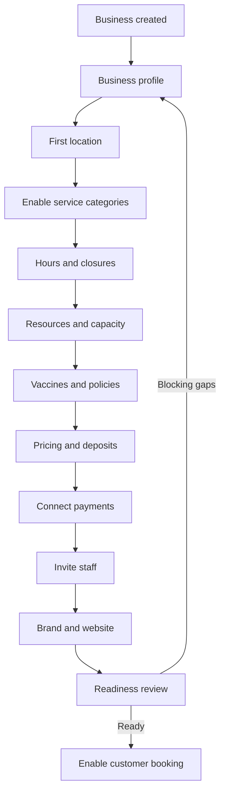

# Business Configuration Domain

- **Domain prefix:** `BCFG`
- **Status:** In progress
- **MVP priority:** P0
- **Owner:** Business Portal

## Purpose

Business Configuration defines how each subscribing pet-care business configures the platform without support intervention. It is the source of truth for business identity, locations, hours, enabled service categories, operating policies, resource setup, branding, and launch readiness.

It does not own customer, pet, booking, price calculation, payment processing, or operational history. It publishes effective configuration that those domains consume.

## Goals

- Guide a new business from signup to a safe, bookable configuration.
- Support boarding, daycare, and grooming at one or more locations.
- Make meaningful business differences configurable without making setup overwhelming.
- Preserve effective dates and history for configuration that affects bookings, eligibility, safety, or money.
- Reuse the same configuration screens during onboarding and ongoing administration.

## Personas

| Persona          | Primary needs                                                                     |
| ---------------- | --------------------------------------------------------------------------------- |
| Business owner   | Complete setup, control policies, connect payments, publish booking.              |
| Location manager | Maintain location hours, capacity, resources, and operational settings.           |
| Platform support | Diagnose setup issues without silently changing tenant configuration.             |
| Staff member     | View effective configuration relevant to daily work, usually without edit rights. |

## Domain boundaries

### Owns

- Business profile
- Location profile and status
- Operating, drop-off, pickup, and closure calendars
- Enabled service categories
- Configuration defaults and location overrides
- Resource definitions used for setup
- Vaccine and document requirement definitions
- Deposit and cancellation policy definitions
- Booking-channel enablement
- Branding and public-site configuration
- Notification defaults
- Readiness calculation and launch gates

### Does not own

- Individual customer consent or communication preference
- Pet vaccine records or eligibility results
- Booking instances or availability calculations
- Price calculation and price snapshots
- Payment transactions or merchant settlement
- Staff shifts or daily operational assignments

## Functional requirements

| ID          | Priority | Requirement                                                                                                                      | Status   |
| ----------- | -------: | -------------------------------------------------------------------------------------------------------------------------------- | -------- |
| BCFG-FR-001 |       P0 | The platform shall provide a resumable guided setup experience for a newly created business.                                     | Accepted |
| BCFG-FR-002 |       P0 | The business shall configure its legal/display name, contact details, locale, currency, and default time zone.                   | Accepted |
| BCFG-FR-003 |       P0 | The business shall create at least one physical location before accepting bookings.                                              | Accepted |
| BCFG-FR-004 |       P0 | Each location shall define address, time zone, contact details, operating status, and customer-facing instructions.              | Accepted |
| BCFG-FR-005 |       P0 | Each location shall configure regular hours and dated closures or exceptions.                                                    | Accepted |
| BCFG-FR-006 |       P0 | A business shall enable boarding, daycare, grooming, or any supported combination by location.                                   | Accepted |
| BCFG-FR-007 |       P0 | Enabling a service category shall reveal only the setup sections required by that category.                                      | Accepted |
| BCFG-FR-008 |       P0 | Authorized users shall configure resources such as kennels, suites, play areas, grooming stations, and staff-requiring services. | Accepted |
| BCFG-FR-009 |       P0 | The business shall define vaccine and required-document rules by service category and location.                                  | Accepted |
| BCFG-FR-010 |       P0 | The business shall define deposit, cancellation, no-show, and refund policy references consumed by Pricing and Booking.          | Accepted |
| BCFG-FR-011 |       P0 | The business shall enable or disable customer online booking independently by location and service category.                     | Accepted |
| BCFG-FR-012 |       P0 | The platform shall calculate readiness and block launch when a safety-critical or transaction-critical prerequisite is missing.  | Accepted |
| BCFG-FR-013 |       P0 | Authorized users shall save progress without publishing incomplete changes.                                                      | Accepted |
| BCFG-FR-014 |       P1 | A business shall configure brand colors, logo, images, typography preference, and public-site content.                           | Accepted |
| BCFG-FR-015 |       P1 | The system shall support business defaults with explicit location overrides.                                                     | Accepted |
| BCFG-FR-016 |       P1 | The system shall show the effective value and its source when inheritance applies.                                               | Accepted |
| BCFG-FR-017 |       P1 | Configuration changes shall support immediate or scheduled effective dates where relevant.                                       | Proposed |
| BCFG-FR-018 |       P1 | Platform support shall be able to view readiness failures and configuration history without tenant impersonation.                | Proposed |

## Business rules

| ID          | Priority | Rule                                                                                                                                                                                                     |
| ----------- | -------: | -------------------------------------------------------------------------------------------------------------------------------------------------------------------------------------------------------- |
| BCFG-BR-001 |       P0 | A business cannot accept bookings without an active location, active service, valid hours, capacity/resource configuration, applicable price, and connected payment capability when payment is required. |
| BCFG-BR-002 |       P0 | Every location time is interpreted in the location's configured IANA time zone.                                                                                                                          |
| BCFG-BR-003 |       P0 | Location closures override regular hours. A dated special opening may override a closure only when explicitly permitted.                                                                                 |
| BCFG-BR-004 |       P0 | Vaccine and document requirements may become stricter at a location but cannot silently weaken a locked business-level safety policy.                                                                    |
| BCFG-BR-005 |       P0 | Historical bookings retain their policy and configuration snapshots after configuration changes.                                                                                                         |
| BCFG-BR-006 |       P0 | Deactivating a service or resource must not delete or invalidate historical bookings and operational records.                                                                                            |
| BCFG-BR-007 |       P0 | Safety-critical changes require an audit entry containing actor, timestamp, previous value, new value, and reason when required.                                                                         |
| BCFG-BR-008 |       P0 | A user may edit configuration only for businesses and locations within their authorized scope.                                                                                                           |
| BCFG-BR-009 |       P1 | Overrides must be explicit and removable so the value can return to inheritance.                                                                                                                         |
| BCFG-BR-010 |       P1 | Draft website or brand changes do not affect the published customer experience until published.                                                                                                          |

## Configuration areas

### Business profile

- Display and legal names
- Primary contact
- Support and customer-facing email/phone
- Country, locale, currency, and default time zone
- Tax and licensing references where applicable
- Business description and social links

### Locations

- Address and map coordinates
- Local time zone
- Contact and manager
- Customer arrival, parking, and access instructions
- Active, temporarily closed, or archived state
- Service categories offered

### Hours and calendars

- Regular operating hours
- Drop-off and pickup windows
- Grooming appointment hours
- Holiday closures and special hours
- Date ranges for renovations or capacity restrictions

### Service-category setup

Boarding configuration may include stay units, arrival/departure windows, housing types, nightly capacity, and holiday rules.

Daycare configuration may include full/half-day offerings, attendance capacity, evaluation requirements, play areas, and recurring-booking policy.

Grooming configuration may include appointment duration rules, eligible staff/resources, buffers, breed/size considerations, and intake requirements.

The authoritative catalog and detailed behavior will live in the Service Catalog domain.

### Policies and requirements

- Required vaccines and accepted proof
- Expiration/grace handling
- Waiver and document requirements
- Deposit and cancellation policy references
- Age, alteration, temperament, or evaluation rules
- Customer-facing policy content

### Branding and website

- Logo and imagery
- Color and typography tokens
- Contact, about, service, FAQ, and policy content
- Custom domain status
- Booking and portal visibility
- Draft and published versions

## Setup workflow

The wizard is resumable and conditionally skips irrelevant steps. Users can move backward without losing valid data.

## Readiness model

Readiness has two outputs:

1. **Launch gate:** pass/fail based on blocking requirements.
2. **Completion score:** a helpful percentage including optional improvements.

### Blocking checks

- Active business
- At least one active location
- Location time zone and contact details
- At least one active, customer-bookable service
- Hours and applicable booking windows
- Capacity or required resource setup
- Applicable active pricing
- Vaccine/document rules reviewed
- Deposit/cancellation policy reviewed
- Payment provider connected when money is due online
- Required customer agreement published

### Optional improvements

- Logo and brand completion
- Public website content
- SMS sender configuration
- Additional staff invitations
- Reviews, memberships, or AI features introduced after MVP

## Permissions

| Capability                    | Owner |     Manager      |      Staff      |              Platform support              |
| ----------------------------- | :---: | :--------------: | :-------------: | :----------------------------------------: |
| Edit business profile         |  Yes  |   Configurable   |       No        |                     No                     |
| Create/archive locations      |  Yes  |   Configurable   |       No        |                     No                     |
| Edit location hours/resources |  Yes  | Yes within scope |       No        |                     No                     |
| Edit safety requirements      |  Yes  |   Configurable   |       No        |                     No                     |
| Connect merchant account      |  Yes  |  No by default   |       No        |                     No                     |
| Publish website/booking       |  Yes  |   Configurable   |       No        |                     No                     |
| View effective configuration  |  Yes  |       Yes        | Relevant subset |                    Yes                     |
| View configuration audit      |  Yes  |   Configurable   |       No        |                    Yes                     |
| Modify tenant configuration   |  Yes  |   Configurable   |       No        | Only via explicit support workflow, future |

## Core entities

| Entity                    | Purpose                                                              |
| ------------------------- | -------------------------------------------------------------------- |
| Business                  | Tenant identity and top-level defaults                               |
| Location                  | Physical facility and local operating context                        |
| LocationServiceCategory   | Enables a category at a location                                     |
| BusinessHoursRule         | Recurring weekly hours and service windows                           |
| CalendarException         | Dated closure, special opening, or restricted window                 |
| ResourceDefinition        | Configured kennel, suite, play area, or grooming resource            |
| RequirementPolicy         | Vaccine, document, evaluation, or eligibility requirement definition |
| CommercialPolicyReference | Link to effective deposit/cancellation/pricing policy                |
| BrandProfile              | Design tokens and brand assets                                       |
| WebsitePublication        | Draft/published customer-site configuration                          |
| ConfigurationRevision     | Auditable version/change record                                      |
| ReadinessAssessment       | Point-in-time readiness result and findings                          |

Additional tables and migrations are created incrementally with each implementation slice.

### Initial E03 implementation

The first implementation slice extends businesses and locations with required contact, locale, currency, time-zone, and postal-address fields. `location_operating_hours` stores one validated recurring interval or a closed state for each weekday. All records are tenant-scoped, protected by RLS, and emit configuration audit events.

New verified identities without a tenant enter `/onboarding`, create a draft business and first location atomically, enroll MFA, and then complete the combined business/location/hours form. `get_business_setup_readiness` calculates the three foundation checks server-side and returns no saved-state inference to an unauthorized or AAL1 privileged session. This foundation score is not the final launch gate; services, capacity, pricing, policies, payments, communications, and operational readiness remain later checks.

The next E03 slice adds separately managed customer arrival and pickup windows. Weekday windows must fit within the location's regular operating hours, weekends begin closed, and the database remains authoritative for tenant access, validation, audit events, and retry-safe upserts.

## Domain events

- `business.created`
- `business.profile.updated`
- `location.created`
- `location.status.changed`
- `location.hours.changed`
- `service_category.enabled`
- `service_category.disabled`
- `resource.configured`
- `requirement_policy.changed`
- `brand_profile.updated`
- `website.published`
- `business.readiness.changed`
- `business.booking_enabled`

Events must include `business_id`, actor context, timestamp, event version, and the affected entity identifier.

## Non-functional requirements

| ID           | Priority | Requirement                                                                                                         |
| ------------ | -------: | ------------------------------------------------------------------------------------------------------------------- |
| BCFG-NFR-001 |       P0 | Saved setup progress shall survive logout, browser closure, and session expiration.                                 |
| BCFG-NFR-002 |       P0 | All tenant-scoped configuration reads and writes shall enforce business and location authorization.                 |
| BCFG-NFR-003 |       P0 | Readiness recalculation shall complete quickly enough to provide interactive feedback after a configuration change. |
| BCFG-NFR-004 |       P0 | Safety-critical and launch-gating configuration changes shall be auditable.                                         |
| BCFG-NFR-005 |       P0 | Configuration interfaces shall meet WCAG 2.2 AA targets.                                                            |
| BCFG-NFR-006 |       P1 | The wizard shall be usable on tablet-sized screens; complex resource setup may optimize for desktop.                |

## Acceptance scenarios

| ID          | Covers                   | Scenario                                                                                                         |
| ----------- | ------------------------ | ---------------------------------------------------------------------------------------------------------------- |
| BCFG-AT-001 | BCFG-FR-001, 002         | A new owner completes profile steps, logs out, returns, and resumes at the correct point with saved values.      |
| BCFG-AT-002 | BCFG-FR-003–006          | An owner configures one location offering boarding, daycare, and grooming with independent hours.                |
| BCFG-AT-003 | BCFG-FR-009, BCFG-BR-004 | A manager creates a stricter boarding vaccine requirement without weakening the locked business minimum.         |
| BCFG-AT-004 | BCFG-FR-012, BCFG-BR-001 | Launch is blocked and explains all missing pricing, capacity, agreement, and payment prerequisites.              |
| BCFG-AT-005 | BCFG-FR-015, 016         | A manager overrides a location value, sees its source, removes the override, and returns to the inherited value. |
| BCFG-AT-006 | BCFG-BR-005–007          | A safety-policy change preserves historical snapshots and produces a complete audit record.                      |
| BCFG-AT-007 | BCFG-BR-008              | A manager cannot read or modify another business or unauthorized location through either UI or direct request.   |
| BCFG-AT-008 | BCFG-BR-010              | Draft branding changes remain invisible until an authorized user publishes them.                                 |

## Open decisions

1. Whether multi-location support is fully enabled in MVP or structurally supported and commercially introduced later.
2. Which business-level safety policies may be locked against location weakening.
3. Whether scheduled configuration activation is P1 or deferred.
4. Whether platform support receives a time-limited, customer-approved configuration assistance workflow.
5. Which website-building capabilities are required before the first pilot.

## Dependencies

- Identity and Access for authorization
- Service Catalog for full service definitions
- Resource and Capacity for availability constraints
- Pricing and Policies for active commercial rules
- Payments for merchant connection state
- Website and Content for full publication behavior
- Audit platform capability for revision history
