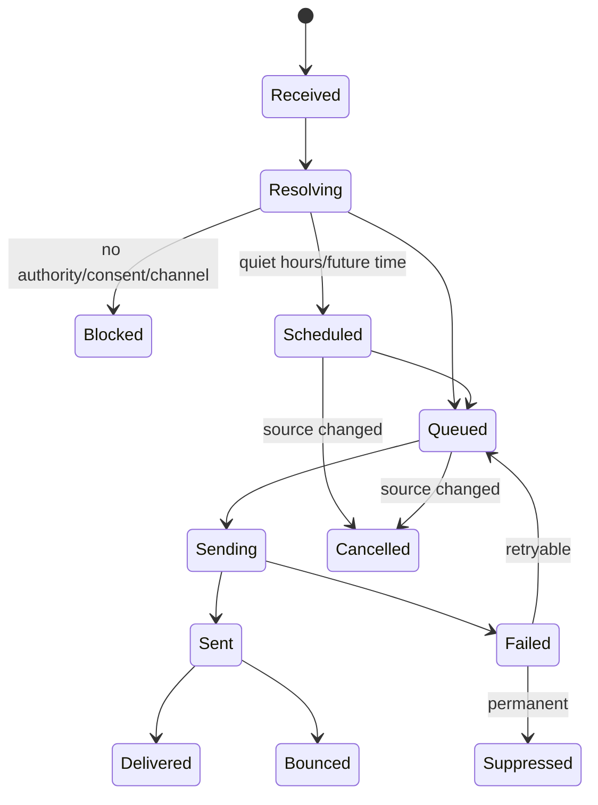
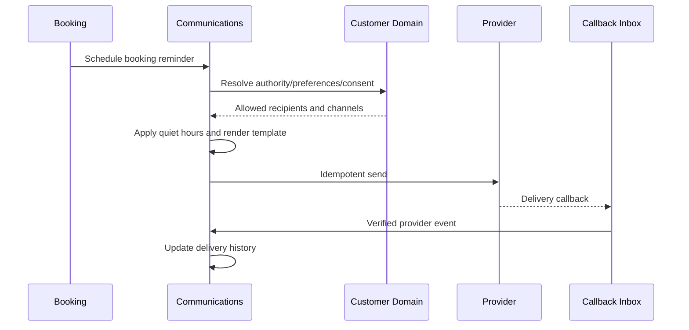

# Communications Domain

- **Domain prefix:** `COMM`
- **Status:** In progress
- **MVP priority:** P0
- **Primary experiences:** Customer Portal, Staff Portal, Business Portal, and background processing

## Purpose

The Communications Domain turns authorized business events and staff actions into customer or internal messages. It manages templates, channel selection, consent/preference checks, scheduling, delivery attempts, provider callbacks, two-way conversations, attachments, and communication history.

Other domains decide that communication is needed and provide authorized facts. Communications decides whether, when, where, and how it is delivered.

## Goals

- Deliver reliable booking, payment, vaccine, operational, and report-card messages.
- Keep transactional, safety, service, and marketing purposes distinct.
- Respect consent, channel preferences, quiet hours, verification, and opt-outs.
- Provide one communication history across email, SMS, and in-app messages.
- Make delivery failures visible and actionable.
- Prevent duplicate messages under event or webhook retries.
- Keep provider-specific details behind adapters.

## Initial channels

- Email through a configured provider
- SMS through a configured provider
- In-app/customer-portal notifications
- Internal staff notifications

Push notifications and additional channels are future extensions using the same intent/delivery model.

## Functional requirements

### Communication intents and orchestration

| ID | Priority | Requirement | Status |
|---|---:|---|---|
| COMM-FR-001 | P0 | Authorized domains and staff shall create a communication intent with tenant, purpose, audience, facts, urgency, and correlation key. | Accepted |
| COMM-FR-002 | P0 | Every intent shall classify its purpose as transactional, safety/emergency, service update, internal operational, or marketing. | Accepted |
| COMM-FR-003 | P0 | The domain shall resolve recipients and allowed contact methods from Customer authority and preferences. | Accepted |
| COMM-FR-004 | P0 | The domain shall choose allowed channels using purpose, recipient preference, verification, urgency, business configuration, and provider availability. | Accepted |
| COMM-FR-005 | P0 | One intent may produce multiple recipient/channel deliveries while preserving one correlation history. | Accepted |
| COMM-FR-006 | P0 | Repeated submission of the same idempotency/correlation key shall not create duplicate deliveries. | Accepted |
| COMM-FR-007 | P0 | Intents lacking an allowed recipient/channel shall create a visible resolution state rather than disappear. | Accepted |

### Templates and content

| ID | Priority | Requirement | Status |
|---|---:|---|---|
| COMM-FR-008 | P0 | Authorized users shall manage business-scoped templates for supported communication purposes. | Accepted |
| COMM-FR-009 | P0 | Templates shall support draft, active, superseded, retired, and archived versions. | Accepted |
| COMM-FR-010 | P0 | Templates shall define channel, locale, subject when applicable, body, required variables, optional variables, and fallback text. | Accepted |
| COMM-FR-011 | P0 | Publication shall validate unsupported variables, unsafe links, missing fallbacks, and required compliance content. | Accepted |
| COMM-FR-012 | P0 | Rendered messages shall preserve the template version and authorized fact snapshot used. | Accepted |
| COMM-FR-013 | P0 | Customer-facing content shall not expose internal notes, restricted incidents, raw medical detail, processor errors, or security secrets. | Accepted |
| COMM-FR-014 | P1 | Businesses shall preview templates using synthetic data before publication. | Proposed |
| COMM-FR-015 | P1 | Localized template variants shall use defined fallback order. | Proposed |

### Consent, preference, and timing enforcement

| ID | Priority | Requirement | Status |
|---|---:|---|---|
| COMM-FR-016 | P0 | Marketing delivery shall require effective consent for purpose and channel. | Accepted |
| COMM-FR-017 | P0 | Transactional delivery shall honor allowed customer channels while preserving required service/safety communication routes. | Accepted |
| COMM-FR-018 | P0 | SMS and email delivery shall require an appropriately verified contact method unless an authorized exceptional workflow applies. | Accepted |
| COMM-FR-019 | P0 | The domain shall enforce business and recipient quiet hours for non-urgent messages. | Accepted |
| COMM-FR-020 | P0 | Safety/emergency messages may bypass quiet hours only under explicit configured rules and audit. | Accepted |
| COMM-FR-021 | P0 | Opt-out keywords and provider unsubscribe events shall update effective consent/preference state through Customer. | Accepted |
| COMM-FR-022 | P0 | A customer marketing opt-out shall not suppress required booking, payment, pickup, safety, or account-security messages. | Accepted |

### Transactional automation

| ID | Priority | Requirement | Status |
|---|---:|---|---|
| COMM-FR-023 | P0 | The platform shall support booking confirmation, action-required, modification, cancellation, and waitlist-offer messages. | Accepted |
| COMM-FR-024 | P0 | The platform shall support deposit receipt, payment failure, invoice, refund, and balance-due messages. | Accepted |
| COMM-FR-025 | P0 | The platform shall support vaccine/document reminder and review-outcome messages. | Accepted |
| COMM-FR-026 | P0 | The platform shall support arrival, reminder, ready-for-pickup, incident-contact, and report-card messages. | Accepted |
| COMM-FR-027 | P0 | Scheduled reminders shall recalculate or cancel when the source booking/status changes. | Accepted |
| COMM-FR-028 | P0 | Waitlist offers and other expiring actions shall include a secure action link and deadline. | Accepted |
| COMM-FR-029 | P0 | Customers shall be able to see recent transactional communications and delivery state in the portal. | Accepted |

### Two-way conversations

| ID | Priority | Requirement | Status |
|---|---:|---|---|
| COMM-FR-030 | P0 | Customers and authorized staff shall exchange messages in a business-scoped conversation. | Accepted |
| COMM-FR-031 | P0 | Conversations shall link to customer/household and optionally pet, booking, invoice, incident, or visit. | Accepted |
| COMM-FR-032 | P0 | Incoming provider messages shall be matched to tenant, sender, recipient endpoint, and conversation safely. | Accepted |
| COMM-FR-033 | P0 | Ambiguous or unrecognized inbound messages shall enter a triage queue rather than attach heuristically. | Accepted |
| COMM-FR-034 | P0 | Staff shall assign, claim, transfer, close, reopen, and categorize conversations. | Accepted |
| COMM-FR-035 | P0 | The platform shall track unread state and response ownership separately for staff and customer. | Accepted |
| COMM-FR-036 | P0 | Internal notes shall be separate from customer-visible conversation messages. | Accepted |
| COMM-FR-037 | P1 | Configurable service-level response targets shall generate reminders and escalation. | Proposed |

### Delivery and provider events

| ID | Priority | Requirement | Status |
|---|---:|---|---|
| COMM-FR-038 | P0 | Each delivery shall track queued, scheduled, sending, sent, delivered when supported, failed, bounced, blocked, suppressed, and cancelled states. | Accepted |
| COMM-FR-039 | P0 | Provider callbacks shall be authenticated/verified and processed through an idempotent inbox. | Accepted |
| COMM-FR-040 | P0 | Duplicate, delayed, or out-of-order callbacks shall not regress valid terminal state or duplicate side effects. | Accepted |
| COMM-FR-041 | P0 | Retry policy shall depend on transient/permanent failure classification, purpose, deadline, and channel. | Accepted |
| COMM-FR-042 | P0 | Permanent failure or suppression shall update delivery health and create actionable staff/customer remediation when needed. | Accepted |
| COMM-FR-043 | P0 | Provider identifiers, costs when available, attempts, responses, and timestamps shall be retained under data-minimization rules. | Accepted |

## Message purposes and examples

| Purpose | Examples | Consent basis | Quiet-hour behavior |
|---|---|---|---|
| Safety/emergency | Injury contact, urgent medical escalation, facility emergency | Service/safety obligation | May bypass when configured |
| Transactional | Booking confirmation, payment receipt, refund, security | Transaction/account relationship | Usually schedule unless time-sensitive |
| Action required | Missing vaccine, waitlist deadline, failed deposit | Transaction/service fulfillment | Respect deadline and configured hours |
| Service update | Ready for pickup, approved boarding update, report card | Active service relationship | Respect quiet hours unless time-sensitive |
| Marketing | Promotion, re-engagement, newsletter | Explicit effective marketing consent | Always enforce quiet hours/opt-out |
| Internal operational | Task escalation, failed delivery, incident review | Workforce role | Staff notification rules |

## Business rules

| ID | Priority | Rule |
|---|---:|---|
| COMM-BR-001 | P0 | Every intent, conversation, message, delivery, and endpoint belongs to one business tenant. |
| COMM-BR-002 | P0 | Marketing consent is never inferred from transactional participation. |
| COMM-BR-003 | P0 | A domain event is not customer-ready content; authorized facts must be rendered through a purpose-specific template. |
| COMM-BR-004 | P0 | Communications cannot invent or reinterpret booking, payment, eligibility, care, or incident facts. |
| COMM-BR-005 | P0 | Recipient authority is evaluated for the message purpose and related pet/booking, not merely household membership. |
| COMM-BR-006 | P0 | Secure action links are single-purpose, time-bounded, revocable, and do not expose sensitive identifiers. |
| COMM-BR-007 | P0 | Templates and sent content are versioned; editing a template never changes sent history. |
| COMM-BR-008 | P0 | Delivery retry must not duplicate a successfully accepted provider request. |
| COMM-BR-009 | P0 | Permanent bounce, invalid number, complaint, or opt-out suppresses the affected channel as required. |
| COMM-BR-010 | P0 | Internal notes can never be delivered through a customer channel. |
| COMM-BR-011 | P0 | Sensitive pet health or incident detail is minimized and normally accessed through authenticated portal links. |
| COMM-BR-012 | P0 | Staff cannot use transactional templates to evade marketing consent rules. |
| COMM-BR-013 | P0 | Safety-message quiet-hour override requires eligible purpose, configured policy, and audit. |
| COMM-BR-014 | P0 | Unknown inbound senders receive no sensitive account confirmation until identity/authority is resolved. |
| COMM-BR-015 | P1 | AI may draft or summarize a conversation, but staff approval is required before customer delivery unless a separately approved low-risk automation exists. |

## Intent and delivery lifecycle

## Example reminder workflow

## Permissions

| Capability | Customer | Front desk | Care staff | Manager | Marketing role | Platform support |
|---|:---:|:---:|:---:|:---:|:---:|:---:|
| View own communications | Yes | Within business | Relevant | Yes | Campaign scope | Limited support view |
| Send transactional message | Reply/initiate allowed | Yes | Relevant service | Yes | No by default | No |
| Add internal note | No | Yes | Relevant | Yes | No by default | No |
| Manage templates | No | No | No | Configurable | Yes for marketing | No |
| Publish transactional template | No | No | No | Yes | Configurable | No |
| Send marketing | Consent-based receipt | No | No | Configurable | Yes | No |
| Override quiet hours | No | No | Safety workflow only | Restricted | No | No |
| Resolve failed delivery | Update preferences | Yes | No | Yes | Campaign scope | Authorized technical role |
| View provider diagnostics | No | Limited | No | Limited | Aggregated | Authorized technical role |

## Core entities

| Entity | Purpose |
|---|---|
| CommunicationIntent | Purpose, audience, facts, urgency, source, correlation |
| CommunicationRecipient | Person/role, authority basis, related entity scope |
| Template | Stable business/purpose/channel identity |
| TemplateVersion | Immutable content, variables, locale, compliance metadata |
| RenderedMessage | Authorized fact snapshot and final content/reference |
| Delivery | Recipient, endpoint, channel, schedule, state, provider reference |
| DeliveryAttempt | Attempt number, time, provider response, failure category |
| ProviderCallback | Verified inbox event and processing state |
| ContactHealth | Validity, bounce/complaint/suppression, last result |
| Conversation | Business/customer scope, links, assignment, category, status |
| ConversationParticipant | Customer/staff role and authority |
| ConversationMessage | Direction, author, body/reference, visibility, state |
| InternalConversationNote | Staff-only note and audit |
| SecureActionLink | Purpose, subject, token hash, expiration, use state |
| CommunicationAttachment | Secure document/media reference and visibility |

## Domain events

- `communication.intent.blocked`
- `communication.delivery.scheduled`
- `communication.delivery.sent`
- `communication.delivery.delivered`
- `communication.delivery.failed`
- `communication.delivery.suppressed`
- `communication.inbound.received`
- `communication.conversation.created`
- `communication.conversation.assigned`
- `communication.conversation.closed`
- `communication.opt_out.received`
- `communication.contact_health.changed`

Events include tenant, purpose, recipient reference, channel, source/correlation identifiers, template version, delivery/conversation ID, event version, and time. Sensitive content is excluded when references suffice.

## Non-functional and security requirements

| ID | Priority | Requirement |
|---|---:|---|
| COMM-NFR-001 | P0 | Intent creation, scheduled execution, provider send, and callback processing shall be idempotent. |
| COMM-NFR-002 | P0 | Tenant, recipient authority, staff role, and message visibility shall be enforced on all reads and writes. |
| COMM-NFR-003 | P0 | High-priority transactional messages shall be queued promptly and monitored through terminal outcome. |
| COMM-NFR-004 | P0 | Provider credentials and callback secrets shall never appear in message content, logs, or client code. |
| COMM-NFR-005 | P0 | Message content and attachments shall follow retention, encryption, malware scanning, and access policies. |
| COMM-NFR-006 | P0 | Provider outages shall not block core booking, payment, or care record creation. |
| COMM-NFR-007 | P0 | Portal messages, templates, and customer notification preferences shall meet WCAG 2.2 AA targets. |
| COMM-NFR-008 | P1 | Provider adapters shall support controlled failover without duplicate delivery. |

## Acceptance scenarios

| ID | Covers | Scenario |
|---|---|---|
| COMM-AT-001 | COMM-FR-001–007 | Duplicate booking-confirmation events create one intent and one delivery per allowed channel. |
| COMM-AT-002 | COMM-FR-008–015 | Publishing blocks an invalid template and sent history retains the exact prior version. |
| COMM-AT-003 | COMM-FR-016–022 | SMS marketing opt-out suppresses promotions but not a required pickup message. |
| COMM-AT-004 | COMM-FR-023–029 | A rescheduled booking cancels the old reminder and creates the correct replacement. |
| COMM-AT-005 | COMM-FR-030–037 | An inbound reply attaches to the correct conversation; an ambiguous sender enters triage. |
| COMM-AT-006 | COMM-FR-038–043 | Duplicate/out-of-order callbacks do not regress delivery or create duplicate side effects. |
| COMM-AT-007 | COMM-BR-005–006 | A secure waitlist offer reaches an authorized recipient and expires safely without leaking identifiers. |
| COMM-AT-008 | COMM-BR-010–014 | Internal notes and restricted incident detail cannot reach customer channels or unknown senders. |
| COMM-AT-009 | COMM-NFR-006 | Provider outage delays notifications but does not block booking confirmation or care recording. |
| COMM-AT-010 | COMM-NFR-002 | Direct requests cannot read another tenant's templates, messages, conversations, endpoints, or delivery history. |

## Metrics

- Intents and deliveries by purpose/channel
- Queue, send, delivery, failure, bounce, complaint, and suppression rates
- Time from source event to provider acceptance and final outcome
- Reminder cancellation/reschedule correctness
- Opt-in/opt-out and contact-health rates
- Conversation volume, first response time, resolution time, and reopen rate
- Unknown inbound/triage volume
- Template usage and validation errors
- Provider cost by tenant/channel/purpose when available
- Duplicate-prevention and retry counts

## Open decisions

1. Whether two-way SMS is required for MVP or begins with portal messaging plus outbound SMS.
2. Exact transactional quiet-hour behavior for reminders versus urgent pickup/safety messages.
3. Whether businesses bring sender identities or use platform-managed sender pools initially.
4. Which templates are platform-controlled versus fully business-editable.
5. Initial retention period for conversation bodies and delivery/provider metadata.
6. Whether staff internal notifications use in-app only or also email/SMS in MVP.
7. Which low-risk AI-assisted replies may eventually be sent without individual review, if any.

## Dependencies

- Customer and Household for authority, contacts, consent, and preferences
- Business Configuration for channel setup, quiet hours, branding, and defaults
- Booking/Waitlist, Payments, Pet, and Operations as communication-intent producers
- Document/Media capability for secure attachments
- Identity and Access for portal and staff messaging authorization
- Reporting for delivery and response analytics
- Provider adapters for email and SMS delivery

