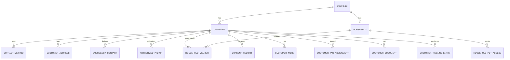
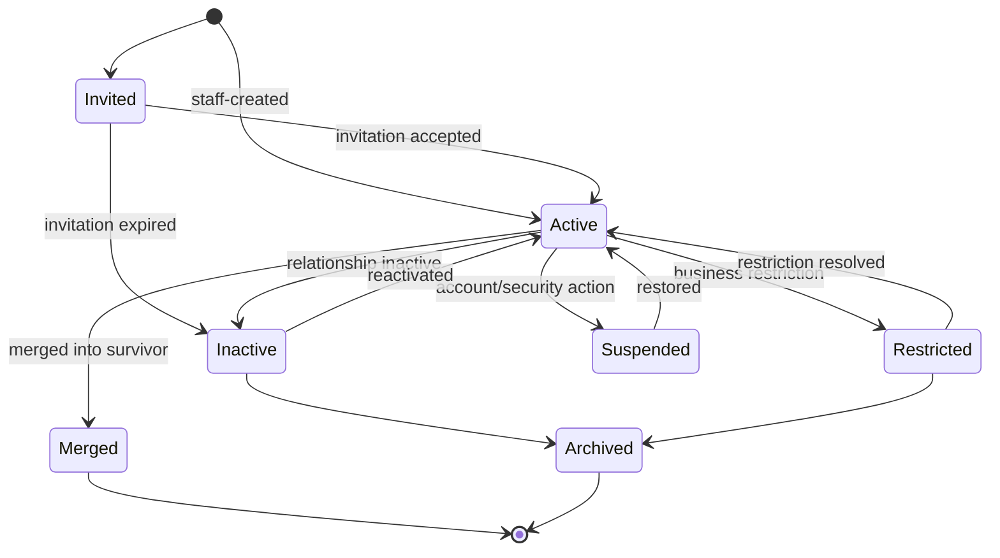

# Customer and Household Domain

- **Domain prefix:** `CUST`
- **Status:** In progress
- **MVP priority:** P0
- **Primary experiences:** Customer Portal and Business Portal

## Purpose

The Customer and Household Domain is the authoritative source for the people and shared account relationships involved in pet care. It supports individual customers, multi-person households, emergency contacts, authorized pickup people, communication preferences, consent, internal notes, documents, duplicate resolution, and portal access.

This domain identifies who may act. The Pet Domain owns the pet, the Booking Domain owns booking authorization snapshots, and the Payments Domain owns money movement.

## Goals

- Maintain one trustworthy customer record per business relationship.
- Allow households to share pets and portal access without sharing passwords.
- Clearly distinguish account access, pet ownership, booking authority, payment responsibility, emergency contact, and pickup authorization.
- Preserve privacy, consent, and an auditable history.
- Make customer history easy for authorized staff to understand.
- Prevent duplicate accounts from fragmenting bookings, pets, messages, or balances.

## Personas

| Persona | Primary needs |
|---|---|
| Primary customer | Manage household, pets, bookings, documents, and communication preferences. |
| Household member | Use an individual login with explicitly granted access. |
| Authorized pickup | Be verified for pickup without receiving portal access by default. |
| Front desk | Find the correct customer, verify authority, update contacts, and resolve routine issues. |
| Manager | Manage restrictions, merges, consent disputes, and sensitive records. |
| Platform support | Diagnose account and access problems without unnecessary data exposure. |

## Domain boundaries

### Owns

- Business-scoped customer profile
- Household and membership
- Contact methods and addresses
- Portal invitation and household access relationship
- Emergency contacts
- Authorized pickup people
- Communication preferences and consent records
- Customer status, tags, notes, and alerts
- Customer documents and signatures where not owned by a booking
- Duplicate candidates, merge decisions, and merge history
- Customer activity timeline references
- Privacy requests and retention state

### Does not own

- Authentication credentials or sessions
- Pet clinical, behavioral, vaccine, feeding, or grooming data
- Booking authority snapshots after booking confirmation
- Invoices, payment methods, payments, refunds, or balances
- Marketing campaign execution
- Staff identity and workforce records

## Relationship model

The `HOUSEHOLD_PET_ACCESS` relationship references pets owned by the Pet Domain and defines which household members may view or act for each pet.

## Functional requirements

### Profiles and contact information

| ID | Priority | Requirement | Status |
|---|---:|---|---|
| CUST-FR-001 | P0 | The platform shall create a business-scoped customer record during registration or authorized staff entry. | Accepted |
| CUST-FR-002 | P0 | A customer record shall support legal name, preferred name, pronouns when provided, locale, and time zone. | Accepted |
| CUST-FR-003 | P0 | A customer shall have one or more typed contact methods with verification and preference status. | Accepted |
| CUST-FR-004 | P0 | The platform shall support billing, residential, and alternate addresses without requiring all address types. | Accepted |
| CUST-FR-005 | P0 | Authorized users shall search customers by name, email, phone, household member, pet name, booking number, and customer identifier. | Accepted |
| CUST-FR-006 | P0 | Staff shall see a concise customer summary containing contact, household, pet, alert, booking, and balance references permitted to their role. | Accepted |

### Households and access

| ID | Priority | Requirement | Status |
|---|---:|---|---|
| CUST-FR-007 | P0 | The platform shall support a household containing one or more customers. | Accepted |
| CUST-FR-008 | P0 | Each household member shall use an individual identity and shall never be required to share credentials. | Accepted |
| CUST-FR-009 | P0 | A household shall designate at least one administrator responsible for household membership and pet access. | Accepted |
| CUST-FR-010 | P0 | Household administrators shall invite another adult by email or mobile number. | Accepted |
| CUST-FR-011 | P0 | Household membership shall not automatically grant booking, payment, document, message, or pet access. | Accepted |
| CUST-FR-012 | P0 | Pet access shall be granted per member with explicit capabilities such as view, edit, book, cancel, sign, or pay. | Accepted |
| CUST-FR-013 | P0 | Removing a household member shall revoke future access without changing historical actions or bookings. | Accepted |
| CUST-FR-014 | P1 | The platform shall support a person participating in more than one household when permitted by policy. | Proposed |

### Emergency contacts and pickup authorization

| ID | Priority | Requirement | Status |
|---|---:|---|---|
| CUST-FR-015 | P0 | A customer shall define one or more emergency contacts with relationship, priority, and contact methods. | Accepted |
| CUST-FR-016 | P0 | A customer shall define authorized pickup people separately from household access. | Accepted |
| CUST-FR-017 | P0 | Pickup authorization shall support all pets or selected pets and optional start/end dates. | Accepted |
| CUST-FR-018 | P0 | Staff shall be able to verify pickup identity and record the verification method without storing unnecessary identity-document data. | Accepted |
| CUST-FR-019 | P0 | A customer shall be able to revoke pickup authorization, subject to an active-booking safety review. | Accepted |
| CUST-FR-020 | P1 | A booking may add a one-time pickup person that expires after the booking. | Proposed |

### Preferences, consent, and communication

| ID | Priority | Requirement | Status |
|---|---:|---|---|
| CUST-FR-021 | P0 | The platform shall maintain transactional channel preferences separately from marketing consent. | Accepted |
| CUST-FR-022 | P0 | Consent records shall capture purpose, channel, status, source, policy version, timestamp, and actor. | Accepted |
| CUST-FR-023 | P0 | Customers shall be able to withdraw optional marketing consent without disabling operational messages required to fulfill active services. | Accepted |
| CUST-FR-024 | P0 | Staff shall see the effective communication preference and any verified delivery limitation. | Accepted |
| CUST-FR-025 | P1 | Businesses shall configure allowed quiet hours while preserving emergency and legally required exceptions. | Proposed |

### Notes, tags, documents, and timeline

| ID | Priority | Requirement | Status |
|---|---:|---|---|
| CUST-FR-026 | P0 | Authorized staff shall add timestamped customer notes with visibility and sensitivity classification. | Accepted |
| CUST-FR-027 | P0 | Managers shall configure customer tags and authorized staff shall assign them. | Accepted |
| CUST-FR-028 | P0 | Customer alerts shall be visually distinct from ordinary notes and require an alert type, severity, and reason. | Accepted |
| CUST-FR-029 | P0 | The domain shall expose a chronological customer timeline referencing material events from related domains. | Accepted |
| CUST-FR-030 | P0 | Customers and authorized staff shall upload permitted documents with type, status, expiration, and access classification. | Accepted |
| CUST-FR-031 | P1 | Internal notes shall support correction by append-only amendment rather than destructive editing after a configured period. | Proposed |

### Duplicate handling and lifecycle

| ID | Priority | Requirement | Status |
|---|---:|---|---|
| CUST-FR-032 | P0 | The platform shall detect likely duplicates using normalized email, phone, name, address, and linked pet signals. | Accepted |
| CUST-FR-033 | P0 | Duplicate detection shall suggest candidates but shall not automatically merge customer records. | Accepted |
| CUST-FR-034 | P0 | Authorized managers shall merge duplicate records using a field-by-field survivor review. | Accepted |
| CUST-FR-035 | P0 | A merge shall preserve identifiers, history, relationships, consent provenance, and a reversible audit map. | Accepted |
| CUST-FR-036 | P0 | Customers with financial or operational history shall be archived rather than physically deleted. | Accepted |
| CUST-FR-037 | P0 | The platform shall support active, invited, inactive, suspended, restricted, merged, and archived lifecycle states. | Accepted |
| CUST-FR-038 | P1 | The platform shall support privacy access, correction, export, and deletion/anonymization requests subject to retention obligations. | Proposed |

## Business rules

| ID | Priority | Rule |
|---|---:|---|
| CUST-BR-001 | P0 | Every customer record belongs to exactly one business tenant, even when the same person uses multiple pet-care businesses. |
| CUST-BR-002 | P0 | A verified email or mobile number may be used for sign-in identity, but contact information alone does not prove household or pet authority. |
| CUST-BR-003 | P0 | Each household must retain at least one active administrator. |
| CUST-BR-004 | P0 | Minors may be recorded as household contacts when permitted, but cannot receive independent portal or payment authority in MVP. |
| CUST-BR-005 | P0 | Emergency-contact status does not imply pickup, booking, payment, or portal authority. |
| CUST-BR-006 | P0 | Authorized-pickup status does not imply household membership or access to customer or pet data. |
| CUST-BR-007 | P0 | The effective pickup authorization is snapshotted at check-in and revalidated at checkout. |
| CUST-BR-008 | P0 | Marketing consent must never be inferred from transactional communication acceptance. |
| CUST-BR-009 | P0 | Safety, restriction, consent, merge, and privacy events require an immutable audit record. |
| CUST-BR-010 | P0 | Suspended or restricted customers cannot create new bookings unless an authorized manager resolves or overrides the restriction with a reason. |
| CUST-BR-011 | P0 | Archiving a customer revokes portal access but preserves required historical records. |
| CUST-BR-012 | P0 | Merge operations cannot cross business tenant boundaries. |
| CUST-BR-013 | P0 | The survivor record in a merge inherits all non-conflicting relationships; conflicts require an explicit manager decision. |
| CUST-BR-014 | P1 | Staff must not use free-form tags or notes as a substitute for safety-critical structured alerts. |

## Lifecycle states

`Merged` records remain resolvable to the survivor and cannot be edited or used for new activity.

## Key workflows

### Customer self-registration

1. Customer provides email or mobile number.
2. Identity and Access verifies the sign-in method.
3. The domain searches for a matching business-scoped customer.
4. A clear match is linked only after appropriate verification; ambiguous matches enter staff review.
5. A new customer and household are created when no valid match exists.
6. Required customer agreements and profile completion are presented.
7. The customer may proceed to pet creation or an existing household invitation.

### Invite a household member

1. Household administrator enters adult contact information.
2. The system shows the access being proposed.
3. An invitation with expiration and single-use token is sent.
4. The invitee verifies a separate identity.
5. The invitee accepts household membership and applicable terms.
6. The granted pet and capability access becomes effective.
7. Both parties receive confirmation and the action is audited.

### Verify an authorized pickup

1. Staff opens the booking checkout authorization list.
2. The person states their identity; the system does not expose the full list first.
3. Staff compares permitted verification information.
4. Failed or ambiguous verification triggers manager review.
5. Successful verification is recorded with actor, time, and method.
6. Checkout records the actual pickup person separately from the authorizer.

### Merge duplicate customers

1. The system or staff creates a duplicate candidate pair.
2. An authorized manager compares identity, household, pets, bookings, consent, documents, and balances.
3. The manager chooses a survivor and resolves field conflicts.
4. A pre-merge validation blocks unsafe conflicts.
5. Relationships are reassigned transactionally.
6. The duplicate becomes a resolvable merged alias.
7. A merge report and audit entry are stored.

## Permissions

| Capability | Customer | Household admin | Front desk | Manager | Platform support |
|---|:---:|:---:|:---:|:---:|:---:|
| View own profile | Yes | Yes | Within business | Within scope | Limited support view |
| Edit own profile/contact | Yes | Yes | Configurable | Yes | No |
| Invite/remove household adults | No | Yes | Assisted workflow | Yes | No |
| Grant pet access | Limited to owned/administered pets | Yes | No by default | Yes | No |
| Manage emergency contacts | Yes | Yes | Assisted workflow | Yes | No |
| Manage authorized pickups | Yes | Yes | Assisted workflow | Yes | No |
| View internal notes | No | No | Permission based | Yes | No by default |
| Create safety alert | No | No | Permission based | Yes | No |
| Restrict/suspend customer | No | No | No | Yes | Security-only workflow |
| Merge customers | No | No | No | Yes | No |
| View consent history | Own | Household-limited | Permission based | Yes | Limited support view |
| Fulfill privacy request | Request only | Request only | No | Coordinated | Authorized privacy role |

## Core entities

| Entity | Selected fields and purpose |
|---|---|
| Customer | `id`, `business_id`, names, locale, time zone, lifecycle status, timestamps |
| Household | `id`, `business_id`, display label, status |
| HouseholdMember | household, customer, role, invitation state, effective dates |
| PetAccessGrant | member, external pet reference, capability set, grantor, effective dates |
| ContactMethod | type, normalized value, display value, verification state, preference |
| CustomerAddress | address type, formatted components, validation state |
| EmergencyContact | customer/household scope, priority, relationship, contact data |
| AuthorizedPickup | person identity, pet scope, effective dates, status, verification hints |
| CommunicationPreference | purpose, channel, allowed state, quiet hours reference |
| ConsentRecord | purpose, channel, status, source, policy version, evidence, timestamp |
| CustomerNote | author, visibility, sensitivity, text, amendment link |
| CustomerAlert | type, severity, reason, effective/expiration dates, resolution state |
| CustomerTag | business-configured definition |
| CustomerTagAssignment | customer, tag, assigner, effective dates |
| CustomerDocument | storage reference, type, status, visibility, expiration |
| DuplicateCandidate | candidate pair, evidence, score, review state |
| CustomerMerge | survivor, merged customer, decisions, actor, timestamp, report |
| CustomerTimelineEntry | external event reference, category, occurred time, display metadata |
| PrivacyRequest | request type, identity verification, scope, status, due date |

Physical schemas, indexes, and row-level security policies will be defined immediately before implementation.

## Domain events

- `customer.created`
- `customer.profile.updated`
- `customer.status.changed`
- `customer.contact.verified`
- `household.created`
- `household.member.invited`
- `household.member.joined`
- `household.member.removed`
- `household.pet_access.changed`
- `customer.pickup_authorization.changed`
- `customer.consent.changed`
- `customer.alert.created`
- `customer.alert.resolved`
- `customer.document.added`
- `customer.duplicate.detected`
- `customer.merged`
- `customer.privacy_request.created`

Every event includes `business_id`, actor context, event version, occurred time, and relevant entity identifiers. Sensitive details are referenced rather than copied unnecessarily into event payloads.

## Non-functional and security requirements

| ID | Priority | Requirement |
|---|---:|---|
| CUST-NFR-001 | P0 | Customer data access shall enforce business, location when relevant, role, household, and pet-grant scope. |
| CUST-NFR-002 | P0 | Search shall return useful results quickly without leaking records from another business. |
| CUST-NFR-003 | P0 | Contact, consent, authority, restriction, merge, and privacy changes shall be auditable. |
| CUST-NFR-004 | P0 | Sensitive fields shall be minimized in logs, events, notifications, and support tooling. |
| CUST-NFR-005 | P0 | Merge and household-membership changes shall be transactional and safe to retry. |
| CUST-NFR-006 | P0 | Portal profile and household workflows shall meet WCAG 2.2 AA targets and support mobile screens. |
| CUST-NFR-007 | P1 | Duplicate search shall explain match signals to authorized reviewers without exposing hidden tenant data. |

## Acceptance scenarios

| ID | Covers | Scenario |
|---|---|---|
| CUST-AT-001 | CUST-FR-001–006 | A new customer registers, verifies contact, is found by authorized staff, and appears with the correct business scope. |
| CUST-AT-002 | CUST-FR-007–013 | A household admin invites an adult, grants booking access for one pet, and later revokes it without altering history. |
| CUST-AT-003 | CUST-FR-015–020 | A non-household pickup person is authorized for one pet and verified safely at checkout. |
| CUST-AT-004 | CUST-FR-021–025 | A customer withdraws SMS marketing while continuing to receive required booking messages through an allowed channel. |
| CUST-AT-005 | CUST-FR-026–031 | Staff records a structured safety alert and a private note; the customer sees neither, while authorized staff see both. |
| CUST-AT-006 | CUST-FR-032–035 | A manager merges duplicates, resolves conflicting contact values, and preserves bookings, pets, consent provenance, and alias lookup. |
| CUST-AT-007 | CUST-FR-036–038 | Archiving revokes access while retaining legally and operationally required records. |
| CUST-AT-008 | CUST-BR-005–007 | Emergency, pickup, and portal authorities remain distinct through booking and checkout. |
| CUST-AT-009 | CUST-BR-010 | A restricted customer cannot book until a manager resolves or records an authorized override. |
| CUST-AT-010 | CUST-NFR-001 | Direct requests cannot read or mutate another tenant's customers, households, contacts, notes, or documents. |

## Metrics

- Registration completion rate
- Verified contact rate
- Portal invitation acceptance rate
- Duplicate-customer rate and merge volume
- Search success and time to find customer
- Contact delivery failure rate
- Marketing consent rate by channel
- Restricted-customer booking attempts
- Privacy-request completion time
- Customer profile completeness

## Open decisions

1. Whether one sign-in identity can link automatically to customer records at multiple businesses.
2. Whether household administrators can delegate administrator status without business review.
3. Which pickup verification methods are configurable by risk level.
4. Whether minors appear in MVP household records or are deferred.
5. Which customer note classifications require manager-only access.
6. Whether a merge can be reversed automatically or only through a controlled support procedure.
7. Retention and anonymization periods by record category and jurisdiction.

## Dependencies

- Identity and Access for credentials, verification, MFA, and sessions
- Pet and Eligibility for pet ownership and access targets
- Booking for confirmed authority snapshots and booking history
- Payments for billing references and balances
- Communications for message delivery and marketing execution
- Document platform for secure storage and malware scanning
- Audit capability for sensitive history
- Platform Administration for privacy and support workflows

