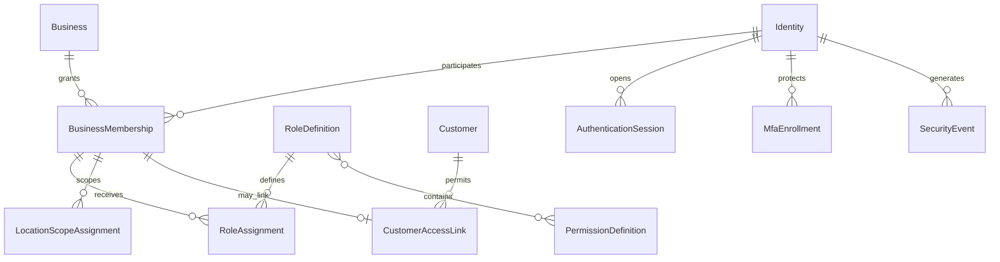
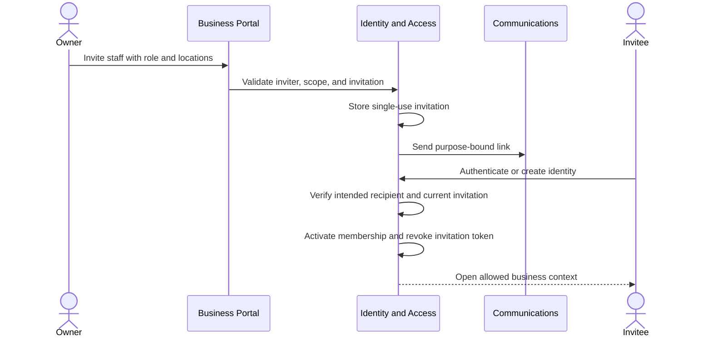

# Identity and Access Management Domain Specification

- **Domain prefix:** `IAM`
- **Status:** In progress
- **MVP priority:** P0
- **Primary experiences:** Public authentication, Customer Portal, Business Portal, Platform Console

## Purpose

Identity and Access Management establishes who a user is, which tenant relationships they hold, what they may do, where they may do it, and how that access is secured and audited. It supports customers, tenant staff, tenant owners, and platform operators without sharing credentials or weakening the business tenant boundary.

Authentication proves control of an identity. Authorization evaluates a specific request using identity, tenant membership, role, location scope, resource relationship, session assurance, and current account state. Signing in alone never grants access to tenant data.

## Product outcomes

- Every person uses an individual account and receives only explicitly granted access.
- One identity can safely relate to multiple businesses without data crossing between them.
- Customers see only households, pets, bookings, documents, messages, and payments authorized for that business relationship.
- Tenant owners can invite staff, assign roles and locations, revoke access, and transfer ownership safely.
- Sensitive actions require stronger verification than routine viewing.
- Account recovery does not become a path around tenant, household, or staff authorization.
- PostgreSQL row-level security and server-side checks reinforce application authorization.
- Platform operators remain distinct from tenant staff and use the Platform Administration support-access model.

## Scope

### MVP

- Email and password registration and sign-in
- Email verification
- Password reset and secure recovery
- Customer, staff, owner, and platform-operator account classifications
- Business-scoped memberships and location scope
- Staff invitation, acceptance, expiration, resend, and revocation
- Customer portal linkage to business-scoped customer and household relationships
- Predefined tenant roles with configurable assignment
- Permission catalog and centralized authorization decisions
- Owner transfer and last-owner protection
- MFA enrollment and challenge for tenant owners and privileged staff
- Session list, global sign-out, revocation, and security-event response
- Step-up authentication for sensitive actions
- Account lock, disable, archive, and recovery states
- Audit events for identity, membership, role, and sensitive access changes
- PostgreSQL row-level-security policy requirements
- Storage and background-job authorization context requirements

### Post-MVP

- Passkeys and passwordless sign-in
- Social identity providers for customers
- Enterprise SAML/OIDC federation and SCIM
- Customer MFA options beyond risk-based requirements
- Fine-grained tenant-defined custom roles
- Device trust and remembered-device policy
- Adaptive authentication and risk scoring
- Delegated organization administration
- Service accounts and public API credentials
- Native mobile biometric unlock

### Out of scope

- Customer household relationship rules and pet access grants
- Staff scheduling, payroll, and HR records
- Platform support-session authorization
- Payment method authentication and processor controls
- Domain-owned rules such as refund eligibility or medication witnessing
- Storing raw passwords or MFA secrets in application tables
- Using one shared account for a front desk, kennel room, or team

## Domain boundaries

### Owns

- Application identity profile linked to the authentication provider
- Identity status and assurance state
- Verified authentication contact references
- Business membership and membership lifecycle
- Staff invitation and acceptance token lifecycle
- Role definitions and assignments
- Permission definitions and authorization-policy composition
- Location and supported scope assignments
- Session security metadata and revocation requests
- MFA requirement and enrollment projection
- Step-up challenge state
- Ownership transfer workflow
- Authentication and authorization security events

### Does not own

- Password hashes, refresh-token storage, or provider MFA secret implementation
- Customer profile, household, emergency contact, or pickup authorization
- Business settings or tenant lifecycle
- Staff employment details, certifications, shift, or compensation
- Platform operator support-session grants
- Domain data or business-rule decisions

## Identity and relationship model

A person has one platform identity where possible. Access is created through relationships, not by copying the identity into every tenant.



The same identity may be:

- A customer of Business A
- A groomer employed by Business B
- An owner of Business C

Each relationship is evaluated independently. A staff role in one business grants no visibility into another business, even if the same email address is used.

## Account classifications

| Classification | Meaning | Authorization source |
|---|---|---|
| Customer | Person using customer-facing experiences | Customer/household access relationship plus customer permissions |
| Tenant staff | Person working for a pet-care tenant | Active business membership, roles, and scopes |
| Tenant owner | Privileged tenant membership responsible for administration | Active owner role and stronger security requirements |
| Platform operator | Internal PetCare operator | Platform role and support session from Platform Administration |

Classifications may coexist on one identity, but their sessions and effective context remain explicit. Platform-operator rights are never inferred from a tenant membership.

## Identity lifecycle

```text
Pending verification
  -> Active
  -> Locked
  -> Disabled
  -> Recovery review
  -> Active
  -> Archived
```

### State behavior

| State | Sign-in | Existing sessions | New access grants |
|---|---|---|---|
| Pending verification | Limited verification flow | Limited | No privileged grant activation |
| Active | Allowed | Allowed | Allowed by policy |
| Locked | Temporarily blocked | Risk policy decides revocation | No |
| Disabled | Blocked | Revoked | No |
| Recovery review | Restricted recovery only | Revoked | No |
| Archived | Blocked | Revoked | No |

Disabling an identity does not erase historical authorship. Audit, booking, care, financial, and consent records continue to reference the stable identity ID or an approved de-identified actor reference.

## Authentication

### Initial web contract

The web application uses Supabase SSR clients with HTTP-only cookie sessions refreshed by the Next.js proxy. Registration requires email verification, password reset responses do not reveal whether an account exists, recovery updates revoke all existing sessions, and callback redirects accept only application-relative paths. Business, portal, and platform route namespaces require an authenticated claim before rendering; database RLS remains the authoritative authorization layer.

The initial forms cover registration, sign-in, verification callback, password-reset request, password update, and sign-out. MFA enrollment and tenant-context selection remain subsequent E02 slices.

### Customer registration

1. Resolve the business from trusted website or booking context.
2. Collect email, password, required acknowledgements, and minimal identity information.
3. Create or link the authentication identity using anti-enumeration behavior.
4. Send a single-use verification message.
5. Establish a business-scoped customer access link only after required verification and relationship checks.
6. Return to the intended tenant-safe route.

Registration for one business does not expose whether the identity has relationships with other businesses.

### Sign-in

- Normalize the sign-in identifier according to provider rules.
- Return generic failure messages for unknown identity, wrong password, disabled account, or disallowed tenant relationship where differentiation would enable enumeration.
- Apply rate limiting and automated-abuse controls.
- Evaluate identity state, membership state, tenant state, required MFA, and requested portal.
- Rotate session tokens on successful authentication and privilege change.
- Record relevant security events without recording credentials.

### Email verification

- Verification tokens are single-use, short-lived, hashed or provider-managed, and bound to an intended purpose.
- Resend invalidates or supersedes older requests according to provider behavior.
- Changing the primary authentication email requires verification of the new address and step-up authentication.
- Email verification does not by itself prove household membership, staff employment, ownership, or pickup authority.

### Password reset

- The request response is indistinguishable whether an account exists.
- Reset links are single-use, short-lived, and purpose-bound.
- Successful reset revokes or rotates existing sessions according to risk policy.
- Reset cannot change tenant memberships, roles, household access, or verified customer relationships.
- Sensitive recent changes may trigger additional recovery review.

## Multi-factor authentication

### MVP policy

- Required for tenant owners
- Required for platform operators under Platform Administration policy
- Required for staff with high-risk permissions such as user administration, refunds, sensitive exports, or security settings
- Optional for other staff where the provider supports it cleanly
- Customer MFA may be introduced later, with step-up alternatives for selected sensitive actions

### Enrollment and recovery

- Enrollment requires a recently authenticated session.
- The platform verifies the second factor before marking enrollment active.
- Recovery codes are shown once, stored securely, and individually invalidated when used.
- Removing the last required factor requires step-up verification or controlled recovery.
- Support cannot read, copy, or disclose MFA secrets or recovery codes.
- MFA reset is a high-risk recovery action with identity verification, reason, session revocation, and audit.

## Sessions

Each session tracks safe metadata such as creation time, last activity, authentication method, assurance level, client type, approximate device label, and revocation state. It does not store raw credentials in application-visible records.

### Session controls

- View current and recent active sessions
- Revoke one session
- Sign out all other sessions
- Revoke all sessions after password, email, MFA, or risk changes
- Shorter inactivity and absolute lifetime for privileged portals
- Session rotation after authentication, ownership change, or permission elevation
- No cross-tenant context carried implicitly from an untrusted URL

An identity switching between permitted businesses receives a new explicit effective tenant context. Cached pages, queries, downloads, and browser state must not leak the previous tenant.

## Business memberships

### Membership states

```text
Invited -> Active -> Suspended -> Active
    |         |          |
    -> Expired|          -> Revoked
              -> Revoked
              -> Ended
```

| State | Meaning |
|---|---|
| Invited | Invitation exists but no active access is granted |
| Active | Membership may receive effective permissions |
| Suspended | Temporarily blocked while history remains |
| Revoked | Access was explicitly removed |
| Ended | Employment or relationship ended under recorded process |
| Expired | Invitation was not accepted in time |

### Membership rules

- A membership belongs to one identity and one business.
- Location scope is separate from role.
- A membership may hold more than one approved role, but permissions combine only within its tenant and scope.
- Removing a role or location takes effect for subsequent authorization decisions and triggers session/context refresh.
- Historical actions retain membership and actor references.
- A disabled identity makes all its memberships ineffective without rewriting them.
- Tenant suspension may override otherwise active membership access under Platform Administration policy.

## Staff invitations

### Initial database contract

The E02 implementation uses `staff_invitations` with normalized role and location-scope child records. Creation returns a cryptographically random token once; only its SHA-256 digest is stored. Acceptance locks the invitation, matches the authenticated verified email, rechecks expiry and MFA, creates the membership, applies the approved role/location scope, and consumes the token in one transaction.

Pending invitations may be revoked or superseded. A scheduled database maintenance function marks elapsed invitations expired and records audit evidence. Raw tokens, authentication credentials, and MFA secrets never enter application tables or audit details.

The initial web interface adds a server-verified business selector, permission-derived business navigation, staff invitation management, and a token-bound acceptance page. The selected business cookie is only a context hint: every resolution revalidates the signed-in identity's active membership through RLS before the application renders tenant data. Until transactional email is implemented, the inviter receives the acceptance link once for secure manual delivery.

### Invitation flow



### Invitation protections

- Invitee address and intended business are visible before acceptance without exposing unrelated tenant data.
- Tokens are single-use, short-lived, purpose-bound, and stored securely.
- Resend rotates or replaces the active token.
- Revocation prevents acceptance immediately.
- Role and location grants are revalidated at acceptance, not trusted from token claims alone.
- Existing identities authenticate before linking; a link does not silently move or merge identity data.
- Invitations to owner or high-risk roles require stronger inviter permission and invitee MFA completion before privileged access activates.

## Authorization model

Authorization uses a combination of role-based and relationship-based controls.

```text
Decision = authenticated identity
         + active identity state
         + trusted effective tenant
         + active tenant state
         + active membership or customer relationship
         + permission grant
         + location/resource scope
         + domain relationship rule
         + session assurance / step-up
         + explicit deny or restriction
```

Any required term that fails causes denial. Explicit safety, privacy, tenant, or platform restrictions take precedence over grants.

### Permission naming

Permissions use stable action-oriented keys:

```text
customers.view
customers.manage
pets.view
pets.manage_care
bookings.view
bookings.create
bookings.modify
bookings.cancel
operations.check_in
operations.record_feeding
operations.record_medication
operations.manage_incident
payments.collect
payments.refund
reports.view_operational
reports.view_financial
reports.export
website.edit
website.publish
staff.invite
staff.manage_roles
business.manage_security
```

UI labels may change; permission keys remain stable. A permission grants the ability to request a domain action, not permission to bypass that domain's state and business rules.

## Predefined tenant roles

| Role | Intended access |
|---|---|
| Owner | Tenant administration, security, billing, configuration, and all authorized business data |
| Manager | Broad assigned-location operations and staff oversight; high-risk financial/security rights configurable |
| Front desk | Customers, pets, bookings, check-in/out, approved payments, and routine communications |
| Care staff | Assigned-location pet care, tasks, observations, and permitted incident actions |
| Groomer | Grooming schedule, assigned pets, grooming workflow, notes, and media |
| Accountant | Invoices, payments, refunds where granted, reconciliation, and financial reports |
| Marketing editor | Website, approved public content, and permitted communications |
| Read-only auditor | Selected records and reports without mutation |

MVP roles are platform-defined templates. Tenants assign roles and scopes but do not create arbitrary custom permission sets at launch. This keeps security review and support manageable.

## Sensitive actions and step-up authentication

Step-up may be required for:

- Changing primary email, password, or MFA
- Inviting or promoting an owner
- Changing staff roles or location scope
- Transferring tenant ownership
- Viewing or exporting sensitive financial, customer, or health data
- Issuing refunds above configured thresholds
- Changing payment, security, or custom-domain settings
- Bulk data export
- Viewing recovery codes or resetting MFA

A recent password or MFA verification raises the session assurance for a short purpose-bound window. Step-up success does not create a blanket long-lived privilege increase.

## Ownership and ownership transfer

### Rules

- Every active tenant has at least one active owner.
- The last active owner cannot remove, demote, suspend, or revoke themselves.
- Adding an owner requires an authorized current owner, step-up authentication, and invitee MFA.
- Ownership transfer identifies whether the prior owner remains an owner, receives another role, or leaves.
- Pending transfer can be revoked before acceptance.
- Transfer acceptance revalidates both identities, tenant state, invitation, and MFA.
- Disputed or inaccessible ownership uses a Platform Administration recovery process, never a database edit from ordinary support.

## Customer portal authorization

IAM authenticates the identity and supplies its business-scoped customer access links. Customer and Household owns the actual household and pet permissions.

A customer action may require:

- Active identity
- Active customer access link for the current business
- Active household membership
- Permission for the selected pet
- Booking-specific authority
- Required consent or agreement state
- Step-up for sensitive account or payment actions

Staff cannot convert an emergency contact or authorized pickup person into a portal user without an invitation and explicit relationship grant.

## Location and resource scope

- `All current locations` is a deliberate dynamic scope.
- `Selected locations` stores explicit location assignments.
- Deactivated locations remain in historical audit context but grant no new operational access.
- A role with `bookings.view` at Location A cannot view a Location B booking merely because it shares a customer.
- Cross-location managers require explicit multi-location scope.
- Customer portal relationships are business and household scoped rather than staff-location scoped, subject to domain policy.

Resource-level assignment, such as a groomer's assigned appointments, may further restrict a role but cannot broaden the membership's location scope.

## Database and storage enforcement

### PostgreSQL row-level security

- Tenant-owned tables contain `business_id`; location-owned tables also contain `location_id` where applicable.
- RLS is enabled for tenant-owned application tables exposed through database APIs.
- Policies derive tenant and identity context from trusted authenticated claims or server-established transaction context.
- Client-supplied `business_id`, role, or location is never sufficient authorization.
- Inserts validate that referenced records belong to the same permitted tenant.
- Updates cannot move records between tenants.
- Deletes follow domain policy and do not bypass audit or retention.
- Service-role access is confined to trusted server jobs with explicit tenant context and separate tests.

### Object storage

- Paths include non-guessable object IDs and tenant scope.
- Authorization is based on storage metadata and current access, not path obscurity.
- Download URLs are short-lived and scoped.
- Revoking membership prevents new URL issuance; highly sensitive revocation may invalidate outstanding access through provider controls.
- Public website media and private pet/customer documents use separate access classifications.

### Background work

Every job carries:

- Tenant ID
- Initiating identity or system actor
- Requested capability
- Location/resource scope where relevant
- Correlation and idempotency keys
- Authorization snapshot or a requirement to reauthorize at execution

Jobs involving current sensitive access, exports, or mutation reauthorize before execution. A queue worker never assumes service credentials grant cross-tenant business authority.

## Functional requirements

### Identity and authentication

| ID | Priority | Requirement | Status |
|---|---:|---|---|
| IAM-FR-001 | P0 | The platform shall provide email/password registration, verification, sign-in, sign-out, and password recovery through the approved authentication provider. | Accepted |
| IAM-FR-002 | P0 | Authentication responses shall resist account and tenant-relationship enumeration. | Accepted |
| IAM-FR-003 | P0 | Every person shall use an individual identity; shared user accounts are prohibited. | Accepted |
| IAM-FR-004 | P0 | The platform shall preserve one identity across multiple separately authorized business relationships where safely linked. | Accepted |
| IAM-FR-005 | P0 | Changing authentication email, password, or MFA shall require appropriate recent verification and create security events. | Accepted |
| IAM-FR-006 | P0 | Authorized users shall view and revoke active sessions. | Accepted |
| IAM-FR-007 | P0 | High-risk identity or security changes shall revoke affected sessions. | Accepted |
| IAM-FR-008 | P1 | The platform shall notify users of material account-security changes through a verified channel. | Proposed |

### Memberships, invitations, and roles

| ID | Priority | Requirement | Status |
|---|---:|---|---|
| IAM-FR-009 | P0 | Authorized tenant users shall invite staff with predefined roles and location scope. | Accepted |
| IAM-FR-010 | P0 | Invitations shall support pending, accepted, expired, revoked, and superseded outcomes. | Accepted |
| IAM-FR-011 | P0 | Invitation acceptance shall authenticate the recipient and revalidate the current intended grants. | Accepted |
| IAM-FR-012 | P0 | Authorized users shall suspend, reactivate, end, or revoke a staff membership without deleting historical actions. | Accepted |
| IAM-FR-013 | P0 | Authorized users shall assign and remove predefined roles and location scopes within their own grant authority. | Accepted |
| IAM-FR-014 | P0 | The system shall prevent a user from granting a permission or scope they are not authorized to administer. | Accepted |
| IAM-FR-015 | P0 | Role and scope changes shall affect subsequent authorization decisions and invalidate stale effective-access context. | Accepted |
| IAM-FR-016 | P0 | Tenant ownership transfer shall require step-up authentication, explicit acceptance, MFA, and last-owner protection. | Accepted |
| IAM-FR-017 | P1 | Tenant owners shall be able to review effective staff access by user, role, location, and high-risk permission. | Proposed |

### Authorization and enforcement

| ID | Priority | Requirement | Status |
|---|---:|---|---|
| IAM-FR-018 | P0 | Every protected request shall resolve a trusted identity and explicit effective tenant before domain access. | Accepted |
| IAM-FR-019 | P0 | Authorization shall evaluate permission, role, scope, relationship, session assurance, and explicit restrictions server-side. | Accepted |
| IAM-FR-020 | P0 | The platform shall maintain a stable permission catalog with documented owning domains and risk classifications. | Accepted |
| IAM-FR-021 | P0 | The database shall enforce tenant isolation using row-level security in addition to application checks. | Accepted |
| IAM-FR-022 | P0 | Storage access, exports, search, reporting, and background jobs shall enforce equivalent tenant and authorization scope. | Accepted |
| IAM-FR-023 | P0 | Authorization denial shall return safe errors and generate security evidence when risk policy requires it. | Accepted |
| IAM-FR-024 | P0 | Sensitive actions shall require a sufficient authentication assurance level and recent step-up when configured. | Accepted |
| IAM-FR-025 | P1 | Authorized users shall be able to explain why a staff member has or lacks a permission without exposing internal security details. | Proposed |

### MFA and recovery

| ID | Priority | Requirement | Status |
|---|---:|---|---|
| IAM-FR-026 | P0 | Tenant owners and privileged staff shall enroll an approved second factor before privileged access activates. | Accepted |
| IAM-FR-027 | P0 | MFA enrollment, replacement, removal, and reset shall require appropriate verification and audit. | Accepted |
| IAM-FR-028 | P0 | Recovery codes shall be displayed once and individually invalidated after use. | Accepted |
| IAM-FR-029 | P0 | Support shall not be able to retrieve passwords, MFA secrets, recovery codes, or active session tokens. | Accepted |
| IAM-FR-030 | P0 | High-risk recovery shall revoke sessions and may hold privileged access pending review. | Accepted |

## Business rules

| ID | Priority | Rule |
|---|---:|---|
| IAM-BR-001 | P0 | Successful authentication does not grant tenant access without an active authorized relationship. |
| IAM-BR-002 | P0 | Every protected tenant record is accessed under exactly one effective tenant context. |
| IAM-BR-003 | P0 | A permission grant never overrides domain business rules or object-state requirements. |
| IAM-BR-004 | P0 | Explicit denies, tenant restrictions, identity disablement, and safety/privacy controls take precedence over role grants. |
| IAM-BR-005 | P0 | A user cannot grant roles, permissions, locations, or ownership beyond their own administrative authority. |
| IAM-BR-006 | P0 | Removing future access never changes historical actor attribution. |
| IAM-BR-007 | P0 | Email address equality alone does not prove two identity records or customer relationships should merge. |
| IAM-BR-008 | P0 | Household membership, emergency contact, pickup authorization, and portal access are separate relationships. |
| IAM-BR-009 | P0 | A tenant must retain at least one active MFA-protected owner. |
| IAM-BR-010 | P0 | Client-provided role, permission, tenant, location, or ownership claims are untrusted until resolved server-side. |
| IAM-BR-011 | P0 | Platform-operator access is evaluated separately from tenant membership. |
| IAM-BR-012 | P0 | Cached authorization results include identity, tenant, membership version, role version, scope version, and relevant restriction version. |
| IAM-BR-013 | P1 | Temporary elevated access expires automatically and cannot become permanent without a normal role change. |
| IAM-BR-014 | P1 | Custom roles, when introduced, cannot include hidden or retired permissions without explicit migration. |

## Conceptual data model

- `Identity`
- `IdentityAuthenticationLink`
- `VerifiedContactReference`
- `BusinessMembership`
- `MembershipStatusHistory`
- `StaffInvitation`
- `RoleDefinition`
- `RolePermission`
- `RoleAssignment`
- `PermissionDefinition`
- `LocationScopeAssignment`
- `CustomerAccessLink`
- `MfaEnrollmentProjection`
- `RecoveryCodeProjection`
- `AuthenticationSessionProjection`
- `StepUpChallenge`
- `OwnershipTransfer`
- `SecurityEvent`
- `AuthorizationDecisionLog` for selected high-risk decisions

Authentication-provider secrets remain provider-managed and are not duplicated in these application entities.

## Audit and security events

Record events for:

- Registration, verification, sign-in success/failure, and sign-out
- Password reset request and completion
- Authentication email change
- MFA enrollment, challenge failure, recovery use, removal, and reset
- Session creation and revocation
- Invitation creation, resend, revocation, expiration, and acceptance
- Membership activation, suspension, ending, and revocation
- Role, permission, and scope assignment changes
- Ownership transfer request, acceptance, cancellation, and failure
- Identity lock, disable, recovery review, and reactivation
- Repeated or high-risk authorization denials

Events contain stable actor, tenant, membership, action, target classification, timestamp, result, correlation, assurance level, and safe network/device context. They never contain passwords, reset links, invitation tokens, MFA secrets, recovery codes, or raw session tokens.

## Security requirements

| ID | Priority | Requirement |
|---|---:|---|
| IAM-SEC-001 | P0 | Password handling shall use the authentication provider's current secure storage and breach-protection capabilities. |
| IAM-SEC-002 | P0 | Authentication, verification, reset, invitation, and MFA endpoints shall be rate-limited and monitored for abuse. |
| IAM-SEC-003 | P0 | Purpose-bound secrets shall be single-use, short-lived, unpredictable, and never stored or logged in plaintext by the application. |
| IAM-SEC-004 | P0 | Session cookies shall use Secure, HttpOnly, appropriate SameSite, path, and domain restrictions. |
| IAM-SEC-005 | P0 | State-changing browser requests shall be protected against cross-site request forgery where cookie authentication applies. |
| IAM-SEC-006 | P0 | Authentication redirects shall use an allowlist and prevent open redirects and tenant-context injection. |
| IAM-SEC-007 | P0 | Privilege changes shall require step-up authentication and shall rotate or invalidate affected session context. |
| IAM-SEC-008 | P0 | RLS policies and authorization helpers shall default to denial when required context is absent or invalid. |
| IAM-SEC-009 | P0 | Service credentials shall never be exposed to browser or mobile clients. |
| IAM-SEC-010 | P0 | Identity recovery shall avoid knowledge-based questions and manual disclosure of existing authentication factors. |

## Non-functional requirements

| ID | Priority | Requirement |
|---|---:|---|
| IAM-NFR-001 | P0 | Authorization checks shall be centralized, deterministic for the same versioned context, and testable independently of UI visibility. |
| IAM-NFR-002 | P0 | Revocation of a high-risk membership or identity shall prevent new authorized requests within 60 seconds under normal conditions. |
| IAM-NFR-003 | P0 | Authentication provider outages shall fail safely and shall not grant access from stale unverified client state. |
| IAM-NFR-004 | P0 | Tenant context shall remain intact across browser navigation, server rendering, APIs, jobs, exports, search, and storage access. |
| IAM-NFR-005 | P0 | Login, recovery, invitation, MFA, and access-management screens shall meet WCAG 2.2 AA. |
| IAM-NFR-006 | P0 | Security-event recording shall not expose credentials and shall not materially delay routine authorization. |
| IAM-NFR-007 | P1 | Common authorization decisions shall complete within the application latency budget at the 95th percentile. |

## Acceptance scenarios

### IAM-AC-001: Multi-tenant identity

**Given** one identity is staff at Business A and a customer at Business B  
**When** it uses Business A's staff portal  
**Then** only its active Business A staff permissions and scopes apply, and Business B customer data is not visible.

### IAM-AC-002: Client tenant tampering

**Given** a user is authorized only for Business A  
**When** the client changes a request's `business_id` to Business B  
**Then** server authorization and RLS deny the request and record risk evidence when configured.

### IAM-AC-003: Invitation privilege change

**Given** an invitation was created for a manager role but the inviter loses authority before acceptance  
**When** the recipient accepts  
**Then** the grants are revalidated and activation is rejected or reduced according to policy.

### IAM-AC-004: Revoked invitation

**Given** a staff invitation is revoked  
**When** its former link is used  
**Then** no membership activates and the response does not expose unrelated account information.

### IAM-AC-005: Last owner protection

**Given** a tenant has one active owner  
**When** that owner attempts to demote, revoke, or suspend themselves  
**Then** the action is blocked until another eligible owner accepts ownership.

### IAM-AC-006: Shared credentials prohibited

**Given** a manager wants all front-desk employees to use one login  
**When** staff access is configured  
**Then** the platform requires individual invitations and does not create a shared user identity.

### IAM-AC-007: Location scope

**Given** a front-desk user has booking access only at Location A  
**When** they request a Location B booking directly by ID  
**Then** access is denied even when the customer also has activity at Location A.

### IAM-AC-008: Password reset isolation

**Given** a user's password is reset  
**When** recovery completes  
**Then** affected sessions are revoked, while tenant roles, household permissions, bookings, and historical actions remain unchanged.

### IAM-AC-009: Step-up expiration

**Given** an owner completed step-up authentication outside the configured assurance window  
**When** they attempt to assign another owner  
**Then** a new step-up challenge is required.

### IAM-AC-010: Customer relationship separation

**Given** a person is an emergency contact and pickup person but has no portal invitation  
**When** they authenticate with the same email address  
**Then** no customer portal access is granted automatically.

### IAM-AC-011: Storage isolation

**Given** a user had access to a private vaccination document and their membership is revoked  
**When** they request a new download URL  
**Then** issuance is denied despite knowing the object identifier or prior path.

### IAM-AC-012: Background export reauthorization

**Given** a user requests a sensitive export and loses permission before the job executes  
**When** the worker begins the export  
**Then** reauthorization fails, no file is generated, and the outcome is audited.

### IAM-AC-013: Disabled identity attribution

**Given** a staff identity is disabled after recording medication  
**When** the care timeline is viewed later  
**Then** the historical administration retains its original actor attribution without restoring access.

### IAM-AC-014: Platform operator separation

**Given** a platform operator also has an ordinary test-tenant membership  
**When** they access a production tenant  
**Then** platform access still requires the Platform Administration support-session policy.

## Screen inventory

### Public and customer authentication

- Register
- Verify email
- Sign in
- Forgot and reset password
- MFA challenge when required
- Security notification result
- Session management
- Personal security settings

### Business Portal

- Staff and invitations
- Invite staff
- Staff access details
- Role and location assignment
- Effective access explanation
- Security requirements and MFA status
- Ownership transfer
- Tenant security-event summary

### Platform Console

- Platform operator access is specified in Platform Administration and uses separate routes, roles, and visual treatment.

## Initial permission governance

Each permission added to the platform requires:

- Stable key and plain-language description
- Owning domain
- Read, write, financial, safety, privacy, or administrative classification
- Allowed predefined roles
- Supported scopes
- Whether step-up, reason, approval, or audit is required
- RLS/storage enforcement implications
- Acceptance tests for granted, denied, wrong-tenant, wrong-location, revoked, and stale-session cases

Permission keys are never repurposed. A retired permission remains documented until all assignments, cached contexts, migrations, and audit interpretations no longer depend on it.

## Measurement

- Registration verification completion rate
- Sign-in success and risk-block rate
- Password reset completion and abuse rate
- MFA enrollment among required roles
- Staff invitation acceptance, expiry, and revocation rate
- Active memberships by role and location scope
- Tenants with only one owner
- Role and scope changes by risk classification
- Session revocation propagation time
- Authorization denials by reason category without exposing sensitive targets
- RLS isolation test coverage and failures
- Account recovery cases and time to safe resolution

Security metrics are interpreted as signals, not employee productivity scores. A rise in denied cross-tenant requests may indicate attacks, defects, tests, or instrumentation changes and requires investigation.

## Open decisions

- Initial password policy and provider breach-detection configuration
- Supported MVP MFA factors and recovery process
- Exact high-risk permission list requiring MFA
- Session inactivity and absolute lifetimes by portal
- Whether customers may share one identity across tenants through a neutral account switcher at launch
- Staff invitation duration and resend limits
- Whether managers can assign other managers or only owners can
- Initial refund thresholds requiring step-up or secondary approval
- RLS claim strategy for Supabase and server-side transaction context
- Authorization cache technology and revocation mechanism
- Tenant-visible security-event detail
- Account archival and authentication-data retention schedule

## Related specifications

- [Architecture Overview](../../architecture/overview.md)
- [Technology Stack](../../architecture/technology-stack.md)
- [ADR-0002: Business Multi-Tenancy](../../decisions/ADR-0002-business-multi-tenancy.md)
- [Business Configuration](../business-configuration/README.md)
- [Customer and Household](../customer-household/README.md)
- [Operations](../operations/README.md)
- [Reporting](../reporting/README.md)
- [Platform Administration](../platform-administration/README.md)
