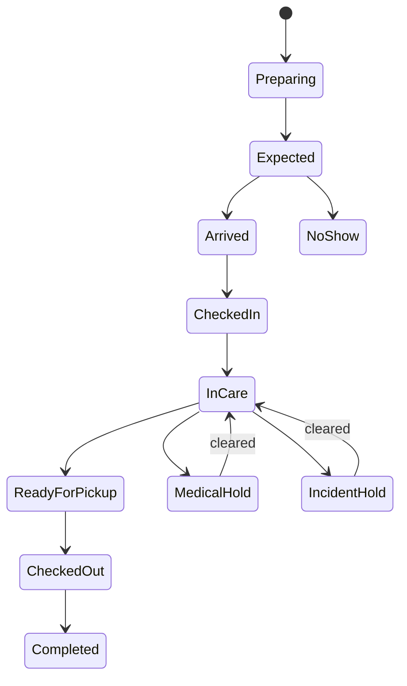

# Operations Domain

- **Domain prefix:** `OPS`
- **Status:** In progress
- **MVP priority:** P0
- **Primary experience:** Staff and Business Portals

## Purpose

The Operations Domain owns the pet-care lifecycle after a confirmed booking enters preparation through check-in, service execution, checkout, and operational completion. It is the system staff use throughout the day to safely care for pets and coordinate work.

## Specification map

- [Check-in and checkout](check-in-checkout.md)
- [Daily care and tasks](daily-care.md)
- [Boarding, daycare, and grooming execution](service-execution.md)
- [Incidents, wellness, and report cards](incidents-report-cards.md)

## Goals

- Tell every staff member what needs attention now.
- Create one auditable pet journey from arrival through departure.
- Prevent missed feeding, medication, safety, cleaning, or customer-handoff work.
- Support boarding, daycare, and grooming through shared patterns plus service-specific workflows.
- Distinguish planned care, actual care, exceptions, and customer-visible updates.
- Operate safely when network or external communications are delayed.

## Domain boundaries

### Owns

- Operational visit/stay and care-plan snapshots
- Check-in and checkout sessions
- Pet presence and operational status
- Housing/resource-assignment coordination
- Care tasks, task status, staff assignment, and exceptions
- Feeding, medication, potty, activity, wellness, and behavior observations
- Boarding, daycare, and grooming execution states
- Cleaning/turnover requests and operational readiness references
- Incidents and escalation
- Report-card authoring, approval, and publication request
- Operational pet timeline and shift handoff

### Does not own

- Booking confirmation, customer master data, pet master profile, prices, invoices, or payments
- Resource capacity commitments or master resource configuration
- Employee identity, payroll, or full shift scheduling
- Message delivery
- Veterinary diagnosis or clinical treatment records

## Operational lifecycle

Booking remains the commercial lifecycle owner; Operations publishes authorized status events back to it.

## Core functional requirements

| ID         | Priority | Requirement                                                                                                                         | Status   |
| ---------- | -------: | ----------------------------------------------------------------------------------------------------------------------------------- | -------- |
| OPS-FR-001 |       P0 | A confirmed booking shall create or schedule an operational visit with pet, service, care, policy, alert, and authority snapshots.  | Accepted |
| OPS-FR-002 |       P0 | Staff shall see location-specific arrivals, departures, pets in care, grooming work, daycare attendance, due tasks, and exceptions. | Accepted |
| OPS-FR-003 |       P0 | Every pet in care shall have one current operational status and chronological timeline.                                             | Accepted |
| OPS-FR-004 |       P0 | Operational actions shall record actor, actual time, source, result, notes/evidence, and correction history.                        | Accepted |
| OPS-FR-005 |       P0 | Safety-critical alerts shall remain prominent across check-in, care, assignment, task, incident, and checkout views.                | Accepted |
| OPS-FR-006 |       P0 | Staff shall receive only the pets, areas, actions, and sensitive details permitted by role and assignment.                          | Accepted |
| OPS-FR-007 |       P0 | Missed, late, refused, blocked, or failed care actions shall create structured exceptions and escalation.                           | Accepted |
| OPS-FR-008 |       P0 | Operational records shall distinguish scheduled, due, completed, skipped, cancelled, and not-applicable states.                     | Accepted |
| OPS-FR-009 |       P0 | Corrections shall append an amendment and shall not erase the original safety-relevant record.                                      | Accepted |
| OPS-FR-010 |       P0 | The domain shall publish material operational events for Booking, Communications, Pet review, Reporting, and audit.                 | Accepted |
| OPS-FR-011 |       P0 | Staff shall search pets/visits and filter work by location, service, area, status, due time, priority, assignment, and exception.   | Accepted |
| OPS-FR-012 |       P1 | Shift handoff shall summarize unresolved alerts, overdue tasks, incidents, medication exceptions, and departure risks.              | Proposed |

## Business rules

| ID         | Priority | Rule                                                                                                                                      |
| ---------- | -------: | ----------------------------------------------------------------------------------------------------------------------------------------- |
| OPS-BR-001 |       P0 | A pet cannot enter `InCare` without a completed authorized check-in.                                                                      |
| OPS-BR-002 |       P0 | A pet cannot complete checkout while blocking departure tasks, unresolved pickup authorization, or required financial resolution remains. |
| OPS-BR-003 |       P0 | Planned time and actual time are stored separately.                                                                                       |
| OPS-BR-004 |       P0 | Safety-critical tasks cannot be bulk-completed without individual pet verification.                                                       |
| OPS-BR-005 |       P0 | Medication administration, serious incidents, and sensitive overrides cannot be backdated without explicit reason and authorization.      |
| OPS-BR-006 |       P0 | Customer-provided care instructions are snapshotted at check-in; later changes require controlled review.                                 |
| OPS-BR-007 |       P0 | Operational observation may propose a Pet-profile update but never silently rewrites the master profile.                                  |
| OPS-BR-008 |       P0 | All timestamps use location context for display and canonical instants for storage.                                                       |
| OPS-BR-009 |       P0 | No staff role may see another tenant's operational data.                                                                                  |
| OPS-BR-010 |       P0 | AI may draft summaries but cannot record care completion, medication administration, check-in, checkout, or incident resolution.          |

## Core entities

| Entity                   | Purpose                                                              |
| ------------------------ | -------------------------------------------------------------------- |
| OperationalVisit         | Booking-linked operational container at one location                 |
| PetVisit                 | One pet's presence, status, snapshots, and timeline                  |
| CarePlanSnapshot         | Effective feeding, medication, handling, activity, and alert plan    |
| OperationalTask          | Scheduled/adhoc work, priority, assignment, SLA, outcome             |
| CareObservation          | Structured appetite, elimination, mood, wellness, or behavior result |
| ServiceExecution         | Boarding/daycare/grooming progress and service-specific state        |
| OperationalException     | Missed/late/blocked/refused/failed condition and escalation          |
| ShiftHandoff             | Unresolved work and risk summary                                     |
| OperationalTimelineEvent | Immutable material event reference                                   |

## Permissions summary

| Capability               |    Front desk    | Kennel/daycare staff |         Groomer         |        Manager        |     Customer     |
| ------------------------ | :--------------: | :------------------: | :---------------------: | :-------------------: | :--------------: |
| Check in/out             |       Yes        |    No by default     | Limited grooming intake |          Yes          | Participate/sign |
| View care plan           |     Relevant     |  Assigned/relevant   |    Grooming relevant    |          Yes          |  Customer-safe   |
| Complete care tasks      |     Limited      |         Yes          |     Grooming tasks      |          Yes          |        No        |
| Administer medication    | Permission based |   Permission based   |      No by default      |   Permission based    |        No        |
| Create incident          |       Yes        |         Yes          |           Yes           |          Yes          |        No        |
| Resolve serious incident |        No        |          No          |           No            |          Yes          |        No        |
| Publish report card      |   Configurable   |        Draft         |          Draft          |    Approve/publish    |  View published  |
| Override safety workflow |        No        |          No          |           No            | Restricted permission |        No        |

## Domain events

- `operations.visit.prepared`
- `operations.pet.arrived`
- `operations.pet.checked_in`
- `operations.pet.status.changed`
- `operations.task.due`
- `operations.task.completed`
- `operations.task.exception`
- `operations.pet.ready_for_pickup`
- `operations.pet.checked_out`
- `operations.visit.completed`
- `operations.shift_handoff.created`

## Non-functional requirements

| ID          | Priority | Requirement                                                                                                        |
| ----------- | -------: | ------------------------------------------------------------------------------------------------------------------ |
| OPS-NFR-001 |       P0 | Safety-critical mutations shall be idempotent, auditable, and resilient to client retry.                           |
| OPS-NFR-002 |       P0 | Due-work and alert views shall update quickly enough for live facility operation.                                  |
| OPS-NFR-003 |       P0 | Interfaces shall remain usable on shared desktops and staff tablets and meet WCAG 2.2 AA targets.                  |
| OPS-NFR-004 |       P0 | Sensitive pet/customer details shall be limited by tenant, role, location, area, assignment, and purpose.          |
| OPS-NFR-005 |       P0 | Temporary notification or AI outages shall not prevent recording essential care.                                   |
| OPS-NFR-006 |       P1 | Safe offline capture for selected tasks shall detect conflict and preserve actual completion time when introduced. |

## Acceptance scenarios

| ID         | Covers         | Scenario                                                                                                                  |
| ---------- | -------------- | ------------------------------------------------------------------------------------------------------------------------- |
| OPS-AT-001 | OPS-FR-001–005 | A confirmed boarding visit prepares, checks in, records care, and checks out with a complete timeline and visible alerts. |
| OPS-AT-002 | OPS-FR-006–009 | A staff member sees assigned pets only; a corrected care record retains both original and amendment.                      |
| OPS-AT-003 | OPS-FR-007–008 | A refused meal and late medication create different structured exceptions and escalation.                                 |
| OPS-AT-004 | OPS-BR-004–005 | Bulk completion cannot mark medication administered and unauthorized backdating is rejected.                              |
| OPS-AT-005 | OPS-NFR-004    | Cross-tenant and unauthorized-area operational requests are denied.                                                       |

## Metrics

- Pets expected, arrived, in care, ready, and departed
- Task due/on-time/late/missed/refused/blocked rates
- Feeding and medication compliance
- Average check-in and checkout duration
- Operational exceptions and resolution time
- Incidents by service/severity
- Report-card completion/publication rate
- Resource moves and readiness delays
- Customer pickup delays and no-shows

## Open decisions

1. Which tasks support offline completion in MVP.
2. Whether one OperationalVisit may span locations; preferred answer is no.
3. Which medication actions require a witness.
4. Whether report-card approval is configurable by service and staff role.
5. How detailed the initial facility board must be versus a list/queue view.
