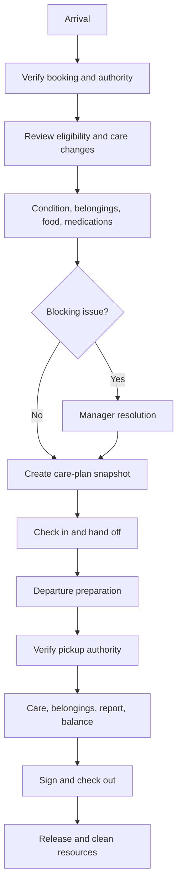

# Check-In and Checkout

## Check-in requirements

| ID         | Priority | Requirement                                                                                                                                  |
| ---------- | -------: | -------------------------------------------------------------------------------------------------------------------------------------------- |
| OPS-FR-020 |       P0 | Staff shall open a check-in session for an expected booking/pet or authorized walk-in workflow.                                              |
| OPS-FR-021 |       P0 | Check-in shall verify customer/booking identity, pickup authority, emergency contact, required agreements, eligibility, and financial flags. |
| OPS-FR-022 |       P0 | Staff and customer shall review medications, feeding, allergies, health, behavior, grooming instructions, and material profile changes.      |
| OPS-FR-023 |       P0 | Staff shall record arrival condition, belongings, supplied food, medications, quantities, and photos when required.                          |
| OPS-FR-024 |       P0 | Check-in shall create an immutable care-plan snapshot and required tasks.                                                                    |
| OPS-FR-025 |       P0 | Blocking discrepancies shall enter a manager-review state rather than being ignored.                                                         |
| OPS-FR-026 |       P0 | Completing check-in shall record the actual receiving staff member, time, signatures, and operational handoff.                               |

## Checkout requirements

| ID         | Priority | Requirement                                                                                                              |
| ---------- | -------: | ------------------------------------------------------------------------------------------------------------------------ |
| OPS-FR-027 |       P0 | Checkout shall verify the pickup person against effective authorization and record verification method.                  |
| OPS-FR-028 |       P0 | Staff shall reconcile belongings, remaining food, medications, documents, and required report card.                      |
| OPS-FR-029 |       P0 | Checkout shall verify service completion and unresolved care, incident, or manager-review items.                         |
| OPS-FR-030 |       P0 | Checkout shall request final invoice/balance resolution from Payments without editing the amount.                        |
| OPS-FR-031 |       P0 | Authorized policy shall determine whether departure may proceed with an outstanding balance.                             |
| OPS-FR-032 |       P0 | Checkout shall record actual pickup person, staff member, time, signatures/acknowledgements, and customer handoff notes. |
| OPS-FR-033 |       P0 | Completed checkout shall release operational assignments and request required cleaning/turnover.                         |

## Flow

## Specific rules

- Customer arrival does not equal completed check-in.
- Staff cannot suppress an expired vaccine, medication discrepancy, bite alert, or pickup restriction without authorized resolution.
- Belongings use identifiable items and returned/missing/damaged status.
- Medication intake records label/container match, quantity, storage, expiration when visible, and discrepancies; staff do not diagnose dosage.
- Pickup identity is verified without first revealing the complete authorized-person list.
- Early departure follows booking/pricing/payment policy but preserves actual operational times.
- A pet may be checked out separately from sibling pets when the booking and financial allocation permit it.

## Implemented E09 foundation

- `operational_visits` is the booking-level operational aggregate; `pet_visits` supports separate sibling-pet custody states.
- `record_booking_arrival` records physical presence without implying custody acceptance.
- `complete_pet_check_in` requires two distinct pet identity signals, current eligibility, and no unresolved blocking booking actions.
- Completion captures immutable arrival condition, care-plan snapshot, custody inventory, receiving staff identity, and operational timeline evidence.
- Care snapshots copy active allergy, medication, feeding, behavior, health, and pet identity data. They do not rewrite the master pet profile.
- Booking-, visit-, pet-, and request-key uniqueness makes arrival and check-in retries safe.
- `visit_resource_assignments` links a pet visit to a compatible named resource without confusing capacity reservations with physical location.
- A resource must be ready or validly occupied below `max_pets`; maintenance and out-of-service resources can never be assigned through check-in.
- `operational_handoffs` records the receiving staff member separately from the staff member who completed intake.
- Handoff queues one idempotent customer confirmation only after a receiving staff member accepts responsibility.
- Manager resolutions are immutable records. Eligibility, deposit, and approval blockers cannot be bypassed from check-in; exceptions require an action explicitly marked overrideable by policy.
- `care_plan_amendments` append visit-only instructions to the immutable intake snapshot. A requested master-profile change remains a separate `proposed` workflow.

## Implemented E11 checkout foundation

- The Departures workspace shows every pet still in care with service, care, incident, report-card, balance, and custody readiness in one controlled workflow.
- `complete_pet_checkout` verifies the pickup person against the household or an effective pet-specific pickup authorization without exposing the authorization list.
- Two distinct identity evidence values, the verification method, relationship, handoff notes, staff identity, timestamp, and final acknowledgement are stored in an immutable checkout record.
- Active care work, unresolved alerts or incidents, an unfinished service, a missing published report card, and an outstanding invoice balance block release by default.
- Only an owner or manager may create an immutable, reasoned override for an allowed checkout blocker. The original blocker remains visible in the reconciliation snapshot.
- Every return-required custody item must be reconciled. Missing or damaged property additionally requires a documented manager exception.
- Retry keys make checkout completion idempotent and prevent duplicate custody returns or turnover work.
- Completing checkout releases only that pet's active resource assignment. A shared resource enters cleaning only after its final active assignment is released.
- Final sibling-pet checkout closes the operational visit; each pet can still depart independently.

## Acceptance scenarios

| ID         | Scenario                                                                                                    |
| ---------- | ----------------------------------------------------------------------------------------------------------- |
| OPS-AT-020 | Staff resolve a changed medication instruction before check-in and generate the correct new care snapshot.  |
| OPS-AT-021 | An unauthorized pickup attempt is blocked, escalated, and audited without exposing other authorized people. |
| OPS-AT-022 | Missing belongings and an unresolved incident prevent checkout until manager review.                        |
| OPS-AT-023 | Final payment succeeds once under retry and checkout completes without duplicating the charge.              |
