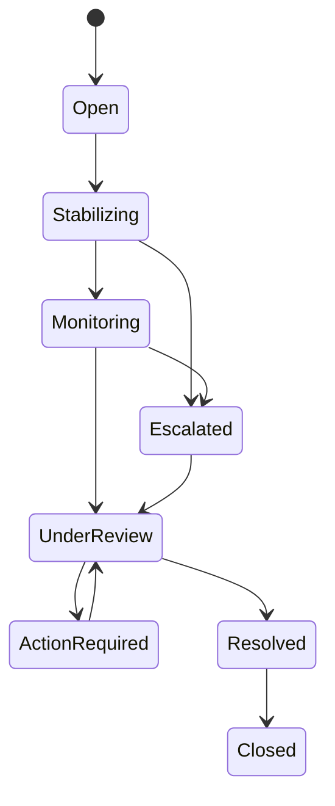

# Incidents, Wellness, and Report Cards

## Incident requirements

| ID         | Priority | Requirement                                                                                                                                      |
| ---------- | -------: | ------------------------------------------------------------------------------------------------------------------------------------------------ |
| OPS-FR-080 |       P0 | Any authorized staff member shall create an incident linked to pet(s), visit, location, time, category, severity, people, and initial facts.     |
| OPS-FR-081 |       P0 | Incidents shall support injury, illness, bite/fight, escape, medication, feeding, behavior, facility, customer, and other configured categories. |
| OPS-FR-082 |       P0 | Staff shall record immediate actions, evidence, witnesses, notifications, veterinary referral, and ongoing monitoring.                           |
| OPS-FR-083 |       P0 | Severity shall determine manager escalation, customer-contact timing, operational hold, and required review.                                     |
| OPS-FR-084 |       P0 | Serious incidents shall require manager resolution and cannot be deleted or silently downgraded.                                                 |
| OPS-FR-085 |       P0 | Incident customer communication shall separate verified facts from internal investigation notes.                                                 |
| OPS-FR-086 |       P1 | Managers shall record root cause and corrective/preventive actions for qualifying incidents.                                                     |

## Wellness requirements

| ID         | Priority | Requirement                                                                                                                                 |
| ---------- | -------: | ------------------------------------------------------------------------------------------------------------------------------------------- |
| OPS-FR-087 |       P0 | Staff shall record structured wellness checks appropriate to service and stay length.                                                       |
| OPS-FR-088 |       P0 | Repeated or severe observations shall create alerts based on configured thresholds.                                                         |
| OPS-FR-089 |       P0 | Wellness escalation shall support manager review, customer contact, veterinarian contact, monitoring plan, and emergency action references. |
| OPS-FR-090 |       P0 | Wellness records shall distinguish observation from diagnosis and treatment authorization.                                                  |

## Report-card requirements

| ID         | Priority | Requirement                                                                                                                    |
| ---------- | -------: | ------------------------------------------------------------------------------------------------------------------------------ |
| OPS-FR-091 |       P0 | Staff shall create boarding, daycare, and grooming report cards from approved operational facts, notes, and media.             |
| OPS-FR-092 |       P0 | Templates shall define required sections, customer-visible fields, rating scales, media limits, approval, and delivery timing. |
| OPS-FR-093 |       P0 | Feeding, medication, activity, wellness, and incident summaries shall reflect actual records and visibility rules.             |
| OPS-FR-094 |       P0 | Report cards shall support draft, review, approved, published, corrected, and archived states.                                 |
| OPS-FR-095 |       P0 | Published report cards shall be immutable; corrections create a new version with appropriate notice.                           |
| OPS-FR-096 |       P0 | Internal notes, restricted incidents, and sensitive medical detail shall not appear without explicit authorized inclusion.     |
| OPS-FR-097 |       P0 | Published report cards shall request delivery through Communications and remain available in the customer portal.              |
| OPS-FR-098 |       P1 | AI may draft a narrative from authorized structured data, but staff must review and approve it.                                |

## Incident lifecycle

## Specific rules

- Immediate pet safety takes priority over data entry; the record may start minimal and be completed promptly afterward.
- Incident severity changes retain the original value and reason.
- Evidence files use secure storage and access classification.
- Customer notification is recorded with time, channel request, recipient, staff member, and approved summary.
- A report card never conceals a required incident notification.
- AI-generated language cannot invent appetite, medication, activity, behavior, or wellness outcomes.
- Report-card media must belong to the correct pet/visit and pass staff review before publication.

## Acceptance scenarios

| ID         | Scenario                                                                                                                    |
| ---------- | --------------------------------------------------------------------------------------------------------------------------- |
| OPS-AT-080 | Staff stabilize an injury, create a serious incident, contact the manager/customer, record referral, and preserve evidence. |
| OPS-AT-081 | Repeated appetite/elimination concerns trigger a wellness escalation and monitoring plan.                                   |
| OPS-AT-082 | A daycare report card summarizes actual activities but excludes an internal behavior investigation note.                    |
| OPS-AT-083 | A published report card correction creates a new version and customer notice without replacing the original.                |
