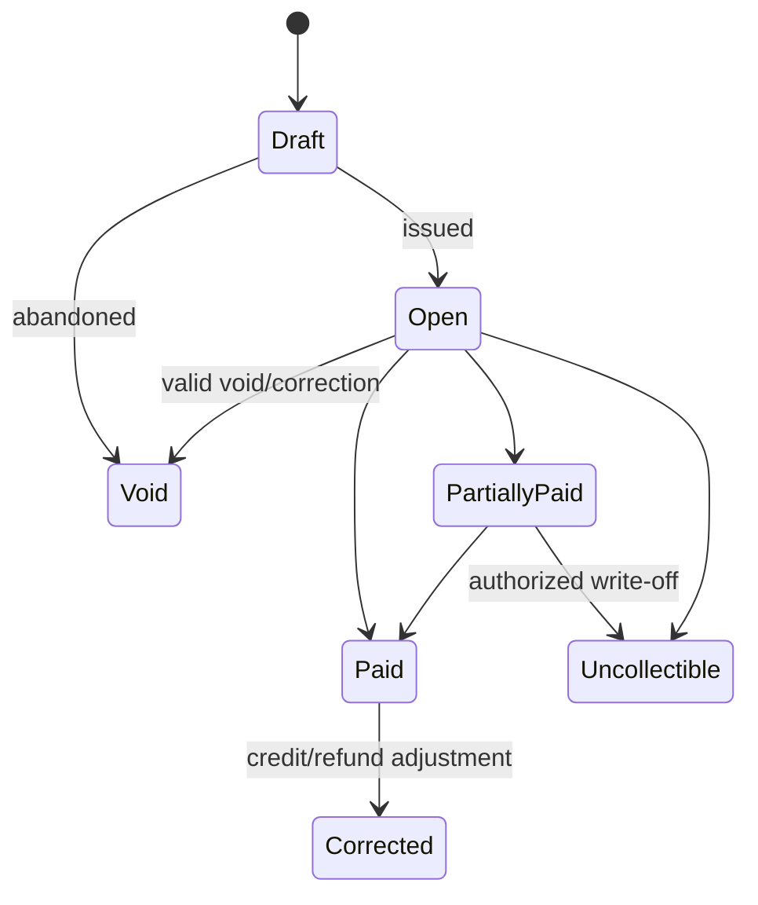
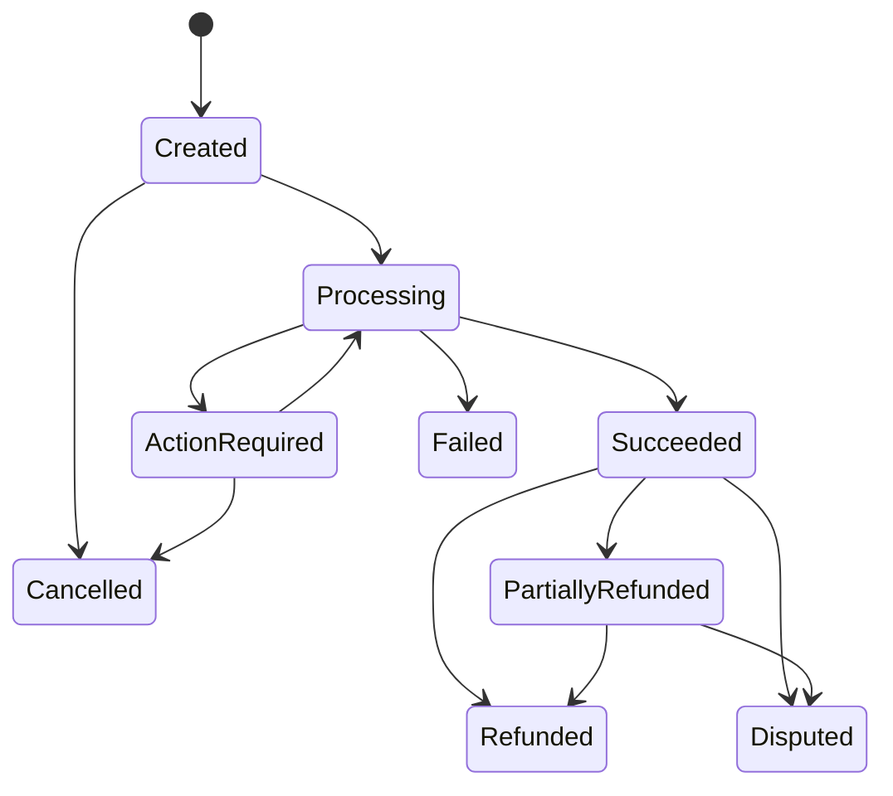
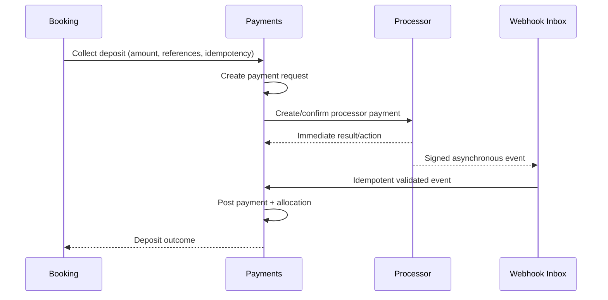

# Payments and Invoicing Domain

- **Domain prefix:** `PAY`
- **Status:** In progress
- **MVP priority:** P0
- **Primary experiences:** Customer Portal, Front Desk, Business Portal, and Platform Administration

## Purpose

The Payments and Invoicing Domain records what is owed, what was paid, how funds were applied, what was refunded or credited, and how processor activity reconciles to PetCare records. Stripe is the initial processor, but PetCare remains the authoritative business ledger for invoices, allocations, balances, deposits, refunds, credits, and audit history.

Pricing determines amounts and policy outcomes. This domain executes and records settlement without independently changing prices.

## Goals

- Collect required deposits and final balances safely.
- Produce understandable invoices, receipts, balances, and refund records.
- Support online and staff-entered payment workflows.
- Prevent duplicate charges during retries.
- Reconcile asynchronous processor events reliably.
- Keep tenant merchant funds and platform subscription billing separate.
- Minimize payment-card exposure and PCI scope.
- Preserve an immutable financial audit trail.

## Financial concepts

| Concept          | Definition                                                                                  |
| ---------------- | ------------------------------------------------------------------------------------------- |
| Merchant account | The business's connected payment-processing account.                                        |
| Invoice          | Versioned statement of charges, adjustments, taxes, and amount due.                         |
| Payment intent   | PetCare's request to collect a specific amount for a defined purpose.                       |
| Payment          | Successful or terminal processor transaction record.                                        |
| Allocation       | Application of payment, credit, or refund to invoice lines/balances.                        |
| Deposit          | Payment allocated toward a booking balance, not separate revenue.                           |
| Refund           | Return of settled money to an original payment method when possible.                        |
| Credit           | Internal liability usable against eligible future charges.                                  |
| Receipt          | Customer-facing evidence of payment/refund.                                                 |
| Reconciliation   | Comparison of PetCare records with processor charges, fees, refunds, disputes, and payouts. |

## Domain boundaries

### Owns

- Merchant connection status and processor references
- Customer payment-method tokens/references and display metadata
- Invoices, invoice versions, lines, balances, and status
- Payment requests/intents and payment records
- Payment allocations and deposit application
- Refunds, voids, credits, and write-offs
- Cash/check/manual tender records
- Receipts and financial timeline
- Processor webhook inbox and processing state
- Disputes/chargebacks and evidence workflow
- Reconciliation findings and payout references

### Does not own

- Service prices, discounts, taxes, deposit formulas, or cancellation outcomes
- Booking lifecycle or capacity
- Processor card data or bank credentials
- General ledger/accounting system
- Pet-care business subscription billing to PetCare unless explicitly handled by a separate platform-billing subdomain
- Staff payroll or commissions

## Functional requirements

### Merchant onboarding and configuration

| ID         | Priority | Requirement                                                                                                                      | Status   |
| ---------- | -------: | -------------------------------------------------------------------------------------------------------------------------------- | -------- |
| PAY-FR-001 |       P0 | An authorized owner shall connect a merchant account for each business or configured legal entity.                               | Accepted |
| PAY-FR-002 |       P0 | The platform shall track onboarding, capability, restriction, payout, and disconnection status without storing bank credentials. | Accepted |
| PAY-FR-003 |       P0 | Online collection shall be blocked when required merchant capabilities are unavailable.                                          | Accepted |
| PAY-FR-004 |       P0 | Staff shall see actionable merchant-connection issues without sensitive processor details.                                       | Accepted |
| PAY-FR-005 |       P0 | Accepted tender types shall be configurable by location/channel within processor and legal constraints.                          | Accepted |

### Payment methods and customer wallet

| ID         | Priority | Requirement                                                                                                       | Status   |
| ---------- | -------: | ----------------------------------------------------------------------------------------------------------------- | -------- |
| PAY-FR-006 |       P0 | Customers shall add a processor-tokenized payment method through a processor-hosted or compliant interface.       | Accepted |
| PAY-FR-007 |       P0 | PetCare shall store only processor references and safe display metadata such as brand, last four, and expiration. | Accepted |
| PAY-FR-008 |       P0 | Customers shall list, remove, and select saved methods subject to active-payment or autopay dependencies.         | Accepted |
| PAY-FR-009 |       P0 | A payment method shall be scoped to the correct customer and merchant context.                                    | Accepted |
| PAY-FR-010 |       P0 | Staff shall never view full card or bank details.                                                                 | Accepted |
| PAY-FR-011 |       P1 | The platform shall support eligible digital wallets through the processor integration.                            | Proposed |

### Invoicing

| ID         | Priority | Requirement                                                                                                             | Status   |
| ---------- | -------: | ----------------------------------------------------------------------------------------------------------------------- | -------- |
| PAY-FR-012 |       P0 | The domain shall create a draft invoice from an immutable quote or approved operational adjustment.                     | Accepted |
| PAY-FR-013 |       P0 | Invoice lines shall reference source quote lines, booking items, taxes, fees, discounts, and adjustments.               | Accepted |
| PAY-FR-014 |       P0 | Invoices shall support draft, open, partially paid, paid, void, uncollectible, and corrected states.                    | Accepted |
| PAY-FR-015 |       P0 | Issued invoices shall be immutable; corrections use adjustment lines, credit notes, or replacement versions.            | Accepted |
| PAY-FR-016 |       P0 | The platform shall calculate invoice balance from posted lines and allocations rather than a manually editable balance. | Accepted |
| PAY-FR-017 |       P0 | Customers and authorized staff shall view itemized invoices and payment/refund history.                                 | Accepted |
| PAY-FR-018 |       P0 | Invoice numbers shall be unique within the configured business/legal scope.                                             | Accepted |
| PAY-FR-019 |       P1 | The platform shall support consolidated household billing only after allocation rules are fully defined.                | Proposed |

### Payment collection

| ID         | Priority | Requirement                                                                                                                                                | Status   |
| ---------- | -------: | ---------------------------------------------------------------------------------------------------------------------------------------------------------- | -------- |
| PAY-FR-020 |       P0 | Booking and staff workflows shall request collection using amount, currency, customer, merchant, purpose, invoice/booking references, and idempotency key. | Accepted |
| PAY-FR-021 |       P0 | Payment collection shall support required deposit, partial balance, full balance, and staff-entered amount within authorization rules.                     | Accepted |
| PAY-FR-022 |       P0 | The platform shall support card and configured manual tenders such as cash or check.                                                                       | Accepted |
| PAY-FR-023 |       P0 | Processor flows requiring additional customer action shall return a resumable action-required state.                                                       | Accepted |
| PAY-FR-024 |       P0 | Successful collection shall create a payment and allocation transactionally or through recoverable idempotent processing.                                  | Accepted |
| PAY-FR-025 |       P0 | Failed collection shall preserve reason category, processor reference, retry safety, and customer-safe guidance.                                           | Accepted |
| PAY-FR-026 |       P0 | Staff shall not mark a processor payment successful manually.                                                                                              | Accepted |
| PAY-FR-027 |       P0 | Offline/manual tender entry shall record collector, location, time, tender, amount, and optional reference.                                                | Accepted |
| PAY-FR-028 |       P1 | Split tender across multiple payment methods shall be supported after partial-allocation behavior is validated.                                            | Proposed |

### Deposits and balances

| ID         | Priority | Requirement                                                                                                                | Status   |
| ---------- | -------: | -------------------------------------------------------------------------------------------------------------------------- | -------- |
| PAY-FR-029 |       P0 | A collected booking deposit shall allocate to the booking invoice and reduce remaining balance.                            | Accepted |
| PAY-FR-030 |       P0 | Deposit reports shall distinguish collected, applied, refunded, forfeited, disputed, and transferred amounts.              | Accepted |
| PAY-FR-031 |       P0 | Booking changes shall preserve prior payment allocations and apply delta instructions from Pricing.                        | Accepted |
| PAY-FR-032 |       P0 | Checkout shall show balance due from invoice lines, allocations, credits, refunds, and approved adjustments.               | Accepted |
| PAY-FR-033 |       P0 | A deposit transfer between bookings shall create explicit deallocation/reallocation records and require policy permission. | Accepted |

### Refunds, credits, voids, and write-offs

| ID         | Priority | Requirement                                                                                                                           | Status   |
| ---------- | -------: | ------------------------------------------------------------------------------------------------------------------------------------- | -------- |
| PAY-FR-034 |       P0 | Authorized staff shall initiate full or partial refunds based on approved Pricing outcome or documented override.                     | Accepted |
| PAY-FR-035 |       P0 | Refunds shall identify source payment, amount, currency, reason, affected lines, initiator, approval, and processor reference.        | Accepted |
| PAY-FR-036 |       P0 | Refund amount shall not exceed refundable settled amount after prior refunds and disputes.                                            | Accepted |
| PAY-FR-037 |       P0 | The platform shall support store/account credit as a separate liability with issuance, balance, expiration policy, and usage history. | Accepted |
| PAY-FR-038 |       P0 | Voids shall be used only when the processor transaction is eligible and shall preserve the original attempt.                          | Accepted |
| PAY-FR-039 |       P0 | Write-offs shall require manager permission and shall not be represented as payment.                                                  | Accepted |
| PAY-FR-040 |       P0 | Refund and credit receipts shall be available to the customer.                                                                        | Accepted |
| PAY-FR-041 |       P1 | Gift cards shall use a separate value instrument model, not generic store credit, when introduced.                                    | Proposed |

### Webhooks and asynchronous processing

| ID         | Priority | Requirement                                                                                                                    | Status   |
| ---------- | -------: | ------------------------------------------------------------------------------------------------------------------------------ | -------- |
| PAY-FR-042 |       P0 | Processor webhooks shall be signature-verified before processing.                                                              | Accepted |
| PAY-FR-043 |       P0 | Raw webhook metadata and payload references shall enter an idempotent inbox before domain mutation.                            | Accepted |
| PAY-FR-044 |       P0 | Duplicate and out-of-order events shall not duplicate payments, refunds, allocations, or status transitions.                   | Accepted |
| PAY-FR-045 |       P0 | Failed webhook processing shall retry with bounded backoff and enter an operational queue after repeated failure.              | Accepted |
| PAY-FR-046 |       P0 | Webhook processing shall correlate processor objects to the correct tenant, merchant, customer, booking, invoice, and request. | Accepted |
| PAY-FR-047 |       P0 | Unknown or mismatched webhook objects shall be quarantined rather than attached heuristically.                                 | Accepted |

### Disputes and reconciliation

| ID         | Priority | Requirement                                                                                                                     | Status   |
| ---------- | -------: | ------------------------------------------------------------------------------------------------------------------------------- | -------- |
| PAY-FR-048 |       P0 | The platform shall record disputes/chargebacks and update affected payment availability without rewriting the original payment. | Accepted |
| PAY-FR-049 |       P0 | Authorized users shall track evidence due dates, submissions, outcomes, and financial impact.                                   | Accepted |
| PAY-FR-050 |       P0 | Reconciliation shall compare PetCare payments/refunds/disputes with processor transactions and payouts.                         | Accepted |
| PAY-FR-051 |       P0 | Reconciliation differences shall create findings with type, amount, references, status, owner, and resolution.                  | Accepted |
| PAY-FR-052 |       P0 | Authorized users shall view gross collections, refunds, disputes, processor fees, net settlement, and payout references.        | Accepted |
| PAY-FR-053 |       P1 | Accounting exports shall use versioned mappings and balanced batches.                                                           | Proposed |

## Financial state models

### Invoice

### Payment request

## Business rules

| ID         | Priority | Rule                                                                                                                                |
| ---------- | -------: | ----------------------------------------------------------------------------------------------------------------------------------- |
| PAY-BR-001 |       P0 | Every financial record belongs to one business/merchant context and one currency.                                                   |
| PAY-BR-002 |       P0 | PetCare never stores raw card number, security code, or bank credentials.                                                           |
| PAY-BR-003 |       P0 | Pricing supplies amounts; Payments cannot silently change a charge, discount, tax, deposit, or cancellation outcome.                |
| PAY-BR-004 |       P0 | Successful processor activity must be represented once in PetCare regardless of retries or duplicate webhooks.                      |
| PAY-BR-005 |       P0 | Payment success does not by itself confirm a booking; Booking owns confirmation and recovery orchestration.                         |
| PAY-BR-006 |       P0 | Deposits are allocations toward invoice balances, not duplicate charges or separate revenue.                                        |
| PAY-BR-007 |       P0 | Issued invoices, posted payments, allocations, refunds, credits, disputes, and write-offs are immutable financial events.           |
| PAY-BR-008 |       P0 | Corrections use compensating records and never delete posted financial history.                                                     |
| PAY-BR-009 |       P0 | Payment allocations may not exceed available payment amount or eligible outstanding balance.                                        |
| PAY-BR-010 |       P0 | Refunds return to original tender when possible; alternate credit requires policy permission and customer/staff acknowledgement.    |
| PAY-BR-011 |       P0 | Manual tenders require explicit staff identity and location; cash/check cannot be entered by customers online.                      |
| PAY-BR-012 |       P0 | Staff cannot edit processor-settled amount, currency, status, or processor identifier.                                              |
| PAY-BR-013 |       P0 | Store credit cannot produce a cash refund except through an explicitly authorized correction process.                               |
| PAY-BR-014 |       P0 | Tenant merchant funds, PetCare subscription revenue, and processor fees remain separately classified.                               |
| PAY-BR-015 |       P0 | Financial overrides, refunds, credits, voids, and write-offs require reason and permission; thresholds may require second approval. |
| PAY-BR-016 |       P0 | Processor webhooks are untrusted input until signature, tenant, object, amount, and currency validation passes.                     |
| PAY-BR-017 |       P0 | Reconciliation cannot silently auto-resolve amount or identity mismatches.                                                          |
| PAY-BR-018 |       P1 | Tips are separate line/allocation categories and are not applied to deposits or mandatory balances.                                 |

## Booking deposit sequence

Booking must define compensation when deposit succeeds but capacity confirmation fails, normally a prompt void/refund with visible recovery state.

## Permissions

| Capability                  |   Customer   |    Front desk    |    Manager     |      Owner/finance       |     Platform support     |
| --------------------------- | :----------: | :--------------: | :------------: | :----------------------: | :----------------------: |
| View own invoices/receipts  |     Yes      | Within business  |      Yes       |           Yes            |   Limited support view   |
| Collect configured balance  | Self-service |       Yes        |      Yes       |           Yes            |            No            |
| Enter cash/check            |      No      | Permission based |      Yes       |           Yes            |            No            |
| Refund within threshold     |      No      |     Limited      |      Yes       |           Yes            |            No            |
| Large refund/write-off      |      No      |        No        | Approval based |           Yes            |            No            |
| Issue store credit          |      No      |     Limited      |      Yes       |           Yes            |            No            |
| Connect merchant account    |      No      |        No        | No by default  |           Yes            |            No            |
| View payout/reconciliation  |      No      |        No        |  Configurable  |           Yes            |   Limited support view   |
| Resolve quarantined webhook |      No      |        No        |       No       | Authorized finance/admin | Authorized platform role |
| View full card/bank data    |    Never     |      Never       |     Never      |          Never           |          Never           |

## Core entities

| Entity                 | Purpose                                                              |
| ---------------------- | -------------------------------------------------------------------- |
| MerchantAccount        | Processor account reference, capabilities, restrictions, status      |
| CustomerPaymentProfile | Merchant-scoped processor customer reference                         |
| PaymentMethodReference | Token/reference and safe display metadata                            |
| Invoice                | Stable identity, number, customer, booking, currency, current status |
| InvoiceVersion         | Issued/corrected line snapshot                                       |
| InvoiceLine            | Charge, discount, fee, tax, credit, or adjustment source             |
| PaymentRequest         | Collection purpose, amount, state, idempotency, references           |
| Payment                | Posted tender/processor transaction and state                        |
| PaymentAllocation      | Application of payment/credit/refund to invoice/line                 |
| Refund                 | Requested/posted return of funds                                     |
| AccountCredit          | Liability instrument, balance, eligibility, expiration               |
| CreditTransaction      | Issue, redeem, expire, reverse, or adjust event                      |
| Receipt                | Customer-facing payment/refund evidence                              |
| ProcessorWebhook       | Verified inbox record, processing state, object references           |
| Dispute                | Processor dispute, evidence timeline, outcome, impact                |
| PayoutReference        | Processor payout and summarized components                           |
| ReconciliationRun      | Scope, processor period, status, totals                              |
| ReconciliationFinding  | Difference, owner, resolution, and audit evidence                    |

## Domain events

- `merchant.connection.changed`
- `invoice.issued`
- `invoice.balance.changed`
- `invoice.paid`
- `payment.action_required`
- `payment.succeeded`
- `payment.failed`
- `payment.allocated`
- `refund.requested`
- `refund.succeeded`
- `refund.failed`
- `credit.issued`
- `credit.redeemed`
- `dispute.opened`
- `dispute.closed`
- `reconciliation.finding.created`
- `reconciliation.completed`

Events include tenant/merchant, currency, amount in minor units, financial and source references, actor/source, event version, correlation/idempotency identifiers, and occurred time. They never contain raw payment credentials.

## Non-functional and security requirements

| ID          | Priority | Requirement                                                                                                    |
| ----------- | -------: | -------------------------------------------------------------------------------------------------------------- |
| PAY-NFR-001 |       P0 | Collection, webhook processing, allocation, refund, credit, and reconciliation operations shall be idempotent. |
| PAY-NFR-002 |       P0 | Financial records shall use currency-aware precision and balanced allocation constraints.                      |
| PAY-NFR-003 |       P0 | Financial reads and mutations shall enforce tenant, merchant, location, role, customer, and purpose scope.     |
| PAY-NFR-004 |       P0 | Payment-card data exposure shall be minimized through processor-hosted/tokenized flows.                        |
| PAY-NFR-005 |       P0 | Posted financial events and audit records shall be tamper-evident and retained according to policy.            |
| PAY-NFR-006 |       P0 | Webhook receipt shall acknowledge safely and process asynchronously with monitoring and retry.                 |
| PAY-NFR-007 |       P0 | Customer payment and invoice interfaces shall meet WCAG 2.2 AA targets.                                        |
| PAY-NFR-008 |       P0 | Critical payment and webhook failures shall create actionable operational alerts without exposing secrets.     |
| PAY-NFR-009 |       P1 | Reconciliation totals shall be reproducible for the same versioned processor period and inputs.                |

## Acceptance scenarios

| ID         | Covers          | Scenario                                                                                                             |
| ---------- | --------------- | -------------------------------------------------------------------------------------------------------------------- |
| PAY-AT-001 | PAY-FR-001–005  | An owner connects a merchant account; missing capability blocks online collection with actionable guidance.          |
| PAY-AT-002 | PAY-FR-006–011  | A customer saves a tokenized method and staff see only safe display metadata.                                        |
| PAY-AT-003 | PAY-FR-012–019  | A quote produces an itemized invoice whose issued version cannot be edited.                                          |
| PAY-AT-004 | PAY-FR-020–028  | Retried deposit collection creates one processor charge, one payment, and one allocation.                            |
| PAY-AT-005 | PAY-FR-029–033  | A booking modification retains the deposit and allocates only the approved delta.                                    |
| PAY-AT-006 | PAY-FR-034–041  | A partial cancellation refunds the allowable amount and issues credit only when selected by policy.                  |
| PAY-AT-007 | PAY-FR-042–047  | Duplicate, delayed, mismatched, and out-of-order webhooks are safely handled or quarantined.                         |
| PAY-AT-008 | PAY-FR-048–053  | A dispute and processor payout reconcile to PetCare records with an explainable finding.                             |
| PAY-AT-009 | PAY-BR-003–005  | A successful payment never silently changes price or confirms a booking without Booking orchestration.               |
| PAY-AT-010 | PAY-BR-007–015  | Posted records cannot be deleted; refund, correction, write-off, and override use permissioned compensating records. |
| PAY-AT-011 | PAY-NFR-002     | Allocation and rounding property tests always balance invoice, payment, refund, and credit totals.                   |
| PAY-AT-012 | PAY-NFR-003–004 | Cross-tenant access and attempts to submit raw card data are rejected and audited appropriately.                     |

## Metrics

- Gross collected, deposits, balances, refunds, credits, disputes, fees, and net settlement
- Collection success, failure, action-required, and retry rates
- Invoice aging and outstanding balances
- Deposit collected/applied/refunded/forfeited/transferred
- Refund volume, reason, processing time, and failure rate
- Manual tender and write-off volume by location/user
- Webhook latency, duplicate rate, retry rate, and quarantine count
- Reconciliation difference amount and resolution time
- Dispute rate, outcome, and evidence timeliness
- Payment-to-booking recovery incidents

## Open decisions

1. Whether each business connects its own Stripe account at MVP launch or platform collection is temporarily centralized; own connected accounts are preferred for SaaS scale.
2. Whether cash and check are P0 for pilot businesses.
3. Refund approval thresholds and whether two-person approval is needed.
4. Whether store credit launches in MVP or follows shortly after.
5. Whether split tender is required for checkout MVP.
6. Initial invoice numbering scope and legal requirements.
7. Tax evidence retained from Pricing/provider for invoices.
8. Whether receipts are generated by PetCare, processor, or both.
9. Reconciliation frequency and owner for pilot operations.

## Dependencies

- Business Configuration for merchant/legal entity, location, tender, and permission setup
- Customer and Household for payer and billing contact
- Booking for deposit, final balance, cancellation, and lifecycle references
- Pricing and Policies for quote lines, deposit amount, cancellation outcome, and tax calculation
- Operations for checkout adjustments and final-balance trigger
- Communications for invoices, receipts, failures, and refund notices
- Audit/security capabilities for financial access and history
- Accounting integration as a post-MVP consumer of balanced exports

## Implementation status

Migration `20260718000800_invoice_manual_payment_foundation.sql` begins E08 with the internal ledger rather than a processor shortcut. Authorized staff can issue one numbered invoice from the current immutable booking revision and quote. Versioned invoice lines retain their source quote lines, while the `invoice_balances` view derives paid, deposit-due, and remaining amounts exclusively from successful immutable allocations. Manual cash, check, and externally verified terminal payments are retry-safe, location-scoped, and require safe references where appropriate; no card credentials enter PetCare. A fully allocated deposit invokes Booking's existing confirmation orchestration, so payment success cannot bypass capacity or booking ownership. Every posted payment creates a receipt and both invoice and receipt events enter a durable transactional-message outbox. The `/app/invoices` ledger and detail views expose itemization, balances, payment history, receipts, and manual collection.

The next E08 slices will add the merchant-account decision and Stripe Connect onboarding, processor-hosted payment methods/intents, signature-verified webhook ingestion, refunds and credits, delivery workers, and reconciliation. The current outbox intentionally records delivery work without pretending an email was sent.
