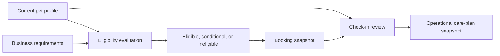
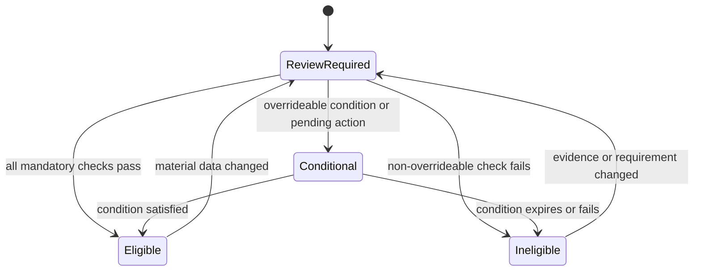

# Pet and Eligibility Domain

- **Domain prefix:** `PET`
- **Status:** In progress
- **MVP priority:** P0
- **Primary experiences:** Customer Portal, Staff Portal, and Business Portal

## Purpose

The Pet and Eligibility Domain is the authoritative source for each pet's identity, ownership relationships, vaccinations, health and medical information, medications, feeding plan, behavior, grooming preferences, documents, alerts, and eligibility for services.

The domain provides structured, current information for safe care. Confirmed bookings and checked-in stays consume immutable snapshots so later profile edits do not rewrite historical decisions or care records.

## Goals

- Give customers and staff one trustworthy pet profile.
- Make safety-critical information visible at the moment it matters.
- Evaluate service eligibility consistently and explain failures clearly.
- Separate factual health information, customer instructions, staff observations, and operational care records.
- Preserve provenance, review state, effective dates, and history.
- Support boarding, daycare, and grooming without forcing each service into a separate pet record.

## Domain boundaries

### Owns

- Pet identity and descriptive profile
- Business-scoped pet relationship and status
- Customer/household ownership and access references
- Vaccination requirements evidence and review state
- Health conditions, allergies, veterinarian contacts, and medical alerts
- Medication instructions before operational task generation
- Feeding plan before operational meal generation
- Behavior, handling, and temperament profile
- Grooming and service preferences
- Service eligibility evaluation and reasons
- Pet documents and media classifications
- Duplicate detection and merge history
- Pet profile timeline and audit history

### Does not own

- Household membership or customer identity
- Business requirement definitions
- Booking status, booking price, or booking policy snapshots
- Medication administrations, meals served, activities, incidents, or report cards during a stay
- Staff scheduling or resource assignment
- Veterinary diagnosis or clinical practice management

## Safety model

Safety-critical data is structured and surfaced as alerts. It must not be buried only in free text.

## Functional requirements

### Identity and ownership

| ID         | Priority | Requirement                                                                                                                                             | Status   |
| ---------- | -------: | ------------------------------------------------------------------------------------------------------------------------------------------------------- | -------- |
| PET-FR-001 |       P0 | Authorized customers or staff shall create a business-scoped pet profile.                                                                               | Accepted |
| PET-FR-002 |       P0 | A pet profile shall support name, preferred name, photo, species, breeds, color/markings, sex, altered status, birth date or estimated age, and weight. | Accepted |
| PET-FR-003 |       P0 | The profile shall support mixed and unknown breeds without forcing inaccurate data.                                                                     | Accepted |
| PET-FR-004 |       P0 | The platform shall distinguish exact birth date from estimated birth date or approximate age.                                                           | Accepted |
| PET-FR-005 |       P0 | The profile shall support microchip, license, and other identifiers with issuer and effective dates where applicable.                                   | Accepted |
| PET-FR-006 |       P0 | Each pet shall link to one or more authorized customers through Customer-domain access grants.                                                          | Accepted |
| PET-FR-007 |       P0 | The profile shall identify a primary responsible customer without removing other authorized relationships.                                              | Accepted |
| PET-FR-008 |       P0 | Authorized staff shall search by pet name, customer, household, breed, microchip, booking, and pet identifier.                                          | Accepted |
| PET-FR-009 |       P1 | The platform shall retain a weight history with source, measured date, unit, and recorder.                                                              | Proposed |

### Vaccinations and documents

| ID         | Priority | Requirement                                                                                                                                            | Status   |
| ---------- | -------: | ------------------------------------------------------------------------------------------------------------------------------------------------------ | -------- |
| PET-FR-010 |       P0 | Customers and authorized staff shall record a vaccination with type, administration date when known, expiration date, provider, and evidence document. | Accepted |
| PET-FR-011 |       P0 | Vaccination evidence shall have pending review, accepted, rejected, expired, superseded, and waived states.                                            | Accepted |
| PET-FR-012 |       P0 | Authorized reviewers shall approve or reject evidence with reason, timestamp, and reviewer.                                                            | Accepted |
| PET-FR-013 |       P0 | The platform shall preserve prior vaccination records when a newer record supersedes them.                                                             | Accepted |
| PET-FR-014 |       P0 | The platform shall calculate requirement compliance by service, location, and date of service.                                                         | Accepted |
| PET-FR-015 |       P0 | Customers and staff shall see which requirement failed and what corrective action is needed.                                                           | Accepted |
| PET-FR-016 |       P0 | Authorized managers shall record a time-bounded waiver or exception with reason and evidence.                                                          | Accepted |
| PET-FR-017 |       P0 | The platform shall warn before upcoming vaccine expiration based on business configuration.                                                            | Accepted |
| PET-FR-018 |       P1 | The platform shall support direct veterinary verification as a future evidence source without changing the core review model.                          | Proposed |

### Health and medical profile

| ID         | Priority | Requirement                                                                                                                | Status   |
| ---------- | -------: | -------------------------------------------------------------------------------------------------------------------------- | -------- |
| PET-FR-019 |       P0 | The profile shall store structured allergies with trigger, reaction, severity, status, and instructions.                   | Accepted |
| PET-FR-020 |       P0 | The profile shall store health conditions with status, onset when known, care impact, and customer-provided instructions.  | Accepted |
| PET-FR-021 |       P0 | The profile shall store primary and emergency veterinarian contacts.                                                       | Accepted |
| PET-FR-022 |       P0 | The profile shall support mobility, sensory, seizure, respiratory, dietary, and other special-needs indicators.            | Accepted |
| PET-FR-023 |       P0 | Staff shall be able to create a structured medical alert with severity, visibility, effective dates, and resolution state. | Accepted |
| PET-FR-024 |       P0 | The platform shall distinguish customer-reported information from staff observation and verified documentation.            | Accepted |
| PET-FR-025 |       P1 | Customers shall provide veterinary treatment authorization preferences for emergency workflows.                            | Proposed |

### Medications

| ID         | Priority | Requirement                                                                                                                                                         | Status   |
| ---------- | -------: | ------------------------------------------------------------------------------------------------------------------------------------------------------------------- | -------- |
| PET-FR-026 |       P0 | The profile shall support active and historical medication instructions.                                                                                            | Accepted |
| PET-FR-027 |       P0 | Medication instructions shall include medication name, dose, unit, route, schedule, purpose, start/end dates, food dependency, and prescribing provider when known. | Accepted |
| PET-FR-028 |       P0 | Safety-critical medication instructions shall require customer confirmation during booking or check-in according to business policy.                                | Accepted |
| PET-FR-029 |       P0 | Medication changes after booking confirmation shall flag affected bookings for review.                                                                              | Accepted |
| PET-FR-030 |       P0 | The domain shall provide medication-plan snapshots to Operations without recording administration itself.                                                           | Accepted |
| PET-FR-031 |       P1 | The profile shall support as-needed medication instructions with allowed reasons, minimum interval, and maximum dose.                                               | Proposed |

### Feeding

| ID         | Priority | Requirement                                                                                                                                            | Status   |
| ---------- | -------: | ------------------------------------------------------------------------------------------------------------------------------------------------------ | -------- |
| PET-FR-032 |       P0 | The profile shall support an active feeding plan containing meals, food source, quantity, units, preparation, schedule, supplements, and restrictions. | Accepted |
| PET-FR-033 |       P0 | A feeding plan shall distinguish customer-provided food from facility-provided food.                                                                   | Accepted |
| PET-FR-034 |       P0 | The profile shall support food allergies, resource guarding, separate-feeding, and bowl/handling instructions as structured safety attributes.         | Accepted |
| PET-FR-035 |       P0 | Feeding-plan changes after booking confirmation shall flag affected bookings for review.                                                               | Accepted |
| PET-FR-036 |       P0 | The domain shall provide feeding-plan snapshots to Operations without recording meals served.                                                          | Accepted |

### Behavior and handling

| ID         | Priority | Requirement                                                                                                                                                        | Status   |
| ---------- | -------: | ------------------------------------------------------------------------------------------------------------------------------------------------------------------ | -------- |
| PET-FR-037 |       P0 | The profile shall store structured behavior and handling attributes relevant to people, dogs, food, toys, barriers, restraint, kennels, grooming, and escape risk. | Accepted |
| PET-FR-038 |       P0 | Behavior entries shall record source, observation date, context, severity, and reviewer where applicable.                                                          | Accepted |
| PET-FR-039 |       P0 | Bite, aggression, escape, and severe-anxiety risks shall create prominent structured alerts.                                                                       | Accepted |
| PET-FR-040 |       P0 | The profile shall support preferred handling methods, triggers, calming strategies, and prohibited approaches.                                                     | Accepted |
| PET-FR-041 |       P0 | Daycare or group-play evaluations shall have pending, approved, conditional, suspended, failed, and expired states.                                                | Accepted |
| PET-FR-042 |       P0 | Staff observations shall not overwrite customer statements; both sources shall remain distinguishable.                                                             | Accepted |
| PET-FR-043 |       P1 | Behavior assessments shall support periodic review and expiration rules.                                                                                           | Proposed |

### Grooming and service preferences

| ID         | Priority | Requirement                                                                                                                | Status   |
| ---------- | -------: | -------------------------------------------------------------------------------------------------------------------------- | -------- |
| PET-FR-044 |       P0 | The profile shall store coat type, coat condition, grooming sensitivities, style notes, and handling constraints.          | Accepted |
| PET-FR-045 |       P0 | Grooming preferences shall support structured options and reference photos without replacing per-appointment consultation. | Accepted |
| PET-FR-046 |       P0 | The profile shall support preferred groomer as a preference, not a guaranteed assignment.                                  | Accepted |
| PET-FR-047 |       P1 | A completed grooming appointment may propose profile updates that require authorized review before becoming defaults.      | Proposed |

### Eligibility and lifecycle

| ID         | Priority | Requirement                                                                                                                                                                       | Status   |
| ---------- | -------: | --------------------------------------------------------------------------------------------------------------------------------------------------------------------------------- | -------- |
| PET-FR-048 |       P0 | The domain shall evaluate eligibility for a requested service, location, and date range.                                                                                          | Accepted |
| PET-FR-049 |       P0 | Eligibility shall consider pet status, vaccine/document compliance, age, alteration status, evaluations, health alerts, behavior restrictions, and business-defined requirements. | Accepted |
| PET-FR-050 |       P0 | Eligibility outcomes shall be eligible, conditionally eligible, ineligible, or review required.                                                                                   | Accepted |
| PET-FR-051 |       P0 | Every non-eligible outcome shall contain stable reason codes and customer-safe remediation text.                                                                                  | Accepted |
| PET-FR-052 |       P0 | Authorized managers shall override only rules configured as overrideable and shall record reason, scope, and expiration.                                                          | Accepted |
| PET-FR-053 |       P0 | Eligibility shall be re-evaluated when material profile or requirement data changes.                                                                                              | Accepted |
| PET-FR-054 |       P0 | The pet lifecycle shall support active, inactive, deceased, restricted, merged, and archived states.                                                                              | Accepted |
| PET-FR-055 |       P0 | Pets with booking, financial, or care history shall be archived or marked deceased rather than deleted.                                                                           | Accepted |
| PET-FR-056 |       P0 | The platform shall detect likely duplicate pets and require authorized review before merging.                                                                                     | Accepted |

## Business rules

| ID         | Priority | Rule                                                                                                                                             |
| ---------- | -------: | ------------------------------------------------------------------------------------------------------------------------------------------------ |
| PET-BR-001 |       P0 | A pet record belongs to one business tenant and cannot be exposed across tenants solely because customer contact data matches.                   |
| PET-BR-002 |       P0 | Species defaults to dog for the MVP experience but remains an explicit field.                                                                    |
| PET-BR-003 |       P0 | Estimated information must be labeled and never displayed as verified fact.                                                                      |
| PET-BR-004 |       P0 | Customer editing of safety-critical data may require staff review before it becomes operationally effective.                                     |
| PET-BR-005 |       P0 | Free text cannot be the sole representation of an allergy, active medication, bite history, escape risk, or separate-feeding requirement.        |
| PET-BR-006 |       P0 | Eligibility is evaluated for a specific service, location, and service date; a pet is not universally eligible or ineligible.                    |
| PET-BR-007 |       P0 | Expiration compliance is based on configured policy for the service period, not merely the booking date.                                         |
| PET-BR-008 |       P0 | A waiver never deletes or changes the underlying failed requirement.                                                                             |
| PET-BR-009 |       P0 | Confirmed bookings retain eligibility, care, vaccine, and requirement snapshots used at confirmation.                                            |
| PET-BR-010 |       P0 | Check-in must revalidate material safety and eligibility information even when booking was previously confirmed.                                 |
| PET-BR-011 |       P0 | Medication and feeding plan changes affecting an active or upcoming stay create review work rather than silently replacing the operational plan. |
| PET-BR-012 |       P0 | Staff observations and incidents are append-only records owned by Operations and may propose, but not silently rewrite, the profile.             |
| PET-BR-013 |       P0 | Marking a pet deceased immediately prevents new bookings while preserving respectful historical access.                                          |
| PET-BR-014 |       P0 | Pet merges cannot cross tenant boundaries and must preserve all former identifiers and history.                                                  |
| PET-BR-015 |       P1 | Weight-based rules use the most recent trusted measurement within a configured age window; otherwise review is required.                         |

## Eligibility decision model

### Example reason codes

- `VACCINATION_MISSING`
- `VACCINATION_EXPIRES_DURING_SERVICE`
- `DOCUMENT_PENDING_REVIEW`
- `DAYCARE_EVALUATION_REQUIRED`
- `DAYCARE_EVALUATION_SUSPENDED`
- `AGE_REQUIREMENT_NOT_MET`
- `ALTERATION_REQUIREMENT_NOT_MET`
- `MEDICAL_REVIEW_REQUIRED`
- `BEHAVIOR_RESTRICTION`
- `PET_STATUS_RESTRICTED`
- `WEIGHT_REVIEW_REQUIRED`

## Key workflows

### Create a pet profile

1. Authorized customer or staff begins pet creation.
2. Duplicate candidates are checked using household, name, breed, birth/age, microchip, and photo signals.
3. Required identity and service-relevant information is collected progressively.
4. Ownership/access grants are created through the Customer Domain.
5. Safety-critical alerts are summarized for confirmation.
6. The profile becomes active and an audit event is recorded.

### Upload and review vaccine evidence

1. Customer selects vaccine type and uploads evidence.
2. File security checks complete.
3. Extracted or entered dates are shown for customer confirmation.
4. Evidence enters pending review.
5. Authorized staff accept, reject, or request correction.
6. Compliance and affected eligibility are recalculated.
7. The customer receives a clear outcome without internal-only notes.

### Change a medication plan

1. Authorized customer or staff proposes the change.
2. The system captures source, effective date, and complete instructions.
3. Safety validation checks dose units and required fields without providing clinical advice.
4. Upcoming and active bookings are identified.
5. Affected bookings receive review-required status or tasks.
6. Operations accepts an updated care-plan snapshot when appropriate.
7. Previous instructions remain historical.

### Evaluate service eligibility

1. Booking requests an evaluation with pet, service, location, and dates.
2. The domain retrieves effective requirement policy and current trusted pet data.
3. Each check emits pass, fail, conditional, or unknown.
4. Rules determine overall outcome and overrideability.
5. Stable reason codes and remediation are returned.
6. Booking stores the decision snapshot when confirmed.

## Permissions

| Capability                     |  Authorized customer  |    Front desk    |       Care staff       |         Manager          |   Platform support   |
| ------------------------------ | :-------------------: | :--------------: | :--------------------: | :----------------------: | :------------------: |
| View pet profile               |     Granted pets      | Within business  | Assigned/relevant pets |       Within scope       | Limited support view |
| Edit basic identity            |          Yes          |       Yes        |        Limited         |           Yes            |          No          |
| Upload vaccine evidence        |          Yes          |       Yes        |      Configurable      |           Yes            |          No          |
| Approve vaccine evidence       |          No           | Permission based |           No           |           Yes            |          No          |
| Edit health/medication/feeding |    Propose/confirm    | Permission based |  Propose observation   |           Yes            |          No          |
| Create safety alert            |          No           | Permission based |    Permission based    |           Yes            |          No          |
| Record operational care        |          No           |        No        |   Through Operations   |    Through Operations    |          No          |
| Override eligibility           |          No           |  No by default   |           No           | Limited configured rules |          No          |
| Merge pet records              |          No           |        No        |           No           |           Yes            |          No          |
| Mark deceased/archive          | Yes with confirmation |     Assisted     |           No           |           Yes            |          No          |

## Core entities

| Entity                   | Purpose                                               |
| ------------------------ | ----------------------------------------------------- |
| Pet                      | Identity, descriptive attributes, lifecycle status    |
| PetBusinessProfile       | Business-scoped status, preferences, and summary      |
| PetIdentifier            | Microchip, license, or external identifier            |
| PetWeightRecord          | Dated measured or customer-reported weight            |
| PetRelationshipReference | Reference to Customer-domain authority grant          |
| VaccinationRecord        | Vaccine dates, provider, evidence, and status         |
| VaccinationReview        | Reviewer decision and reason                          |
| RequirementWaiver        | Time-bounded exception to a requirement               |
| HealthCondition          | Structured condition and care impact                  |
| Allergy                  | Trigger, reaction, severity, and instructions         |
| VeterinarianContact      | Primary or emergency provider reference               |
| MedicalAlert             | Structured safety alert and lifecycle                 |
| MedicationPlan           | Versioned medication instructions                     |
| FeedingPlan              | Versioned feeding instructions                        |
| BehaviorAttribute        | Structured behavior observation or customer statement |
| HandlingInstruction      | Trigger, preferred technique, and prohibited approach |
| ServiceEvaluation        | Daycare/grooming/other evaluation and status          |
| GroomingProfile          | Coat, style, sensitivity, and preference data         |
| PetDocument              | Secure file reference and classification              |
| EligibilityEvaluation    | Point-in-time outcome and check results               |
| PetMerge                 | Survivor, merged record, decisions, and audit map     |

Detailed tables, constraints, indexes, and row-level policies will be produced immediately before implementation.

### Initial E04 implementation

The first pet slice creates an explicit dog record linked to a business-scoped household. It captures name, breed or mix, optional birth date with an estimated-date flag, sex, and lifecycle status in the same transaction as the first customer and household.

The vaccination slice adds structured vaccine type, administration and expiration dates, provider, private evidence metadata, scan state, and staff review. Authorized staff can submit PDF/JPG/PNG evidence from the pet page, open it through a five-minute signed URL, and accept or reject it with rejection reasons preserved. Uploads begin in `pending` scan state; a production malware-scanning integration must promote clean files or block unsafe files before customer launch. Medical, feeding, medication, behavior, identifiers, automated vaccine compliance, and broader eligibility decisions remain subsequent E04 slices.

The allergy-safety slice adds structured allergen category, severity, reaction, exact care instructions, and information provenance to the same pet care profile. Active records are visually prioritized; staff resolve rather than delete them, with actor, time, and required reason retained. Other health conditions, feeding, medication, behavior, identifiers, automated compliance, and broader eligibility decisions remain subsequent E04 slices.

The medication-plan slice adds medication name, explicit dose and route, schedule, administration instructions, optional effective dates, as-needed indication, and information provenance. Plans are discontinued with preserved reason and history instead of being deleted. These profile plans are inputs to later check-in snapshots and operational medication tasks; they are not administration records. Other health conditions, feeding, behavior, identifiers, automated compliance, and broader eligibility decisions remain subsequent E04 slices.

The feeding-plan slice adds food source and product, amount per meal, meal count, schedule, preparation, supplements, separate-feeding controls, and information provenance. A pet has only one active plan; replacement requires discontinuing the prior plan with an auditable reason. These profile plans feed later check-in snapshots and operational meal tasks; they are not meal-completion records. Other health conditions, behavior, identifiers, automated compliance, and broader eligibility decisions remain subsequent E04 slices.

The behavior-and-handling slice adds structured aggression, bite, escape, anxiety, guarding, interaction, restraint, and barrier risks. Each record preserves context, severity, observation date, source, triggers, preferred handling, prohibited approaches, calming strategies, and group-play guidance. High and critical risks are visually prominent, while resolution preserves the original report and a required reason. Formal service evaluations, other health conditions, identifiers, automated compliance, and broader eligibility decisions remain subsequent E04 slices.

The health-condition slice adds structured medical category, severity, diagnosis date, care impact, emergency instructions, and information provenance. Severe and critical conditions cannot be recorded without emergency instructions and remain prominent for staff until resolved. Resolution preserves the original condition and requires historical context. Formal service evaluations, identifiers, automated compliance, and broader eligibility decisions remain subsequent E04 slices.

The pet-identifier slice adds microchip, license, registration, and other durable identifiers with issuer and effective-date metadata. Values are normalized for tenant-scoped, formatting-insensitive duplicate prevention while preserving the exact display value. Retirement retains the original identifier and requires a reason. Pet photo, formal service evaluations, automated compliance, and broader eligibility decisions remain subsequent E04 slices.

The pet-photo slice adds a private, tenant-scoped profile image with signed display access and controlled replacement. Only JPG, PNG, and WebP files up to 5 MB are accepted, and the prior object is removed after authoritative metadata changes successfully. The interface deliberately presents the photo alongside structured identity rather than treating appearance as identity. Formal service evaluations, automated compliance, and broader eligibility decisions remain subsequent slices.

The service-evaluation slice implements formal daycare/group-play requests and the pending, approved, conditional, suspended, failed, and expired lifecycle. Conditional approval requires explicit participation restrictions, transitions are state controlled, and every change is retained as a separate history record. Automated vaccine compliance and broader service/date eligibility decisions remain subsequent E05 work.

The identity-completion slice adds preferred name, color/markings, altered status, and dated weight history with information source. Weight entries retain both the original value/unit and normalized kilograms instead of overwriting prior measurements. These fields complete the core age, alteration, and weight inputs needed by E05 eligibility and pricing rules. Veterinarian relationships, automated vaccine compliance, and broader service/date eligibility remain subsequent work.

The veterinary-contact slice adds structured clinic and provider details with explicit primary and emergency roles. A pet may have one active provider per role, the same clinic may fill both roles, and replacement requires retiring the prior contact with historical context. Automated vaccine compliance and broader service/date eligibility remain subsequent E05 work.

The grooming-profile slice separates coat type and condition, grooming sensitivity, safety-related handling constraints, style preferences, structured nail/ear/teeth options, and preferred groomer. Replacements require a reason and create a new current version while preserving the prior profile. A preferred groomer remains explicitly non-guaranteed. Automated vaccine compliance and broader service/date eligibility remain subsequent E05 work.

The E05 eligibility core evaluates active requirements bound to the exact published service version. It consumes accepted or waived vaccination evidence, approved or conditional daycare evaluations, birth date, and latest recorded weight; document requirements route to staff review until the document domain is implemented. Results contain deterministic eligible/review flags and customer-safe reason objects while underlying pet evidence remains authoritative.

## Domain events

- `pet.created`
- `pet.profile.updated`
- `pet.status.changed`
- `pet.weight.recorded`
- `pet.vaccination.submitted`
- `pet.vaccination.reviewed`
- `pet.requirement_waiver.changed`
- `pet.medical_alert.changed`
- `pet.medication_plan.changed`
- `pet.feeding_plan.changed`
- `pet.behavior_alert.changed`
- `pet.service_evaluation.changed`
- `pet.eligibility.changed`
- `pet.document.added`
- `pet.duplicate.detected`
- `pet.merged`

Events include tenant context, actor/source, pet identifier, event version, and time. Event payloads minimize medical or personal detail and use authorized references where possible.

## Non-functional and security requirements

| ID          | Priority | Requirement                                                                                                   |
| ----------- | -------: | ------------------------------------------------------------------------------------------------------------- |
| PET-NFR-001 |       P0 | Pet data access shall enforce business tenant, role, customer relationship, and operational assignment scope. |
| PET-NFR-002 |       P0 | Safety-critical changes and reviews shall be auditable and historical versions recoverable.                   |
| PET-NFR-003 |       P0 | Eligibility evaluation shall be deterministic for the same versioned inputs and rules.                        |
| PET-NFR-004 |       P0 | Eligibility responses shall be fast enough for interactive availability and booking flows.                    |
| PET-NFR-005 |       P0 | Medical details shall be minimized in logs, notifications, analytics, events, and support views.              |
| PET-NFR-006 |       P0 | Document access shall use short-lived authorization and malware-scanned storage.                              |
| PET-NFR-007 |       P0 | Customer-facing pet profile and document workflows shall meet WCAG 2.2 AA targets and support mobile screens. |
| PET-NFR-008 |       P1 | Profile and eligibility changes shall propagate reliably to affected bookings and operational review queues.  |

## Acceptance scenarios

| ID         | Covers         | Scenario                                                                                                                          |
| ---------- | -------------- | --------------------------------------------------------------------------------------------------------------------------------- |
| PET-AT-001 | PET-FR-001–009 | An authorized customer creates a mixed-breed dog with estimated age, identifiers, photo, and correct household access.            |
| PET-AT-002 | PET-FR-010–018 | A customer uploads vaccine evidence; staff reject an unreadable document, accept the replacement, and eligibility updates.        |
| PET-AT-003 | PET-FR-019–025 | A severe allergy is recorded as a structured alert and shown to assigned staff without leaking to unrelated users.                |
| PET-AT-004 | PET-FR-026–031 | A medication change flags an upcoming boarding stay and preserves the previously confirmed care snapshot.                         |
| PET-AT-005 | PET-FR-032–036 | A feeding plan with customer-provided food, supplements, and separate-feeding risk creates a complete operational snapshot.       |
| PET-AT-006 | PET-FR-037–043 | A daycare evaluation conditionally approves a pet and a later incident suspends group-play eligibility without blocking grooming. |
| PET-AT-007 | PET-FR-044–047 | Grooming preferences and reference photos are available during intake but do not bypass appointment confirmation.                 |
| PET-AT-008 | PET-FR-048–053 | Eligibility returns distinct results for boarding and grooming with stable reasons and allowed remediation.                       |
| PET-AT-009 | PET-FR-054–056 | A deceased or merged pet cannot be newly booked while historical bookings remain accessible and respectful.                       |
| PET-AT-010 | PET-BR-007–010 | A vaccine valid at booking but expiring during the stay blocks confirmation or requires configured remediation.                   |
| PET-AT-011 | PET-BR-011–012 | Staff observations propose profile changes without overwriting customer instructions or operational history.                      |
| PET-AT-012 | PET-NFR-001    | Direct requests cannot read or mutate another tenant's pets, documents, health data, or eligibility results.                      |

## Metrics

- Pet profile completion rate
- Vaccine compliance by service and date
- Evidence review turnaround time
- Upcoming expiration volume
- Eligibility failure and remediation rates
- Check-in changes to medication or feeding plans
- Duplicate-pet rate and merge volume
- Daycare evaluation pass/conditional/suspension rates
- Safety-alert prevalence and resolution time
- Bookings requiring manual pet review

## Open decisions

1. Whether non-dog species are hidden, disabled, or minimally supported in MVP.
2. Which safety-critical customer edits require staff approval before becoming effective.
3. Whether vaccine evidence dates may be assisted by document extraction in MVP.
4. How long a weight remains trusted for weight-based eligibility and pricing.
5. Which medical and behavior alerts may be acknowledged or dismissed by each staff role.
6. Whether emergency treatment authorization belongs here, Customer, Booking, or a dedicated Agreements domain.
7. Exact retention and privacy treatment for deceased pets and medical documents.

## Dependencies

- Customer and Household for access and ownership authority
- Business Configuration for requirement definitions
- Service Catalog for service-specific eligibility context
- Booking for decision and care snapshots
- Operations for observations, medication administrations, meals, incidents, and report cards
- Communications for vaccine and review notifications
- Document platform for secure upload, scanning, and access
- Audit capability for safety-critical history
