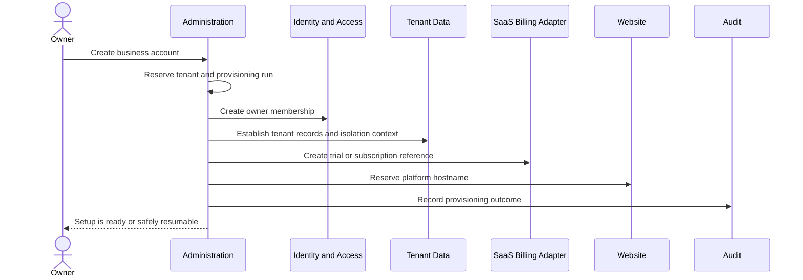
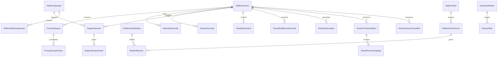

# Platform Administration Domain Specification

- **Domain prefix:** `ADMIN`
- **Status:** In progress
- **MVP priority:** P0
- **Primary experience:** Internal Platform Console

## Purpose

Platform Administration provides the protected internal controls required to operate PetCare as a multi-tenant SaaS business. It manages tenant provisioning, SaaS plans and entitlements, subscription state, support access, feature release controls, account restrictions, platform audit review, administrative jobs, and privacy requests.

This domain is separate from a pet-care business's own settings. Business Configuration lets a tenant operate its pet-care business; Platform Administration lets the PetCare operator safely operate the SaaS platform.

## Product outcomes

- A new tenant can be provisioned predictably and traced from signup through activation.
- Subscription status and product entitlements are applied consistently without affecting the tenant's customer payment ledger.
- Support staff can diagnose problems without unrestricted impersonation or invisible data access.
- High-risk administrative actions require explicit reason, authorization, confirmation, and immutable audit evidence.
- A tenant can be suspended, restored, exported, or closed without corrupting operational or financial history.
- Feature releases can be limited, measured, and reversed without editing tenant data manually.
- Platform operators can see administrative failures and safely retry idempotent work.

## Scope

### MVP

- Tenant directory, search, status, ownership, locations, and readiness summary
- Tenant provisioning and activation workflow
- SaaS plan catalog, tenant subscriptions, trials, plan changes, and entitlements
- Separation of platform subscription billing from customer-to-business payments
- Tenant restriction, suspension, reactivation, and closure workflow
- Platform operator roles and permissions
- Time-bound, reason-bound support sessions
- Tenant-visible support-access history
- Feature flags, tenant overrides, and staged rollouts
- Platform audit-event search and protected export
- Administrative job visibility, safe retry, and cancellation where supported
- Privacy request coordination for access, correction, export, restriction, and deletion
- Platform announcements and tenant operational notices
- Internal notes with restricted visibility and retention
- Cross-tenant health summary using non-sensitive aggregates

### Post-MVP

- Enterprise contracts, purchase orders, invoiced SaaS billing, and negotiated entitlements
- Reseller and franchise administration
- Automated usage-based platform billing
- Regional data-residency controls
- Advanced risk scoring and automated fraud review
- Customer-managed enterprise SSO and SCIM
- Fine-grained delegated support organizations
- Bulk tenant migrations and automated competitor imports
- Sandbox tenant self-service
- Public status page administration

### Out of scope

- Tenant staff management and day-to-day business configuration
- Customer payments, deposits, refunds, and business invoices
- Editing customer, pet, booking, care, or financial records as a normal support shortcut
- General employee HR administration for the PetCare company
- Production database consoles exposed in the application
- Unlogged impersonation
- AI making autonomous suspension, deletion, refund, or access decisions

## Domain boundaries

### Owns

- Platform tenant registry and lifecycle state
- Tenant provisioning orchestration
- Platform plan and entitlement catalog
- SaaS subscription projection and enforcement state
- Administrative restriction and suspension records
- Platform-operator role assignments
- Support-session requests, grants, scope, expiry, and revocation
- Feature definitions, environments, targeting rules, and overrides
- Platform administrative notes and notices
- Administrative action and job records
- Privacy-request coordination state
- Platform-level audit query and export controls

### Does not own

- Business profile, location settings, hours, service, or resource configuration
- Tenant staff invitations and ordinary tenant roles
- Customer identities, pets, bookings, operations, or website content
- Pet-owner invoices and payments
- Raw observability logs or infrastructure deployment systems
- Source-domain correction workflows
- Authentication credentials or session implementation

## Core concepts

| Concept           | Definition                                                                                            |
| ----------------- | ----------------------------------------------------------------------------------------------------- |
| Tenant            | A subscribing pet-care business and the primary isolation boundary.                                   |
| Tenant lifecycle  | Platform state controlling whether the tenant may configure, transact, or serve customers.            |
| Plan              | A marketable SaaS offering with a versioned set of commercial limits and default entitlements.        |
| Subscription      | A tenant's platform billing relationship, trial, period, and lifecycle state.                         |
| Entitlement       | An effective capability or limit granted by plan, add-on, contract, or approved override.             |
| Restriction       | A narrow limitation applied for risk, billing, compliance, or support reasons.                        |
| Suspension        | A broad controlled state that prevents defined tenant activity while preserving data.                 |
| Platform operator | An internal user authorized for one or more administrative capabilities.                              |
| Support session   | A time-limited audited grant to view or act within a tenant scope for a stated case.                  |
| Feature flag      | A release-control decision, not a purchased commercial right.                                         |
| Privacy request   | A tracked request concerning personal-data access, correction, portability, restriction, or deletion. |

## Tenant lifecycle

## Implemented operator and tenant-control foundation

The platform console now requires an explicit platform-operator assignment and MFA; ordinary tenant membership never grants entry. Initial roles are administrator, support, and auditor, with separate directory, lifecycle-management, and audit permissions. Operator grants are service-role-only bootstrap operations rather than self-service elevation.

The tenant directory exposes business name, slug, lifecycle state, location count, active-member count, and control timestamps. It deliberately excludes customers, pets, bookings, care records, invoices, and payment details. Platform administrators can move an active, restricted, or suspended tenant through controlled transitions with a documented reason. Suspension additionally requires typing the tenant slug, updates the coarse business access state, and creates an immutable platform event.

The initial SaaS subscription projection contains versioned plans and entitlements plus one current subscription per tenant. Trialing, active, past-due, scheduled-cancellation, and cancelled states use controlled transitions and immutable events. The platform console labels this as the business-to-PetCare commercial relationship and keeps it entirely separate from customer invoices, deposits, payments, refunds, receipts, and tenant financial reporting.

Feature controls now combine an explicit release state, stable tenant percentage assignment, current SaaS entitlement, and optional time-bounded tenant override. An emergency kill switch overrides every rollout or tenant grant, requires feature-key confirmation, and leaves an immutable platform event. Tenant overrides require a reason and cannot manufacture an entitlement that the active plan does not provide.

Routine support access now requires a tenant-linked support case, purpose, one or more approved domain scopes, and a duration of no more than two hours. Read-only is the default; supported write commands require a separate platform permission. Every session uses the operator's own identity, expires automatically during authorization checks, can be revoked immediately, produces immutable events, and has a sanitized history available to an authorized tenant owner.

The administrative job directory exposes only safe operational metadata: tenant reference, job type, opaque object reference, status, progress, attempt count, error category, sanitized message, and next permitted action. Internal workers register jobs through a service-only command. Operators may retry only a failed job explicitly declared retryable, and each retry appends an immutable attempt record rather than rewriting failure history.

```text
Prospect
  -> Provisioning
  -> Setup
  -> Trial
  -> Active
  -> Restricted
  -> Suspended
  -> Closing
  -> Closed
  -> Purge eligible
  -> Purged
```

Not every transition is linear. An eligible restricted or suspended tenant can return to `Active`. A closed tenant cannot resume automatically; reopening requires a controlled decision and validation that retained data is still usable.

### Lifecycle meaning

| State        | Administrative meaning                                          | Customer-facing effect                        |
| ------------ | --------------------------------------------------------------- | --------------------------------------------- |
| Provisioning | Required tenant resources are being created                     | No public access                              |
| Setup        | Owner may configure but cannot transact until launch gates pass | Site may be draft only                        |
| Trial        | Enabled under trial entitlements and limits                     | Allowed according to readiness                |
| Active       | Subscription and risk posture allow normal use                  | Normal operation                              |
| Restricted   | One or more capabilities are disabled                           | Explicitly defined per restriction            |
| Suspended    | Broad tenant activity is blocked                                | Safe maintenance or unavailability experience |
| Closing      | Closure is scheduled; exports and retention are being resolved  | New transactions normally disabled            |
| Closed       | Interactive tenant use is disabled; retention clock applies     | Public site and booking disabled              |
| Purged       | Eligible tenant data is irreversibly deleted or anonymized      | No tenant experience                          |

## Tenant provisioning

Provisioning is a resumable orchestration, not one database insert.

### Required steps

1. Reserve the tenant ID and normalized tenant key.
2. Create the tenant registry record in `Provisioning`.
3. Create the initial owner membership through Identity and Access.
4. Establish tenant-scoped storage and row-level-security context.
5. Create default business configuration, locale, time zone, and currency placeholders.
6. Create the initial subscription or trial and effective entitlements.
7. Provision the default platform website hostname.
8. Record onboarding readiness and required next steps.
9. Validate isolation and required resources.
10. Transition to `Setup` and notify the owner.



Each step is idempotent. A retry must discover and reuse successfully created resources. A failed run stays traceable with step, error category, attempt count, and safe remediation.

## SaaS plans, subscriptions, and entitlements

### Separation from tenant commerce

Two distinct financial relationships exist:

1. **Platform subscription:** the pet-care business pays PetCare for software access.
2. **Customer commerce:** a customer pays the pet-care business for boarding, daycare, grooming, and add-ons.

They use separate accounts, ledgers, invoices, webhooks, permissions, reporting labels, and reconciliation. A tenant subscription failure must not appear as a pet-owner invoice or alter customer balances.

### Entitlement precedence

```text
Safety or legal platform restriction
  -> Administrative suspension or restriction
  -> Contract entitlement or approved override
  -> Purchased add-on
  -> Plan-version entitlement
  -> Platform default
```

A feature flag determines whether code is released to an eligible audience. An entitlement determines whether the tenant purchased or was granted access. Both must allow the capability.

### Entitlement types

- Boolean capability, such as custom domains
- Integer limit, such as active locations
- Usage allowance, such as included SMS messages
- Tiered capability, such as reporting level
- Date-bounded grant, such as a trial add-on
- Configuration constraint, such as media storage allowance

Effective entitlements include source, effective dates, reason, approving operator, and version. Historical entitlement changes remain queryable.

### Subscription states

```text
Trialing -> Active -> Past due -> Restricted -> Suspended
     |         |          |          |             |
     +------> Cancel scheduled ------+-------------+
                         -> Cancelled -> Closed decision
```

Provider webhook state is evidence, but the platform applies its own documented grace and restriction policy. Duplicate or out-of-order events cannot reverse a newer valid state silently.

## Restrictions and suspension

### Restriction categories

- Subscription past due
- Trial expired
- Security risk
- Suspected abuse or fraud
- Legal or compliance hold
- Customer-requested pause
- Platform operational containment
- Contract limit exceeded

### Possible effects

- Block new staff sign-ins
- Permit read-only business access
- Block new public bookings
- Keep current operations available for pet safety
- Disable outbound marketing while preserving transactional messages
- Disable website publication changes while retaining the current site
- Prevent creation of new locations or users
- Require platform contact before reactivation

Restrictions must be narrow when possible. A billing issue should not prevent staff from viewing pets currently in care, administering medication, or completing safe checkout. The restriction policy explicitly separates new commercial activity from safety-critical ongoing care.

### Suspension workflow

```text
Request or automated signal
  -> policy evaluation
  -> authorized review
  -> impact preview
  -> confirmation and reason
  -> restriction/suspension applied
  -> tenant notification where permitted
  -> review date and remediation
  -> reactivation or closure
```

Emergency containment may be immediate, but it requires after-the-fact review within a defined interval.

## Platform operator roles

| Role                   | Typical scope                                                          |
| ---------------------- | ---------------------------------------------------------------------- |
| Platform support       | Cases, tenant diagnostics, scoped support sessions, safe retries       |
| Billing operations     | SaaS subscription state, credits, plan changes, billing reconciliation |
| Trust and safety       | Risk restrictions, evidence, review, and reactivation                  |
| Privacy operations     | Privacy requests, holds, exports, and deletion coordination            |
| Release manager        | Feature definitions, staged rollout, kill switches                     |
| Platform administrator | Tenant lifecycle and tightly controlled global configuration           |
| Security administrator | Operator access, break-glass review, and security containment          |
| Read-only auditor      | Approved audit evidence without mutation access                        |

No role receives all capabilities merely because its display name contains `admin`. Permissions are explicit, environment-aware, and least-privileged. Production access is separate from test and staging access.

## Support access model

### Principles

- Support begins with metadata and diagnostics that do not expose tenant records.
- Access to tenant data requires a support case, purpose, scope, and expiration.
- The operator uses their own identity; the system never masks them as the tenant user.
- The UI visibly indicates support mode and effective tenant scope.
- Write actions are separately granted and limited to supported workflows.
- Sensitive medical, financial, document, and credential fields may require additional permission or remain masked.
- The tenant can view support-access history unless a legally approved exception applies.
- Access ends automatically and can be revoked immediately.

### Support-session states

```text
Requested -> Approved -> Active -> Expired
                    |       |
                    |       -> Revoked
                    -> Denied
```

### Break-glass access

Emergency access requires:

- A declared incident
- Strong authentication
- Short maximum duration
- Narrowest possible scope
- Immediate alert to security reviewers
- Complete action logging
- Mandatory post-incident review

Break-glass access is not a faster form of routine support.

## Feature controls

### Feature states and targeting

A feature definition has a stable key, owner, description, environments, expected removal or permanence, default state, and dependencies. Targeting may use:

- Environment
- Tenant allowlist
- Plan entitlement
- Percentage rollout using stable tenant bucketing
- Platform-operator cohort
- Explicit tenant override with expiration

Rules may not target protected customer traits. A flag is evaluated after tenant identity is resolved and before rendering or executing protected functionality.

### Kill switches

High-risk integrations and workflows may have emergency disable controls, including:

- New payment initiation
- SMS sending
- Website publishing
- Public booking creation
- AI processing
- Bulk export

Disabling a capability must define its safe fallback and must not block essential pet-care records unless containment specifically requires it.

## Administrative jobs

The Platform Console provides controlled visibility into jobs such as:

- Tenant provisioning
- Projection rebuilds
- Bulk exports
- Privacy-request exports and deletion workflows
- Domain verification
- Subscription reconciliation
- Notification replay
- Search reindexing
- Data backfills and migrations approved for application-level control

Operators see state, tenant, type, creation time, progress, attempts, idempotency key, error category, and next allowed action. Raw secrets and unrestricted payloads are never displayed.

Retry is available only when the job defines safe idempotent behavior. A retry creates an administrative action record and never edits the original attempt history.

## Privacy requests and retention

### Request types

- Access
- Correction
- Portable export
- Processing restriction
- Deletion
- Consent or objection review

### Workflow

```text
Received -> Identity verification -> Scope discovery -> Holds checked
         -> Domain actions assigned -> Review -> Fulfilled or Denied
         -> Evidence retained under policy
```

Administration coordinates the request; each owning domain performs its approved action and reports evidence. Required financial, fraud, legal, and safety records may be retained or de-identified according to policy. A deletion request is never implemented as an unreviewed cascade across the production database.

## Functional requirements

### Tenant administration

| ID           | Priority | Requirement                                                                                                                              | Status   |
| ------------ | -------: | ---------------------------------------------------------------------------------------------------------------------------------------- | -------- |
| ADMIN-FR-001 |       P0 | Authorized operators shall search tenants by approved identifiers and see lifecycle, subscription, readiness, and health summaries.      | Accepted |
| ADMIN-FR-002 |       P0 | The system shall provision a tenant through a resumable, idempotent, audited workflow.                                                   | Accepted |
| ADMIN-FR-003 |       P0 | Operators shall see failed provisioning steps and perform only supported remediation or retry actions.                                   | Accepted |
| ADMIN-FR-004 |       P0 | The system shall enforce valid tenant lifecycle transitions and preserve transition history.                                             | Accepted |
| ADMIN-FR-005 |       P0 | Authorized operators shall preview the customer, staff, website, booking, and safety impact before applying a restriction or suspension. | Accepted |
| ADMIN-FR-006 |       P0 | Suspension and reactivation shall require an authorized actor, reason, effective time, and audit event.                                  | Accepted |
| ADMIN-FR-007 |       P0 | Safety-critical access for pets currently in care shall follow the documented continuity policy during billing restrictions.             | Accepted |

### Plans and subscription operations

| ID           | Priority | Requirement                                                                                                                         | Status   |
| ------------ | -------: | ----------------------------------------------------------------------------------------------------------------------------------- | -------- |
| ADMIN-FR-008 |       P0 | The platform shall maintain versioned SaaS plans and entitlement definitions independently from tenant service pricing.             | Accepted |
| ADMIN-FR-009 |       P0 | A tenant subscription shall record provider references, lifecycle, billing period, trial, cancellation, and effective plan version. | Accepted |
| ADMIN-FR-010 |       P0 | Provider subscription events shall be verified, persisted, deduplicated, ordered safely, and reconciled.                            | Accepted |
| ADMIN-FR-011 |       P0 | The platform shall calculate effective entitlements with source and precedence traceability.                                        | Accepted |
| ADMIN-FR-012 |       P0 | Plan changes shall preview immediate, scheduled, entitlement, and billing effects before confirmation.                              | Accepted |
| ADMIN-FR-013 |       P1 | Approved entitlement overrides shall require reason, approver, start, expiration, and automatic reversion.                          | Proposed |

### Support and operator access

| ID           | Priority | Requirement                                                                                                                        | Status   |
| ------------ | -------: | ---------------------------------------------------------------------------------------------------------------------------------- | -------- |
| ADMIN-FR-014 |       P0 | Operators shall authenticate with their own platform identity and explicit role assignments.                                       | Accepted |
| ADMIN-FR-015 |       P0 | Tenant-data access shall require a case-linked, scoped, time-bound support session unless an approved break-glass process applies. | Accepted |
| ADMIN-FR-016 |       P0 | Support mode shall remain visibly identifiable and shall not impersonate a tenant user.                                            | Accepted |
| ADMIN-FR-017 |       P0 | The system shall record support-session approval, activation, access, actions, revocation, and expiration.                         | Accepted |
| ADMIN-FR-018 |       P0 | A tenant owner shall be able to review ordinary support-access history for their tenant.                                           | Accepted |
| ADMIN-FR-019 |       P0 | Write actions in support mode shall require separate permission and use domain-supported commands.                                 | Accepted |
| ADMIN-FR-020 |       P0 | Break-glass use shall alert security reviewers and require documented post-use review.                                             | Accepted |

### Features, jobs, and audit

| ID           | Priority | Requirement                                                                                                             | Status   |
| ------------ | -------: | ----------------------------------------------------------------------------------------------------------------------- | -------- |
| ADMIN-FR-021 |       P0 | Authorized release managers shall create, target, activate, and deactivate feature flags by environment.                | Accepted |
| ADMIN-FR-022 |       P0 | Feature evaluation shall combine release state with effective tenant entitlement.                                       | Accepted |
| ADMIN-FR-023 |       P0 | High-risk feature changes shall preview affected tenants and require confirmation.                                      | Accepted |
| ADMIN-FR-024 |       P0 | Operators shall inspect administrative jobs and safely retry only jobs declared retryable.                              | Accepted |
| ADMIN-FR-025 |       P0 | Authorized auditors shall search administrative events by actor, tenant, action, time, case, and risk classification.   | Accepted |
| ADMIN-FR-026 |       P0 | Protected audit exports shall require purpose, bounded filters, authorization, expiration, and download auditing.       | Accepted |
| ADMIN-FR-027 |       P1 | The platform shall support tenant-targeted operational notices with start, end, severity, and acknowledgement behavior. | Proposed |

### Privacy and closure

| ID           | Priority | Requirement                                                                                                                                                | Status   |
| ------------ | -------: | ---------------------------------------------------------------------------------------------------------------------------------------------------------- | -------- |
| ADMIN-FR-028 |       P0 | Privacy requests shall be tracked through verification, domain fulfillment, review, and evidence retention.                                                | Accepted |
| ADMIN-FR-029 |       P0 | Tenant closure shall identify active pets in care, future bookings, balances, exports, contracts, legal holds, and retention obligations before execution. | Accepted |
| ADMIN-FR-030 |       P0 | A tenant shall not become purge eligible until all mandatory retention and legal-hold rules permit it.                                                     | Accepted |
| ADMIN-FR-031 |       P0 | Purge shall be irreversible, multi-step, separately authorized, and evidenced without retaining deleted personal content in the evidence record.           | Accepted |

## Business rules

| ID           | Priority | Rule                                                                                                                                              |
| ------------ | -------: | ------------------------------------------------------------------------------------------------------------------------------------------------- |
| ADMIN-BR-001 |       P0 | Platform operators cannot derive tenant access from ordinary tenant memberships alone.                                                            |
| ADMIN-BR-002 |       P0 | Every administrative command is evaluated against actor, environment, tenant scope, capability, risk, and current state.                          |
| ADMIN-BR-003 |       P0 | A support session never changes the recorded actor to a tenant user.                                                                              |
| ADMIN-BR-004 |       P0 | High-risk actions require a reason selected or entered before execution; reasons cannot be added retroactively as a substitute for authorization. |
| ADMIN-BR-005 |       P0 | Tenant subscription billing and pet-owner commerce never share invoice or payment identifiers.                                                    |
| ADMIN-BR-006 |       P0 | A provider billing event cannot directly delete, purge, or overwrite a tenant.                                                                    |
| ADMIN-BR-007 |       P0 | Billing restriction preserves minimum access needed for safe care of pets already checked in.                                                     |
| ADMIN-BR-008 |       P0 | Feature flags cannot grant a capability denied by tenant isolation, security policy, legal restriction, or missing entitlement.                   |
| ADMIN-BR-009 |       P0 | Percentage rollouts use stable assignment and do not reshuffle tenants on each evaluation.                                                        |
| ADMIN-BR-010 |       P0 | Audit events are append-only and cannot be edited through the Platform Console.                                                                   |
| ADMIN-BR-011 |       P0 | Internal notes do not replace audit events and cannot contain secrets, payment credentials, or unnecessary sensitive customer data.               |
| ADMIN-BR-012 |       P0 | Purge actions cannot be undone and require stronger approval than closure or suspension.                                                          |
| ADMIN-BR-013 |       P1 | Temporary grants and overrides expire automatically and revert to the next effective source.                                                      |
| ADMIN-BR-014 |       P1 | Cross-tenant health views use approved aggregates and must not expose customer or pet details.                                                    |

## Administrative risk levels

| Level    | Examples                                                                           | Minimum control                                                                           |
| -------- | ---------------------------------------------------------------------------------- | ----------------------------------------------------------------------------------------- |
| Low      | View non-sensitive tenant metadata, inspect job status                             | Normal authorization and audit                                                            |
| Moderate | Retry safe job, create support session, send operational notice                    | Case/reason and confirmation                                                              |
| High     | Write in tenant scope, change plan immediately, restrict tenant, bulk export audit | Step-up authentication, reason, impact preview, detailed audit                            |
| Critical | Break-glass, purge tenant, change security operator roles, global kill switch      | Step-up authentication, dual approval where feasible, immediate alert, post-action review |

Risk classification is attached to the command definition, not selected by the operator performing it.

## Conceptual data model

- `PlatformTenant`
- `TenantLifecycleTransition`
- `TenantProvisioningRun`
- `TenantProvisioningStep`
- `PlatformPlan`
- `PlatformPlanVersion`
- `EntitlementDefinition`
- `PlanEntitlement`
- `TenantSubscription`
- `TenantEntitlementOverride`
- `TenantRestriction`
- `PlatformOperator`
- `PlatformRoleAssignment`
- `SupportCaseReference`
- `SupportSession`
- `SupportSessionGrant`
- `FeatureDefinition`
- `FeatureRule`
- `FeatureOverride`
- `AdministrativeCommand`
- `AdministrativeJob`
- `AdministrativeNote`
- `PlatformNotice`
- `PrivacyRequest`
- `PrivacyDomainAction`
- `AuditEvent`



Administrative records use platform-level storage protected from tenant application access. When a record references a tenant-owned object, it stores the minimal identifier and classification needed for the administrative purpose.

## Audit event standard

Administrative events include:

- Event ID and occurred time
- Actor identity, role, authentication assurance, and environment
- Tenant and location scope where applicable
- Support case and support-session ID where applicable
- Command key and risk level
- Target type and opaque target ID
- Reason and approval references
- Before/after classification or safe structured diff
- Outcome, correlation ID, and error category
- Origin IP/device context under security policy

Audit details must not duplicate secrets, authentication tokens, full document content, or payment credentials.

## Security requirements

| ID            | Priority | Requirement                                                                                                                 |
| ------------- | -------: | --------------------------------------------------------------------------------------------------------------------------- |
| ADMIN-SEC-001 |       P0 | Platform operator accounts shall require phishing-resistant MFA when supported and shall not be shared.                     |
| ADMIN-SEC-002 |       P0 | Production administrative access shall be separate from tenant application roles and non-production access.                 |
| ADMIN-SEC-003 |       P0 | Sensitive commands shall require recent step-up authentication.                                                             |
| ADMIN-SEC-004 |       P0 | Operator sessions shall use short inactivity and absolute timeouts appropriate to risk.                                     |
| ADMIN-SEC-005 |       P0 | Authorization shall be enforced server-side for every query, command, export, and support-scoped action.                    |
| ADMIN-SEC-006 |       P0 | Support grants shall default to read-only and to the narrowest tenant, location, domain, and field scope.                   |
| ADMIN-SEC-007 |       P0 | Operator access changes, failed access attempts, and break-glass activity shall generate security events.                   |
| ADMIN-SEC-008 |       P0 | Secrets, provider credentials, raw authentication tokens, and complete payment data shall never be viewable in the console. |
| ADMIN-SEC-009 |       P1 | Critical actions shall support dual authorization when the operator team can sustain it.                                    |

## Non-functional requirements

| ID            | Priority | Requirement                                                                                                            |
| ------------- | -------: | ---------------------------------------------------------------------------------------------------------------------- |
| ADMIN-NFR-001 |       P0 | Failure of the Platform Console shall not prevent tenant staff from operating the pet-care application.                |
| ADMIN-NFR-002 |       P0 | Administrative commands shall be idempotent or reject ambiguous retries with a traceable result.                       |
| ADMIN-NFR-003 |       P0 | Subscription and restriction projections shall converge after provider events while preserving the latest valid state. |
| ADMIN-NFR-004 |       P0 | Operator-facing errors shall be actionable without exposing cross-tenant data or secrets.                              |
| ADMIN-NFR-005 |       P0 | Critical administrative actions and audit writes shall be durably recorded before success is reported.                 |
| ADMIN-NFR-006 |       P0 | The console shall meet the platform accessibility standard.                                                            |
| ADMIN-NFR-007 |       P1 | Common tenant lookup and summary views shall return within 2 seconds at the 95th percentile under normal load.         |
| ADMIN-NFR-008 |       P1 | Feature evaluation shall fail to the documented safe default when its configuration source is unavailable.             |

## Platform Console screen inventory

- Operator home and alerts
- Tenant directory and tenant summary
- Tenant lifecycle and restrictions
- Provisioning runs and remediation
- SaaS plans and plan versions
- Tenant subscriptions and billing-event reconciliation
- Effective entitlements and overrides
- Support cases and support sessions
- Feature definitions, rollout rules, and overrides
- Administrative jobs and safe actions
- Privacy requests and domain-action tracking
- Platform audit search and protected exports
- Platform notices
- Operator roles and access review

## Domain events

Published events may include:

- `tenant.provisioning_started`
- `tenant.provisioning_failed`
- `tenant.provisioned`
- `tenant.activated`
- `tenant.restricted`
- `tenant.suspended`
- `tenant.reactivated`
- `tenant.closure_started`
- `tenant.closed`
- `tenant.purged`
- `platform_subscription.changed`
- `tenant_entitlement.changed`
- `support_session.started`
- `support_session.revoked`
- `support_session.expired`
- `feature_rule.changed`
- `privacy_request.received`
- `privacy_request.fulfilled`

Consumers must handle duplicates and verify that the event tenant and lifecycle version are current before applying destructive or restrictive effects.

## Acceptance scenarios

### ADMIN-AC-001: Provisioning retry

**Given** tenant provisioning created the owner and database records but hostname creation failed  
**When** an authorized operator retries the failed run  
**Then** the existing resources are reused, hostname creation resumes, and no duplicate tenant or owner is created.

### ADMIN-AC-002: Subscription separation

**Given** a tenant's SaaS subscription payment fails  
**When** the billing event is processed  
**Then** the tenant subscription follows the grace policy and no pet-owner invoice, payment, deposit, or balance is changed.

### ADMIN-AC-003: Safe billing restriction

**Given** a past-due tenant has pets currently checked in  
**When** its commercial restriction takes effect  
**Then** new bookings may be blocked while authorized staff can still view care plans, record medications, and complete safe checkout.

### ADMIN-AC-004: Scoped support

**Given** a support operator has an approved read-only session for one tenant and the Booking domain  
**When** the operator attempts to open another tenant or edit a pet record  
**Then** access is denied and the attempt is audited.

### ADMIN-AC-005: Support identity transparency

**Given** an operator performs an approved support action  
**When** the tenant reviews history  
**Then** the action identifies the platform operator and support session rather than attributing it to a tenant employee.

### ADMIN-AC-006: Entitlement and feature flag

**Given** a feature is released to a tenant cohort but requires an entitlement the tenant lacks  
**When** the application evaluates access  
**Then** the feature remains unavailable and the decision identifies the missing entitlement internally.

### ADMIN-AC-007: Temporary override expiry

**Given** an entitlement override has an approved expiration  
**When** the expiration passes  
**Then** the override stops applying automatically and the tenant returns to the next effective entitlement source.

### ADMIN-AC-008: Out-of-order billing event

**Given** the platform already processed a newer subscription state  
**When** an older provider event arrives  
**Then** the event is retained for reconciliation but does not silently revert the tenant state.

### ADMIN-AC-009: Failed feature rollout

**Given** a staged feature causes operational errors  
**When** an authorized release manager activates its kill switch  
**Then** the safe fallback takes effect, affected tenants are traceable, and essential care recording continues.

### ADMIN-AC-010: Purge blocked by hold

**Given** a closed tenant has an active legal or financial retention hold  
**When** an operator requests purge  
**Then** purge is blocked and the permitted retention reason is recorded without exposing protected details to unauthorized operators.

### ADMIN-AC-011: Break-glass review

**Given** emergency access is activated during an incident  
**When** the session begins and ends  
**Then** security reviewers are alerted, every action is logged, access expires automatically, and a post-use review is required.

### ADMIN-AC-012: Job retry safety

**Given** an administrative job is not declared safely retryable  
**When** an operator opens the job  
**Then** no retry control is offered and the supported remediation path is shown.

## Measurement

- Tenant provisioning success rate and median completion time
- Provisioning failures by step and retry outcome
- Trial-to-paid activation rate
- Subscription event processing delay and reconciliation exceptions
- Tenants by lifecycle and restriction category
- Support sessions by purpose, duration, scope, and denied attempts
- Temporary overrides approaching expiration
- Feature rollout exposure and rollback frequency
- Administrative job failure and safe-retry success rate
- Privacy requests by age, status, and completion deadline
- Break-glass use and overdue post-action reviews

Metrics for operator performance must not incentivize unsafe access, premature case closure, or avoidance of complex privacy and security cases.

## Open decisions

- Initial SaaS plans, limits, trials, grace periods, and restriction schedule
- Whether platform subscription billing uses a separate Stripe platform account or product grouping
- Minimum safety-critical access preserved for every suspension category
- Which support actions are allowed in the MVP beyond read-only diagnosis
- Initial platform-operator staffing model and feasibility of dual approval
- Tenant-owner visibility and notification timing for security-sensitive support access
- Tenant data-retention schedule after closure
- Privacy-request jurisdiction and identity-verification procedures
- Initial feature-flag implementation and safe-default conventions
- Which administrative jobs are exposed in the first console release
- Required platform audit retention period

## Related specifications

- [Architecture Overview](../../architecture/overview.md)
- [Business Configuration](../business-configuration/README.md)
- [Payments and Invoicing](../payments-invoicing/README.md)
- [Operations](../operations/README.md)
- [Reporting](../reporting/README.md)
- [Website and Content](../website-content/README.md)
- [ADR-0002: Business Multi-Tenancy](../../decisions/ADR-0002-business-multi-tenancy.md)
