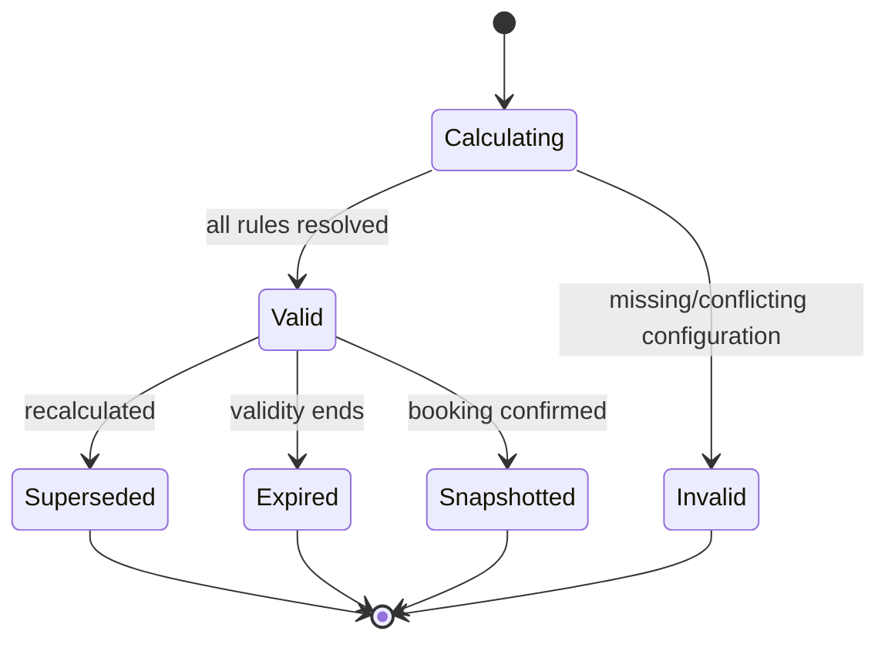

# Pricing and Policies Domain

- **Domain prefix:** `PRICE`
- **Status:** In progress
- **MVP priority:** P0
- **Primary experiences:** Business Portal, Booking, Customer Portal, and Staff Portal

## Purpose

The Pricing and Policies Domain determines what a proposed booking costs and which financial/cancellation rules apply. It owns versioned price books, rate rules, discounts, fees, taxes, deposit calculations, cancellation outcomes, and immutable quote/policy snapshots.

It does not collect money or issue refunds. Payments and Invoicing executes the financial instructions produced here.

## Goals

- Produce deterministic, explainable totals.
- Support boarding, daycare, grooming, and add-ons without custom code per business.
- Make holiday, seasonal, multi-pet, membership, package, coupon, fee, and tax behavior explicit.
- Prevent hidden price changes during checkout.
- Preserve the exact terms accepted for confirmed bookings.
- Reprice modifications without rewriting the original booking revision.
- Give staff controlled overrides with reasons and audit history.

## Core concepts

| Concept             | Definition                                                                                        |
| ------------------- | ------------------------------------------------------------------------------------------------- |
| Price book          | Versioned set of commercial rules for a business/location and currency.                           |
| Rate rule           | Determines a base charge or adjustment for matching service demand.                               |
| Charge unit         | Per night, day, session, appointment, pet, booking, occurrence, quantity, or configured interval. |
| Adjustment          | Discount, surcharge, fee, tax, credit application, or override.                                   |
| Quote               | Time-bounded calculation from versioned inputs.                                                   |
| Quote snapshot      | Immutable confirmed line items, rules, policies, totals, and explanations.                        |
| Deposit policy      | Determines amount due before confirmation or service.                                             |
| Cancellation policy | Determines refund, forfeiture, fee, or credit outcome for a cancellation/no-show.                 |

## Functional requirements

### Price-book administration

| ID           | Priority | Requirement                                                                                                                    | Status   |
| ------------ | -------: | ------------------------------------------------------------------------------------------------------------------------------ | -------- |
| PRICE-FR-001 |       P0 | Authorized users shall create a draft price book for a business and currency.                                                  | Accepted |
| PRICE-FR-002 |       P0 | A price book shall support business defaults and explicit location overrides.                                                  | Accepted |
| PRICE-FR-003 |       P0 | Price books shall have effective dates, draft, active, superseded, retired, and archived states.                               | Accepted |
| PRICE-FR-004 |       P0 | Publishing shall validate service coverage, currency, rule conflicts, missing tax/deposit references, and effective-date gaps. | Accepted |
| PRICE-FR-005 |       P0 | Active price-book versions shall be immutable and replaced by a new version.                                                   | Accepted |
| PRICE-FR-006 |       P0 | Authorized users shall preview calculated examples before publication.                                                         | Accepted |
| PRICE-FR-007 |       P0 | The platform shall show which effective rule produced each charge or adjustment.                                               | Accepted |
| PRICE-FR-008 |       P1 | Price books shall support scheduled activation and retirement.                                                                 | Proposed |

### Base rates and charge units

| ID           | Priority | Requirement                                                                                                                                    | Status   |
| ------------ | -------: | ---------------------------------------------------------------------------------------------------------------------------------------------- | -------- |
| PRICE-FR-009 |       P0 | A rate rule shall reference a service version/category and one supported charge unit.                                                          | Accepted |
| PRICE-FR-010 |       P0 | Boarding rates shall support per-night and configured arrival/departure boundary adjustments.                                                  | Accepted |
| PRICE-FR-011 |       P0 | Daycare rates shall support day, half-day/session, occurrence, and package-funded use.                                                         | Accepted |
| PRICE-FR-012 |       P0 | Grooming rates shall support fixed appointment, pet attribute bands, duration, and staff-entered condition adjustments under controlled rules. | Accepted |
| PRICE-FR-013 |       P0 | Add-ons shall support per booking, pet, night, day, appointment, occurrence, or quantity pricing.                                              | Accepted |
| PRICE-FR-014 |       P0 | Rules may match location, service, variant, dates, day of week, pet count, pet attributes, customer segment, or booking channel.               | Accepted |
| PRICE-FR-015 |       P0 | A matching rule shall define precedence, combinability, and rounding behavior.                                                                 | Accepted |

### Calendar and demand adjustments

| ID           | Priority | Requirement                                                                                                           | Status   |
| ------------ | -------: | --------------------------------------------------------------------------------------------------------------------- | -------- |
| PRICE-FR-016 |       P0 | The platform shall support holiday, seasonal, weekend, and dated peak-period rate adjustments.                        | Accepted |
| PRICE-FR-017 |       P0 | Overlapping calendar rules shall resolve using explicit precedence and conflict validation.                           | Accepted |
| PRICE-FR-018 |       P0 | Date-range bookings shall itemize which dates received different rates.                                               | Accepted |
| PRICE-FR-019 |       P0 | A holiday surcharge shall support per night/day/item/booking scope.                                                   | Accepted |
| PRICE-FR-020 |       P1 | Occupancy-based dynamic pricing shall be structurally possible but disabled for MVP unless explicitly designed later. | Proposed |

### Discounts, coupons, memberships, and packages

| ID           | Priority | Requirement                                                                                                                        | Status   |
| ------------ | -------: | ---------------------------------------------------------------------------------------------------------------------------------- | -------- |
| PRICE-FR-021 |       P0 | The platform shall support fixed and percentage discounts with scope, eligibility, limits, and effective dates.                    | Accepted |
| PRICE-FR-022 |       P0 | Multi-pet discounts shall identify qualifying pets, item order, and whether the discount applies per concurrent period or booking. | Accepted |
| PRICE-FR-023 |       P0 | Coupon codes shall support usage limits, customer limits, minimums, service/location scope, and expiration.                        | Accepted |
| PRICE-FR-024 |       P0 | Coupon validation shall return a safe explanation when not applicable.                                                             | Accepted |
| PRICE-FR-025 |       P0 | Membership benefits and package redemptions shall be applied through versioned external entitlement references.                    | Accepted |
| PRICE-FR-026 |       P0 | The quote shall show discounts and redemptions separately from base charges.                                                       | Accepted |
| PRICE-FR-027 |       P0 | Discount stacking shall be controlled explicitly by rule group and precedence.                                                     | Accepted |
| PRICE-FR-028 |       P1 | Managers shall create customer-specific negotiated rates with effective dates and approval.                                        | Proposed |

### Fees, taxes, and tips

| ID           | Priority | Requirement                                                                                                                            | Status   |
| ------------ | -------: | -------------------------------------------------------------------------------------------------------------------------------------- | -------- |
| PRICE-FR-029 |       P0 | The platform shall support configured late pickup, late cancellation, no-show, special handling, medication, and other disclosed fees. | Accepted |
| PRICE-FR-030 |       P0 | Fees shall define trigger, scope, amount type, tax behavior, waiver permission, and customer-visible explanation.                      | Accepted |
| PRICE-FR-031 |       P0 | Tax rules shall support business/location jurisdiction, taxable category, rate/version reference, and line-level calculation.          | Accepted |
| PRICE-FR-032 |       P0 | Quotes and invoices shall distinguish pre-tax subtotal, discounts, fees, taxes, deposit due, and total.                                | Accepted |
| PRICE-FR-033 |       P0 | Monetary calculations shall use integer minor units or a decimal type appropriate to the currency and never binary floating point.     | Accepted |
| PRICE-FR-034 |       P1 | Suggested tips may be configured but are never included in required booking totals.                                                    | Proposed |

### Deposits and payment timing

| ID           | Priority | Requirement                                                                                                           | Status   |
| ------------ | -------: | --------------------------------------------------------------------------------------------------------------------- | -------- |
| PRICE-FR-035 |       P0 | Deposit policies shall support no deposit, fixed amount, percentage, first unit, full payment, or configured formula. | Accepted |
| PRICE-FR-036 |       P0 | Deposit rules may vary by service, location, dates, customer segment, booking channel, or lead time.                  | Accepted |
| PRICE-FR-037 |       P0 | Deposit calculation shall support minimum, maximum, and additional amount for holiday/peak conditions.                | Accepted |
| PRICE-FR-038 |       P0 | The quote shall state deposit due now, remaining balance, and expected balance-due timing.                            | Accepted |
| PRICE-FR-039 |       P0 | Existing credits or prior payments shall not reduce a required deposit unless the policy explicitly allows it.        | Accepted |
| PRICE-FR-040 |       P1 | Payment schedules beyond deposit and final balance are deferred but shall not require redefining the quote model.     | Proposed |

### Cancellation, no-show, and modification outcomes

| ID           | Priority | Requirement                                                                                                                              | Status   |
| ------------ | -------: | ---------------------------------------------------------------------------------------------------------------------------------------- | -------- |
| PRICE-FR-041 |       P0 | Cancellation policies shall support time windows, service/date scope, refund percentage, fee, forfeiture, and store-credit alternatives. | Accepted |
| PRICE-FR-042 |       P0 | The domain shall calculate a cancellation outcome from the booking's accepted policy and current cancellation context.                   | Accepted |
| PRICE-FR-043 |       P0 | Partial cancellation shall allocate charges, discounts, taxes, deposits, and prior payments across affected and retained items.          | Accepted |
| PRICE-FR-044 |       P0 | No-show outcomes shall be calculated separately from customer cancellation when configured.                                              | Accepted |
| PRICE-FR-045 |       P0 | A modification shall produce a delta quote comparing the existing confirmed revision with the proposed revision.                         | Accepted |
| PRICE-FR-046 |       P0 | A delta quote shall show added charges, removed charges, retained payments, additional amount due, and potential refund/credit.          | Accepted |
| PRICE-FR-047 |       P0 | Authorized policy overrides shall preserve both calculated and overridden outcomes with reason.                                          | Accepted |

### Quotes and snapshots

| ID           | Priority | Requirement                                                                                                                 | Status   |
| ------------ | -------: | --------------------------------------------------------------------------------------------------------------------------- | -------- |
| PRICE-FR-048 |       P0 | The domain shall produce an itemized quote with stable line identifiers and calculation explanations.                       | Accepted |
| PRICE-FR-049 |       P0 | A quote shall include business, location, currency, customer/pet/service inputs, rule versions, issue time, and expiration. | Accepted |
| PRICE-FR-050 |       P0 | Recalculation shall create a new quote version and shall not mutate a previously displayed quote.                           | Accepted |
| PRICE-FR-051 |       P0 | Confirmation shall persist an immutable quote and policy snapshot referenced by the booking revision and invoice.           | Accepted |
| PRICE-FR-052 |       P0 | Staff shall be able to explain totals from line-level source rules without access to implementation internals.              | Accepted |
| PRICE-FR-053 |       P0 | Quote errors shall identify missing or conflicting configuration and shall not silently substitute zero prices.             | Accepted |

## Calculation order

The default order is explicit and versioned:

1. Normalize requested service quantities and charge periods.
2. Select effective base rates.
3. Apply calendar/variant/attribute rate adjustments.
4. Calculate add-ons.
5. Apply eligible line-level discounts.
6. Apply eligible booking-level discounts and coupons.
7. Apply membership benefits and package redemptions according to entitlement rules.
8. Add configured fees.
9. Calculate taxes using taxable bases and jurisdiction rules.
10. Calculate required deposit and remaining balance.
11. Round at configured line and total boundaries.
12. Produce explanations and snapshot references.

Changing calculation order requires a new engine/rule version and regression tests.

## Business rules

| ID           | Priority | Rule                                                                                                                                     |
| ------------ | -------: | ---------------------------------------------------------------------------------------------------------------------------------------- |
| PRICE-BR-001 |       P0 | Every quote uses one currency and one business/location commercial context.                                                              |
| PRICE-BR-002 |       P0 | No active service may be customer-bookable without an applicable price or an explicit request-for-quote model; MVP requires a price.     |
| PRICE-BR-003 |       P0 | Published rates and policies are versioned and never destructively changed.                                                              |
| PRICE-BR-004 |       P0 | Identical versioned inputs produce identical monetary results.                                                                           |
| PRICE-BR-005 |       P0 | Rule precedence and stacking are explicit; ambiguous conflicts block publication or quoting.                                             |
| PRICE-BR-006 |       P0 | Discounts cannot reduce a line below zero unless an explicit credit line is created.                                                     |
| PRICE-BR-007 |       P0 | Taxes are calculated on legally/configurably applicable bases after eligible discounts and before optional tips.                         |
| PRICE-BR-008 |       P0 | Deposits are part of amount timing, not additional revenue or an extra charge.                                                           |
| PRICE-BR-009 |       P0 | Confirmed bookings retain accepted quote and policy snapshots after price-book changes.                                                  |
| PRICE-BR-010 |       P0 | Booking modifications use current rules by default for changed items while retained items follow the configured price-protection policy. |
| PRICE-BR-011 |       P0 | Cancellation calculations use the booking's accepted cancellation policy, not the current public policy.                                 |
| PRICE-BR-012 |       P0 | Package redemption and store credit do not change the underlying service revenue price; they change settlement/funding treatment.        |
| PRICE-BR-013 |       P0 | Every manual price, fee, discount, deposit, or policy override requires permission, reason, actor, and audit.                            |
| PRICE-BR-014 |       P0 | Customer-visible estimates must be clearly labeled if any required input remains unknown.                                                |
| PRICE-BR-015 |       P0 | A quote expiration never cancels a confirmed booking or changes its snapshot.                                                            |
| PRICE-BR-016 |       P1 | Dynamic pricing, if introduced, must use disclosed constraints and cannot change a valid unexpired held quote.                           |

## Quote lifecycle



## Example boarding calculation

```text
Standard Boarding — Pet A — 4 nights       $240.00
Standard Boarding — Pet B — 4 nights       $240.00
Holiday adjustment — 2 pet-nights           $30.00
Private play — Pet A — 2 occurrences         $30.00
Additional-pet discount                     -$48.00
Subtotal                                    $492.00
Taxable fees                                 $10.00
Tax                                          $10.04
Total                                       $512.04
Deposit due now (25%)                       $128.01
Remaining balance                           $384.03
```

Actual taxability, line scopes, and rounding are business/jurisdiction configuration, not assumptions from this example.

## Permissions

| Capability                     | Owner |     Manager      |    Front desk    |       Customer        |   Platform support   |
| ------------------------------ | :---: | :--------------: | :--------------: | :-------------------: | :------------------: |
| View published prices/policies |  Yes  |       Yes        |       Yes        |      Applicable       | Limited support view |
| Create/edit price-book drafts  |  Yes  | Permission based |        No        |          No           |          No          |
| Publish/retire                 |  Yes  |   Configurable   |        No        |          No           |          No          |
| Apply approved coupon          |  Yes  |       Yes        |       Yes        |          Yes          |          No          |
| Manual price/fee override      |  Yes  |   Configurable   |     Limited      |          No           |          No          |
| Policy/deposit override        |  Yes  |   Configurable   |  No by default   |          No           |          No          |
| View calculation explanation   |  Yes  |       Yes        |       Yes        |     Customer-safe     | Limited support view |
| View audit/version history     |  Yes  |       Yes        | Permission based | Own accepted snapshot | Limited support view |

## Core entities

| Entity               | Purpose                                                  |
| -------------------- | -------------------------------------------------------- |
| PriceBook            | Business/currency identity and lifecycle                 |
| PriceBookVersion     | Immutable effective configuration                        |
| RateRule             | Base or adjusted rate and matching conditions            |
| CalendarRateRule     | Holiday/season/weekend/dated adjustment                  |
| DiscountRule         | Fixed/percentage benefit, scope, limits, stacking        |
| Coupon               | Customer-entered code and usage constraints              |
| FeeRule              | Triggered disclosed fee and tax treatment                |
| TaxRuleReference     | Jurisdiction/category/rate provider or version reference |
| DepositPolicy        | Deposit formula, boundaries, and due timing              |
| CancellationPolicy   | Windows and financial outcomes                           |
| Quote                | Calculation identity, version, validity, inputs, totals  |
| QuoteLine            | Stable itemized charge/discount/fee/tax line             |
| QuoteRuleApplication | Source rule, match facts, order, and explanation         |
| QuoteSnapshot        | Immutable confirmation artifact                          |
| PolicySnapshot       | Immutable accepted deposit/cancellation/financial terms  |
| PricingOverride      | Original outcome, replacement, reason, actor, scope      |

## Domain events

- `price_book.published`
- `price_book.superseded`
- `price_book.retired`
- `coupon.created`
- `coupon.status.changed`
- `deposit_policy.published`
- `cancellation_policy.published`
- `quote.calculated`
- `quote.invalid`
- `quote.expired`
- `quote.snapshotted`
- `pricing.override.applied`

Events include tenant/location, currency, price-book/rule versions, quote/booking references, actor/source, correlation ID, and occurred time. Events do not carry full sensitive booking inputs when references suffice.

## Non-functional requirements

| ID            | Priority | Requirement                                                                                        |
| ------------- | -------: | -------------------------------------------------------------------------------------------------- |
| PRICE-NFR-001 |       P0 | Pricing shall be deterministic for identical versioned inputs.                                     |
| PRICE-NFR-002 |       P0 | Monetary values shall use currency-aware precision and documented rounding.                        |
| PRICE-NFR-003 |       P0 | Quote calculation shall be fast enough for interactive booking and modification flows.             |
| PRICE-NFR-004 |       P0 | Pricing configuration and quotes shall enforce tenant/location authorization.                      |
| PRICE-NFR-005 |       P0 | Published rules, accepted snapshots, and overrides shall be immutable and auditable.               |
| PRICE-NFR-006 |       P0 | Quote calculation shall be safe to retry using an idempotency/correlation context.                 |
| PRICE-NFR-007 |       P0 | Customer-facing price explanations and administration screens shall meet WCAG 2.2 AA targets.      |
| PRICE-NFR-008 |       P1 | A regression suite shall compare known scenarios before every pricing-engine or rule-order change. |

## Acceptance scenarios

| ID           | Covers           | Scenario                                                                                                            |
| ------------ | ---------------- | ------------------------------------------------------------------------------------------------------------------- |
| PRICE-AT-001 | PRICE-FR-001–008 | A manager previews, publishes, schedules, and supersedes a location price book without changing confirmed bookings. |
| PRICE-AT-002 | PRICE-FR-009–015 | Boarding nights, daycare sessions, grooming appointment, and per-pet add-ons use correct charge units.              |
| PRICE-AT-003 | PRICE-FR-016–020 | A stay spanning normal and holiday dates itemizes each rate and resolves overlap predictably.                       |
| PRICE-AT-004 | PRICE-FR-021–028 | A multi-pet discount and valid coupon stack only as configured and show separate explanations.                      |
| PRICE-AT-005 | PRICE-FR-029–034 | Fees and taxes calculate with correct taxable bases and monetary rounding.                                          |
| PRICE-AT-006 | PRICE-FR-035–040 | A holiday deposit applies minimum/maximum rules and shows due-now versus remaining balance.                         |
| PRICE-AT-007 | PRICE-FR-041–047 | Partial cancellation produces refund/credit instructions from the accepted policy and retains unaffected items.     |
| PRICE-AT-008 | PRICE-FR-048–053 | Recalculation creates a new quote while the prior quote and confirmed snapshot remain immutable and explainable.    |
| PRICE-AT-009 | PRICE-BR-004–005 | Randomized rule-order and retry tests return identical totals or a blocking conflict.                               |
| PRICE-AT-010 | PRICE-BR-013     | An unauthorized override fails; an authorized override records original value, replacement, actor, and reason.      |
| PRICE-AT-011 | PRICE-BR-009–011 | A price/policy change does not alter an existing confirmed booking's quote or cancellation terms.                   |
| PRICE-AT-012 | PRICE-NFR-004    | Direct requests cannot view or use another tenant's price books, coupons, quotes, policies, or overrides.           |

## Metrics

- Average booking value by service/location/channel
- Base charges, discounts, fees, taxes, and deposits
- Coupon attempts, validation failures, redemptions, and revenue impact
- Multi-pet and membership benefit use
- Quote calculation latency and invalid-configuration rate
- Quote expiration and conversion
- Override volume, value, actor, and reason
- Cancellation/no-show charges, refunds, and credits
- Price-book coverage and effective-date gaps
- Rounding or reconciliation discrepancies

## Open decisions

1. Exact boarding charge boundary and partial-day fee model.
2. Whether grooming size/coat adjustments are quoted online, estimated, or finalized after intake.
3. Tax provider and whether MVP uses managed configuration or manual rates.
4. Whether coupons are required in MVP or P1.
5. Whether memberships/packages launch with MVP or only their integration contracts do.
6. Price-protection behavior for unchanged versus changed items during modifications.
7. Quote validity by channel and service type.
8. Whether manager overrides may reduce required holiday deposits.

## Implemented foundation

The E06 implementation is provided by migrations `20260718000300` and `20260718000400`, `/app/settings/pricing`, and `/app/quotes`. Managers can draft a currency-specific price book with a location policy and agreement, add rates for exact published service versions, and publish the commercial bundle. Published bundles are immutable; controlled revision clones rates, adjustments, coupons, and policy terms into a new draft, and publication atomically supersedes the prior versions.

Staff can calculate immutable itemized quote snapshots with integer-minor-unit base charges, peak/seasonal/holiday adjustment support, fixed or percentage discount codes, deterministic post-discount tax rounding, deposit due, remaining balance, expiration, and rule trace. Recalculation can retain an explicit predecessor quote without mutating it. Coupon redemption evidence and agreement acceptance preserve the exact rule or policy version, actor, time, scope, and evidence.

Cancellation and no-show outcomes are calculated from the quote's snapshotted policy rather than the current public policy. Outcome records preserve notice hours, original total and deposit, fee, projected refund, calculation trace, and any manager-authorized override. Overrides require `pricing.manage` and a meaningful reason. Multi-pet discount rules, per-date split itemization, partial-cancellation allocation, and external tax/entitlement integrations remain future expansion work.

## Dependencies

- Business Configuration for locations, currency, and policy setup
- Service Catalog for services, variants, add-ons, and charge declarations
- Customer/Pet for discount and attribute inputs
- Booking for quote, snapshot, modification, cancellation, and no-show requests
- Payments and Invoicing for settlement, refunds, credits, and tax records
- Membership/Package capability for entitlement and redemption inputs
- Reporting for revenue and discount analysis
