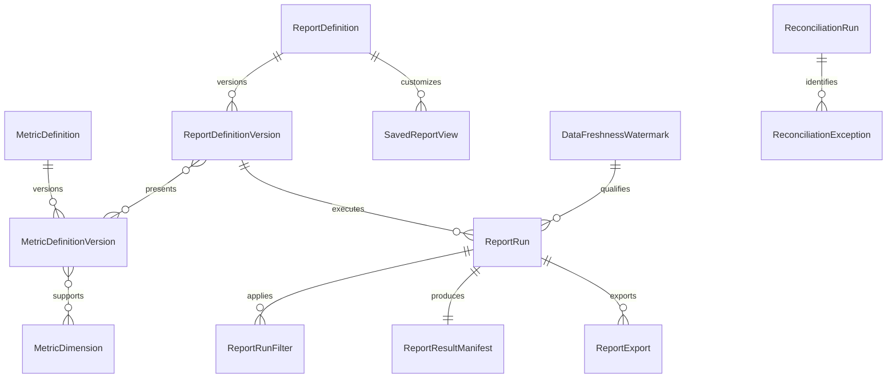
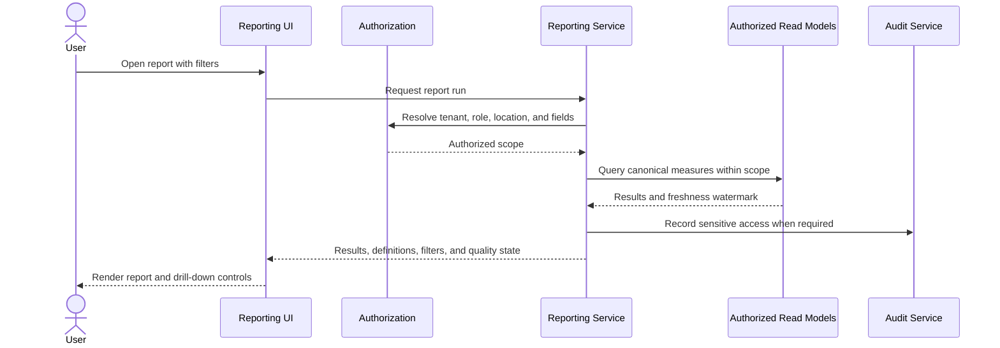

# Reporting Domain Specification

## Purpose

The Reporting domain turns trusted operational and financial records into consistent, explainable business information. It gives business owners, managers, and authorized staff timely answers about bookings, occupancy, revenue, customers, compliance, and daily execution without changing the underlying source records.

This domain owns metric definitions, report composition, filtering, exports, saved views, freshness indicators, and reconciliation evidence. It does not own bookings, payments, invoices, pet records, or care activity.

## Product outcomes

- Owners can understand business performance without assembling spreadsheets.
- Managers can identify capacity, compliance, and operational exceptions early.
- Every displayed metric has one canonical definition and source lineage.
- Financial views reconcile to invoices, payments, refunds, and processor settlement.
- Users see only the tenants, locations, customers, pets, and financial details they are authorized to access.
- Reports remain useful at one location and across a multi-location business.

## Scope

### MVP

- A reporting center with role-aware report navigation
- Operational overview and daily activity reports
- Occupancy and capacity reporting
- Booking, cancellation, no-show, and waitlist reporting
- Revenue, invoice, payment, refund, and outstanding-balance reporting
- Customer, pet, and vaccination-compliance reporting
- Feeding, medication, task, incident, and report-card compliance reporting
- Common date, location, service, status, customer, and pet filters
- CSV export of the filtered result set
- Visible metric definitions, applied filters, time zone, and data freshness
- Saved report views for the current user
- Audit events for sensitive report access and exports

### Post-MVP

- Scheduled report delivery
- Custom report builder
- Cross-tenant platform benchmarks using privacy-preserving aggregation
- Forecasting, anomaly detection, and natural-language insights
- Cohort, retention, lifetime value, and marketing attribution analysis
- Dedicated analytical warehouse and semantic-model service
- Embedded charts on configurable executive dashboards

### Out of scope

- General ledger accounting
- Tax filing or statutory financial statements
- Editing source transactions from a report
- Payroll calculation
- AI-generated business advice in the MVP
- Claims that operational revenue equals bank settlement or recognized accounting revenue

## Domain boundaries and sources

| Subject                                     | System of record         | Reporting responsibility                                     |
| ------------------------------------------- | ------------------------ | ------------------------------------------------------------ |
| Bookings and waitlist                       | Booking and Waitlist     | Aggregate lifecycle and conversion measures                  |
| Sellable capacity and assignments           | Resource and Capacity    | Calculate occupancy and utilization at a defined grain       |
| Prices, discounts, fees, and taxes          | Pricing and Policies     | Explain booked-value composition from immutable snapshots    |
| Invoices, payments, refunds, and settlement | Payments and Invoicing   | Present distinct financial measures and reconciliation views |
| Check-in, care, incidents, and check-out    | Operations               | Calculate execution and compliance measures                  |
| Customers, households, and pets             | Customer and Pet domains | Provide authorized counts, segments, and compliance lists    |
| Delivery activity                           | Communications           | Summarize notification delivery and failure performance      |

Reporting reads authoritative records or purpose-built projections. It never silently reinterprets a source status. Corrections occur in the owning domain and flow back into reports.

## Users and permissions

| Capability                  |        Owner        |   Manager    |       Staff       |  Accountant  |     Platform support     |
| --------------------------- | :-----------------: | :----------: | :---------------: | :----------: | :----------------------: |
| View business performance   |         Yes         | Configurable |        No         | Configurable | Time-bound support only  |
| View financial detail       |         Yes         | Configurable |        No         |     Yes      | Time-bound support only  |
| View operational compliance |         Yes         |     Yes      | Assigned location |   Optional   | Time-bound support only  |
| View customer or pet detail |         Yes         |     Yes      | Assigned location |   Limited    | Time-bound support only  |
| Export reports              |         Yes         | Configurable |   Configurable    |     Yes      |   Disabled by default    |
| Save personal views         |         Yes         |     Yes      |        Yes        |     Yes      |            No            |
| Manage shared report views  |         Yes         | Configurable |        No         |      No      |            No            |
| Change metric definitions   | Platform-controlled |      No      |        No         |      No      | Authorized platform role |

All access is tenant-scoped. Location restrictions, role permissions, field masking, and support-access controls apply before aggregation and export. Aggregate results must not become a path around row-level authorization.

## Core concepts

### Metric definition

A versioned definition containing:

- Stable metric ID and display name
- Business question answered
- Formula, numerator, and denominator
- Record inclusion and exclusion rules
- Measurement grain
- Supported dimensions
- Authoritative source fields
- Time basis and tenant time-zone behavior
- Freshness expectation
- Data owner and definition owner
- Known caveats and reconciliation procedure

### Report definition

A controlled composition of metrics, dimensions, columns, filters, sorting, drill-down behavior, permissions, and export rules.

### Report run

An immutable record of a report request, including definition version, requesting user, tenant, scope, filters, time zone, execution time, freshness watermark, result status, and export reference when applicable.

### Saved view

A user's or administrator's saved filter, column, sort, and visualization preferences. A saved view references a report definition; it does not clone or redefine metrics.

### Data-quality status

A visible state such as `Current`, `Delayed`, `Partial`, `Rebuilding`, or `Unavailable`, supported by a watermark and reason. Reports must not present stale or incomplete values as current.

## Metric design standard

Metrics use the following hierarchy:

- **Outcomes:** a small set of business results, such as occupied capacity and collected cash.
- **Drivers:** measures that explain the outcome, such as booking conversion or average booking value.
- **Guardrails:** measures that expose harmful tradeoffs, such as cancellation, incident, refund, or missed-medication rates.

Dashboards should emphasize one to three outcomes, their most useful drivers, and relevant guardrails. A large catalog may exist, but a screen should not treat every measure as equally important.

## Canonical MVP metrics

### Capacity and operations

| ID          | Metric                              | Canonical definition                                                                                                                                                                                      |
| ----------- | ----------------------------------- | --------------------------------------------------------------------------------------------------------------------------------------------------------------------------------------------------------- |
| RPT-MET-001 | Sellable resource-hours             | Sum of resource time available for sale after closures, maintenance, and administrative blocks, at the resource/location time grain.                                                                      |
| RPT-MET-002 | Occupied resource-hours             | Sum of sellable resource time assigned to eligible active stays. Cancelled, declined, no-show, and tentative holds are excluded unless a separate hold metric is requested.                               |
| RPT-MET-003 | Occupancy rate                      | `occupied resource-hours / sellable resource-hours`. Numerator and denominator must use the same resources, intervals, location time zone, and service eligibility.                                       |
| RPT-MET-004 | Check-in completion rate            | Completed check-ins divided by bookings that reached an eligible arrival state during the period. Cancelled-before-arrival bookings are excluded.                                                         |
| RPT-MET-005 | On-time care-task rate              | Eligible care tasks completed within their configured window divided by completed, missed, or overdue eligible tasks. Cancelled tasks and tasks invalidated by an approved care-plan change are excluded. |
| RPT-MET-006 | Medication on-time rate             | Medication administrations recorded within the configured window divided by administrations due and eligible for compliance measurement. Approved holds remain separately visible.                        |
| RPT-MET-007 | Incident rate per 100 pet-care days | `qualifying incidents / pet-care days * 100`. Severity and incident type remain available as dimensions.                                                                                                  |

Occupancy is calculated from summed time, not by averaging percentages across days or locations. A pet staying in a shared resource follows the capacity units defined by the Resource and Capacity domain.

### Booking and demand

| ID          | Metric                   | Canonical definition                                                                                                                                                                               |
| ----------- | ------------------------ | -------------------------------------------------------------------------------------------------------------------------------------------------------------------------------------------------- |
| RPT-MET-010 | Booking requests         | Distinct booking requests created in the period, excluding test and administratively voided records.                                                                                               |
| RPT-MET-011 | Confirmed bookings       | Distinct requests that first entered a confirmed state in the period.                                                                                                                              |
| RPT-MET-012 | Booking conversion rate  | Confirmed eligible booking requests divided by eligible completed booking requests for the selected cohort. The cohort basis must be shown as request-created date or decision date.               |
| RPT-MET-013 | Cancellation rate        | Bookings cancelled after confirmation divided by confirmed bookings with a scheduled arrival in the selected period. Customer, business, and policy cancellation reasons are separable dimensions. |
| RPT-MET-014 | No-show rate             | Bookings marked no-show divided by bookings expected to arrive, excluding cancellations recorded before the arrival cutoff.                                                                        |
| RPT-MET-015 | Waitlist conversion rate | Waitlist entries converted to a confirmed booking divided by eligible closed waitlist entries. Expired, declined, and withdrawn outcomes remain separately visible.                                |
| RPT-MET-016 | Average lead time        | Average elapsed calendar time between booking creation and scheduled service start for confirmed bookings. Median must also be available to expose skew.                                           |

### Financial

| ID          | Metric                | Canonical definition                                                                                                                                                                                          |
| ----------- | --------------------- | ------------------------------------------------------------------------------------------------------------------------------------------------------------------------------------------------------------- |
| RPT-MET-020 | Gross booked value    | Sum of immutable booking price snapshots before discounts, credits, refunds, and payment activity, excluding voided bookings. This is demand value, not cash or recognized revenue.                           |
| RPT-MET-021 | Net invoiced charges  | Finalized invoice charges plus fees and taxes, less invoice discounts and credit notes, using invoice issue or service-period basis as visibly selected.                                                      |
| RPT-MET-022 | Collected cash        | Sum of successful captured payments in the period, excluding failed, pending, and authorized-only attempts.                                                                                                   |
| RPT-MET-023 | Net collected cash    | Successful captured payments less successful refunds in the period. Processor fees and disputes are not deducted unless the report is explicitly a settlement report.                                         |
| RPT-MET-024 | Outstanding balance   | Finalized invoice amount minus applied successful payments, applied credits, and other settled allocations as of the report watermark. Negative balances appear as customer credit, not negative receivables. |
| RPT-MET-025 | Average booking value | Net invoiced charges allocated to completed eligible bookings divided by those bookings. Scope and allocation basis must be shown.                                                                            |
| RPT-MET-026 | Refund rate           | Successful refunded amount divided by successfully captured amount for the selected payment cohort. Both transaction-period and original-payment-cohort views may be offered but cannot be mixed.             |
| RPT-MET-027 | Deposit liability     | Unapplied, unrefunded successful deposits held as of the report watermark. Applied deposits move out of this measure when the allocation succeeds.                                                            |

`Revenue`, `sales`, `booked value`, `invoice charges`, `cash collected`, and `processor settlement` are never interchangeable labels. Reports must state which measure is displayed.

### Customers and compliance

| ID          | Metric                      | Canonical definition                                                                                                                                                |
| ----------- | --------------------------- | ------------------------------------------------------------------------------------------------------------------------------------------------------------------- |
| RPT-MET-030 | Active customers            | Distinct non-merged customer households with qualifying completed or future confirmed activity inside the configured activity window. The window must be displayed. |
| RPT-MET-031 | Repeat-customer rate        | Customers with at least two completed qualifying bookings divided by customers with at least one, for the selected cohort and observation window.                   |
| RPT-MET-032 | Returning booking share     | Confirmed bookings from customers with a prior completed booking divided by confirmed bookings in the period.                                                       |
| RPT-MET-033 | Vaccine compliance rate     | Pets associated with an upcoming eligible service whose required vaccines are verified and valid through the configured service boundary divided by pets evaluated. |
| RPT-MET-034 | Report-card completion rate | Eligible completed stays with a published required report card divided by eligible completed stays.                                                                 |

## MVP report catalog

| Report                    | Primary question                          | Key content                                                                                   |
| ------------------------- | ----------------------------------------- | --------------------------------------------------------------------------------------------- |
| Daily operations          | What needs attention today?               | Arrivals, departures, in-care pets, capacity, overdue tasks, medication exceptions, incidents |
| Occupancy and utilization | How effectively is capacity used?         | Sellable and occupied resource-hours, occupancy by location/service/resource type, closures   |
| Booking performance       | How is demand converting?                 | Requests, confirmations, lead time, modifications, cancellations, no-shows, source            |
| Waitlist performance      | Is constrained demand being recovered?    | Entries, offers, response time, conversions, expiry, decline reasons                          |
| Sales and invoices        | What was charged for services?            | Booked value, finalized charges, discounts, fees, taxes, credits, outstanding balances        |
| Payments and refunds      | What cash moved?                          | Captures, failures, refunds, deposits, payment method, disputes, unapplied funds              |
| Financial reconciliation  | Do system records agree?                  | Invoice totals, allocations, captured/refunded cash, processor settlement exceptions          |
| Customer activity         | Who is using the business?                | New, active, returning, inactive, repeat behavior, household and location scope               |
| Pet eligibility           | Which pets need action?                   | Vaccine status, upcoming expirations, missing documents, eligibility blocks                   |
| Care compliance           | Was scheduled care completed safely?      | Feeding, medication, wellness, task and report-card completion and exceptions                 |
| Incident overview         | What safety patterns need review?         | Counts, rate per 100 care-days, severity, type, location, resolution time                     |
| Communication delivery    | Are required messages reaching customers? | Sent, delivered, failed, suppressed, retried, channel and template                            |

## Functional requirements

## Implemented MVP summary

The first E13 vertical slice provides a role-aware business summary for a user-selected period of up to 366 days. It records each successful run immutably, displays its canonical definition version, UTC time basis, authorized-location scope, and freshness watermark, and keeps operational and financial permission boundaries independent.

The summary distinguishes booking requests, scheduled confirmations, cancellations, completed bookings, current pets in care, and unresolved operational alerts. Financial visibility separately presents net invoiced charges, collected cash, refunded cash, and the current outstanding balance. The interface explicitly avoids describing these measures as accounting revenue or processor settlement.

Report aggregation is performed only after tenant membership, permission, and location-scope checks. A staff member cannot use an aggregate to infer records outside their authorized locations. Future exports and drill-downs must reuse the same scope and definition version rather than reconstructing access in the browser.

The booking-activity drill-down applies that rule directly. It presents authorized booking-item records behind the summary, caps synchronous results at 5,000 rows, and offers CSV only to users with `reports.export`. Every screen run and export records its period, authorized-location scope, definition version, freshness watermark, requester, and row count. CSV responses are private, non-cacheable downloads and use deterministic columns and escaping.

| ID         | Priority | Requirement                                                                                                                               |
| ---------- | -------: | ----------------------------------------------------------------------------------------------------------------------------------------- |
| RPT-FR-001 |       P0 | The system shall provide only reports authorized for the user's tenant, role, and location scope.                                         |
| RPT-FR-002 |       P0 | The system shall display applied filters, effective time zone, metric definition version, and freshness watermark with every report run.  |
| RPT-FR-003 |       P0 | Users shall filter supported reports by date range, location, service, booking status, and other definition-approved dimensions.          |
| RPT-FR-004 |       P0 | The system shall calculate canonical metrics from documented inclusion, exclusion, grain, and time-basis rules.                           |
| RPT-FR-005 |       P0 | Authorized users shall drill from aggregate values to authorized supporting records without expanding their data access.                  |
| RPT-FR-006 |       P0 | Authorized users shall export the complete filtered result set to CSV using the same definitions and authorization as the visible report. |
| RPT-FR-007 |       P0 | The system shall identify delayed, partial, rebuilding, or unavailable report data and shall not label it current.                        |
| RPT-FR-008 |       P0 | Financial reporting shall present booked, invoiced, collected, refunded, outstanding, and settled measures separately.                    |
| RPT-FR-009 |       P0 | Users shall be able to inspect a plain-language definition and calculation notes for every displayed KPI.                                 |
| RPT-FR-010 |       P1 | Users shall save personal report views without modifying the underlying report or metric definition.                                      |
| RPT-FR-011 |       P1 | Authorized administrators shall create shared saved views for their tenant.                                                               |
| RPT-FR-012 |       P1 | The system shall provide previous-period comparison only when both periods use compatible definitions and complete data.                  |
| RPT-FR-013 |       P1 | Financial reconciliation shall expose unmatched, duplicate, delayed, and amount-mismatch exceptions.                                      |
| RPT-FR-014 |       P1 | Exports exceeding synchronous limits shall run asynchronously and notify the requester when ready.                                        |

## Business rules

| ID         | Priority | Rule                                                                                                                                                           |
| ---------- | -------: | -------------------------------------------------------------------------------------------------------------------------------------------------------------- |
| RPT-BR-001 |       P0 | A metric name maps to one active canonical definition version at a time. Historical runs retain the version used.                                              |
| RPT-BR-002 |       P0 | Aggregation cannot bypass tenant, location, role, or field-level authorization.                                                                                |
| RPT-BR-003 |       P0 | Report date boundaries use the selected location's business time zone unless an authorized multi-location report explicitly uses a displayed comparison basis. |
| RPT-BR-004 |       P0 | Money is aggregated from stored minor units and currency. Different currencies are never summed without an explicit conversion policy and rate provenance.     |
| RPT-BR-005 |       P0 | Percentages are calculated from summed numerators and denominators, not averaged from child percentages.                                                       |
| RPT-BR-006 |       P0 | Soft-deleted, merged, test, voided, and anonymized records follow each metric's explicit inclusion rules.                                                      |
| RPT-BR-007 |       P0 | A source correction changes future report runs; completed report-run metadata remains immutable.                                                               |
| RPT-BR-008 |       P0 | Financial totals must reconcile to authoritative transaction records within documented timing tolerances before being marked complete.                         |
| RPT-BR-009 |       P0 | Personally identifiable and health-related fields are excluded from exports unless required by the report and authorized for the requester.                    |
| RPT-BR-010 |       P1 | Small aggregate groups may be suppressed in cross-location or platform benchmark views to reduce disclosure risk.                                              |
| RPT-BR-011 |       P1 | Comparisons across metric-definition versions require a compatibility declaration or visible discontinuity warning.                                            |

## Data model

Conceptual entities:

- `MetricDefinition`
- `MetricDefinitionVersion`
- `MetricDimension`
- `ReportDefinition`
- `ReportDefinitionVersion`
- `ReportRun`
- `ReportRunFilter`
- `ReportResultManifest`
- `SavedReportView`
- `ReportExport`
- `DataFreshnessWatermark`
- `DataQualityIssue`
- `ReconciliationRun`
- `ReconciliationException`

Large result rows need not be permanently copied into the operational database. The result manifest may point to a short-lived authorized export object or reproducible query/projection reference, subject to retention policy.

## Report execution flow

## Reconciliation design

Financial reconciliation is evidence-driven, not a single revenue tile.

1. Tie finalized invoice totals to invoice lines, discounts, fees, taxes, and credits.
2. Tie payment allocations to successful payment transactions.
3. Tie refunds to the original payment and allocation effect.
4. Tie processor settlement records to captured payments, refunds, disputes, and processor fees.
5. Classify timing differences separately from amount mismatches, duplicates, missing records, and invalid states.
6. Preserve the reconciliation run, watermark, tolerances, exceptions, assignee, and resolution.

Settlement data is optional for the earliest MVP if a provider integration does not expose it, but reports must then say `Processor settlement not reconciled` rather than imply agreement.

## Time, grain, and comparison rules

- Operational days use the location's configured time zone and business-day boundary.
- Multi-location reports show the selected comparison basis; defaulting all locations silently to server time is prohibited.
- Booking metrics disclose whether they are grouped by request creation, confirmation, service start, or completion.
- Financial metrics disclose whether they are grouped by booking date, invoice date, service period, payment date, or settlement date.
- A pet spanning midnight contributes care-days according to the documented operational-day rule.
- Partial periods are labeled and are not compared to complete periods without normalization or warning.
- Previous-period and year-over-year comparisons use the same definition version or disclose a break in series.

## Export requirements

- Exported files repeat the report name, run timestamp, tenant and location scope, time zone, filters, definition version, and freshness watermark.
- CSV uses stable machine-readable column names plus a data dictionary reference.
- Spreadsheet formula injection is neutralized for user-controlled values.
- Exports are encrypted in transit and at rest, expire after a configurable period, and require reauthorization at download time.
- Export creation, download, expiration, and deletion are audited.
- A deleted or expired export cannot be restored from a public URL.

## Non-functional requirements

| ID          | Priority | Requirement                                                                                                                                  |
| ----------- | -------: | -------------------------------------------------------------------------------------------------------------------------------------------- |
| RPT-NFR-001 |       P0 | Standard MVP reports for a typical single location shall return an initial result within 3 seconds at the 95th percentile under normal load. |
| RPT-NFR-002 |       P0 | Long-running reports and exports shall not block transactional booking or operations workloads.                                              |
| RPT-NFR-003 |       P0 | Re-running a report against the same immutable source watermark and definition version shall produce the same result.                        |
| RPT-NFR-004 |       P0 | Report failures shall expose a safe user message and a traceable operational error without leaking cross-tenant or query details.            |
| RPT-NFR-005 |       P0 | Report tables, filters, charts, and definition help shall meet the platform accessibility standard.                                          |
| RPT-NFR-006 |       P1 | Cached results shall include scope and definition version in the cache key and shall never be shared across unauthorized tenants or scopes.  |

Performance targets are initial engineering targets and must be validated using realistic tenant sizes and concurrent operational load.

## Audit and privacy

- Audit sensitive financial, customer-detail, health-detail, and bulk-export access.
- Store actor, tenant, effective role, support session, report, filters, scope, timestamp, and result classification.
- Do not place secrets, full payment credentials, or unrestricted medical notes in analytical projections.
- Apply source-domain retention, legal hold, anonymization, and deletion outcomes to reporting projections.
- Customer deletion must not corrupt required financial aggregates; retained records must be minimized and de-identified according to policy.

## Domain events

The Reporting domain may consume events such as:

- `booking.created`, `booking.confirmed`, `booking.cancelled`, `booking.no_show_recorded`
- `waitlist.entry_created`, `waitlist.entry_converted`, `waitlist.entry_closed`
- `capacity.availability_changed`, `resource.assignment_changed`
- `invoice.finalized`, `invoice.credited`, `payment.captured`, `payment.refunded`, `payment.disputed`
- `operation.check_in_completed`, `care_task.completed`, `care_task.missed`, `incident.reported`, `operation.check_out_completed`
- `vaccination.verified`, `vaccination.expired`
- `communication.delivered`, `communication.failed`

Event consumption improves read performance but does not make the event stream the unquestioned financial source of truth. Projections must be rebuildable and reconcilable to authoritative records.

## Acceptance scenarios

### RPT-AC-001: Tenant and location isolation

**Given** a manager is limited to Location A  
**When** the manager opens an occupancy report and exports it  
**Then** the visible totals, drill-down rows, and exported rows contain only Location A data.

### RPT-AC-002: Correct weighted occupancy

**Given** two resources have different sellable hours  
**When** occupancy is calculated  
**Then** the rate equals total occupied resource-hours divided by total sellable resource-hours and not the average of the two resource percentages.

### RPT-AC-003: Financial labels remain distinct

**Given** a booking is invoiced, partially paid, and later partially refunded
**When** an owner opens the financial overview  
**Then** booked value, net invoiced charges, collected cash, net collected cash, outstanding balance, and deposit liability are shown as distinct measures.

### RPT-AC-004: Stale data is visible

**Given** a reporting projection is delayed beyond its freshness objective  
**When** a user opens an affected report  
**Then** the report displays the delayed state and watermark and does not present the result as current.

### RPT-AC-005: Export matches report

**Given** an authorized user applies date, location, service, and status filters  
**When** the user exports the report  
**Then** the file uses the same filters, definition version, authorization scope, totals, and freshness watermark.

### RPT-AC-006: Definition transparency

**Given** a user questions a KPI  
**When** the user opens metric details  
**Then** the formula, grain, time basis, inclusions, exclusions, source owner, freshness, and caveats are available in plain language.

### RPT-AC-007: Currency safety

**Given** a tenant has records in more than one currency  
**When** a financial report is generated without an approved conversion policy  
**Then** the report separates currencies and does not produce a mixed-currency total.

### RPT-AC-008: Source correction

**Given** an invoice is corrected in the Payments and Invoicing domain  
**When** the projection is refreshed and the financial report is rerun  
**Then** the new run reflects the correction and retains traceability to its definition and freshness watermark.

## MVP implementation approach

Begin with governed operational read models and indexed database queries inside the modular monolith. Introduce asynchronous export jobs for large results. Add a dedicated warehouse only after data volume, cross-domain workload, historical modeling, or customer demand justifies the operational cost.

This sequence preserves one metric contract while allowing the physical implementation to evolve:

1. Canonical definitions and authorized operational queries
2. Rebuildable read projections and cached report runs
3. Analytical warehouse and semantic model
4. Forecasting and AI-assisted interpretation

## Open decisions

- Final operational-day boundary for overnight boarding
- Initial activity window for the `Active customers` metric
- Which care tasks count toward the launch compliance scorecard
- Whether multi-currency support is enabled at launch or explicitly prohibited per tenant
- Provider-specific settlement data available for MVP reconciliation
- Synchronous export row and size limits
- Data-retention period for report-run metadata and generated files
- Which roles may create tenant-shared saved views

## Related specifications

- [Booking and Waitlist](../booking-waitlist/README.md)
- [Resource and Capacity](../resource-capacity/README.md)
- [Pricing and Policies](../pricing-policies/README.md)
- [Payments and Invoicing](../payments-invoicing/README.md)
- [Operations](../operations/README.md)
- [Communications](../communications/README.md)
- [Customer and Household](../customer-household/README.md)
- [Pet and Eligibility](../pet-eligibility/README.md)
