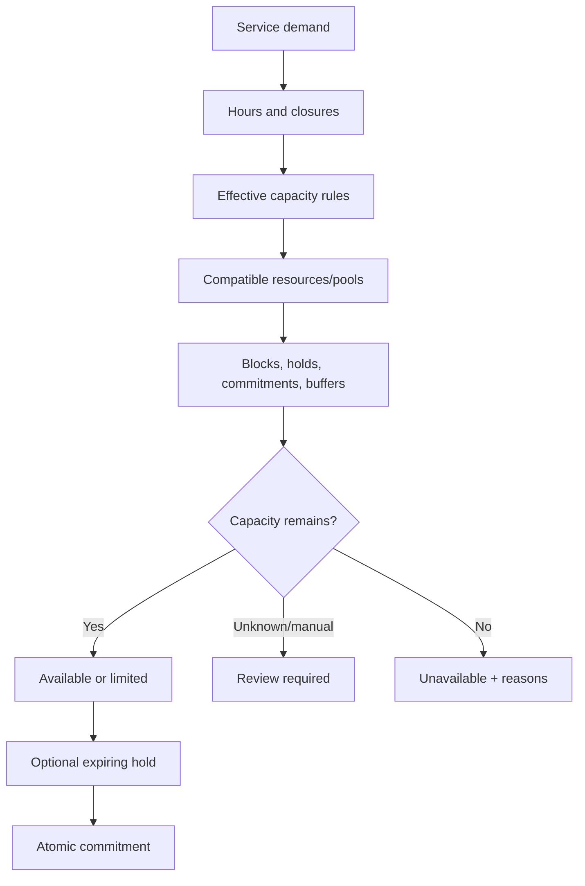
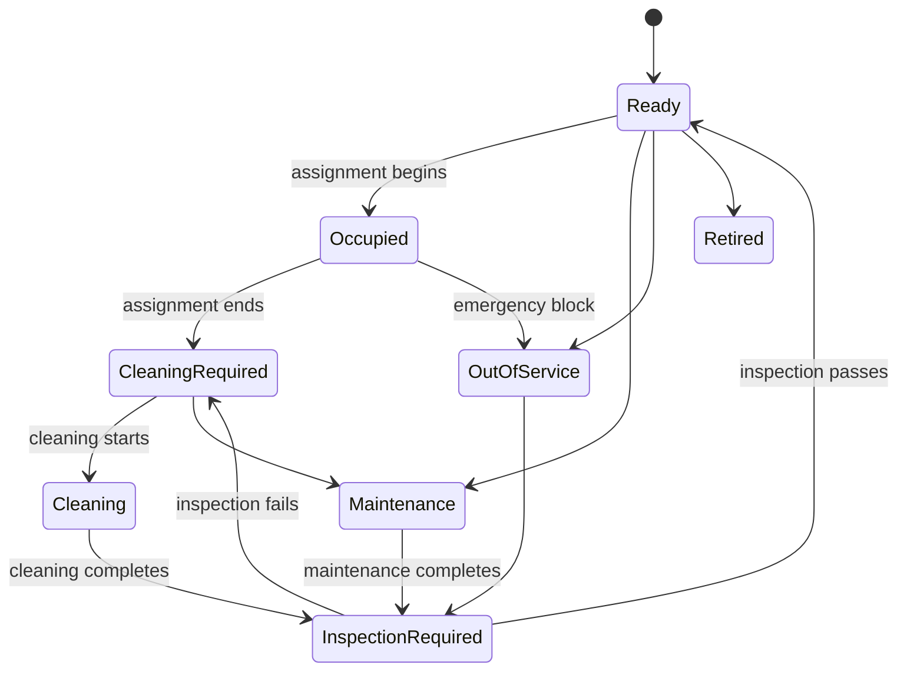

# Resource and Capacity Domain

- **Domain prefix:** `CAP`
- **Status:** In progress
- **MVP priority:** P0
- **Primary experiences:** Business Portal, Staff Portal, and Booking

## Purpose

The Resource and Capacity Domain represents what a location can safely sell and use over time. It manages physical resources, pooled capacity, operating constraints, closures, temporary holds, allocation candidates, confirmed commitments, and operational assignments.

Service Catalog declares what a service needs. This domain determines whether those needs can be satisfied. Booking owns the customer transaction; Operations owns the actual in-care assignment and resource state.

## Goals

- Prevent overselling and conflicting assignments.
- Support both named resources and pooled capacity.
- Model boarding, daycare, and grooming accurately without three unrelated systems.
- Explain availability failures and possible alternatives.
- Allow safe temporary holds during checkout.
- Preserve historical capacity and assignment evidence.
- Give staff a live, understandable facility view.

## Capacity concepts

| Concept | Definition |
|---|---|
| Resource type | Business-defined class such as kennel, suite, play area, grooming table, bathing station, or groomer. |
| Resource | A named assignable item at a location. |
| Capacity pool | A count-based limit not requiring a specific named resource at booking time. |
| Capacity rule | Effective limit by service, resource type, time, pet attributes, or operating condition. |
| Hold | Temporary capacity reservation while a user completes a booking or staff decision. |
| Commitment | Confirmed capacity consumption linked to a booking item. |
| Assignment | A specific resource allocation, usually during planning or operations. |
| Block | A period when a resource or quantity is unavailable. |
| Turnover buffer | Required time between uses for cleaning, setup, inspection, or travel. |

## Functional requirements

### Resource configuration

| ID | Priority | Requirement | Status |
|---|---:|---|---|
| CAP-FR-001 | P0 | Authorized users shall define resource types for each location. | Accepted |
| CAP-FR-002 | P0 | Authorized users shall create named resources with identifier, label, type, location, area, status, and attributes. | Accepted |
| CAP-FR-003 | P0 | Resources shall support active, unavailable, cleaning, maintenance, out-of-service, retired, and archived states. | Accepted |
| CAP-FR-004 | P0 | Resources shall support size, weight, occupancy, equipment, accessibility, isolation, and service-compatibility attributes. | Accepted |
| CAP-FR-005 | P0 | Resources shall be organized into facility areas for maps, permissions, and operational views. | Accepted |
| CAP-FR-006 | P0 | A resource may participate in one or more compatible capacity pools without duplicating physical capacity. | Accepted |
| CAP-FR-007 | P0 | Resource retirement shall preserve historical assignments and commitments. | Accepted |
| CAP-FR-008 | P1 | Authorized users shall duplicate or bulk-create resources from a template. | Proposed |

### Capacity pools and limits

| ID | Priority | Requirement | Status |
|---|---:|---|---|
| CAP-FR-009 | P0 | Authorized users shall create count-based capacity pools by location and service context. | Accepted |
| CAP-FR-010 | P0 | Capacity limits shall support recurring schedules and dated overrides. | Accepted |
| CAP-FR-011 | P0 | Capacity may be limited by total pets, service units, resource quantity, staff-linked quantity, or a configured combination. | Accepted |
| CAP-FR-012 | P0 | The system shall support lower operational limits than physical maximums. | Accepted |
| CAP-FR-013 | P0 | A dated closure or restriction shall reduce available capacity without deleting resources. | Accepted |
| CAP-FR-014 | P0 | Capacity rules shall support service, variant, pet size/weight group, and configured eligibility segment. | Accepted |
| CAP-FR-015 | P0 | The platform shall show physical, configured, committed, held, blocked, and available quantities separately. | Accepted |
| CAP-FR-016 | P1 | Managers shall schedule temporary capacity increases with required reason and authorization. | Proposed |

### Availability evaluation

| ID | Priority | Requirement | Status |
|---|---:|---|---|
| CAP-FR-017 | P0 | The domain shall evaluate requested service requirements across the complete requested interval. | Accepted |
| CAP-FR-018 | P0 | Availability shall consider hours, closures, resource status, capacity limits, holds, commitments, buffers, and compatibility. | Accepted |
| CAP-FR-019 | P0 | Multi-pet and multi-service requests shall be evaluated together when they compete for shared capacity. | Accepted |
| CAP-FR-020 | P0 | The result shall identify available, limited, unavailable, or review-required status. | Accepted |
| CAP-FR-021 | P0 | Unavailable results shall contain stable reason codes and safe alternatives when known. | Accepted |
| CAP-FR-022 | P0 | Availability shall be recalculated immediately before commitment. | Accepted |
| CAP-FR-023 | P0 | Boarding availability shall support date-range occupancy and turnover boundaries. | Accepted |
| CAP-FR-024 | P0 | Daycare availability shall support attendance-day/session pools and operational limits. | Accepted |
| CAP-FR-025 | P0 | Grooming availability shall support appointment duration, buffers, staff skills, and required stations. | Accepted |
| CAP-FR-026 | P1 | Availability may return ranked alternate dates, times, variants, or locations. | Proposed |

### Holds and commitments

| ID | Priority | Requirement | Status |
|---|---:|---|---|
| CAP-FR-027 | P0 | Booking shall be able to create an expiring hold for a validated availability result. | Accepted |
| CAP-FR-028 | P0 | Holds shall have owner, scope, quantity/resource demand, expiration, and idempotency key. | Accepted |
| CAP-FR-029 | P0 | Expired, cancelled, or failed-checkout holds shall release automatically. | Accepted |
| CAP-FR-030 | P0 | A valid hold shall convert transactionally into a commitment during booking confirmation. | Accepted |
| CAP-FR-031 | P0 | Commitments shall preserve the capacity inputs used at confirmation. | Accepted |
| CAP-FR-032 | P0 | Booking changes shall adjust commitments only after replacement capacity is secured. | Accepted |
| CAP-FR-033 | P0 | Cancellation shall release future capacity while preserving the historical commitment record. | Accepted |
| CAP-FR-034 | P1 | Authorized staff shall create short manual holds with reason and expiration. | Proposed |

### Assignment and facility state

| ID | Priority | Requirement | Status |
|---|---:|---|---|
| CAP-FR-035 | P0 | The domain shall provide compatible resource candidates for a commitment or active stay. | Accepted |
| CAP-FR-036 | P0 | Staff shall assign, move, swap, and release named resources without changing the booked service unless required. | Accepted |
| CAP-FR-037 | P0 | Assignment checks shall consider pet compatibility, resource attributes, sibling rules, isolation, cleaning, maintenance, and conflicts. | Accepted |
| CAP-FR-038 | P0 | Resource moves shall preserve a chronological assignment history. | Accepted |
| CAP-FR-039 | P0 | Staff shall see a live resource board showing occupancy, next transition, cleaning, maintenance, alerts, and assignment state. | Accepted |
| CAP-FR-040 | P0 | Resource state changes shall trigger availability recalculation for affected periods. | Accepted |
| CAP-FR-041 | P1 | The platform shall recommend assignments but require authorized confirmation for safety-sensitive cases. | Proposed |

## Service-specific model

### Boarding

Boarding normally consumes capacity continuously from the defined arrival boundary through the departure and turnover boundary. A booking may commit a housing class or pool before assigning a specific kennel or suite.

Sibling co-housing is represented explicitly: one assignment may contain multiple pets only when resource capacity, customer request, pet compatibility, and business policy allow it.

### Daycare

Daycare normally consumes an attendance pool for a day or session. Play-area placement is an operational assignment and does not necessarily determine sellable capacity unless configured as a limiting pool.

### Grooming

Grooming may require a skilled employee plus one or more stations over overlapping intervals. A station may be reusable during processing/wait phases only when the workflow declaration allows it.

## Business rules

| ID | Priority | Rule |
|---|---:|---|
| CAP-BR-001 | P0 | Every resource, pool, hold, commitment, block, and assignment belongs to one business and location. |
| CAP-BR-002 | P0 | Physical maximum is never increased by schedule or override; configured capacity may only operate at or below it unless an authorized structural change occurs. |
| CAP-BR-003 | P0 | Availability is a time-bounded result, not a permanent property of a service. |
| CAP-BR-004 | P0 | A displayed availability result does not guarantee capacity until a valid hold or commitment exists. |
| CAP-BR-005 | P0 | Holds expire automatically and cannot be silently extended indefinitely. |
| CAP-BR-006 | P0 | Conversion of a hold to a commitment must be atomic and idempotent. |
| CAP-BR-007 | P0 | A booking modification cannot release existing capacity until replacement capacity is secured or the user accepts loss of the original allocation. |
| CAP-BR-008 | P0 | A named resource cannot have conflicting assignments after buffers and blocks are applied. |
| CAP-BR-009 | P0 | The same physical resource cannot contribute duplicate capacity through multiple pools for the same demand. |
| CAP-BR-010 | P0 | Out-of-service, maintenance, or failed-inspection resources cannot be assigned. |
| CAP-BR-011 | P0 | Cleaning-required resources cannot become ready without the configured cleaning and inspection transition. |
| CAP-BR-012 | P0 | Overrides that exceed configured operational limits require role permission, reason, scope, expiration, and audit. |
| CAP-BR-013 | P0 | Resource assignments and moves never erase history. |
| CAP-BR-014 | P0 | Waitlist priority is not calculated in this domain; this domain only publishes newly available capacity. |
| CAP-BR-015 | P1 | Recommendation scoring cannot override a hard compatibility or safety constraint. |

## Availability flow

## Resource lifecycle

Not every resource type requires cleaning or inspection; lifecycle configuration determines applicable transitions.

## Permissions

| Capability | Owner | Manager | Front desk | Care/grooming staff | Customer | Platform support |
|---|:---:|:---:|:---:|:---:|:---:|:---:|
| Configure types/pools/limits | Yes | Configurable | No | No | No | No |
| Create/block/retire resources | Yes | Yes | Limited block | Limited status | No | No |
| View availability | Yes | Yes | Yes | Relevant | Customer-safe result | Limited support view |
| Create customer checkout hold | System | System | System | No | Through Booking | No |
| Create manual hold | Yes | Yes | Configurable | No | No | No |
| Assign/move resource | Yes | Yes | Configurable | Assigned-area permission | No | No |
| Override operational limit | Yes | Configurable | No | No | No | No |
| View history/audit | Yes | Yes | Permission based | Relevant | No | Limited support view |

## Core entities

| Entity | Purpose |
|---|---|
| FacilityArea | Hierarchical location area for resources and maps |
| ResourceType | Attribute schema and lifecycle behavior |
| Resource | Named physical or personnel-backed item |
| ResourceAttribute | Typed capability or constraint value |
| CapacityPool | Count-based capacity definition |
| CapacityPoolMembership | Physical-resource contribution without duplication |
| CapacityRule | Recurring/effective limit and segmentation |
| CapacityOverride | Dated authorized limit change |
| ResourceBlock | Closure, maintenance, cleaning, or manual unavailability |
| AvailabilityEvaluation | Point-in-time demand, inputs, result, and reasons |
| CapacityHold | Expiring reservation of demand |
| CapacityCommitment | Confirmed booking demand and snapshot |
| ResourceAssignment | Specific resource, subject, interval, and state |
| AssignmentHistory | Immutable move/swap/release record |
| ResourceStateTransition | Audited lifecycle transition |

Detailed schema, locking strategy, indexes, and concurrency tests will be created immediately before implementation.

## Domain events

- `resource.created`
- `resource.status.changed`
- `resource.blocked`
- `resource.ready`
- `capacity.rule.changed`
- `capacity.override.changed`
- `capacity.hold.created`
- `capacity.hold.expired`
- `capacity.committed`
- `capacity.released`
- `capacity.availability.changed`
- `resource.assigned`
- `resource.moved`
- `resource.released`

Events include tenant, location, resource/pool, interval, actor, source, version, and correlation identifiers without copying unrelated customer or pet details.

## Non-functional requirements

| ID | Priority | Requirement |
|---|---:|---|
| CAP-NFR-001 | P0 | Concurrent holds and confirmations shall not oversell configured capacity. |
| CAP-NFR-002 | P0 | Hold creation, expiration, commitment, and release shall be idempotent and auditable. |
| CAP-NFR-003 | P0 | Interactive availability evaluation shall meet a defined latency target under expected peak search load. |
| CAP-NFR-004 | P0 | All queries and mutations shall enforce business, location, and role scope. |
| CAP-NFR-005 | P0 | Time calculations shall use location time zone while storing canonical timestamps. |
| CAP-NFR-006 | P0 | Resource-board state shall converge reliably after offline, delayed, or retried staff actions. |
| CAP-NFR-007 | P0 | Availability and resource-board interfaces shall meet WCAG 2.2 AA targets. |
| CAP-NFR-008 | P1 | Availability cache use shall never bypass final transactional validation. |

## Acceptance scenarios

| ID | Covers | Scenario |
|---|---|---|
| CAP-AT-001 | CAP-FR-001–008 | A manager creates kennel, suite, yard, grooming station, and groomer resource types and named resources. |
| CAP-AT-002 | CAP-FR-009–016 | Daycare physical capacity of 60 is safely limited to 45 on a staffing-constrained date. |
| CAP-AT-003 | CAP-FR-017–026 | A combined boarding and departure-groom request is evaluated across housing, groomer, station, closures, and buffers. |
| CAP-AT-004 | CAP-FR-027–034 | Two customers compete for the last slot; only one atomic hold/commitment succeeds and the expired hold releases. |
| CAP-AT-005 | CAP-FR-035–041 | Staff assign siblings to a compatible suite, move them after maintenance, and retain complete history. |
| CAP-AT-006 | CAP-BR-007 | A reschedule failure preserves the customer's original capacity commitment. |
| CAP-AT-007 | CAP-BR-009 | One kennel included in two reporting groups contributes only once to sellable capacity. |
| CAP-AT-008 | CAP-BR-010–011 | A failed cleaning inspection prevents assignment until recleaned and passed. |
| CAP-AT-009 | CAP-NFR-001–002 | High-concurrency confirmation and retry tests produce no oversell or duplicate commitment. |
| CAP-AT-010 | CAP-NFR-004 | Direct requests cannot expose or consume another tenant's resources or capacity. |

## Metrics

- Physical, configured, committed, held, blocked, and available capacity
- Occupancy/utilization by service, pool, type, and resource
- Hold creation, conversion, expiration, and abandonment rates
- Availability-search failure reasons
- Oversell/conflict prevention count
- Manual override volume and reasons
- Resource moves and assignment recommendation acceptance
- Cleaning and maintenance downtime
- Lost demand due to capacity versus staffing/resource mismatch

## Open decisions

1. Whether staff employees are modeled as resources here or referenced from a future Workforce domain.
2. Exact transaction/locking strategy for holds and commitments in PostgreSQL.
3. Whether customers choose a housing class, a named suite, or only express preference.
4. How sibling co-housing consumes capacity when a resource supports multiple pets.
5. Whether grooming workflow phases permit station reuse during processing time in MVP.
6. Which alternate-date recommendations are P0 versus P1.
7. Whether a digital facility map is required for the first pilot or follows the list/board view.

## Dependencies

- Business Configuration for locations, areas, hours, and closures
- Service Catalog for demand declarations
- Pet and Eligibility for compatibility inputs
- Booking and Waitlist for holds, commitments, modifications, and demand
- Operations for assignments, cleaning, maintenance, and live states
- Workforce scheduling for employee availability when introduced
- Reporting for utilization and lost-demand analysis

