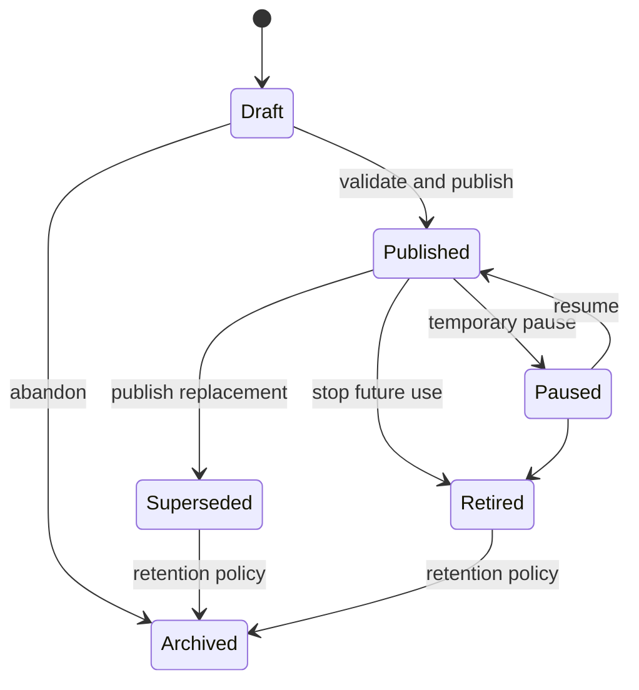

# Service Catalog Domain

- **Domain prefix:** `SERV`
- **Status:** In progress
- **MVP priority:** P0
- **Primary experience:** Business Portal with customer-facing projections

## Purpose

The Service Catalog Domain defines what a pet-care business offers. It provides configurable boarding, daycare, grooming, assessment, and add-on definitions that other domains use consistently.

The catalog describes a service's identity and operational shape. Pricing owns monetary calculation, Capacity owns availability, Pet owns eligibility decisions, Booking owns transactions, and Operations owns service execution.

## Goals

- Let a business configure services without code changes.
- Support boarding, daycare, grooming, and combined purchases through one model.
- Preserve service history when definitions change.
- Expose clear, customer-safe descriptions and booking expectations.
- Declare resource, staffing, scheduling, eligibility, and intake needs for downstream domains.
- Keep the model extensible for training, pet sitting, and dog walking later without expanding MVP scope.

## Core concepts

| Concept                 | Definition                                                                                  |
| ----------------------- | ------------------------------------------------------------------------------------------- |
| Category                | Stable platform grouping such as boarding, daycare, grooming, assessment, or add-on.        |
| Service                 | A business-defined offering customers may request or staff may add.                         |
| Service version         | Immutable effective version of a service definition.                                        |
| Variant                 | A purchasable option sharing a service identity, such as half-day/full-day or kennel/suite. |
| Add-on                  | A service attachable to another service under compatibility rules.                          |
| Requirement declaration | A reference indicating which eligibility or document rules apply.                           |
| Resource requirement    | A declaration of resource type, quantity, timing, and whether assignment is required.       |
| Staff requirement       | Skill/role, duration, quantity, and assignment timing needed to perform the service.        |
| Booking policy          | How the service may be requested, approved, modified, or cancelled.                         |

## Domain boundaries

### Owns

- Platform service categories
- Business-defined services, variants, and add-ons
- Customer-facing and internal service content
- Duration and time-model declarations
- Booking-channel and approval declarations
- Resource and staff requirement declarations
- Service compatibility and attachment rules
- Required intake questions and instructions
- Service versioning, effective dates, status, and display order

### Does not own

- Prices, discounts, deposits, taxes, or monetary totals
- Actual availability, resource allocation, or employee schedules
- Pet compliance evidence or eligibility outcome
- Booking, invoice, payment, or operational service instance
- Website page layout beyond catalog content projection

## Functional requirements

### Catalog administration

| ID          | Priority | Requirement                                                                                                                  | Status   |
| ----------- | -------: | ---------------------------------------------------------------------------------------------------------------------------- | -------- |
| SERV-FR-001 |       P0 | Authorized users shall create a service under a supported category.                                                          | Accepted |
| SERV-FR-002 |       P0 | A service shall have an internal name, customer-facing name, short description, full description, status, and display order. | Accepted |
| SERV-FR-003 |       P0 | A service shall be enabled independently by location.                                                                        | Accepted |
| SERV-FR-004 |       P0 | A service shall support draft, active, paused, retired, and archived states.                                                 | Accepted |
| SERV-FR-005 |       P0 | Authorized users shall duplicate an existing service as a new draft without sharing mutable configuration.                   | Accepted |
| SERV-FR-006 |       P0 | Service changes affecting future behavior shall create an effective version rather than rewriting historical meaning.        | Accepted |
| SERV-FR-007 |       P0 | The catalog shall preserve retired services for historical bookings and reporting.                                           | Accepted |
| SERV-FR-008 |       P1 | Businesses shall organize customer-visible services into configurable collections.                                           | Proposed |

### Service shape and scheduling declarations

| ID          | Priority | Requirement                                                                                                                     | Status   |
| ----------- | -------: | ------------------------------------------------------------------------------------------------------------------------------- | -------- |
| SERV-FR-009 |       P0 | A service shall declare a time model: overnight/date range, attendance day, fixed appointment, flexible appointment, or add-on. | Accepted |
| SERV-FR-010 |       P0 | Appointment services shall declare default duration, allowed duration adjustments, and before/after buffers when applicable.    | Accepted |
| SERV-FR-011 |       P0 | Date-range services shall declare charge/occupancy boundaries without owning price calculation.                                 | Accepted |
| SERV-FR-012 |       P0 | Attendance services shall declare full-day, partial-day, or configured session behavior.                                        | Accepted |
| SERV-FR-013 |       P0 | A service shall declare applicable booking, arrival, departure, or appointment windows by reference.                            | Accepted |
| SERV-FR-014 |       P0 | A service shall declare whether recurring requests are allowed and which recurrence patterns Booking may offer.                 | Accepted |
| SERV-FR-015 |       P1 | A service shall support lead-time, horizon, and same-day booking declarations consumed by Booking.                              | Proposed |

### Variants and add-ons

| ID          | Priority | Requirement                                                                                                                   | Status   |
| ----------- | -------: | ----------------------------------------------------------------------------------------------------------------------------- | -------- |
| SERV-FR-016 |       P0 | A service may define one or more customer-selectable variants.                                                                | Accepted |
| SERV-FR-017 |       P0 | Each variant shall have a stable identifier, label, status, and operational differences.                                      | Accepted |
| SERV-FR-018 |       P0 | A service or variant may declare compatible, required, mutually exclusive, and prohibited add-ons.                            | Accepted |
| SERV-FR-019 |       P0 | Add-ons shall declare whether they apply per booking, per pet, per day, per night, or per occurrence.                         | Accepted |
| SERV-FR-020 |       P0 | The system shall prevent circular add-on dependencies.                                                                        | Accepted |
| SERV-FR-021 |       P0 | Add-on availability may depend on location, parent service, timing, pet, resource, or staff constraints evaluated downstream. | Accepted |
| SERV-FR-022 |       P1 | Staff-only add-ons shall be hidden from customers while remaining available to authorized employees.                          | Proposed |

### Resource and staffing declarations

| ID          | Priority | Requirement                                                                                                                                | Status   |
| ----------- | -------: | ------------------------------------------------------------------------------------------------------------------------------------------ | -------- |
| SERV-FR-023 |       P0 | A service shall declare required resource types, quantity, timing, and whether assignment occurs before confirmation or during operations. | Accepted |
| SERV-FR-024 |       P0 | A service shall declare required staff roles or skills and expected effort/duration.                                                       | Accepted |
| SERV-FR-025 |       P0 | Boarding variants shall support housing-type requirements.                                                                                 | Accepted |
| SERV-FR-026 |       P0 | Daycare services shall support attendance-capacity and play-area declarations.                                                             | Accepted |
| SERV-FR-027 |       P0 | Grooming services shall support groomer and station/equipment declarations.                                                                | Accepted |
| SERV-FR-028 |       P0 | Resource declarations shall identify whether customer preference is allowed and whether it is guaranteed.                                  | Accepted |
| SERV-FR-029 |       P1 | Service definitions shall support configurable operational task templates by reference.                                                    | Proposed |

### Eligibility, intake, and policy declarations

| ID          | Priority | Requirement                                                                                                                            | Status   |
| ----------- | -------: | -------------------------------------------------------------------------------------------------------------------------------------- | -------- |
| SERV-FR-030 |       P0 | A service shall reference applicable vaccination, age, alteration, evaluation, health, behavior, and document requirement policies.    | Accepted |
| SERV-FR-031 |       P0 | A service shall declare required intake questions and whether answers apply per customer, pet, or booking.                             | Accepted |
| SERV-FR-032 |       P0 | Intake questions shall support text, choice, boolean, number, date, acknowledgement, and secure file response types.                   | Accepted |
| SERV-FR-033 |       P0 | Required waivers, cancellation policies, and deposit policies shall be linked by versioned reference.                                  | Accepted |
| SERV-FR-034 |       P0 | A service shall declare whether eligibility is evaluated before availability, before confirmation, at check-in, or at multiple stages. | Accepted |
| SERV-FR-035 |       P0 | Staff shall see internal preparation and care instructions that are separate from customer-facing content.                             | Accepted |

### Booking and publication behavior

| ID          | Priority | Requirement                                                                                                                            | Status   |
| ----------- | -------: | -------------------------------------------------------------------------------------------------------------------------------------- | -------- |
| SERV-FR-036 |       P0 | A service shall be enabled independently for public website, customer portal, staff entry, and API channels.                           | Accepted |
| SERV-FR-037 |       P0 | A service shall declare instant confirmation, staff approval, or request-only behavior.                                                | Accepted |
| SERV-FR-038 |       P0 | A service shall declare whether multiple pets may be included and whether each pet requires a separate service item.                   | Accepted |
| SERV-FR-039 |       P0 | A service shall declare allowed combinations with other primary services in the same booking.                                          | Accepted |
| SERV-FR-040 |       P0 | Customer-visible catalog output shall include only published, active, location-enabled, channel-enabled services.                      | Accepted |
| SERV-FR-041 |       P0 | The customer-facing projection shall expose clear duration, arrival/appointment expectations, prerequisites, and cancellation summary. | Accepted |
| SERV-FR-042 |       P1 | Services shall support scheduled publication and retirement.                                                                           | Proposed |

## Category profiles

### Boarding

Boarding uses a date-range time model and normally requires housing capacity. A business may offer variants such as standard kennel, large kennel, private suite, or luxury suite. The catalog declares the housing need and service expectations; Capacity assigns actual inventory and Pricing calculates the charge.

Common add-ons include private play, extra walks, medication administration, photo packages, baths, nail trims, or departure grooming.

### Daycare

Daycare uses an attendance-day or configured-session model. It normally consumes location attendance capacity and may require a valid evaluation or playgroup approval. Full-day and half-day may be variants or separate services, depending on operational differences.

Recurring eligibility is declared here; recurring booking instances are owned by Booking.

### Grooming

Grooming uses an appointment model with duration, buffer, staff-skill, and station requirements. Services may include bath, full groom, puppy groom, deshedding, nail service, teeth brushing, or specialty treatment.

Breed, size, coat, and condition may influence duration or pricing downstream but must not be represented by hidden catalog duplication unless operationally necessary.

### Assessment

Assessments include daycare evaluations, meet-and-greets, and grooming consultations. They may produce a Pet-domain evaluation result but do not own the result.

## Business rules

| ID          | Priority | Rule                                                                                                                                    |
| ----------- | -------: | --------------------------------------------------------------------------------------------------------------------------------------- |
| SERV-BR-001 |       P0 | Every service belongs to one business tenant and at least one supported platform category.                                              |
| SERV-BR-002 |       P0 | A service must have an active effective version before it can be published or booked.                                                   |
| SERV-BR-003 |       P0 | A service cannot be customer-visible at a location unless the category and service are enabled there.                                   |
| SERV-BR-004 |       P0 | Historical booking items retain service name, description, duration, requirements, and policy references from their confirmed version.  |
| SERV-BR-005 |       P0 | Retiring or archiving a service cannot alter historical bookings or active stays.                                                       |
| SERV-BR-006 |       P0 | A service version with confirmed future bookings cannot be destructively edited.                                                        |
| SERV-BR-007 |       P0 | Price must never be stored as an authoritative mutable field on the catalog service.                                                    |
| SERV-BR-008 |       P0 | Resource and staff declarations describe needs; they do not prove availability.                                                         |
| SERV-BR-009 |       P0 | Requirement references describe applicable rules; Pet determines the actual eligibility outcome.                                        |
| SERV-BR-010 |       P0 | A customer cannot select an add-on without a compatible parent service unless the add-on is explicitly standalone.                      |
| SERV-BR-011 |       P0 | Staff approval cannot bypass non-overrideable safety or eligibility rules.                                                              |
| SERV-BR-012 |       P0 | Customer-visible content must not expose internal preparation, risk, margin, or staff notes.                                            |
| SERV-BR-013 |       P0 | At least one permitted channel is required for an active service.                                                                       |
| SERV-BR-014 |       P1 | Variant use is reserved for choices sharing one customer-recognizable service; substantially different workflows use separate services. |

## Version lifecycle

The service identity remains stable across versions. Confirmed booking items reference the exact effective version.

## Key workflows

### Create and publish a boarding service

1. Manager chooses Boarding and starts a draft.
2. Manager enters customer and internal content.
3. Manager selects date-range model and housing requirement.
4. Manager adds location enablement, variants, add-ons, intake, requirements, and channel behavior.
5. Pricing, resource, requirement, and policy references are validated.
6. A preview shows customer-facing output.
7. Readiness checks block incomplete or conflicting configuration.
8. The service version is published and downstream projections refresh.

### Modify an active grooming service

1. Manager creates a draft from the current published version.
2. Duration, buffers, add-ons, or content are changed.
3. The system identifies future bookings affected by material differences.
4. Manager chooses an effective date and reviews impact.
5. The new version publishes; existing confirmed items retain their snapshots unless explicitly rebooked.

### Retire a daycare service

1. Manager requests retirement and date.
2. The system lists future bookings, recurrence templates, packages, and website links.
3. Retirement is blocked or requires an explicit migration plan when dependencies remain.
4. After retirement, new selection stops while history remains readable.

## Permissions

| Capability                    | Owner |    Manager     |    Front desk    |       Care staff       |    Customer    |   Platform support   |
| ----------------------------- | :---: | :------------: | :--------------: | :--------------------: | :------------: | :------------------: |
| View active catalog           |  Yes  |      Yes       |       Yes        |        Relevant        | Published only | Limited support view |
| Create/edit drafts            |  Yes  | Yes if granted |        No        |           No           |       No       |          No          |
| Publish/pause/retire          |  Yes  |  Configurable  |        No        |           No           |       No       |          No          |
| Edit internal instructions    |  Yes  |      Yes       |        No        | Configurable proposals |       No       |          No          |
| Manage requirements/resources |  Yes  |      Yes       |        No        |           No           |       No       |          No          |
| View version history          |  Yes  |      Yes       | Permission based |           No           |       No       | Limited support view |

## Core entities

| Entity                      | Purpose                                                      |
| --------------------------- | ------------------------------------------------------------ |
| ServiceCategory             | Stable platform grouping and supported behavior profile      |
| Service                     | Stable business-owned service identity                       |
| ServiceVersion              | Immutable effective definition and publication state         |
| ServiceLocation             | Location enablement and local overrides                      |
| ServiceVariant              | Customer/staff selectable operational option                 |
| ServiceChannel              | Public, portal, staff, or API availability                   |
| ServiceCompatibilityRule    | Primary-service combination and exclusion rules              |
| ServiceAddOnRule            | Parent/add-on compatibility, scope, requirement, and limits  |
| ServiceResourceRequirement  | Resource type, quantity, timing, and assignment rule         |
| ServiceStaffRequirement     | Role/skill, quantity, effort, and assignment rule            |
| ServiceRequirementReference | Pet/document/evaluation policy reference                     |
| ServicePolicyReference      | Deposit, cancellation, waiver, or booking policy reference   |
| ServiceIntakeQuestion       | Versioned question, response type, audience, and requirement |
| ServiceContent              | Customer-facing and internal content by locale/audience      |
| CatalogCollection           | Optional customer-facing service grouping                    |

Detailed schemas and migrations will be produced immediately before implementation.

## Domain events

- `service.created`
- `service.version.published`
- `service.version.superseded`
- `service.paused`
- `service.resumed`
- `service.retired`
- `service.location.enabled`
- `service.location.disabled`
- `service.variant.changed`
- `service.addon_rules.changed`
- `service.requirements.changed`
- `service.channels.changed`

Events include `business_id`, affected locations, service and version identifiers, actor, event version, effective time, and change classification.

## Non-functional requirements

| ID           | Priority | Requirement                                                                                                                    |
| ------------ | -------: | ------------------------------------------------------------------------------------------------------------------------------ |
| SERV-NFR-001 |       P0 | Catalog reads shall enforce tenant and publication/channel scope.                                                              |
| SERV-NFR-002 |       P0 | Published service versions and historical references shall be immutable.                                                       |
| SERV-NFR-003 |       P0 | Publication validation shall identify every blocking dependency with actionable guidance.                                      |
| SERV-NFR-004 |       P0 | Customer-visible catalog queries shall respond quickly enough for interactive browsing and booking.                            |
| SERV-NFR-005 |       P0 | Catalog changes affecting bookings or safety requirements shall be audited.                                                    |
| SERV-NFR-006 |       P0 | Customer-facing catalog content and administration interfaces shall meet WCAG 2.2 AA targets.                                  |
| SERV-NFR-007 |       P1 | Catalog projections shall support caching without showing stale retired or paused services beyond a short controlled interval. |

## Acceptance scenarios

| ID          | Covers          | Scenario                                                                                                                              |
| ----------- | --------------- | ------------------------------------------------------------------------------------------------------------------------------------- |
| SERV-AT-001 | SERV-FR-001–008 | A manager creates, previews, publishes, pauses, resumes, and retires a service while history remains intact.                          |
| SERV-AT-002 | SERV-FR-009–015 | Boarding, daycare, and grooming each expose correct date/session/appointment behavior.                                                |
| SERV-AT-003 | SERV-FR-016–022 | A customer selects a compatible per-pet add-on; incompatible and circular combinations are rejected.                                  |
| SERV-AT-004 | SERV-FR-023–029 | Each service produces correct resource and staff requirement declarations without claiming availability.                              |
| SERV-AT-005 | SERV-FR-030–035 | Grooming intake, daycare evaluation, vaccines, waivers, and internal instructions reach the correct downstream domains and audiences. |
| SERV-AT-006 | SERV-FR-036–042 | A staff-only service remains hidden online while a published portal service appears with correct prerequisites.                       |
| SERV-AT-007 | SERV-BR-004–006 | Publishing a changed version leaves a confirmed future booking on its original service snapshot.                                      |
| SERV-AT-008 | SERV-BR-007–009 | Catalog output contains references and requirements but no authoritative price, availability, or eligibility decision.                |
| SERV-AT-009 | SERV-BR-010–013 | Channel, add-on, approval, and customer/internal visibility rules are enforced.                                                       |
| SERV-AT-010 | SERV-NFR-001    | Direct catalog requests cannot expose another tenant's drafts, services, internal content, or versions.                               |

## Metrics

- Active services by category and location
- Online-bookable versus staff-only services
- Draft-to-publication completion time
- Publication validation failure reasons
- Service and add-on selection rates
- Retirement impact count
- Booking conversion by service/version/channel
- Services with incomplete dependencies
- Customer drop-off after prerequisite display

## Open decisions

1. Whether half-day/full-day daycare defaults to variants or separate services.
2. Whether boarding housing classes are variants, resources, or both in the initial UX.
3. Which service changes require explicit impact review for future bookings.
4. Whether localized catalog content is MVP, P1, or only structurally supported.
5. How much task-template configuration belongs here versus Operations.
6. Whether scheduled publication is required for the first pilot.
7. Whether combined boarding-plus-grooming is represented by multiple booking items or a catalog bundle; the preferred default is multiple items.

## Dependencies

- Business Configuration for locations, categories, hours, and publication readiness
- Pet and Eligibility for actual compliance decisions
- Resource and Capacity for availability and assignment
- Pricing and Policies for money, deposits, and cancellation calculations
- Booking and Waitlist for requests and transactions
- Operations for task generation and execution
- Website and Content for customer presentation
- Reporting for service/version performance

## Implemented foundation

The initial E05 slice is implemented by `20260717002200_service_catalog_foundation.sql` and the staff route at `/app/settings/services`. It provides stable tenant-owned services, immutable published versions, explicit scheduling and confirmation semantics, location/channel enablement, dedicated view/manage permissions, audited lifecycle actions, and tenant-isolation coverage in `022_service_catalog_foundation.test.sql`. Pricing, requirements, booking questions, resource declarations, and availability remain deliberately outside this slice and will attach to the published version identity in later E05 milestones.
