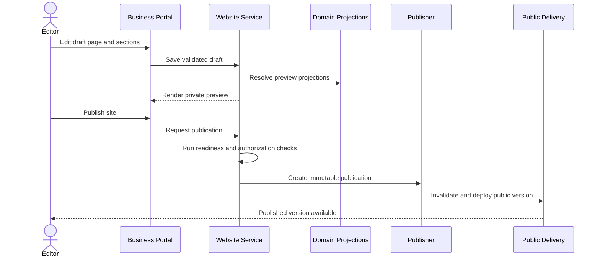
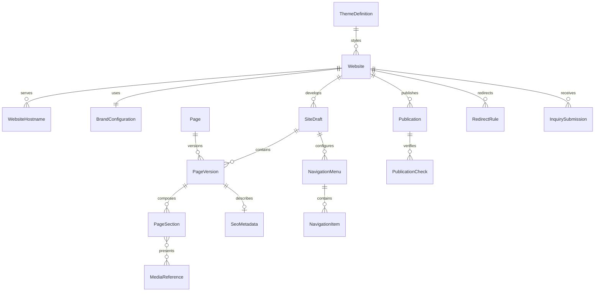

# Website and Content Domain Specification

- **Domain prefix:** `WEB`
- **Status:** In progress
- **MVP priority:** P0/P1
- **Primary experiences:** Public website and Business Portal

## Purpose

The Website and Content domain gives each pet-care business a polished, light-themed public website that feels continuous with booking and the customer portal. Authorized business users select a supported theme, apply their brand, manage structured pages, preview changes, and publish without writing code.

The MVP is a governed template and content system. AI does not generate the customer's website. AI may assist with copy in a later phase, but publishing remains an explicit human action.

## Product outcomes

- A business can launch a credible website and online booking entry point during onboarding.
- Visitors can understand services, requirements, policies, location details, and how to book.
- Moving from the public site into booking or the customer portal feels like one product.
- Operational data appears consistently without duplicating mutable service, price, or hours data inside page content.
- Draft changes cannot accidentally alter the live site.
- Every published site is responsive, accessible, secure, indexable where appropriate, and performant.

## Scope

### MVP

- One public website per tenant with one or more location pages
- Supported responsive theme presets with a light customer-facing background
- Business logo, colors, typography selection, images, contact information, and social links
- Structured Home, About, Services, Pricing, Requirements, FAQ, Policies, Contact, and Book Now experiences
- Configurable navigation and footer
- Reusable approved content sections
- Service, location, hours, and selected pricing projections from source domains
- Draft, preview, publish, unpublish, and version history
- Platform subdomain and custom-domain connection workflow
- SEO titles, descriptions, canonical URLs, sitemap, robots controls, and social preview metadata
- Responsive media upload, validation, optimization, and accessibility text
- Booking and customer-portal handoff preserving tenant, location, service, and campaign context
- Public inquiry form with consent and abuse protection
- Publishing readiness checks and audit history

### Post-MVP

- Additional themes and advanced layout controls
- Blog and scheduled article publishing
- Campaign landing pages
- Multi-language content and localized URLs
- AI-assisted copy suggestions with review and approval
- Reusable cross-location content libraries
- Structured job postings, gift cards, referrals, reviews, and promotional content
- Controlled custom CSS for advanced plans
- Redirect-management UI and deeper SEO auditing
- A/B tests and personalization

### Out of scope

- Free-form HTML or JavaScript injection
- Fully unconstrained drag-and-drop page design
- AI publishing content without explicit approval
- Website hosting outside the platform in the MVP
- Domain registration or domain ownership transfer
- Editing operational source data from a page editor
- Full marketing automation

## Domain boundaries

### Owns

- Website identity, status, theme selection, and public hostname bindings
- Page definitions, slugs, navigation, footer, and structured page composition
- Tenant-authored marketing copy and content versions
- Draft, preview, publication, rollback, and redirect records
- Public SEO and social-sharing metadata
- Public media usage and presentation metadata
- Site-level booking links and inquiry forms
- Public publishing readiness and audit events

### Does not own

- Legal business identity, location identity, hours, or closures
- Service definitions or customer-safe service descriptions
- Price calculations, discounts, fees, deposits, or taxes
- Availability and resource capacity
- Booking or customer authentication sessions
- Customer communication preferences after an inquiry becomes a customer record
- Stored media binaries and processing infrastructure
- Payment, invoice, or receipt data

## Authoritative content rules

| Public content | Source of truth | Website behavior |
|---|---|---|
| Business name, contact, locations | Business Configuration | Render approved public projection |
| Hours, closures, arrival instructions | Business Configuration | Render effective location projection |
| Services and add-ons | Service Catalog | Render active, customer-visible versions |
| Starting prices or price ranges | Pricing and Policies | Render approved public display projection; never recalculate |
| Vaccine and document requirements | Business Configuration / Pet Eligibility | Render current customer-facing requirement summary |
| Availability | Resource and Capacity / Booking | Query only during availability search; do not publish static claims |
| Tenant-authored About, FAQ, and marketing copy | Website and Content | Store as versioned content |
| Policy full text and acceptance version | Owning policy/waiver domain | Link or project the active customer-facing version |

An authorized source projection may be hidden or reordered through website settings, but it is not copied into freely editable text. This prevents public content from drifting away from bookable reality.

## Personas

| Persona | Need |
|---|---|
| Visitor | Understand the business, services, requirements, and next step quickly. |
| Customer | Move between site, booking, sign-in, and portal without losing context. |
| Business owner | Launch and brand the website without a developer. |
| Marketing manager | Edit content, SEO, navigation, and imagery safely. |
| Location manager | Maintain authorized location-specific public content. |
| Platform support | Diagnose domain and publishing problems through audited, time-bound access. |

## Site lifecycle

```text
Not configured
    -> Draft
    -> Ready for preview
    -> Ready to publish
    -> Published
    -> Unpublished
    -> Archived
```

Publishing creates an immutable publication version. Editors continue working in a new draft while the current published version remains live. Rollback republishes a prior valid version as a new publication event rather than deleting history.

## Page model

### Required system routes

| Route purpose | MVP behavior |
|---|---|
| Home | Brand promise, primary services, trust content, locations, and booking CTA |
| Services | Active customer-visible service collections and details |
| Pricing | Approved public price display with policy and final-price disclaimers |
| Requirements | Vaccine, document, eligibility, and arrival preparation summaries |
| Contact | Location contact details, hours, map link, and protected inquiry form |
| Book | Stable entry into the tenant-aware booking flow |
| Sign in / Portal | Stable entry into tenant-aware authentication and customer portal |
| Privacy / Terms / Accessibility | Platform and tenant legal content as configured |
| Not found | Branded recovery page with safe navigation and booking link |

About, FAQ, Gallery, and Policies are recommended and can be enabled when valid content exists.

### Approved section types

- Hero with heading, supporting text, media, and CTA
- Rich text with restricted semantic formatting
- Service collection and service cards
- Location summary and location details
- Hours and closure notice
- Price summary
- Requirements summary
- FAQ accordion
- Image gallery
- Testimonial or review quote with provenance fields
- Trust badges and certifications
- Call-to-action banner
- Contact details, map link, and inquiry form
- Policy link collection

Each section type has a controlled schema, accessibility rules, responsive behavior, and allowed placement. Arbitrary script execution is prohibited.

## Theme and branding

The MVP provides a small set of high-quality themes rather than a blank canvas. Themes share the platform design system and booking components while varying presentation.

Configurable tokens include:

- Primary and secondary brand colors
- Accent and link colors within contrast limits
- Approved heading and body font pairing
- Logo, icon, and social-sharing image
- Border radius and restrained visual-density preference
- Button treatment and image style where supported by the theme

Customer-facing surfaces use a light background by default. A tenant may not select combinations that fail contrast or make critical controls unclear. Staff and business portal themes are separate from the public brand.

## Navigation and URL rules

- Required legal and booking routes cannot be removed, though approved labels may vary.
- Navigation depth is limited to keep mobile use understandable.
- Every published page has one canonical, tenant-scoped URL.
- Slugs are unique within a site, lowercase-normalized, and reserved routes cannot be claimed.
- Changing a published slug requires a redirect from the prior URL.
- External links are visibly distinguishable and use safe browser behavior.
- Custom domains redirect to one canonical hostname to avoid duplicate indexing.
- Query parameters do not create arbitrary indexable page variants.

## Booking and portal continuity

The public site, booking flow, and portal use the same tenant identity and approved brand tokens. A booking CTA may carry:

- Tenant and public-site identity
- Selected location
- Selected service or category
- Permitted campaign parameters
- Safe return URL

The booking domain revalidates service status, eligibility, pricing, and availability. Website content never guarantees a slot or final price. Authentication handoff must prevent open redirects, tenant switching, and untrusted parameter injection.

## Custom domains

### Domain states

```text
Requested -> Verification pending -> Verified -> Certificate provisioning
          -> Active -> Degraded -> Disconnected
```

### Rules

- The platform proves domain control before serving tenant content.
- TLS is mandatory; plain HTTP redirects to HTTPS.
- A hostname can belong to only one active tenant binding.
- Certificate status, DNS guidance, and last verification result are visible to authorized users.
- The platform subdomain remains available as a recovery path unless policy disables it.
- Removing a custom domain does not delete site content.
- Domain verification tokens are secrets and are not exposed to public page content.

## Content authoring and publication

### Editing flow



### Readiness checks

- Active business and at least one public active location
- Valid brand name and accessible logo alternative
- Required pages and legal links present
- Book link resolves to an enabled booking channel or clearly indicates request-only behavior
- No broken internal links or missing required media
- No duplicate slugs
- SEO title and description for the homepage
- Published service and hours projections are available
- Contact destination is configured
- Custom domain is verified when chosen as canonical

Warnings may allow publishing; blocking failures may not. The result identifies the owner and corrective action for each issue.

## Functional requirements

### Site administration

| ID | Priority | Requirement | Status |
|---|---:|---|---|
| WEB-FR-001 | P0 | The system shall provision a draft public site for a configured tenant. | Accepted |
| WEB-FR-002 | P0 | Authorized users shall select a supported responsive theme and configure allowed brand tokens. | Accepted |
| WEB-FR-003 | P0 | Authorized users shall create, edit, order, hide, and archive supported pages and sections. | Accepted |
| WEB-FR-004 | P0 | The editor shall validate section content against its controlled schema before saving. | Accepted |
| WEB-FR-005 | P0 | Users shall privately preview the draft at desktop, tablet, and mobile widths before publication. | Accepted |
| WEB-FR-006 | P0 | Publishing shall create an immutable publication version without exposing subsequent draft changes. | Accepted |
| WEB-FR-007 | P0 | Authorized users shall unpublish a site and roll back to a prior valid publication. | Accepted |
| WEB-FR-008 | P0 | Publication shall run readiness checks and block critical security, booking, legal, or content failures. | Accepted |
| WEB-FR-009 | P1 | Multiple authorized editors shall receive conflict protection when editing the same draft. | Proposed |

### Public experience

| ID | Priority | Requirement | Status |
|---|---:|---|---|
| WEB-FR-010 | P0 | Public pages shall render only the current published site version for the resolved tenant hostname. | Accepted |
| WEB-FR-011 | P0 | Active services, locations, hours, requirements, and approved price displays shall come from authoritative public projections. | Accepted |
| WEB-FR-012 | P0 | Book and sign-in links shall preserve valid tenant and optional location or service context. | Accepted |
| WEB-FR-013 | P0 | The site shall provide usable responsive navigation, footer navigation, focus handling, and keyboard access. | Accepted |
| WEB-FR-014 | P0 | The site shall provide a protected inquiry form with field validation, consent disclosure, abuse controls, and delivery confirmation. | Accepted |
| WEB-FR-015 | P0 | Public sites shall support platform subdomains and verified custom domains over HTTPS. | Accepted |
| WEB-FR-016 | P0 | The platform shall show a branded safe fallback when a published site or dependent projection is temporarily unavailable. | Accepted |

### SEO and media

| ID | Priority | Requirement | Status |
|---|---:|---|---|
| WEB-FR-017 | P0 | Editors shall configure page title, description, social image, and indexability within platform rules. | Accepted |
| WEB-FR-018 | P0 | The system shall generate canonical URLs, sitemap entries, robots directives, and structured metadata for eligible published pages. | Accepted |
| WEB-FR-019 | P0 | Media uploads shall validate type and size, remove unsafe metadata where required, create optimized renditions, and require alternative text unless decorative. | Accepted |
| WEB-FR-020 | P1 | Slug changes shall create managed redirects and detect redirect loops. | Proposed |
| WEB-FR-021 | P1 | Editors shall see broken-link, missing-alt-text, and incomplete-metadata warnings before publishing. | Proposed |

## Business rules

| ID | Priority | Rule |
|---|---:|---|
| WEB-BR-001 | P0 | Draft content is never publicly visible without a successful publication event. |
| WEB-BR-002 | P0 | A public hostname resolves to exactly one tenant before tenant content is loaded. |
| WEB-BR-003 | P0 | Source-owned operational content cannot be overridden by duplicating it in a website section. |
| WEB-BR-004 | P0 | Website price content may display only the Pricing domain's approved public projection and cannot imply that a starting price is a final quote. |
| WEB-BR-005 | P0 | Booking links must target the resolved tenant and be revalidated by Booking. |
| WEB-BR-006 | P0 | Sanitization occurs when content is stored and output encoding occurs when it is rendered. |
| WEB-BR-007 | P0 | Uploaded media is unavailable publicly until validation and processing succeed. |
| WEB-BR-008 | P0 | A site cannot publish when its canonical custom domain is unverified or lacks a valid certificate. |
| WEB-BR-009 | P0 | Unpublishing a site does not cancel bookings or disable the customer portal. |
| WEB-BR-010 | P1 | Rollback creates a new publication record referencing the prior content version; it does not erase intervening history. |
| WEB-BR-011 | P1 | Reviews or testimonials require source, permission, display status, and optional expiration metadata. |
| WEB-BR-012 | P1 | Site-wide announcement banners require start/end times interpreted in the applicable location time zone. |

## Permissions

| Capability | Owner | Marketing editor | Location manager | Staff | Platform support |
|---|:---:|:---:|:---:|:---:|:---:|
| Configure theme and brand | Yes | Configurable | No | No | Time-bound support |
| Edit tenant pages | Yes | Yes | Configurable | No | Time-bound support |
| Edit location content | Yes | Yes | Assigned locations | No | Time-bound support |
| Preview drafts | Yes | Yes | Assigned scope | No | Time-bound support |
| Publish or rollback | Yes | Configurable | No | No | Disabled by default |
| Configure custom domain | Yes | Configurable | No | No | Diagnose only |
| View publication audit | Yes | Yes | Assigned scope | No | Time-bound support |

Publishing, rollback, domain changes, legal-link changes, and support access are audited.

## Conceptual data model

- `Website`
- `WebsiteHostname`
- `ThemeDefinition`
- `BrandConfiguration`
- `SiteDraft`
- `Page`
- `PageVersion`
- `PageSection`
- `NavigationMenu`
- `NavigationItem`
- `SeoMetadata`
- `MediaReference`
- `RedirectRule`
- `Publication`
- `PublicationCheck`
- `InquirySubmission`



## Security and privacy

- Resolve tenant from a normalized trusted hostname; never trust a client-supplied tenant ID alone.
- Sanitize authored content and prohibit scripts, event handlers, unsafe URLs, and unapproved embeds.
- Use content-security policy, secure headers, anti-clickjacking controls, and strict transport security.
- Apply rate limits, bot detection, spam controls, and CSRF protection to inquiry forms.
- Scan uploads and serve processed media from isolated origins or safe content types.
- Avoid exposing internal service notes, eligibility logic, unpublished prices, customer data, or storage paths.
- Inquiry data follows consent, retention, access, and deletion policies and must not automatically grant marketing consent.
- Preview URLs are authenticated, short-lived or revocable, non-indexable, and tenant-scoped.

## Accessibility requirements

- Meet WCAG 2.2 AA for platform themes and supported sections.
- Preserve semantic heading order and landmark structure.
- Provide visible keyboard focus and skip navigation.
- Require text alternatives for meaningful images and labels for inputs and icons.
- Do not use color as the only signal.
- Respect reduced-motion preferences.
- Ensure zoom and reflow work at supported mobile widths.
- Prevent tenant brand choices from lowering required contrast.
- Publish accessible validation errors and inquiry confirmation states.

## Performance and reliability

| ID | Priority | Requirement |
|---|---:|---|
| WEB-NFR-001 | P0 | Public pages shall target passing Core Web Vitals at the 75th percentile on representative mobile traffic. |
| WEB-NFR-002 | P0 | Public content shall be cacheable at the edge without allowing one tenant's content or host mapping to leak to another. |
| WEB-NFR-003 | P0 | Publication invalidation shall make the new version available within 60 seconds under normal conditions. |
| WEB-NFR-004 | P0 | A failed publication shall leave the previous published version intact. |
| WEB-NFR-005 | P0 | Responsive images shall use optimized formats, declared dimensions, and lazy loading when appropriate. |
| WEB-NFR-006 | P1 | Public-site availability shall be measured separately from business-portal and booking availability. |

The final performance budget will define JavaScript, image, font, layout-shift, and server-response limits per theme.

## SEO rules

- Only published canonical pages are indexable.
- Preview, draft, authentication, portal, booking-step, and internal-search routes are non-indexable.
- Location structured data is generated only from verified public business configuration.
- Service structured data must not advertise a price or availability claim that the source domains cannot support.
- Sitemap entries update after successful publication.
- Deleted or renamed pages follow the redirect or gone-content policy.
- Canonical tags prevent duplicate indexing across platform and custom hostnames.

## Inquiry workflow

```text
Visitor submits form
  -> validate and apply abuse controls
  -> record consent context and source page
  -> create tenant-scoped inquiry
  -> deliver to configured business destination
  -> show generic confirmation
  -> audit delivery outcome
```

The public response does not reveal whether a submitted email already belongs to a customer. Inquiry content is not treated as an authenticated customer instruction, booking, cancellation, or medical update.

## Domain events

Published events may include:

- `website.draft_created`
- `website.draft_updated`
- `website.readiness_failed`
- `website.published`
- `website.unpublished`
- `website.rolled_back`
- `website.hostname_verified`
- `website.hostname_activated`
- `website.hostname_degraded`
- `website.inquiry_received`
- `website.inquiry_delivery_failed`

Consumed events may include public projection changes for business configuration, location, service catalog, pricing display, and policy summaries. A projection update refreshes affected public content without rewriting the authored publication version.

## Acceptance scenarios

### WEB-AC-001: Draft isolation

**Given** a published site and an editor changing its homepage draft  
**When** a visitor opens the public homepage before publication  
**Then** the visitor sees the existing published version and none of the draft changes.

### WEB-AC-002: Source-owned service content

**Given** a service is paused in the Service Catalog  
**When** the public projection refreshes  
**Then** the service is no longer presented as bookable even if it appeared in the current page layout.

### WEB-AC-003: Seamless booking handoff

**Given** a visitor selects boarding at Location A  
**When** the visitor chooses Book Now  
**Then** the booking flow opens for the same tenant with permitted location and service context and revalidates availability and price.

### WEB-AC-004: Failed publication safety

**Given** a draft contains a blocking readiness error  
**When** an editor attempts to publish  
**Then** publication fails with corrective guidance and the prior published site remains unchanged.

### WEB-AC-005: Custom-domain isolation

**Given** a hostname is already active for Tenant A  
**When** Tenant B attempts to bind it  
**Then** activation is rejected without revealing Tenant A's private information.

### WEB-AC-006: Accessible branding

**Given** an editor chooses brand colors that fail required contrast  
**When** the editor saves or publishes  
**Then** the system substitutes or requires an accessible token combination and explains the issue.

### WEB-AC-007: Safe rich content

**Given** authored content contains script or unsafe-link markup  
**When** it is saved and rendered  
**Then** prohibited content is rejected or removed and cannot execute in the public page.

### WEB-AC-008: Inquiry is not a booking

**Given** a visitor submits a message asking to reserve dates  
**When** the inquiry is accepted  
**Then** it is recorded as an inquiry and the confirmation clearly states that no reservation was created.

### WEB-AC-009: Slug redirect

**Given** an editor changes a published page slug  
**When** the updated site publishes  
**Then** the former URL redirects to the new canonical URL without a loop.

### WEB-AC-010: Media processing failure

**Given** an image fails validation or processing  
**When** the editor attempts to publish a section requiring it  
**Then** the unsafe image is never public and the readiness result identifies the missing valid asset.

## MVP screen inventory

### Business Portal

- Website overview and publication status
- Theme and branding
- Pages and navigation
- Page editor with structured section panel
- Responsive preview
- SEO and social metadata
- Media library
- Domains and certificate status
- Redirects
- Publishing readiness and history
- Inquiry settings and inquiry list

### Public website

- Home
- About
- Services list and detail
- Pricing summary
- Requirements
- FAQ
- Gallery
- Policies
- Location and contact
- Book entry
- Legal pages
- Safe error and not-found pages

## Measurement

Initial website measures include:

- Published-site activation rate
- Time from tenant creation to first publication
- Public page availability and Core Web Vitals
- Book CTA selections and booking-flow starts
- Booking completion by public entry page and valid campaign source
- Inquiry submissions, delivery failures, and spam rejection rate
- Publish failures by readiness category
- Broken-link and missing-accessibility-content counts

Marketing attribution is limited to consented, documented parameters. Website analytics must not silently introduce cross-tenant tracking or unnecessary personal profiling.

## Open decisions

- Initial theme names and exact token controls
- Whether custom domains are P0 or plan-gated P1 at launch
- Supported map provider and privacy behavior
- Inquiry delivery destination and ownership before a CRM lead module exists
- Initial public price-display options: hidden, starting at, range, or exact catalog projection
- Review/testimonial verification and consent workflow
- Publication approval requirement for non-owner editors
- Media size limits and retention for unused assets
- Supported analytics provider or first-party event strategy
- Whether location pages live under one tenant site or can use location-specific hostnames later

## Related specifications

- [Business Configuration](../business-configuration/README.md)
- [Service Catalog](../service-catalog/README.md)
- [Resource and Capacity](../resource-capacity/README.md)
- [Booking and Waitlist](../booking-waitlist/README.md)
- [Pricing and Policies](../pricing-policies/README.md)
- [Communications](../communications/README.md)
- [Reporting](../reporting/README.md)

