# MVP Implementation Roadmap and Epic Sequence

Status: Authoritative delivery sequence; estimates require calibration after scaffolding  
Audience: Founder, product, engineering, design, quality, security, and implementation partners  
Delivery model: Solo-founder-led, AI-assisted development with production-quality gates

## 1. Purpose

This roadmap converts the PetCare product and domain specifications into an executable build sequence. It identifies what to build first, which dependencies must exist, what constitutes a usable vertical slice, and when the product is ready for internal testing, design partners, beta, and paid launch.

It is deliberately not a promise to build every documented capability before launch. The repository contains long-term architecture boundaries and future ideas; this roadmap is governed by the [MVP scope](mvp-scope.md).

## 2. MVP outcome

The MVP is successful when a real single-location boarding/daycare/grooming business can:

1. Create and configure its business.
2. Publish its core services, prices, requirements, policies, and capacity.
3. Invite staff with appropriate access.
4. Accept a valid customer booking and deposit online.
5. Prepare for arrival and safely check in the correct pet.
6. Record essential feeding, medication, notes, and service work.
7. Check out the pet, reconcile payment, and retain an auditable history.
8. Give the customer a consistent website and portal experience.
9. See basic booking, occupancy, and financial reporting.
10. Operate without relying on AI, native mobile apps, retail POS, or advanced marketing.

## 3. Delivery principles

### 3.1 Vertical slices over horizontal layers

Build a narrow journey through UI, domain logic, database, authorization, tests, audit, and operations. Avoid completing the entire database, all APIs, or every screen before a usable path exists.

### 3.2 One modular application first

Use the approved modular-monolith architecture. Do not create microservices, separate mobile backends, Kubernetes, or a dedicated data warehouse for MVP.

### 3.3 Safety and isolation from the first migration

Tenant ownership, row-level security, role checks, audit, idempotency, and safe errors are foundation work—not hardening to add after beta.

### 3.4 Configuration depth is earned

Support the configuration required by initial design partners. Do not build a general rules language or arbitrary custom-role designer before real usage proves the need.

### 3.5 Operable beats feature-rich

Every deployed slice needs logging, metrics, failure visibility, backup/recovery consideration, support behavior, and a controlled rollout path.

### 3.6 AI assists development, not acceptance

AI may draft code and tests, but accepted requirements, human review, real database behavior, browser journeys, and release gates determine completion.

## 4. Roadmap horizons

| Horizon | Meaning | Exit outcome |
|---|---|---|
| H0 Foundation | Repository and deployable skeleton | Secure application can deploy to nonproduction |
| H1 First booking | Business configuration through paid booking | One controlled customer booking succeeds end to end |
| H2 First stay/visit | Check-in through checkout | Staff can safely execute the service journey |
| H3 Design-partner alpha | Complete minimum business loop | Founder and selected businesses test realistic workflows |
| H4 Private beta | Hardened multi-tenant operation | Several businesses use isolated production tenants |
| H5 Paid MVP | Supported commercial launch | Billing, support, reliability, and core reporting are ready |
| H6 Post-MVP | Validated expansion | Deferred capabilities enter evidence-based planning |

## 5. Epic map

```mermaid
flowchart LR
    E00["E00 Repository and delivery foundation"] --> E01["E01 Application shell and design system"]
    E01 --> E02["E02 Tenant identity and access"]
    E02 --> E03["E03 Business onboarding and configuration"]
    E03 --> E04["E04 Customers, households, and pets"]
    E03 --> E05["E05 Services, resources, capacity, and eligibility"]
    E04 --> E06["E06 Pricing, policies, agreements, and quotes"]
    E05 --> E06
    E06 --> E07["E07 Booking, waitlist, and calendar"]
    E07 --> E08["E08 Invoices, payments, and transactional messages"]
    E08 --> E09["E09 Check-in and operational visit"]
    E09 --> E10["E10 Daily care and service execution"]
    E10 --> E11["E11 Checkout and final reconciliation"]
    E11 --> E12["E12 Customer portal and tenant website completion"]
    E12 --> E13["E13 Reporting and business dashboard"]
    E13 --> E14["E14 Platform operations and SaaS billing"]
    E14 --> E15["E15 Alpha, beta, and launch hardening"]
```



Some epics overlap after their contracts stabilize. The dependency order governs irreversible decisions; it does not require one large epic to finish before any work begins on the next.

## 6. E00 — Repository and delivery foundation

### Goal

Create a reproducible, testable, deployable codebase before business features accumulate.

### Scope

- Package/workspace structure for web app, shared UI, domain modules, database, and tests.
- Next.js, TypeScript, styling, validation, and test scaffolding.
- Environment configuration validation.
- Supabase development/test/staging project conventions.
- GitHub Actions for formatting, lint, type check, unit tests, build, secret scan, and migration checks.
- Preview and staging deployment.
- Structured logging, correlation IDs, safe error boundary, and health checks.
- Feature-flag foundation.
- Database migration and seed workflow.
- Dependency update and security policy.
- Basic developer setup documentation.

### Implementation artifacts created just in time

- Repository architecture decision.
- Environment variable catalog.
- CI workflow definition.
- Database role and migration conventions.
- Initial operational runbook.

### Exit criteria

- A clean checkout installs, validates, tests, and builds from documented commands.
- CI runs on pull requests and main.
- A minimal page deploys to preview and staging.
- Secrets are separated by environment and absent from client bundles/logs.
- An empty migration applies to disposable PostgreSQL.
- Automated test results and deployment identity are observable.

## 7. E01 — Application shell and design system

### Goal

Establish one consistent experience for public, customer, staff/business, and platform surfaces.

### Scope

- Design tokens, typography, spacing, color, focus, and responsive primitives.
- Core accessible components: buttons, fields, forms, dialogs, alerts, tables, tabs, navigation, cards, badges, uploads, and loading/error states.
- Public shell, customer shell, business/staff shell, and platform shell.
- Route namespaces and safe not-found/denied behavior.
- Tenant branding token boundary.
- Global error, empty, offline/degraded, and session states.
- Component documentation and accessibility examples.

### Exit criteria

- Shared components pass component, keyboard, and automated accessibility checks.
- Shells reflow at required widths and zoom.
- Tenant color validation prevents unsafe themes.
- Navigation can respond to permissions without becoming authorization.
- No feature team needs to invent foundational form, dialog, or status patterns.

## 8. E02 — Tenant identity and access

### Goal

Allow customers and business users to authenticate and receive only explicit tenant-scoped access.

### Scope

- Registration, email verification, sign-in, password reset, and sign-out.
- Identity profile and session handling.
- Business membership, predefined roles, and location scope.
- Staff invitations and acceptance.
- Customer access links.
- Owner protection and MFA requirement for privileged roles.
- Central authorization helpers and denial model.
- Tenant switch for multi-business identities.
- Audit events for access changes.
- Initial RLS patterns and two-tenant adversarial fixtures.

### Exit criteria

- Customer, staff, owner, and platform contexts remain distinct.
- Tenant A cannot read or mutate Tenant B data through database/API paths.
- Role/location changes affect subsequent authorization decisions.
- Invitations are purpose-bound, expiring, single-use, and auditable.
- Last-owner and sensitive-action protections work.
- Direct protected URLs fail safely without record enumeration.

## 9. E03 — Business onboarding and configuration

### Goal

A business owner can create a usable tenant without founder database edits.

### First vertical slice

```text
Create business
→ create first location
→ set time zone and contact details
→ set operating hours
→ invite one manager/front-desk user
→ see setup progress
```

### Scope

- Business and location profiles.
- Time zone, locale, contact, address, and operating hours.
- Closures and basic holidays.
- Arrival/pickup windows.
- Setup checklist and readiness blockers.
- Business/location state and archival rules.
- Initial staff invitation.
- Audit and support visibility.

### Deferred from this epic

- Complex organization hierarchies.
- Franchise-level inheritance.
- Arbitrary configuration rules engine.
- Full custom-domain and website publishing, completed in E12.

### Exit criteria

- A new tenant can reach a defined `Configuration ready for service setup` state.
- Incomplete or invalid time/location settings block dependent publication clearly.
- Retry does not create duplicate business/location records.
- Multi-tenant tests include provisioning and tenant switch.

## 10. E04 — Customers, households, and pets

### Goal

Create the people and pet records required for eligibility, booking, and safe care.

### Scope

- Customer creation by staff and customer self-registration.
- Household membership and primary contact.
- Contact details, addresses, communication preferences, and consent.
- Emergency contacts and authorized pickup relationships.
- Pet profile, photo, identifiers, breed/species, and lifecycle.
- Feeding, medication, allergy, medical, behavior, and handling information.
- Vaccination records and document upload.
- Duplicate detection and safe merge foundations.
- Tenant-scoped search and timeline.

### First vertical slice

```text
Customer registers
→ creates household
→ adds one dog
→ uploads vaccine evidence
→ staff verifies record
→ eligibility can consume the result
```

### Exit criteria

- Pet identity never relies on photo alone.
- Customer/household authority is distinct from emergency and pickup relationships.
- Sensitive pet and customer fields follow role/field policy.
- Document storage is private, tenant-scoped, scanned/validated as designed, and auditable.
- Corrections preserve history where safety requires it.

## 11. E05 — Services, resources, capacity, and eligibility

### Goal

A business can define what it sells and whether a requested pet/date can be accepted.

### Scope

- Boarding, daycare, grooming, assessment, and add-on service definitions.
- Versioned publication and retirement.
- Service schedule shape and booking questions.
- Capacity pools and basic individually assigned resources.
- Housing-unit types and resources.
- Hours, closures, and capacity overrides.
- Vaccine/document requirements and eligibility decisions.
- Availability calculation with holds and confirmed commitments.
- Staff-facing explanation of availability and blocks.

### Narrow MVP configuration

- Count-based boarding/daycare capacity plus optional housing units.
- Grooming capacity based on service duration and configured staff/resource availability.
- Explicit rules for multi-pet demand.
- No general optimization engine.

### Exit criteria

- Published service versions remain interpretable after edits.
- Availability produces deterministic reasons and never silently oversells.
- Concurrent requests for last capacity resolve safely.
- Holds expire and release idempotently.
- Tenant/location/service/date scope is tested at every layer.

## 12. E06 — Pricing, policies, agreements, and quotes

### Goal

Produce an explainable, immutable commercial offer for a valid booking request.

### Scope

- Base prices and approved charge units.
- Multi-pet and add-on pricing.
- Holiday/peak adjustments required by design partners.
- Basic discount/coupon support only if required for launch partners.
- Fees, tax input/integration boundary, tips if enabled.
- Deposit amount/timing rules.
- Cancellation and no-show policy outcomes.
- Versioned policies, agreements, and acceptance evidence.
- Quote calculation, expiration, recalculation, and immutable snapshot.
- Calculation trace for support and testing.

### Exit criteria

- Monetary calculations use approved precision and rounding.
- Quote totals reconcile to their components.
- A configuration change does not alter an existing confirmed snapshot.
- The customer sees full price and material policy consequences before commitment.
- Agreement acceptance identifies actor, version, scope, time, and evidence.

## 13. E07 — Booking, waitlist, and calendar

### Goal

Create the first complete booking commitment from customer or staff workflow.

### Scope

- Availability search and service/date selection.
- Customer and pet selection/creation handoff.
- Intake questions, eligibility, documents, add-ons, quote, policies, and review.
- Booking request, confirmation, modification, cancellation, and no-show foundations.
- Multi-pet bookings where configured.
- Capacity holds and commitments.
- Waitlist entry, staff review, offer/promotion, expiry, decline, and withdrawal.
- Staff day/week/agenda calendar.
- Booking detail timeline and safe concurrency.

### First-booking release slice

```text
Published boarding service
→ customer selects one pet and stay dates
→ eligibility and capacity pass
→ quote and deposit are shown
→ customer accepts policies
→ payment succeeds
→ booking confirms
→ capacity commits
→ confirmation is queued
```

### Exit criteria

- The critical booking journey passes in supported browsers and at required accessibility settings.
- Duplicate submission does not duplicate booking, allocation, invoice, or payment.
- Modifications revalidate capacity, eligibility, price, and policy.
- Calendar and list views show the same authoritative booking state.
- Waitlist promotion never bypasses current validation.

## 14. E08 — Invoices, payments, and transactional messages

### Goal

Collect and reconcile customer money and communicate critical booking outcomes reliably.

### Scope

- Invoice and invoice-line creation from booking snapshots.
- Stripe platform/connected-account onboarding decision and implementation.
- Payment method token flow, intent, capture, failure, and receipt.
- Deposits, remaining balance, partial payment, refund, and void behavior.
- Verified, persisted, idempotent webhooks.
- Reconciliation view and exception queue.
- Transactional email templates and delivery events.
- SMS only for approved reminder scenarios and consent.
- Retry, suppression, and safe-link behavior.

### Exit criteria

- PetCare never stores raw card data.
- Provider account maps to exactly one tenant.
- Duplicate/out-of-order webhooks produce one correct financial effect.
- Invoice, payment, refund, and booking states reconcile.
- Failed messages do not roll back valid bookings/payments.
- Operators can identify and recover from provider ambiguity.

## 15. E09 — Check-in and operational visit

### Goal

Safely transfer the correct pet into business care and create operational truth.

### Scope

- Today arrivals and expected list.
- Booking/pet/customer identity verification.
- Eligibility, agreement, balance, and authorization blockers.
- Current care, feeding, medication, behavior, and emergency review.
- Belongings and medication intake.
- Approved current-visit changes and care-plan snapshot.
- Custody acceptance and visit creation.
- Basic housing/resource assignment.
- Arrival communication and audit timeline.

### Exit criteria

- Retry cannot create duplicate visits, tasks, or custody records.
- Pet identity uses the approved safety pattern.
- Current-visit truth and proposed master-profile changes remain distinguishable.
- Blocking, override, and approval behavior is role-appropriate and audited.
- Offline/dependency failure produces an approved safe response.

## 16. E10 — Daily care and service execution

### Goal

Give staff a task-focused workspace for essential boarding, daycare, and grooming work.

### Scope

- Today work queue and role-specific defaults.
- Boarding, daycare, and grooming boards.
- Generated feeding and medication tasks.
- Task start, complete, unable, skipped, refused, corrected, and escalated outcomes as applicable.
- Notes, wellness observations, activities, potty/rest, and basic enrichment.
- Grooming stage progression and basic quality review.
- Daycare attendance/playgroup minimum workflow.
- Operational alerts and overdue/escalation rules.
- Media and timeline events.
- Basic report-card summary if required by design partners.

### Exit criteria

- Safety-critical tasks are idempotent, auditable, and support correction without erasure.
- Overdue medication and care exceptions remain visible until resolved.
- Staff see only authorized locations, fields, and work.
- Compact touch workflows meet responsive/accessibility standards.
- Boarding/daycare/grooming states coordinate without collapsing into one ambiguous status.

## 17. E11 — Checkout and final reconciliation

### Goal

Return the correct pet to an authorized person with care, belongings, and financial records reconciled.

### Scope

- Today departures and readiness.
- Pickup authorization and identity verification evidence.
- Final service/care status and unresolved exception review.
- Belongings and medication return.
- Final invoice and payment collection.
- Receipt and approved report-card delivery.
- Custody release, visit completion, resource turnover, and timeline.
- Correction/reopen rules and post-checkout support.

### Exit criteria

- Checkout cannot complete with unresolved safety blockers unless an approved override path exists.
- Pickup, checkout, payment, and visit states are distinct but coordinated.
- Retry does not duplicate payment, receipt, custody release, or turnover.
- Historical visit remains interpretable after later customer/pet/configuration changes.

## 18. E12 — Customer portal and tenant website completion

### Goal

Complete the seamless customer-facing experience and tenant-branded public entry point.

### Scope

- Customer dashboard, bookings, pets, documents, invoices, payments, and profile/security.
- Booking modification/cancellation requests.
- Messages and report-card access at launch-required depth.
- Tenant home, services, about, FAQ, policies, contact, and booking pages.
- Theme/logo/media configuration with accessibility validation.
- Draft, preview, publish, and rollback.
- Platform subdomain and optional verified custom domain.
- SEO, structured metadata, sitemap, and safe analytics consent foundation.

### Exit criteria

- Website, booking, and portal preserve tenant branding and context.
- Published content never exposes drafts or private media.
- Customer can complete all core self-service journeys without staff intervention.
- Custom-domain failure does not misroute to another tenant.
- Public performance and accessibility meet launch targets.

## 19. E13 — Reporting and business dashboard

### Goal

Give owners/managers trustworthy minimum operating and financial visibility.

### MVP reports

- Today/near-term arrivals, departures, and workload.
- Booking counts and lifecycle summary.
- Occupancy/capacity utilization under explicit definitions.
- Invoiced amounts, collected cash, refunds, and outstanding balances.
- Basic service mix and customer return summary if source quality supports it.
- Export of approved records with audit and expiration.

### Exit criteria

- Metrics use canonical definitions and show time basis/freshness.
- Totals reconcile to source records.
- Financial terms do not imply unimplemented accounting recognition.
- Tenant, role, location, and field policies apply before aggregation/export.
- Reports are operationally useful without requiring a warehouse.

## 20. E14 — Platform operations and SaaS billing

### Goal

Operate multiple production tenants safely and commercially.

### Scope

- Tenant directory, lifecycle, provisioning visibility, and restrictions.
- SaaS plans, subscriptions, and entitlements at minimum commercial depth.
- Feature controls and kill switches.
- Time-limited audited support sessions.
- Administrative job framework.
- Privacy/export/deletion request coordination.
- Platform health, tenant-impact visibility, and audit search.
- Founder support workflow and issue correlation.

### Exit criteria

- SaaS billing remains separate from customer commerce.
- Platform operators cannot browse tenants without approved context.
- Feature rollout and kill switch behavior are tested.
- Tenant suspension is safe and reversible.
- Support can diagnose core failures without direct production database edits.

## 21. E15 — Alpha, beta, and launch hardening

### Goal

Prove the product with real businesses and make it supportable as a paid service.

### Alpha activities

- Founder walkthrough of every critical journey.
- Seeded production-shaped tenant rehearsals.
- Design-partner workflow observation.
- Data import approach for first partners.
- Usability, accessibility, and operational safety review.
- Fix terminology and workflow confusion before adding options.

### Private beta activities

- Isolated production tenants for a small invited cohort.
- Controlled onboarding and weekly feedback review.
- Incident, defect, support, and request tracking.
- Load, backup restore, migration, webhook, and provider-failure rehearsals.
- Security review and penetration test.
- Privacy, terms, accessibility statement, and support materials.

### Paid-launch gates

- All P0 requirements are implemented or explicitly removed from MVP scope.
- Critical journey evidence is complete.
- No unresolved S0/S1 or tenant-isolation defect exists.
- Backups and restore are proven.
- Monitoring, alerting, support, rollback, and incident response are usable.
- Stripe/communications/provider production configuration is verified.
- Subscription, cancellation, export, retention, and tenant closure behavior is documented.
- At least one design partner completes repeated real booking-to-checkout cycles successfully.

## 22. Increment sequence

The epics are delivered through smaller increments:

| Increment | Demonstrable outcome |
|---:|---|
| I00 | Repository builds, tests, and deploys a secure skeleton |
| I01 | Accessible shells and shared components render in preview |
| I02 | Owner signs in and creates isolated business/location |
| I03 | Owner invites staff and verifies scoped access |
| I04 | Staff/customer creates household and pet with vaccine evidence |
| I05 | Owner publishes one boarding service with capacity and requirements |
| I06 | System produces a correct quote and policy review |
| I07 | Customer completes one paid confirmed booking |
| I08 | Staff sees the booking on Today/calendar and processes check-in |
| I09 | Staff records feeding and medication tasks |
| I10 | Staff checks out and reconciles payment/receipt |
| I11 | Same lifecycle supports minimum daycare and grooming variations |
| I12 | Customer portal and public website are launch-complete |
| I13 | Owner views reconciled minimum reports |
| I14 | Platform operator safely provisions/supports multiple tenants |
| I15 | Design-partner beta passes launch gates |

Each increment must be demoable using realistic data and include its required tests, not merely merged backend code.

## 23. Cross-cutting work carried through every epic

Every epic includes proportionate work for:

- Tenant and location isolation.
- Role/field authorization.
- Audit and timeline events.
- Responsive and accessible behavior.
- Error, loading, empty, stale, and degraded states.
- Logging, metrics, correlation, and alerts.
- Data retention/classification.
- Idempotency, time zones, and concurrency.
- Documentation and requirement traceability.
- Support and recovery behavior.
- Security and dependency review.

These are not separate cleanup epics.

## 24. Just-in-time specification rule

Before an epic enters implementation, create or finalize only the required implementation artifacts:

1. Accepted scope and requirement IDs.
2. Screen/journey specification.
3. State machine and business-rule catalog.
4. Database schema/migration and RLS policies.
5. API and event contracts.
6. Permission and field-access matrix.
7. Error/validation catalog.
8. Acceptance and operational test cases.
9. Observability and support behavior.
10. Deployment/migration/rollback considerations.

Do not generate implementation artifacts for late epics while earlier architecture is still changing.

## 25. Epic readiness checklist

An epic is ready to start when:

- The user/business outcome is explicit.
- In-scope and deferred behavior are agreed.
- Dependencies are implemented or have stable contracts.
- Domain owner and requirement IDs are known.
- Open decisions that could invalidate implementation are resolved.
- Main happy path and important failures are designed.
- Tenant, role, location, privacy, and accessibility impacts are understood.
- Test data and acceptance evidence can be produced.

## 26. Epic completion checklist

An epic is complete when:

- Demonstrable outcomes work in a production-like environment.
- Requirements are linked to implementation and verification.
- Security, isolation, accessibility, and safety gates pass.
- Migrations and external contracts are rehearsed.
- Logs, metrics, alerts, and audit identify success/failure.
- Failure recovery and support steps are documented.
- Known defects are triaged under the test strategy.
- Deferred scope is recorded rather than partially hidden in code.

## 27. Solo-founder work-in-progress limits

- One primary implementation increment at a time.
- At most one additional research/design item that unblocks the next increment.
- Finish validation and documentation before beginning another major vertical slice.
- Avoid parallel branches that change the same domain model.
- Keep pull requests/review units small enough for deliberate AI-output review.
- Automate repetitive checks before increasing feature throughput.
- Use design-partner evidence to reorder future work, not momentary feature excitement.

## 28. Suggested cadence

Cadence is outcome-based, not a fixed promise:

- Plan one small demonstrable slice.
- Finalize its just-in-time design and contracts.
- Implement behind a feature flag when incomplete.
- Run automated and manual gates.
- Deploy to preview/staging.
- Demonstrate with realistic data.
- Record findings and update requirements.
- Merge and prepare the next slice.

After a stable deployment process exists, use short weekly or biweekly planning windows. Do not estimate the entire product in hours before the first three increments calibrate actual throughput.

## 29. Validation checkpoints

### Checkpoint A — Architecture proven

After I03:

- Review development speed, CI reliability, Supabase/RLS approach, shell architecture, and deployment cost.
- Correct foundation problems before business logic expands.

### Checkpoint B — Commercial engine proven

After I07:

- Validate availability, pricing, policies, payment, booking state, and customer comprehension.
- Observe design partners completing booking scenarios.

### Checkpoint C — Operational engine proven

After I10:

- Validate check-in, care tasks, audit, checkout, staff usability, and safety under realistic workload.

### Checkpoint D — Multi-service fit proven

After I11:

- Confirm the shared model supports boarding, daycare, and grooming without forcing harmful sameness.

### Checkpoint E — Launch decision

After I15:

- Evaluate product usage, defect severity, support burden, costs, and willingness to pay.
- Launch, extend beta, or narrow scope based on evidence.

## 30. Design-partner strategy

Select a small set with:

- At least one boarding-heavy business.
- At least one daycare workflow.
- At least one grooming workflow.
- Preferably one business combining all three.
- Willingness to share real rules, forms, policies, and daily workflows.
- Willingness to test frequently and tolerate controlled beta limitations.

Do not promise every requested feature. Classify findings as:

- Core workflow blocker.
- Safety/security/compliance requirement.
- Important usability improvement.
- Tenant configuration need.
- Integration/data migration need.
- Post-MVP enhancement.

## 31. Data migration for early partners

MVP migration support should begin narrowly:

- Customers and contact data.
- Pets and basic care information.
- Vaccination dates/evidence references where feasible.
- Future bookings only when validation and reconciliation are reliable.
- Opening balances only under an approved financial process.

Imports use tenant-scoped staging, validation reports, dry runs, idempotency, error quarantine, and signed approval. Avoid generic self-service migration tooling before repeated patterns are known.

## 32. Deferred capabilities

The following do not block paid MVP unless evidence changes scope:

- Native mobile apps.
- Full payroll/workforce/HR.
- Retail POS, purchasing, and warehouse operations.
- Advanced loyalty, referrals, marketing journeys, and campaigns.
- AI receptionist, forecasting, autonomous scheduling, or business advisor.
- Arbitrary custom roles and general rules engine.
- Franchise hierarchy and enterprise SSO.
- Veterinary records/workflows.
- Pet sitting, walking, training execution, and mobile grooming specialization.
- Data warehouse and advanced BI.
- Multi-region architecture.

Foundation boundaries may anticipate these without implementing their workflows.

## 33. Scope-change control

A proposed MVP addition must answer:

1. Which launch outcome fails without it?
2. Is it required for safety, security, legal, payment, or tenant isolation?
3. Which design partner provided evidence?
4. What existing scope or quality work will move?
5. Does it create a new domain or provider dependency?
6. Can a controlled manual process support the first cohort instead?
7. What is the minimum safe version?

Additions are recorded in the MVP scope, roadmap, requirements, and affected tests. Quiet scope expansion inside implementation is prohibited.

## 34. Measurement by horizon

| Horizon | Evidence |
|---|---|
| H0 | Build success, CI duration, deployment success, foundation defect rate |
| H1 | Valid quote/booking/payment completion, capacity correctness, booking usability |
| H2 | Check-in/out completion, task compliance, safety exceptions, staff usability |
| H3 | Design-partner task success, defects, support needs, configuration gaps |
| H4 | Tenant isolation, reliability, provider success, repeat real workflows |
| H5 | Activation, paid conversion, booking volume, operational adoption, retention signals |

Metrics require canonical definitions from Reporting and must not substitute activity volume for validated product value.

## 35. Major delivery risks and mitigations

| Risk | Mitigation |
|---|---|
| Building too much before customer use | Deliver first booking and first visit early; use design partners |
| AI-generated inconsistency | Shared standards, small changes, human review, requirement-linked tests |
| Tenant data leak | RLS from first migration, two-tenant fixtures, release gate |
| Availability/pricing complexity | Narrow supported rules, deterministic engine, snapshots, property tests |
| Payment ambiguity | Verified webhooks, idempotency, reconciliation queue, provider adapter |
| Operational safety gaps | Pet identity pattern, immutable timeline, exception/escalation paths |
| Solo-founder overload | WIP limits, modular monolith, managed services, defer noncore capabilities |
| Provider lock-in | Domain adapters and persisted internal state without premature abstraction |
| Poor first-business onboarding | Founder-assisted beta onboarding, readiness checklist, observable failures |
| Documentation outruns implementation | Just-in-time implementation artifacts and acceptance evidence |

## 36. Roadmap status model

Each epic/increment uses:

- `Planned` — ordered but not ready.
- `Discovery` — resolving workflow and open decisions.
- `Ready` — meets readiness checklist.
- `In progress` — active WIP.
- `Validation` — implemented and gathering required evidence.
- `Done` — completion checklist satisfied.
- `Deferred` — intentionally removed from current horizon.
- `Blocked` — cannot proceed without named dependency or decision.

Progress is based on accepted outcomes, not percentage-complete guesses.

## 37. Initial execution queue

The immediate next work after accepting this roadmap is:

1. Confirm repository/tooling architecture for E00.
2. Create the application workspace and minimal Next.js deployment.
3. Add CI, environment validation, test runner, and database migration harness.
4. Implement the first design-system primitives and shells.
5. Define the initial PostgreSQL tenant/identity/business schema and RLS tests.
6. Deliver I02: an owner creates and reopens an isolated business/location.

This is the transition from repository planning to working software.

## 38. Open decisions before E00/E02

- Exact monorepo/workspace tool or whether the initial repository remains a simple package workspace.
- Supabase project and local-development workflow.
- Authentication email provider/configuration for development and production.
- Database migration tool and ownership roles.
- Preview/staging hosting accounts and environment naming.
- Initial component documentation approach.
- Feature-flag implementation for prelaunch work.
- Stripe Connect commercial flow and charge model before E08.
- First design-partner recruitment timing.

## 39. Related specifications

- [Product vision](product-vision.md)
- [MVP scope](mvp-scope.md)
- [Product glossary](glossary.md)
- [Documentation backlog](../requirements/documentation-backlog.md)
- [Architecture overview](../architecture/overview.md)
- [Technology stack](../architecture/technology-stack.md)
- [Multi-tenant security model](../architecture/multi-tenant-security.md)
- [Platform test strategy](../quality/test-strategy.md)
- [Information architecture and navigation](../ux/information-architecture.md)
- [Business onboarding journey](../ux/business-onboarding-journey.md)
- [Customer booking journey](../ux/customer-booking-journey.md)
- [Check-in and checkout journey](../ux/check-in-checkout-journey.md)
- [Daily care and service-execution journey](../ux/daily-care-service-execution-journey.md)

