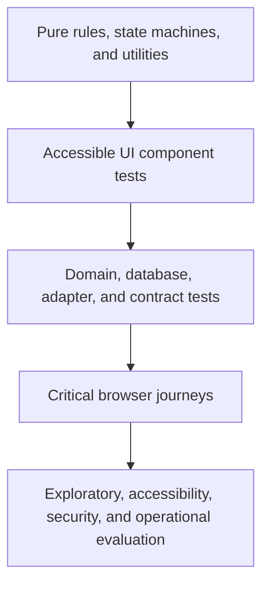

# Platform Test Strategy

Status: Authoritative foundation specification  
Audience: Product, engineering, quality, security, accessibility, operations, and implementation partners  
Applies to: All PetCare product surfaces, domain modules, integrations, data stores, infrastructure, and AI-assisted development

## 1. Purpose

This strategy defines how PetCare will prove that the platform works correctly and safely. It establishes test layers, ownership, environments, evidence, release gates, and risk-based depth for a multi-tenant pet-care SaaS.

Testing is part of product design and implementation, not a final phase. A feature is complete only when its requirements, failure behavior, permissions, tenant isolation, accessibility, observability, and recovery have verifiable evidence.

## 2. Quality objectives

PetCare must:

- Protect every tenant boundary.
- Prevent harm caused by incorrect pet identity, medication, feeding, care, check-in, or checkout behavior.
- Prevent double booking, overselling capacity, duplicate charges, and incorrect price or policy application.
- Preserve financial and operational history under retries, failures, and concurrency.
- Remain usable with supported assistive technologies and responsive layouts.
- Degrade safely when payments, email, SMS, storage, AI, or other dependencies are unavailable.
- Make failures detectable, diagnosable, recoverable, and auditable.
- Support frequent releases without relying on customers to discover regressions.

## 3. Quality principles

1. **Risk determines depth.** Safety, security, money, identity, and irreversible actions receive the strongest evidence.
2. **Test behavior, not implementation trivia.** Tests should survive safe refactoring while catching changed outcomes.
3. **Shift left and verify in production.** Fast checks begin during design and coding; controlled production validation completes the feedback loop.
4. **Defense in depth.** Unit, integration, database, browser, contract, manual, and operational checks cover different failure modes.
5. **Determinism first.** Control time, randomness, IDs, external responses, and test data where possible.
6. **Tenant isolation is universal.** Every data path is tested with multiple tenants.
7. **Failures must be observable.** A passing UI test is insufficient if the audit, event, or operational signal is wrong.
8. **Automation supports judgment.** Automated accessibility and security tools do not replace skilled human evaluation.
9. **Production data stays in production.** Tests use synthetic, generated, or approved de-identified data.
10. **AI output is untrusted until verified.** AI-generated code and tests receive the same review and gates as human-authored work.

## 4. Risk classification

### 4.1 Risk dimensions

Each feature is evaluated for:

- Animal safety.
- Human safety.
- Tenant or personal data exposure.
- Unauthorized privilege.
- Financial loss or accounting error.
- Legal, consent, or policy impact.
- Booking and capacity integrity.
- Irreversible data loss.
- Operational disruption.
- Customer trust and accessibility.
- Blast radius across tenants.
- Detectability and ease of recovery.

### 4.2 Test criticality

| Class                       | Description                                                                      | Examples                                                              | Minimum evidence                                                                                              |
| --------------------------- | -------------------------------------------------------------------------------- | --------------------------------------------------------------------- | ------------------------------------------------------------------------------------------------------------- |
| Q0 Safety/security critical | Failure can harm animals, expose tenants, corrupt money, or bypass authorization | Medication, pet identity, RLS, payment callbacks, ownership transfer  | Unit/property, integration, database policy, end-to-end, adversarial/manual, observability, rollback evidence |
| Q1 Core business critical   | Failure prevents or materially corrupts the primary service                      | Availability, booking, pricing, check-in/out, vaccination eligibility | Unit, integration, browser journey, concurrency/error paths, acceptance evidence                              |
| Q2 Important workflow       | Failure has workaround but degrades operations or trust                          | Messaging, reports, website publishing, staff tasks                   | Unit/integration plus focused browser and manual checks                                                       |
| Q3 Low-risk presentation    | Failure is localized and readily reversible                                      | Cosmetic layout, nonessential preference                              | Component/static checks and proportionate manual review                                                       |

Classification applies to requirements and changed paths, not entire modules. A visual component can still be Q0 when used to confirm medication or pet identity.

## 5. Test pyramid and portfolio

PetCare uses many fast, narrow tests and fewer broad, expensive tests.



No percentage target is universal. A rule-heavy pricing engine may have extensive unit/property tests; a support-access flow requires stronger integration and manual security evaluation.

## 6. Static verification

Every change runs:

- TypeScript type checking independent of test execution.
- Linting for correctness, security, React, accessibility, and project conventions.
- Formatting verification.
- Dependency and lockfile validation.
- Secret scanning.
- Vulnerability and license-policy checks.
- Migration syntax and policy inventory checks.
- Forbidden import and architecture-boundary checks.
- Dead-link and documentation-reference checks where practical.

Static checks are blocking when they identify a release-gate condition. Suppressions require a reason and narrow scope.

## 7. Unit tests

Unit tests cover deterministic business logic without network or database dependencies.

Priority subjects include:

- Price calculation order, rounding, deposits, fees, tax inputs, and snapshots.
- Capacity intervals, resource requirements, and availability decisions.
- Booking and operational state transitions.
- Cancellation and modification rules.
- Vaccination and eligibility dates.
- Care-task windows and overdue classification.
- Communication preference and consent decisions.
- Permission composition helpers.
- Date, time-zone, daylight-saving, and service-day boundaries.
- Idempotency and deduplication keys.
- Report metric definitions.
- Data classification and retention decisions.

### 7.1 Unit-test rules

- Use clear arrange/act/assert structure or equivalent.
- Name the business outcome and requirement ID for P0/Q0 behavior.
- Freeze or inject time instead of depending on the wall clock.
- Use explicit time zones and currencies.
- Avoid asserting private function calls or internal component structure.
- Include invalid, boundary, empty, maximum, and transition cases.
- A bug fix adds a failing regression test before or with the correction.

## 8. Property and model-based tests

Property testing is used where combinations exceed practical examples.

Candidate properties include:

- A monetary total equals its rounded component ledger under the defined calculation order.
- A confirmed allocation never exceeds sellable capacity.
- A tenant-owned record can never change `business_id`.
- State machines reject transitions not in their transition table.
- Replaying an idempotent command does not duplicate its business effect.
- A date range never produces a negative duration or inverted stay.
- Price snapshots remain unchanged after future configuration edits.
- Refund totals never exceed captured funds without an explicit credit workflow.
- Location scope never expands beyond membership scope.

Generated counterexamples must be persisted as deterministic regression fixtures.

## 9. Component tests

UI component tests verify behavior through user-visible roles, names, text, and state.

They cover:

- Keyboard operation and focus management.
- Accessible names, descriptions, states, and errors.
- Loading, empty, error, disabled, read-only, and success states.
- Compact, long-content, localization, high-contrast, and reduced-motion behavior.
- Form validation and preservation of valid values.
- Dialog, drawer, menu, tabs, combobox, table, calendar, and notification patterns.
- Tenant theme constraints.
- Permission-aware rendering without treating rendering as authorization.

Prefer queries that match how users and assistive technologies find controls. Test IDs are reserved for cases without stable semantic selectors.

## 10. Domain integration tests

Integration tests exercise domain services with real PostgreSQL behavior and controlled adapters.

They verify:

- Transactions and rollback.
- Constraints, indexes, triggers, and row-level policies.
- Domain authorization and field filtering.
- State transitions and audit entries.
- Outbox/event creation in the same transaction where required.
- Retry and idempotency behavior.
- Concurrency conflicts.
- Snapshot creation.
- Cross-domain references and invariants.
- Storage metadata and access policy.

Mocks are not used where the risk exists specifically in SQL, RLS, transactions, provider signatures, or serialization.

## 11. Database and migration tests

### 11.1 Schema verification

- Migrations apply from an empty database.
- Migrations apply from every supported prior release state.
- Forward and rollback strategy is documented; irreversible migrations have recovery plans.
- Tenant-owned tables contain required ownership keys and RLS.
- Constraints and indexes match domain requirements.
- Application runtime roles cannot own tables or bypass RLS.
- Seed/reference data is idempotent.

### 11.2 Tenant-isolation suite

Every applicable table is tested with:

- Tenant A and Tenant B fixtures with deliberately similar names and IDs.
- Anonymous, customer, staff, owner, platform, runtime, and elevated-role contexts as relevant.
- Select, insert, update, delete, count, exists, join, aggregate, and upsert behavior.
- `USING` and `WITH CHECK` outcomes.
- Cross-tenant foreign-key attempts.
- Stale membership and location changes.
- Missing tenant context.
- Security-definer and service-role paths.

This suite is a release gate and follows the [multi-tenant security model](../architecture/multi-tenant-security.md).

### 11.3 Migration safety

Large or locking changes are rehearsed with production-shaped synthetic volume. Tests measure lock duration, application compatibility, backfill restartability, and mixed-version behavior during deployment.

## 12. API tests

API tests verify:

- Authentication and authorization.
- Tenant and location context.
- Request and response schemas.
- Validation, stable error codes, and safe messages.
- Field-level policy.
- Pagination, filtering, sorting, and cursor binding.
- Idempotency and conditional requests.
- Rate limiting and abuse behavior.
- File upload/download authorization.
- Batch atomicity and mixed-tenant rejection.
- Version compatibility.
- No protected-data enumeration through status, timing, counts, or errors.

Contract examples are generated from or validated against the authoritative API schema once implementation begins.

## 13. External integration and contract tests

Each provider adapter has a contract suite covering normal, delayed, duplicated, out-of-order, malformed, unauthorized, and unavailable behavior.

### 13.1 Payments

- Signature verification.
- Connected-account-to-tenant mapping.
- Authorization, capture, failure, refund, dispute, and reconciliation events.
- Duplicate and out-of-order callbacks.
- Timeout after provider success but before local acknowledgement.
- Minor-unit precision and currency.
- No raw card data entering PetCare systems.

### 13.2 Email and SMS

- Tenant branding and safe links.
- Consent and channel eligibility.
- Provider acceptance, delivery, bounce, failure, and complaint events.
- Duplicate suppression and retry.
- Message content minimization.
- Opt-out and transactional/marketing separation.

### 13.3 Storage, maps, domains, and AI

- Signed access expiry and revocation.
- Upload quarantine and scan outcomes.
- Host/domain ownership and routing.
- Maps/geocoding failure and ambiguous results.
- AI timeout, refusal, malformed output, cost limit, and disabled-feature behavior.
- AI retrieval and tool-call tenant isolation.

Provider sandboxes are supplemented by local fakes and recorded contract fixtures; neither alone is sufficient.

## 14. End-to-end browser tests

Browser tests cover a deliberately small set of high-value journeys in real application conditions.

MVP critical journeys include:

1. Business registration and onboarding through publish readiness.
2. Customer account creation, pet creation, vaccination upload, booking, deposit, and confirmation.
3. Staff customer/pet creation and assisted booking.
4. Availability conflict and waitlist handling.
5. Booking modification and cancellation with recalculation and refund consequences.
6. Check-in with identity, eligibility, agreements, medications, belongings, and payment blockers.
7. Daily care task completion, exception, correction, and audit history.
8. Check-out with pickup authorization, reconciliation, payment, receipt, and final state.
9. Role invitation, scope change, revocation, and direct-link denial.
10. Tenant switch with no cached-data leakage.
11. Website edit, preview, publish, and booking handoff.
12. Payment webhook retry and reconciliation.

### 14.1 Browser-test rules

- Use browser-level accessibility roles and labels as selectors.
- Avoid arbitrary sleeps; wait for observable state or events.
- Control external providers and time.
- Capture trace, screenshot, console, network, and server correlation data on failure.
- Run parallel tests with isolated tenant data.
- Clean up through trusted test APIs or disposable environments.
- Retry only to diagnose flakiness; a retry must not turn an unstable test into accepted evidence.

Playwright is the initial browser automation choice because it supports Chromium, Firefox, WebKit, and representative device emulation. Exact projects belong in the implementation configuration.

## 15. Journey acceptance tests

Acceptance tests express product outcomes using Given/When/Then or equally readable steps. They link to stable requirement IDs.

Example:

```text
BOOK-BR-014 / BOOK-AT-027
Given one sellable boarding space remains
And Customer A and Customer B request the same overlapping stay
When both confirmations execute concurrently
Then exactly one booking becomes confirmed
And the other receives the defined unavailable or waitlist outcome
And capacity never becomes negative
```

Acceptance tests should not duplicate every unit edge case. They prove that the integrated product fulfills the requirement.

## 16. Accessibility testing

PetCare targets WCAG 2.2 AA as defined in the [responsive and accessibility interaction standards](../ux/responsive-accessibility-standards.md).

### 16.1 Automated checks

- Static accessibility linting.
- Automated axe checks in component and browser tests.
- Contrast validation for platform and tenant themes.
- Missing name, role, state, heading, landmark, and form relationship checks.
- Responsive visual and DOM checks at representative widths.

### 16.2 Manual evaluation

- Keyboard-only completion.
- Focus order, visibility, restoration, and absence of traps.
- Screen-reader name, role, state, announcements, and error recovery.
- 200 percent text resize, 400 percent zoom, and 320 CSS pixel reflow.
- Touch targets, orientation, forced colors, and reduced motion.
- Meaning without color, image, sound, hover, drag, or spatial position alone.
- Representative assistive-technology/browser combinations.

W3C guidance states that automated tools cannot determine conformance alone, so manual evaluation and, for high-impact journeys, evaluation with people with disabilities remain required.

## 17. Security testing

Security testing includes:

- Threat modeling for new boundaries and sensitive changes.
- Authentication, session, MFA, recovery, and step-up tests.
- Role, scope, relationship, and field authorization tests.
- Multi-tenant adversarial tests.
- Input validation and injection tests.
- CSRF, XSS, SSRF, open redirect, file upload, path, and host-header tests as applicable.
- Secret and dependency scanning.
- Rate-limit and abuse tests.
- Webhook signature and replay tests.
- Audit completeness and tamper-resistance tests.
- Manual penetration testing before production launch and after major boundary changes.

A suspected cross-tenant defect is treated as high severity until disproven.

## 18. Concurrency and idempotency testing

Required scenarios include:

- Two customers compete for the last capacity.
- Two staff assign the same housing resource.
- A customer double-submits payment or booking confirmation.
- Provider callbacks arrive twice or out of order.
- A staff member completes a task while another records an exception.
- A role is revoked during a mutation.
- Configuration changes while a booking is being priced.
- A retry occurs after the external side effect succeeds but the local response fails.
- Scheduled and manual jobs target the same record.

Tests assert final state, history, emitted events, balances, allocations, and user-facing outcomes—not merely HTTP status.

## 19. Time and date testing

PetCare must test:

- Location time zones.
- Daylight-saving spring-forward and fall-back transitions.
- Midnight and service-day boundaries.
- Leap days and month/year boundaries.
- Holiday and peak-price boundaries.
- Vaccine expiration relative to arrival and stay dates.
- Late pickup, early drop-off, grace periods, and overnight stays.
- Scheduled message and task behavior after configuration changes.
- User and business displays when viewers are in different time zones.

Persist instants and explicit business/date concepts according to the domain model; tests must not assume the build agent’s local time zone.

## 20. Financial testing

- Use integer minor units or approved decimal types, never binary floating point for money.
- Test every supported currency’s precision assumptions before enabling it.
- Verify calculation order and line-level traceability.
- Reconcile invoice, payment intent, capture, refund, credit, dispute, and processor settlement projections.
- Test partial payments, partial refunds, failed refunds, overpayment, and write-off policy.
- Confirm immutable price/policy snapshots after configuration changes.
- Verify financial exports and reports against source ledgers.
- Test retry and concurrency paths for duplicate financial effects.

Q0 financial cases require independent review of expected results.

## 21. Pet-care safety testing

Safety-critical testing covers:

- Pet identity using name plus approved secondary identifier.
- Similar pet names and same-household siblings.
- Medication drug, dose, route, time, actor, witness, refusal, correction, and overdue escalation.
- Feeding instructions, allergies, supplements, appetite outcomes, and exceptions.
- Vaccination and eligibility decisions across service dates.
- Incident creation, escalation, evidence, notification, and closure.
- Check-in snapshot accuracy and mid-stay instruction changes.
- Pickup authorization and belongings/medication reconciliation.
- Audit history after corrections; prior safety records are not overwritten.

Tests must prove both the successful path and the safe blocked/exception path.

## 22. Performance and capacity tests

Performance objectives are set per critical user action before implementation acceptance.

Test categories include:

- Public website and booking response.
- Availability search under realistic rules and occupancy.
- Today boards and care-task updates at peak shift change.
- Calendar and report queries with production-shaped volume.
- Upload and media processing.
- Bulk communications and scheduled jobs.
- Webhook bursts.
- Tenant-fair queue and rate-limit behavior.
- Database policy and index performance.

Performance tests use percentile latency, throughput, error rate, saturation, and correctness. Fast but incorrect or cross-tenant results fail.

## 23. Reliability and resilience tests

Inject or simulate:

- Database connection loss and transaction timeout.
- Payment provider latency and outage.
- Email/SMS rejection and callback delay.
- Storage upload interruption.
- Queue worker crash between side effects.
- Duplicate delivery and poison messages.
- AI provider failure or spend-limit rejection.
- Deployment during active sessions.
- Read-only or degraded modes where designed.

Verify bounded retries, circuit behavior, safe user messaging, audit, alerts, recovery, and no duplicated business effect.

## 24. Backup and recovery tests

- Backup completion is monitored.
- Restore is rehearsed into an isolated environment.
- Row counts, checksums, tenant isolation, storage references, and critical workflows are validated after restore.
- Recovery-point and recovery-time objectives are measured, not assumed.
- Webhooks, queues, and scheduled jobs do not replay uncontrolled side effects after restore.
- Production data used in recovery testing remains access-controlled and is destroyed afterward.

## 25. Compatibility matrix

The maintained release matrix covers:

- Supported desktop and mobile browsers.
- Representative screen sizes, touch, keyboard, and pointer input.
- Supported assistive-technology combinations.
- Public custom domains and platform subdomains.
- Current and immediately previous supported application/database migration state.
- Provider API versions and webhook event versions.

Exact versions live in implementation and release documentation because they change over time.

## 26. Visual regression testing

Visual tests are useful for:

- Shared components and design tokens.
- Tenant themes.
- Responsive layouts.
- Safety/status presentation.
- PDFs, receipts, report cards, and email templates.

Visual snapshots do not prove semantics, accessibility, data correctness, or authorization. Baseline updates require human review and must not be accepted in bulk without understanding the change.

## 27. Test environments

| Environment        | Purpose                                                    | Data                                           |
| ------------------ | ---------------------------------------------------------- | ---------------------------------------------- |
| Local              | Fast development and focused integration                   | Synthetic fixtures                             |
| CI ephemeral       | Isolated automated verification per change                 | Generated, disposable multi-tenant data        |
| Shared integration | Provider sandboxes and cross-service validation            | Synthetic stable scenarios                     |
| Preview            | Product/design review for a branch                         | Synthetic or approved seed data                |
| Staging            | Production-like release validation and migration rehearsal | Synthetic production-shaped data               |
| Production         | Smoke, monitoring, canary, and controlled verification     | Real data with strict non-destructive controls |

Environments use separate databases, storage, credentials, domains, provider accounts, and observability boundaries.

## 28. Test-data strategy

### 28.1 Standard tenant fixtures

Maintain reusable tenants representing:

- Single-location boarding business.
- Multi-location boarding/daycare/grooming business.
- Small operation with simple capacity.
- Complex operation with resource types, holiday prices, staff scopes, and eligibility rules.
- Suspended or partially configured tenant.

### 28.2 Data requirements

- Similar customer and pet names across tenants to expose isolation mistakes.
- Overlapping IDs where feasible in external fixtures.
- Multiple time zones and locale formats.
- Boundary dates and long stays.
- Current, expiring, expired, waived, and missing vaccinations.
- Payment success, failure, refund, and dispute states.
- Accessible long-content and localization cases.
- Large but realistic schedules, timelines, reports, and media metadata.

Tests never depend on execution order or a permanently mutable shared account.

## 29. Mocks, fakes, and test doubles

- Mock at stable system boundaries, not every internal function.
- Fakes model provider state transitions and failure modes.
- Contract tests verify that fakes remain compatible with actual provider sandboxes.
- Database behavior, RLS, SQL constraints, and transactions use a real PostgreSQL test instance.
- Time, UUID generation, queues, and random decisions are injectable.
- Test-only bypasses must not compile into or activate in production.

## 30. Continuous integration pipeline

### 30.1 Pull-request checks

- Formatting, linting, type checking, and secret scanning.
- Unit, property, and component tests.
- Changed-domain integration tests.
- Migration and RLS inventory checks.
- Focused browser journeys.
- Automated accessibility checks.
- Build and dependency-policy validation.
- Documentation and traceability checks.

### 30.2 Main-branch checks

- Full integration and tenant-isolation suite.
- Cross-browser critical journeys.
- Provider contract suites.
- Broader accessibility and visual regression checks.
- Deployment artifact creation and provenance.

### 30.3 Scheduled checks

- Full browser matrix.
- Dependency and vulnerability refresh.
- Performance baselines.
- Backup restore rehearsal according to cadence.
- External-provider drift detection.
- Flaky-test analysis.

## 31. Flaky-test policy

- A flaky test is a defect in the product, test, environment, or observability.
- Retries collect evidence but do not erase the initial failure.
- Quarantine requires an owner, reason, issue, risk assessment, and deadline.
- Q0/Q1 coverage cannot remain quarantined for release without approved equivalent evidence.
- Track failure frequency, time in quarantine, and repeat offenders.
- Fix root causes such as shared data, uncontrolled time, race conditions, or ambiguous waits.

## 32. Coverage and quality metrics

Track:

- Requirement coverage for P0 and Q0/Q1 behavior.
- Domain and journey acceptance completion.
- Tenant-isolation policy coverage.
- Escaped defect rate and severity.
- Flaky-test rate and quarantine age.
- Mean time to detect and resolve regressions.
- Change failure and rollback rate.
- Accessibility defect trends.
- Critical journey success in production.
- Test duration and developer feedback time.

Code coverage is a diagnostic, not the quality target. High line coverage with missing business assertions is inadequate. Thresholds may protect critical packages but cannot replace requirement coverage.

## 33. Defect severity

| Severity    | Meaning                                                       | Example                                                               | Release effect                |
| ----------- | ------------------------------------------------------------- | --------------------------------------------------------------------- | ----------------------------- |
| S0 Critical | Active or likely severe safety/security/data incident         | Cross-tenant leak, wrong medication record, duplicate charge at scale | Stop/revert, incident process |
| S1 High     | Core flow blocked or materially wrong without safe workaround | Overbooking, unauthorized refund, checkout loses belongings record    | Release blocked               |
| S2 Medium   | Important degradation with bounded workaround                 | Report filter wrong, noncritical message delayed                      | Risk review required          |
| S3 Low      | Minor localized issue                                         | Cosmetic alignment, low-impact copy                                   | May defer with owner          |

Severity reflects impact and exposure; priority also considers urgency and occurrence.

## 34. Release gates

A release is blocked when:

- Required CI checks fail.
- A Q0/S0/S1 defect is unresolved.
- P0 requirement evidence is missing for changed behavior.
- Tenant-isolation tests fail or coverage inventory is incomplete.
- Critical booking, payment, check-in, care, or checkout journeys fail.
- Required migrations have not been rehearsed.
- Accessibility blockers prevent completion of a core journey.
- Security review is missing for a changed boundary.
- Rollback or forward-recovery is undefined for a high-risk change.
- Observability cannot distinguish success, failure, and duplicate effects.

## 35. Release evidence package

Each production release records:

- Commit and artifact identifiers.
- Requirements and decisions changed.
- Test suites and results.
- Migration and rollback/forward-recovery plan.
- Security and accessibility review where required.
- Known defects and approved exceptions.
- Provider/configuration changes.
- Deployment owner and approval.
- Production smoke and monitoring results.

Evidence is retained long enough to investigate financial, security, and safety history.

## 36. Production verification

Production checks are safe and minimally destructive:

- Health and dependency checks.
- Public tenant resolution.
- Authentication and authorized tenant context.
- Read-only or synthetic canary journey where possible.
- Webhook receipt and queue health.
- Error, latency, saturation, and business-event signals.
- No increase in denial anomalies or cross-tenant alarms.

Real customer bookings, payments, messages, medications, or care tasks are never created merely as an uncontrolled smoke test.

## 37. AI-assisted development quality controls

AI may draft code, migrations, tests, documentation, and fixtures, but:

- A human owns every change.
- Generated tests must independently validate requirements rather than mirror generated implementation assumptions.
- Security, tenant, money, time, and safety logic receives deliberate review.
- Dependencies and APIs are verified against authoritative documentation.
- Generated migrations and RLS policies are tested in real PostgreSQL.
- Secrets and customer data are not placed in prompts.
- Passing AI-generated tests does not justify removing manual or adversarial review.
- Prompts and model output are not the authoritative product specification; repository requirements are.

## 38. Ownership

- **Product:** acceptance outcomes, risk classification, and defect impact.
- **Engineering:** testable design, automated suites, observability, and correction.
- **Quality:** strategy, risk coverage, exploratory testing, evidence, and release recommendation.
- **Security:** threat models, security gates, penetration testing, and incident validation.
- **Accessibility:** manual evaluation, assistive-technology matrix, and exception review.
- **Platform operations:** environment, deployment, resilience, backup, and production validation.
- **Domain owners:** business-rule accuracy and domain fixtures.

For a solo-founder phase, one person may hold several roles, but the review questions and evidence remain distinct.

## 39. Definition of done

A feature is complete only when:

- Requirement IDs and risk class are identified.
- Acceptance criteria include failure and recovery behavior.
- Appropriate unit, integration, browser, and manual evidence exists.
- Tenant, role, location, and field boundaries are tested.
- Accessibility and responsive behavior are verified.
- Time, concurrency, retry, and external failure paths are covered where relevant.
- Audit, metrics, logs, and alerts distinguish outcomes.
- Documentation and support impact are updated.
- No release-blocking defect or unexplained flaky coverage remains.

## 40. Initial implementation toolchain

Proposed tools, subject to an architecture decision when scaffolding begins:

| Need                          | Initial choice                                                     |
| ----------------------------- | ------------------------------------------------------------------ |
| Type checking                 | TypeScript compiler                                                |
| Unit/property/component tests | Vitest plus appropriate property and DOM testing libraries         |
| Browser journeys              | Playwright                                                         |
| Automated accessibility       | axe-core integrated with component and Playwright tests            |
| API/contract validation       | OpenAPI/schema validation plus adapter-specific contract suites    |
| Database/RLS                  | Disposable Supabase/PostgreSQL test environment and SQL assertions |
| Visual regression             | Playwright screenshots or approved hosted comparison service       |
| Load and resilience           | Selected during implementation based on deployment topology        |

Vitest test execution does not replace a separate TypeScript type-check step. Tool versions and configuration are pinned in the repository.

## 41. Open decisions

- Final unit/component/property testing libraries.
- CI runtime targets and test-suite partitioning.
- Browser and assistive-technology support matrix.
- Performance service-level objectives for each critical action.
- Production canary and feature-flag rollout model.
- Penetration-test provider and launch cadence.
- Visual regression hosting approach.
- Test-management/evidence tooling beyond GitHub.
- Minimum product analytics and synthetic-monitoring coverage for MVP.
- Backup restore rehearsal cadence.

## 42. Related PetCare specifications

- [Master requirements index](../requirements/README.md)
- [Requirements traceability](../requirements/traceability.md)
- [Architecture overview](../architecture/overview.md)
- [Technology stack](../architecture/technology-stack.md)
- [Multi-tenant security model](../architecture/multi-tenant-security.md)
- [Responsive and accessibility interaction standards](../ux/responsive-accessibility-standards.md)
- [Role and permission presentation model](../ux/role-permission-presentation-model.md)
- [Operations domain](../domains/operations/README.md)
- [Payments and Invoicing domain](../domains/payments-invoicing/README.md)

## 43. Authoritative external references

- [Playwright documentation](https://playwright.dev/docs/intro)
- [Playwright browser support](https://playwright.dev/docs/browsers)
- [Playwright accessibility testing](https://playwright.dev/docs/accessibility-testing)
- [Vitest documentation](https://vitest.dev/guide/)
- [W3C evaluating web accessibility](https://www.w3.org/WAI/test-evaluate/)
