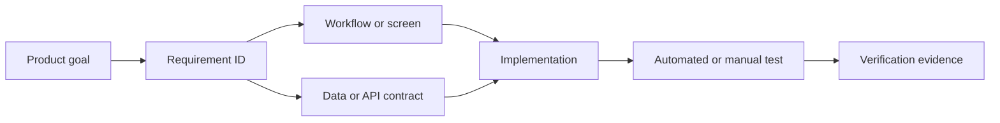

# Requirements Traceability

Traceability connects product decisions to implementation and proof. It provides coverage without duplicating the full requirement text in multiple places.

## Trace chain

## Required metadata

Each accepted requirement records:

| Field               | Description                                    |
| ------------------- | ---------------------------------------------- |
| ID                  | Stable requirement identifier                  |
| Title               | Short human-readable name                      |
| Statement           | Testable requirement text                      |
| Rationale           | Why the requirement exists                     |
| Priority            | P0, P1, P2, or Future                          |
| Status              | Proposed through Verified                      |
| Owner domain        | Single authoritative domain                    |
| Dependencies        | Other requirement IDs or external dependencies |
| Acceptance evidence | Test IDs, screenshots, logs, or review records |

## Traceability table template

| Requirement | Design                | Data/API     | Implementation | Verification | Status   |
| ----------- | --------------------- | ------------ | -------------- | ------------ | -------- |
| BCFG-FR-001 | Business Setup Wizard | `businesses` | TBD            | BCFG-AT-001  | Accepted |

## Repository conventions

- Requirement definitions live in domain specifications.
- Code references requirement IDs only when the link adds lasting value; avoid noisy comments on obvious code.
- Test names or metadata should include the relevant requirement ID for safety-critical and P0 behavior.
- Pull requests list the requirement IDs they implement or change.
- A requirement cannot be marked `Verified` without linked evidence.

## Change control

When a requirement changes:

1. Update the authoritative domain specification.
2. Record affected requirement IDs.
3. Review linked workflows, data contracts, permissions, and tests.
4. Add a decision record if the change alters architecture or a major product rule.
5. Keep historical booking, pricing, policy, financial, and care records interpretable after the change.
