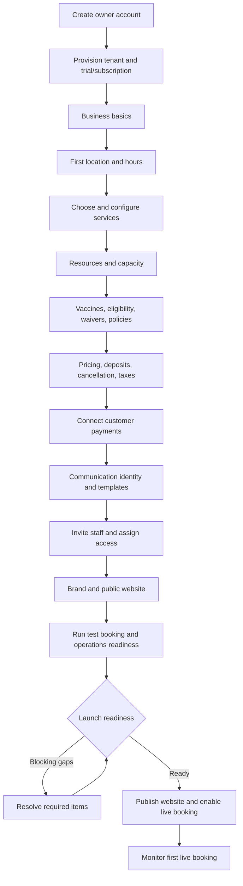

# Business Onboarding Journey

- **Status:** In progress
- **MVP priority:** P0
- **Primary user:** Business owner
- **Supporting users:** Location manager, invited staff, platform billing/support

## Purpose

This document defines the end-to-end journey from creating a PetCare SaaS tenant through configuring a safe, bookable pet-care business and accepting its first live booking. It coordinates tenant provisioning, identity, business configuration, services, resources, capacity, pricing, safety requirements, policies, merchant onboarding, communications, staff access, website publication, readiness testing, and launch.

The onboarding experience guides and validates. Each owning domain remains authoritative for its records and publication rules.

## Journey outcomes

- A solo owner can make meaningful progress without already understanding software architecture.
- The setup adapts to boarding, daycare, grooming, or a supported combination.
- Progress survives interruption and can be delegated safely.
- The business cannot launch a service with missing capacity, price, safety, agreement, or payment prerequisites.
- Optional polish is distinguished from true launch blockers.
- Owners can preview the exact customer experience and complete a realistic test booking before going live.
- Live publishing is an explicit, reversible, audited action.
- The owner understands what changes after launch and where to manage each area.

## Principles

1. Ask about the business in the owner's language, then configure the underlying domains.
2. Provide useful defaults, but never silently invent safety policies, prices, taxes, capacities, or legal terms.
3. Show why each required step matters and what it unlocks.
4. Save valid progress immediately without publishing incomplete configuration.
5. Let users move backward while clearly identifying downstream effects.
6. Reveal service-specific setup only when that service is selected.
7. Use readiness checks continuously, not only at the final screen.
8. Keep SaaS subscription billing separate from the tenant's customer-payment setup.
9. Require a test of the complete customer and operational handoff before live launch.
10. Make support assistance transparent, scoped, and auditable.

## Journey overview



The owner may complete some areas in a different order after the first location and services exist. Dependencies remain enforced.

## Onboarding stages

| Stage               | Outcome                                          |     Required for launch      |
| ------------------- | ------------------------------------------------ | :--------------------------: |
| Account and tenant  | Secure owner account and provisioned tenant      |             Yes              |
| Business basics     | Identity, locale, currency, time zone, contacts  |             Yes              |
| Location            | Physical operating context and hours             |             Yes              |
| Services            | Customer-bookable offering definitions           |             Yes              |
| Resources/capacity  | Safe sellable limits                             |             Yes              |
| Safety and policies | Eligibility, documents, waivers, cancellation    |             Yes              |
| Pricing             | Deterministic bookable quote and deposit         |             Yes              |
| Customer payments   | Merchant capable of required collection          | Conditional but normally yes |
| Communications      | Required transactional email path                |             Yes              |
| Staff access        | At least owner; operational staffing recommended |         Conditional          |
| Website/brand       | Valid public booking entry and required pages    | Yes for included-site launch |
| Test and readiness  | End-to-end verification                          |             Yes              |

## Onboarding shell

### Persistent elements

- Business name or `New business` placeholder
- Overall setup stage and launch state
- Current section and progress
- Save state
- Readiness issues count
- Preview customer experience
- Help/support
- Owner/security menu

### Desktop layout

- Left step navigation grouped by stage
- Main setup form/workspace
- Right contextual checklist or preview when useful

### Compact layout

- Current stage header
- Section content
- `Back` and explicit next action
- Collapsible checklist
- Save/exit

Complex resource, schedule, and pricing configuration remains usable on tablet; desktop may be recommended for dense setup.

## Progress model

Do not use one misleading percentage alone.

### Three progress views

1. **Required setup:** complete/incomplete launch prerequisites
2. **Service readiness:** boarding, daycare, grooming readiness independently
3. **Recommended improvements:** brand, extra staff, richer content, optional SMS

### States

- Not started
- In progress
- Needs review
- Blocked
- Ready
- Published/live

A section can be complete while a downstream service remains blocked. Example: business profile is complete, but boarding is unready because capacity is missing.

## Save and resume

- Save valid field/section changes as drafts.
- Display `Saving`, `Saved`, and recoverable failure states.
- Preserve progress after sign-out, session expiry, browser closure, and device change.
- Reauthenticate before sensitive merchant, security, or publication actions.
- Resume at the most relevant incomplete section, not necessarily the last URL.
- If another authorized user changes setup, show current values and conflicts.
- Draft changes do not affect published customer behavior until the owning domain publishes or activates them.

## Stage 1: Owner account and tenant provisioning

### Owner account

- Email and password
- Email verification
- Owner name
- Required platform terms
- MFA enrollment before privileged launch/billing actions

Marketing consent is optional and separate.

### Tenant creation

Collect minimal commercial intent:

- Business display name
- Country
- Expected service categories
- Existing business versus new business
- Trial/plan selection when required

### Provisioning progress

Show customer-friendly stages:

- Creating secure workspace
- Setting up business profile
- Preparing website address
- Applying plan/trial
- Ready for setup

If provisioning fails, do not create duplicate tenants on retry. Show a safe retry/support state tied to the same provisioning run.

### Subscription distinction

Explain:

- The SaaS plan is what the business pays PetCare.
- Customer payment setup is configured later so customers can pay the business.
- Trial dates, included features, renewal timing, and cancellation access.

Do not mix PetCare subscription invoices with future customer invoices.

## Stage 2: Business basics

### Required

- Legal name where required
- Public display name
- Primary business contact
- Customer-facing email and phone
- Country and address context
- Locale
- Currency
- Default IANA time zone

### Optional/conditional

- Business description
- Tax/business identifier references
- Licenses/certifications
- Social links
- Support contact distinct from public contact

### Guidance

- Explain that currency changes after transactions begin may require support/migration.
- Infer time zone from address only as a suggestion; owner confirms it.
- Preview how the public name/contact appear.
- Validate email/phone purpose and verification where required.

## Stage 3: First location

### Location identity

- Location name
- Physical address and map position review
- Location time zone
- Public phone/email
- Manager/contact
- Parking, arrival, access, and pickup instructions

### Hours

Separate:

- General operating hours
- Drop-off windows
- Pickup windows
- Daycare attendance windows
- Grooming appointment hours
- Closed days and breaks
- Holiday/special hours

Use one schedule editor with service-aware layers. The UI displays effective hours and warns about gaps or contradictions.

### Calendar exceptions

- Full closure
- Special opening
- Reduced service
- Capacity restriction
- Renovation/maintenance period
- Holiday/peak designation for pricing reference

A closure overrides normal hours. Special openings require explicit confirmation.

### Multiple locations

The MVP starts with one location. The model supports more, but the journey does not force franchise complexity on a single-location business. Owners adding another location later can copy eligible drafts while reviewing every inherited safety, capacity, price, merchant, and website value.

## Stage 4: Choose services

### Category selection

- Boarding
- Daycare
- Grooming

Selecting a category opens a guided category setup. Deselecting after configuration warns about dependent drafts and never deletes historical data.

### Starter templates

Templates may create drafts such as:

- Standard overnight boarding
- Full-day daycare
- Basic grooming appointment

Templates provide fields and example structure, not final prices, policies, capacities, legal language, or safety decisions.

### Common service setup

- Customer-facing name and description
- Location availability
- Time model
- Booking channel: instant, request approval, staff-only
- Variants
- Add-ons
- Intake questions
- Eligibility references
- Resource and staff requirements
- Customer instructions

### Boarding

- Overnight/date-range boundaries
- Accommodation variants
- Arrival/departure windows
- Minimum/maximum stay if any
- Turnover needs
- Compatible add-ons

### Daycare

- Full/half-day or session variants
- Attendance capacity context
- Evaluation requirement
- Recurring request policy
- Arrival/pickup windows

### Grooming

- Service/variant menu
- Default duration and buffers
- Size/coat/condition inputs
- Request-only versus instant appointment
- Staff/station needs
- Change-approval policy

### Preview

Preview customer cards and service-detail content using current draft. A service remains nonbookable until capacity, pricing, requirements, and channel readiness pass.

## Stage 5: Resources and capacity

### Setup choice

The journey asks how the business manages capacity:

- Named resources, such as each kennel/suite
- Pooled quantity, such as daycare attendance limit
- Staff/station scheduling, such as groomer plus table
- Combination

### Boarding resources

- Resource type: kennel, suite, run, room
- Label/identifier
- Area
- Physical and configured capacity
- Size/weight/occupancy attributes
- Isolation/accessibility/equipment attributes
- Service compatibility
- Turnover/cleaning buffer

Bulk creation may generate sequential drafts, but the owner reviews identifiers and attributes.

### Daycare capacity

- Daily/session attendance pool
- Operational maximum at or below physical maximum
- Play areas
- Area/group capacity
- Staff-ratio inputs where required
- Evaluation/segmentation constraints

### Grooming capacity

- Groomers/skills or placeholder staff capacity strategy
- Bathing/grooming stations
- Appointment duration and buffers
- Overlap rules for processing/drying phases only when defined

### Capacity test

Use example dates and demand to show:

- Physical capacity
- Configured capacity
- Required buffers
- Example available count
- Reasons availability can be blocked

The test does not create real holds or bookings.

## Stage 6: Safety requirements and policies

### Vaccine/document requirements

For each service/location:

- Requirement type
- Required/optional
- Accepted proof
- Verification method
- Validity through arrival, departure, or another boundary
- Grace behavior if legally/operationally allowed
- Pending-review behavior
- Customer-facing explanation

Provide common vaccine names as reference data, but the business confirms requirements with its own qualified/legal guidance.

### Eligibility

- Age limits
- Alteration requirements
- Evaluation/temperament requirements
- Health/behavior restrictions
- Breed/size rules only when lawful, ethical, and business-approved
- Required staff review
- Overrideability and authorized role

The platform does not suggest discriminatory or unsupported rules as defaults.

### Waivers and agreements

- Agreement title and purpose
- Current text/version
- Services/locations affected
- Signer authority
- Acceptance timing
- Renewal/reacceptance behavior

The product may provide structural templates, not legal advice. Tenant-authored legal content requires review and explicit publication.

### Care defaults

- Feeding intake fields
- Medication policy and labeling requirements
- Emergency authorization/contact procedure
- Group-play consent
- Belongings policy
- Grooming condition/change approval
- Incident/customer communication expectations

## Stage 7: Pricing and commercial policies

### Price setup sequence

1. Choose currency-confirmed price book.
2. Set base price for every active bookable service/variant.
3. Configure add-on prices.
4. Configure holiday/seasonal adjustments if needed.
5. Configure multi-pet/other discounts if needed.
6. Configure fees.
7. Configure tax behavior.
8. Configure deposit.
9. Configure cancellation/no-show/refund policy.
10. Run sample quotes.

### Price entry

Always show charge unit:

- Per night
- Per day/session
- Per appointment
- Per pet
- Per booking
- Per quantity

Do not accept ambiguous bare amounts.

### Deposit

Choices may include:

- None
- Fixed amount
- Percentage
- First night/day/unit
- Full payment

Show sample amount due now and balance timing. Explain that deposits apply toward the booking balance and are not extra charges.

### Cancellation/no-show

Use a structured policy builder:

- Time boundary
- Refund/forfeiture percentage
- Fee
- Store-credit alternative
- Service/date/location scope
- Customer-facing explanation

The owner previews example outcomes and policy text. Unsupported conflicts block publication.

### Sample quotes

Required examples include:

- One-pet standard booking
- Multi-pet booking when enabled
- Holiday/peak date when configured
- Add-on
- Deposit amount
- Tax/fee
- Cancellation timing

The system shows which rules produced each line. Zero/missing price never silently passes.

## Stage 8: Connect customer payments

### Merchant onboarding

The owner enters the payment processor's hosted onboarding flow. PetCare displays:

- Connection status
- Required information remaining
- Capability status
- Restriction/action-needed state
- Payout status summary when available

PetCare never collects bank credentials or full card data in its own forms.

### Payment configuration

- Accepted online tender types
- Deposit collection behavior
- Saved-payment-method option when supported
- Staff/manual tender policy
- Refund permission defaults
- Receipt identity/contact

### Verification

- Processor account connected to the correct tenant/legal context
- Required payment capability active
- Supported currency matches price book
- Webhook/reconciliation health ready
- Test-mode collection can run before live mode

### Failure behavior

If merchant onboarding is incomplete:

- Save setup progress.
- Show exact safe provider action.
- Block live paid booking.
- Permit continued setup and preview.
- Do not encourage disabling required deposits merely to pass readiness.

## Stage 9: Communications

### Sender identity

- Customer-facing from name
- Reply-to/customer contact
- Verified sending domain/address when required
- SMS sender/number when enabled

### Required transactional templates

- Booking confirmation
- Booking action required
- Booking cancellation/modification
- Payment receipt/failure
- Vaccine/document reminder
- Arrival reminder
- Ready for pickup
- Report-card delivery
- Account invitation/security message where platform-controlled

### Preview and test

- Preview using synthetic business/customer/pet/booking data.
- Confirm no internal notes or sensitive fields appear.
- Send test to the owner's verified contact.
- Verify links remain in test/preview mode.
- Show delivery result.

SMS remains optional for MVP unless the business enables and completes it. Required transactional email is a launch prerequisite.

## Stage 10: Staff and access

### Initial roles

- Owner
- Manager
- Front desk
- Care staff
- Groomer
- Accountant
- Marketing editor

### Invite flow

- Email
- Role
- Location scope
- Privileged-permission warning
- Invitation expiry
- MFA requirement for high-risk roles

### Owner guidance

- Never share the owner login.
- Invite each employee separately.
- Keep at least one additional owner only when appropriate.
- Review financial, refund, website publishing, staff management, and medication permissions.
- End access promptly when employment ends.

### Launch requirement

The owner account may satisfy the technical minimum for a pilot. Readiness warns when selected services have no operational staff roles or grooming capability configured, but the exact launch gate depends on the staffing model accepted for MVP.

## Stage 11: Brand and website

### Quick launch

- Choose supported light theme
- Upload logo
- Select accessible brand colors
- Choose approved font pairing
- Confirm homepage/service/location content
- Add About, FAQ, requirements, contact, and policy links
- Configure navigation/footer
- Preview public website, booking, and Customer Portal

### Source-owned content

The preview draws active drafts/projections from:

- Business/location details
- Hours
- Services
- Approved price display
- Requirements
- Policies

Editors cannot paste conflicting prices/hours into structured source sections.

### Domain

- Platform subdomain is available first.
- Custom domain setup may proceed in parallel.
- DNS ownership and certificate must verify before custom domain becomes canonical.
- A custom-domain delay does not have to block launch on the platform subdomain if plan/policy allows.

### Publication

Website draft remains private until site readiness and final launch action. The owner can preview using an authenticated, non-indexable link.

## Stage 12: Operational defaults

Before testing, confirm:

- Arrival/check-in roles
- Care task defaults
- Feeding and medication intake requirements
- Boarding settling assessment
- Daycare attendance/playgroup approach
- Grooming production stages
- Incident severity/contact policy
- Report-card requirement
- Resource cleaning/inspection protocol
- Checkout balance/pickup policy

These settings are service-aware. The owner is not forced to configure daycare playgroups if daycare is disabled.

## Stage 13: Test booking

### Test mode

Create a clearly labeled test customer, pet, and booking that cannot be confused with live data. Test mode uses:

- Test payment environment
- Nonlive or owner-routed communications
- Test capacity that is isolated or safely cleaned afterward
- Visible `Test` labels across booking and operations
- Exclusion from normal financial/operational reports or explicit test filters

### Required test journey

1. Open the draft/public preview.
2. Select location, service, pet, dates/time, and add-ons.
3. Complete customer/pet/eligibility requirements.
4. Review quote, deposit, and policy.
5. Complete a test payment.
6. Verify confirmed/pending result.
7. Verify confirmation message.
8. Open the booking in the Business Portal.
9. Start/complete a test check-in or validate the operational preparation path.
10. Inspect generated care/service tasks.
11. Complete/cancel the test using cleanup workflow.

### Test evaluation

- Customer language and branding make sense.
- Availability matches configured capacity.
- Price and deposit match expected rules.
- Requirements and waivers appear correctly.
- Payment connects to the correct merchant/test account.
- Messages render correctly.
- Staff can find and act on the booking.
- Test cleanup leaves no live commitment, balance, or customer confusion.

## Launch readiness

### Readiness categories

| Category          | Examples                                                        |
| ----------------- | --------------------------------------------------------------- |
| Identity/security | Verified owner, MFA, active tenant/subscription                 |
| Business/location | Required contact, address, time zone, hours                     |
| Service           | Active customer-visible service and valid time model            |
| Capacity          | Required pools/resources, limits, hours, buffers                |
| Safety            | Vaccine/document/eligibility rules reviewed                     |
| Legal/policy      | Required agreements and cancellation terms published            |
| Pricing           | Applicable active deterministic price and deposit               |
| Payments          | Connected live merchant capability when collection required     |
| Communications    | Required transactional sender/template ready                    |
| Website/booking   | Valid public entry, required pages, booking channel             |
| Operations        | Check-in/care/checkout defaults and access ready                |
| Test              | Required end-to-end test completed after material configuration |

### Severity

- **Blocker:** Launch cannot proceed safely or transactionally.
- **Required review:** Owner must explicitly confirm an allowed judgment.
- **Warning:** Launch may proceed, but experience or operations may be incomplete.
- **Recommendation:** Optional improvement.

### Finding anatomy

- What is missing/wrong
- Affected location/service
- Why it matters
- Blocking level
- Owner/domain
- Direct fix action
- Last checked time
- Whether a recent change invalidated prior readiness

## Launch review

The owner sees a customer-to-operations summary:

- Public hostname/site status
- Locations and live services
- Bookable date/time examples
- Price/deposit examples
- Requirements/policies
- Merchant and communication status
- Staff/role readiness
- Test result
- Blocking findings
- Warnings

No single `100%` score substitutes for these facts.

## Launch action

### Preconfirmation

State exactly what will happen:

- Publish website version
- Enable selected public booking channels
- Activate selected service/location versions
- Make live availability and prices customer-visible
- Use live payment mode
- Send live transactional communications
- Start monitoring

### Authorization

- Owner or specifically authorized publisher
- Recent step-up authentication
- Accepted current platform/subscription terms if required
- Reason/confirmation for exceptions

### Execution

Launch is a tracked orchestration:

```text
Recalculate readiness
  -> freeze selected configuration versions
  -> activate service/capacity/pricing/policy projections
  -> verify merchant/live callbacks
  -> publish website
  -> enable booking routes
  -> verify public smoke test
  -> record launch result
```

A partial failure does not leave an ambiguous state. The orchestration either completes, rolls back safely, or enters a visible recovery state with booking disabled until consistent.

## Go-live result

### Success

- `Your business is live`
- Canonical public URL
- Live location/services
- Book Now test link
- Monitor-first-booking checklist
- Staff invitation/readiness reminder
- Support path

### Recovery

- Clear affected component
- Public/booking current state
- Automatic retry or operator action
- No instruction to repeat merchant/domain operations blindly
- Previous website/public state preserved where safe

## First live booking

The first live booking receives additional owner guidance without changing customer behavior:

- Owner notification that live demand began
- Checklist to verify booking, payment, confirmation, capacity, requirements, and operations
- Prominent staff action-required items
- No automatic cancellation or modification
- Support reference if cross-domain results disagree

### First-booking health

- Booking appears once
- Correct customer/pet/service/dates
- Correct quote/deposit/invoice/payment
- Capacity commitment exists
- Requirements/actions are correct
- Confirmation delivery attempted
- Operational visit/preparation exists

## Post-launch transition

Onboarding becomes a `Business health and setup` area rather than disappearing.

- Readiness remains continuously monitored.
- Owners manage each area through normal Settings.
- Material changes show downstream impact.
- New service/location launch uses a scoped version of the readiness journey.
- Optional improvements remain available without blocking operation.
- Trial/subscription status remains visible separately.

## Editing after launch

### Draft/publication pattern

Changes to services, prices, policies, website, and certain requirements use draft/version/publication workflows. Existing confirmed bookings keep snapshots.

### Impact preview

Before material activation show:

- Affected future availability
- Existing future bookings needing review
- Price/policy effective boundary
- Customer communication needs
- Website changes
- Operational task/template changes
- Readiness regressions

Deactivating a service/location never deletes history and cannot strand pets currently in care.

## Delegation

The owner may invite a manager/marketing editor to complete allowed sections.

### Delegation rules

- Owner remains accountable for launch unless another role has explicit publish authority.
- Merchant connection, ownership, security, high-risk policies, and final launch remain restricted.
- Assignees see only authorized locations/sections.
- Checklist shows owner and status for delegated work.
- Comments/notes used for setup do not become public content automatically.

## Import from existing systems

Automated competitor migration is post-MVP. Initial onboarding may offer controlled CSV templates for:

- Customers
- Pets
- Vaccination metadata
- Future bookings only when import validation is fully defined

### Import principles

- Preview before commit
- Map source fields explicitly
- Detect duplicates
- Reject/route invalid rows
- Preserve source/batch provenance
- Never mark vaccines verified solely because a file says `current`
- Never create paid/confirmed financial history without reconciled evidence
- Keep imported data out of live operation until validation completes

Import is not required to configure and test the platform.

## Support assistance

- Contextual help uses current section and readiness finding.
- Support initially sees non-sensitive setup/readiness metadata.
- Tenant configuration access requires a support session.
- Support acts as their own identity and does not impersonate the owner.
- Changes identify operator, case, scope, reason, previous/new values.
- Final owner review remains required for legal, pricing, safety, merchant, and publication decisions unless an approved exception applies.

## Failure and recovery matrix

| Failure                        | User experience                                 | Recovery                           |
| ------------------------------ | ----------------------------------------------- | ---------------------------------- |
| Tenant provisioning step fails | Setup not ready, no duplicate signup            | Resume same provisioning run       |
| Autosave fails                 | Keep local form state and show unsaved warning  | Retry before leaving               |
| Address/time-zone lookup fails | Manual entry and confirmation                   | Revalidate later                   |
| Capacity setup conflict        | Explain duplicate/overlapping physical capacity | Correct resources/pools            |
| Pricing conflict               | Block publication; show matching rules/examples | Edit and rerun quotes              |
| Merchant incomplete            | Continue setup; paid booking remains blocked    | Finish provider onboarding         |
| Email test fails               | Show delivery/provider state                    | Correct sender/contact and retry   |
| Domain verification delayed    | Platform subdomain remains available            | Continue DNS verification          |
| Test payment uncertain         | Reconcile before rerun                          | Resolve authoritative test attempt |
| Launch orchestration fails     | Booking remains disabled or rolls back safely   | Resume controlled launch run       |

## Responsive and accessibility requirements

- Stage progress and completion are available as text, not color alone.
- Every form has visible labels and field-linked guidance/errors.
- Keyboard users can navigate step list, schedules, resource lists, rule builders, previews, and dialogs.
- Complex schedule/pricing tables have accessible list/form alternatives.
- Focus moves to errors/findings after validation.
- Preview is not the only way to understand configuration; effective values are available textually.
- Tablet setup supports touch targets and reflow.
- Browser zoom and large text do not hide save, readiness, or navigation.
- Status updates announce without excessive live-region noise.
- Time zone, currency, units, and effective dates are explicit.

## Security and privacy

- Owner verifies email and enrolls required MFA.
- Setup links and invitations are purpose-bound and expire.
- Tenant context is server-resolved.
- Merchant onboarding uses provider-hosted secure flows.
- Sample/test data is synthetic and visibly classified.
- Public preview links are authenticated/revocable/non-indexable.
- Secrets, provider tokens, and full payment details never appear.
- Support access follows Platform Administration.
- Imported personal data is encrypted, tenant-scoped, and retained according to batch policy.
- Publication and high-risk changes require authorization and audit.

## Events and measurement

### Journey events

- `onboarding_started`
- `onboarding_stage_started`
- `onboarding_stage_completed`
- `onboarding_stage_blocked`
- `location_created`
- `service_draft_created`
- `capacity_test_completed`
- `sample_quote_completed`
- `merchant_connected`
- `transactional_message_tested`
- `staff_invited`
- `website_previewed`
- `test_booking_completed`
- `readiness_assessed`
- `launch_started`
- `launch_completed`
- `launch_failed`
- `first_live_booking_confirmed`

Events exclude entered legal text, pricing secrets beyond safe category, credentials, personal test data, payment details, and free-form support content.

### Metrics

- Tenant provisioning success/time
- Time to first saved location
- Time to first ready service
- Stage completion/drop-off
- Readiness blockers by category
- Merchant onboarding completion
- Test-booking completion
- Time from signup to launch
- Launch failure/recovery
- Time from launch to first booking
- First-booking cross-domain health
- Support contacts by stage
- Post-launch readiness regression

Completion speed is paired with configuration quality, test success, support burden, and early operational errors as guardrails.

## Screen inventory

- Signup and email verification
- MFA enrollment
- Tenant provisioning progress/error
- Plan/trial selection and summary
- Welcome/setup overview
- Business basics
- Location identity
- Hours and calendar exceptions
- Service category selection
- Boarding setup
- Daycare setup
- Grooming setup
- Add-on setup
- Resources and pools
- Capacity test
- Vaccine/document requirements
- Eligibility and care policies
- Waivers/agreements
- Price book/base prices
- Discounts/fees/taxes
- Deposit/cancellation/no-show
- Sample quote tester
- Merchant onboarding/status
- Communication sender/templates/test
- Staff invitations/access
- Theme/branding
- Website pages/navigation/domain/preview
- Operational defaults
- Test booking launcher/result
- Readiness dashboard
- Launch review/confirmation/progress/result
- First-booking health
- Continuous business health/setup

## Acceptance scenarios

### BOJ-AC-001: Resumable setup

**Given** an owner completes business basics and part of location setup  
**When** they sign out and return on another device  
**Then** saved values remain and the journey resumes at the relevant incomplete work.

### BOJ-AC-002: Service-specific disclosure

**Given** a business selects boarding and grooming but not daycare  
**When** setup continues  
**Then** boarding/grooming configuration appears and daycare playgroup/attendance setup does not block readiness.

### BOJ-AC-003: Template safety

**Given** the owner starts from a standard boarding template  
**When** the draft is created  
**Then** no final price, vaccine rule, legal waiver, tax, deposit, or capacity is silently approved.

### BOJ-AC-004: Time-zone confirmation

**Given** address lookup suggests a time zone  
**When** the owner confirms location setup  
**Then** the IANA time zone is explicitly stored and booking windows preview in that local time.

### BOJ-AC-005: Capacity duplication

**Given** the same physical kennel is accidentally counted in two overlapping pools  
**When** capacity validation runs  
**Then** readiness blocks double-counting and identifies the conflicting resource/pools.

### BOJ-AC-006: Missing service price

**Given** a grooming service is active but has no applicable MVP price  
**When** the owner runs readiness  
**Then** public booking remains blocked and no zero-price fallback is created.

### BOJ-AC-007: Merchant separation

**Given** the owner has paid the PetCare SaaS subscription but has not connected a merchant account  
**When** paid booking readiness runs  
**Then** platform subscription is active while customer payment/booking remains blocked.

### BOJ-AC-008: Draft website isolation

**Given** the owner edits theme and homepage content  
**When** they preview before launch  
**Then** the draft is privately visible but not indexed or available on the public site.

### BOJ-AC-009: Test isolation

**Given** the owner completes a test booking/payment/check-in  
**When** reports and live queues are opened  
**Then** test records are visibly excluded or filtered and cannot be confused with live customer money or pets.

### BOJ-AC-010: Readiness regression

**Given** a previously ready service loses its applicable price or resource capacity  
**When** readiness recalculates  
**Then** the service becomes blocked before launch and the owner sees the direct fix.

### BOJ-AC-011: Launch partial failure

**Given** website publication succeeds but live booking activation fails  
**When** launch orchestration evaluates the result  
**Then** the public experience does not advertise usable live booking until consistency is restored, and recovery uses the same launch run.

### BOJ-AC-012: First live booking

**Given** the first live booking confirms  
**When** the owner opens first-booking health  
**Then** booking, payment, capacity, requirements, communication, and operational preparation are reconciled without changing customer state.

### BOJ-AC-013: Delegated setup

**Given** a marketing editor is invited to complete website content  
**When** they use onboarding  
**Then** they can edit/preview permitted content but cannot connect merchant accounts, change owner security, or launch unless explicitly authorized.

### BOJ-AC-014: Historical protection

**Given** the owner changes a policy after launch  
**When** the new version activates  
**Then** existing confirmed bookings retain their accepted snapshots and future bookings use the new effective version.

### BOJ-AC-015: Support transparency

**Given** support helps diagnose a pricing-readiness issue  
**When** tenant data/configuration is accessed  
**Then** a scoped support session is visible/audited and support does not impersonate the owner.

### BOJ-AC-016: Incomplete email setup

**Given** the booking confirmation template or sender cannot deliver  
**When** readiness runs  
**Then** required transactional communication is blocked with a test/fix path while optional SMS remains nonblocking.

### BOJ-AC-017: Unsafe legal shortcut

**Given** the owner has not published required waiver text  
**When** they attempt launch  
**Then** the system blocks launch and does not autoaccept generic legal wording on the owner's behalf.

### BOJ-AC-018: Deactivating configured service

**Given** a service draft has dependent resources/prices  
**When** the owner deselects it before launch  
**Then** dependencies are preserved as inactive drafts or reviewed cleanup, not silently deleted.

## Implementation slices

### Slice 1: Tenant and one boarding service

- Signup/provisioning
- Business/location/hours
- Boarding service
- Named/pooled capacity
- Requirements/policies
- Price/deposit
- Merchant
- Required email
- Test booking
- Readiness/launch

### Slice 2: Daycare and grooming

- Service-specific setup
- Attendance/appointment capacity
- Grooming request/approval pricing
- Operational defaults

### Slice 3: Website and staff delegation

- Theme/site publishing
- Custom domain
- Staff roles/invitations
- Delegated checklist

### Slice 4: Import and advanced lifecycle

- Controlled import
- Additional locations
- Plan/entitlement differences
- Mature first-booking monitoring

## Open decisions

- Trial length, plan selection timing, and whether card is required before trial
- Exact MVP minimum for website publication versus booking-only hosted page
- Whether custom domain is launch-blocking or optional
- Which common configuration templates are safe and useful
- Which policy/waiver structural templates can be provided with legal disclaimers
- Required test-booking depth before launch
- Test data cleanup and retention
- Whether owner-only launch is permitted without another operational staff account
- Which staff skills/capacity are modeled before full staff scheduling exists
- Whether multi-location is commercially available at MVP
- Which import types are safe enough for first pilots
- Launch rollback behavior when one projection fails after partial activation
- First-booking monitoring window and alert thresholds

## Related specifications

- [Information Architecture](information-architecture.md)
- [Design System](design-system.md)
- [Customer Booking Journey](customer-booking-journey.md)
- [Business Configuration](../domains/business-configuration/README.md)
- [Identity and Access](../domains/identity-access/README.md)
- [Service Catalog](../domains/service-catalog/README.md)
- [Resource and Capacity](../domains/resource-capacity/README.md)
- [Pricing and Policies](../domains/pricing-policies/README.md)
- [Payments and Invoicing](../domains/payments-invoicing/README.md)
- [Communications](../domains/communications/README.md)
- [Website and Content](../domains/website-content/README.md)
- [Platform Administration](../domains/platform-administration/README.md)
