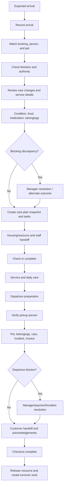

# Check-In and Checkout Journey

- **Status:** In progress
- **MVP priority:** P0
- **Primary users:** Front desk, manager, customer/pickup person, and receiving care staff
- **Services:** Boarding, daycare, and grooming

## Purpose

This document defines the staff- and customer-facing experience for receiving a pet into care and safely returning the pet at departure. It turns a commercial booking into a verified operational care plan at check-in, then reconciles care, identity, belongings, service completion, incidents, and money before checkout.

Operations owns check-in and checkout state. Booking, IAM, Customer, Pet, Eligibility, Capacity, Pricing, Payments, Communications, and Reporting provide authoritative references and outcomes.

## Journey outcomes

- Staff immediately know who is expected, who arrived, what is blocking intake, and what must happen next.
- Each arriving pet is physically and digitally matched to the correct booking, customer, care instructions, medications, belongings, and operational visit.
- Material changes are reviewed rather than silently overwriting a confirmed booking or master pet profile.
- Check-in creates an immutable care-plan snapshot and the right operational tasks.
- Pickup verifies the actual person without exposing the full authorization list unnecessarily.
- Checkout does not hide unresolved incidents, missing belongings, incomplete services, or financial blockers.
- Pets may be handed off individually when rules permit without corrupting sibling, invoice, resource, or booking state.
- Every critical decision, override, signature, actual time, and handoff is auditable.

## Core principles

1. Arrival is not check-in, and payment is not checkout.
2. Verify the pet and person before revealing or acting on sensitive records.
3. Treat check-in as a care-plan review, not a signature collection exercise.
4. Compare current information to the booking snapshot and master profile; do not silently replace either.
5. Capture physical items, quantities, condition, and custody when they enter or leave the facility.
6. Place safety, medication, allergy, behavior, and pickup restrictions above speed.
7. Let authorized staff resolve routine issues without enabling broad overrides.
8. Keep customer participation clear while the staff member remains responsible for the operational record.
9. Continue safe animal-care workflows during nonessential communication or reporting outages.
10. End with an explicit operational handoff, not an ambiguous `Done` button.

## Journey overview



## Operational states

### Check-in session

```text
Not started
  -> In progress
  -> Waiting on customer
  -> Waiting on staff review
  -> Blocked
  -> Ready to complete
  -> Completed
  -> Cancelled / Abandoned
```

### Checkout session

```text
Not started
  -> Preparing
  -> Waiting for pickup
  -> Pickup verification
  -> Reconciliation
  -> Blocked
  -> Ready to complete
  -> Completed
  -> Cancelled / Returned to care
```

Sessions are resumable. A second staff member can take over with current status and audit history. Concurrent editing uses conflict protection.

## Entry points

### Check-in

- Today > Arrivals
- Booking detail > Start check-in
- Customer search > Eligible expected booking
- Scanned/entered booking reference when supported
- Authorized walk-in intake path
- Grooming appointment board
- Daycare attendance list

### Checkout

- Today > Departures
- Ready for pickup list
- Pet/visit detail > Start checkout
- Booking detail > Operational visit
- Grooming board > Ready
- Customer arrival/pickup queue

A user cannot start the workflow from an inaccessible tenant, location, booking, pet, or operational visit even when they know its identifier.

## Arrivals workspace

### Default grouping

- Due now
- Arrived, check-in not complete
- Expected later
- Blocked or manager review
- Late arrivals
- No-show review
- Completed check-ins

### Arrival row/card

- Scheduled arrival window and actual arrival status
- Customer and expected handoff person
- Pet identity with photo/fallback and disambiguating details
- Service and stay/appointment period
- Eligibility/document status
- Medication and special-care indicator
- Balance or agreement blocker without unauthorized detail
- Assigned housing/resource when known
- Check-in progress and primary action

Critical alerts remain visible regardless of list filters. Staff cannot bulk-complete check-in.

## Record arrival

Recording arrival captures:

- Actual arrival time
- Receiving staff/location
- Person presenting the pet
- Booking matched or unresolved-arrival state
- Optional queue position/wait status

`Arrived` informs the facility that the customer is present. It does not place the pet in care, trigger care tasks, or imply that intake requirements passed.

### Unmatched arrival

If a person or pet cannot be matched safely:

- Search by booking number, customer contact, pet, and scheduled time within authorized scope.
- Do not reveal complete customer, pet, or pickup details before sufficient matching.
- Allow manager-reviewed walk-in or booking correction only under configured policy.
- Record the unresolved arrival and outcome.
- Never attach the pet heuristically to a similar name.

## Step 1: Verify booking, person, and pet

### Booking verification

- Tenant and location
- Booking number and status
- Expected date/time
- Service and pet list
- Confirmation/pending status
- Cancellation, no-show, or modification state
- Check-in eligibility from Booking

Pending request, waitlist entry, or draft is not a confirmed booking. A manager may resolve according to availability, pricing, and payment rules; front desk cannot simply check it in.

### Presenting person

Record relationship and verify identity according to policy:

- Booking customer
- Household member with authority
- Drop-off person explicitly authorized for the booking/pet
- Courier/transport provider when supported
- Unverified person requiring customer/manager resolution

Verification stores method category and outcome, not unnecessary identity-document images or numbers.

### Pet verification

Use at least two safe identifiers where possible:

- Pet name
- Photo
- Breed/appearance
- Sex
- Age
- Weight/size
- Microchip suffix only when necessary and permitted
- Customer/household association

Staff explicitly confirm each pet. Similar names, littermates, or look-alike pets require stronger disambiguation.

## Step 2: Preflight blockers

The preflight groups blockers by severity and owner.

### Blocking by default

- Booking is not in a check-in-eligible state
- Wrong location or service date outside allowed policy
- Pet identity cannot be verified
- Presenting person lacks required authority
- Required agreement/signature missing
- Non-overrideable eligibility failure
- Required vaccine/document not valid or approved under tenant policy
- Critical medical/behavior discrepancy without authorized plan
- Medication instruction/container discrepancy that prevents safe administration
- Facility cannot fulfill required care or capacity
- Merchant/payment policy requires resolution before check-in

### Warning or resolvable according to policy

- Noncritical contact update
- Expiring but currently valid document
- Minor belongings discrepancy
- Optional add-on question
- Balance allowed under configured departure/arrival policy
- Nonblocking pet-profile update

Each item shows:

- What is wrong
- Which pet/booking it affects
- Why it matters
- Who can resolve it
- Allowed resolution
- Whether it blocks one pet or the whole booking

## Step 3: Confirm customer and emergency information

Review:

- Primary customer contact
- Emergency contacts and priority
- Veterinary contact when required
- Authorized pickup people and booking-specific changes
- Expected pickup window/person
- Communication limitations
- Contact method for service or medical decisions

Updates to master customer data require appropriate permission and consent. The check-in snapshot preserves the effective contacts for this stay.

### Pickup changes at check-in

Adding or changing a pickup person requires:

- Authorized customer/household actor
- Pet and booking scope
- Effective dates or booking-only scope
- Contact/relationship information
- Verification expectations
- Audit event

Staff do not add the person based solely on a verbal claim from someone without authority.

## Step 4: Review pet care information

The UI compares three sources:

1. Master pet profile
2. Confirmed booking/intake snapshot
3. Changes declared or observed at arrival

Differences are shown by category, with prior and proposed values where safe.

### Review categories

- Medical conditions and allergies
- Medication
- Feeding and diet
- Behavior and handling
- Mobility/accessibility needs
- Group-play eligibility
- Potty routine
- Sleep/housing preferences
- Grooming instructions
- Recent illness, injury, symptoms, or veterinary treatment
- Contact authorization for unexpected service changes

### Change outcomes

| Outcome | Behavior |
|---|---|
| Accept for this visit | Included in care-plan snapshot; may propose master-profile update |
| Accept and update master | Authorized structured update plus snapshot |
| Needs manager review | Check-in waits or follows controlled conditional path |
| Needs veterinary/customer clarification | Record contact action and response |
| Cannot accommodate | Alternative service, delayed intake, cancellation, or refusal under policy |

Staff do not diagnose. Observed symptoms or reported medical changes use structured safety escalation.

## Medication intake

Medication intake is pet-specific and medication-specific.

### Required review

- Medication name exactly as provided
- Prescribed/presented label match
- Dose and unit
- Route
- Schedule and due windows during stay
- First/last dose timing relative to check-in/out
- Food dependency
- Storage requirements
- Expiration when visible/required
- Quantity received
- Container count and description
- Prescriber/label instructions when policy requires
- Customer-reported purpose and special instructions

### Discrepancies

- Unlabeled or incorrectly labeled container
- Instructions differ from booking/profile
- Dose/unit ambiguity
- Insufficient quantity
- Expired/damaged medication
- Storage cannot be met
- Controlled or restricted medication policy issue
- Customer requests staff to alter dosage without authorized instruction

The system does not let a staff member resolve a clinical discrepancy by free-text acknowledgment alone. The allowed response may include manager review, veterinarian/prescriber clarification, customer taking medication home, or inability to accept the pet.

### Custody record

For accepted medication record:

- Received quantity/container
- Receiving staff and customer/presenter
- Actual time
- Condition and photo when required
- Storage location/classification
- Expected administration count
- Expected return/disposition
- Signatures/acknowledgements when policy requires

## Food and supplies intake

### Food

- Food source: customer supplied or facility supplied
- Brand/type and preparation
- Meal quantity and units
- Meals/times
- Supplements/treats
- Allergy/cross-contamination warnings
- Quantity received by bag/container/portion
- Expected sufficiency and shortage plan
- Refrigeration/freezer needs
- Container labels

The UI calculates an informational sufficiency estimate but does not hide staff judgment or unusual feeding plans.

### Belongings

Examples:

- Leash/collar/harness
- Bedding/blanket
- Toys
- Bowls
- Carrier/crate
- Clothing
- Documents
- Food containers
- Medication containers

Each accepted item may include quantity, description, identifying label, condition, photo, permitted-use note, storage location, and expected return. Prohibited or discouraged items are clearly declined and recorded as returned immediately.

## Step 5: Arrival condition assessment

Staff perform a non-diagnostic intake observation appropriate to service:

- General demeanor and energy
- Mobility
- Visible skin/coat condition
- Visible wounds, swelling, or irritation
- Eyes/ears/nose observations
- Coughing, breathing, vomiting, or diarrhea reported/observed
- Hydration/appetite concern reported
- Fleas/ticks/parasite concern
- Cleanliness/matting for grooming
- Behavior during handling
- Existing property such as bandage, cone, or assistive device

### Evidence

Photos are required only by configured risk/service policy or when documenting condition/discrepancy. Consent, sensitive-media access, retention, and customer visibility apply.

### Concerning condition

```text
Observation
  -> structured severity
  -> manager/safety review
  -> customer discussion
  -> veterinary/emergency path when policy requires
  -> accept with documented plan, delay, redirect, or refuse service
```

The UI states that observations are not veterinary diagnosis.

## Step 6: Agreements, payment, and service changes

### Agreements

- Show missing or changed agreement only.
- Identify signer authority.
- Display readable current policy version.
- Record signature/acknowledgement with actor, time, version, and booking.
- Never use prechecked acceptance.

### Arrival service changes

Common examples:

- Add bath or nail trim
- Change grooming style/service after assessment
- Add special handling fee under approved policy
- Change departure time
- Add/remove a pet or service

Every material change uses Booking/Pricing revision rules:

- Current availability/capacity
- Eligibility
- New quote/delta
- Policy effect
- Customer authorization
- Payment effect
- Audit and communication

Operations cannot directly overwrite the confirmed booking or invoice.

### Balance at arrival

Show only what the role needs:

- No balance issue
- Balance due now
- Payment processing/reconciliation
- Approved pay-later arrangement
- Manager decision required

Payment collection uses Payments. A successful processor result is not manually declared. If policy allows care to begin before resolution, the exception is explicit and due before checkout.

## Step 7: Care-plan snapshot

Before completion, show a structured final review:

- Pet identity and critical alerts
- Feeding tasks
- Medication tasks
- Potty/activity/rest tasks
- Grooming/service instructions
- Handling and group-play restrictions
- Housing requirements/preferences
- Wellness follow-ups
- Customer update/report-card expectations
- Emergency and decision contacts
- Belongings/food/medication custody
- Outstanding permitted actions

### Snapshot rules

- Snapshot is immutable once check-in completes.
- Corrections append a reviewed care-plan amendment.
- Snapshot records source references and differences from master/booking data.
- Task generation is deterministic and traceable to the snapshot.
- A proposed master pet update is separate from current-visit operational truth.
- Every in-care staff view uses the current effective snapshot plus amendments.

## Step 8: Housing/resource and operational handoff

### Assignment

- Confirm a compatible ready resource or service station.
- Show cleaning/readiness state.
- Respect resource commitment, size, separation, accessibility, sibling request, isolation, and safety constraints.
- Manager override requires allowed reason and does not override physical incompatibility or out-of-service state.

### Handoff

Receiving care staff see:

- Pet identity
- Assigned area/resource
- Critical alerts
- First due tasks
- Medication/feeding supplies location
- Settling/initial assessment task
- Outstanding nonblocking action
- Customer departure status

The front desk and receiving staff may use a handoff confirmation where policy requires. Customer departure before operational handoff completes creates an urgent internal exception, not an invisible gap.

## Complete check-in

The final action is labeled `Complete check-in` and shows affected pets.

Completion records:

- Actual check-in time
- Receiving staff and completing staff
- Person who presented the pet
- Pet-specific completion
- Care-plan snapshot/version
- Accepted custody items
- Signatures/agreements
- Resource/handoff state
- Approved exceptions and reviewers
- Timeline event

### Completion effects

- Pet operational state becomes checked in/in care as defined.
- Due care tasks activate.
- Booking receives authorized status event.
- Customer communication may be requested.
- Arrival queue updates.
- Capacity/resource occupancy reflects actual operational state.

Idempotent retry cannot create duplicate visits, tasks, custody records, or communications.

## Multi-pet check-in

- Present a booking-level overview plus pet-specific progress.
- Verify each pet independently.
- Shared customer, agreements, and booking data may be confirmed once when legally/operationally valid.
- Medication, condition, food, belongings, care plan, and resource assignment remain pet-specific.
- One blocked pet does not automatically block siblings unless booking, payment, shared housing, transport, or policy requires it.
- Completing one pet shows the remaining pets clearly; the booking is not presented as fully checked in until all intended pets reach an allowed outcome.

## Walk-in and unexpected arrival

MVP walk-in support is controlled, not a shortcut.

### Examples

- Customer arrives on wrong date
- Booking was not completed
- Extra pet arrives
- Grooming walk-in request
- Daycare customer arrives without an eligible occurrence

### Resolution

1. Identify customer/pets and current booking state.
2. Search current capacity and service eligibility.
3. Create or revise a booking through Booking.
4. Calculate current price/policies.
5. Collect required payment/acceptance.
6. Create operational visit only after booking reaches an eligible state.

An emergency safety intake, if ever supported, uses a separate policy and high-risk audit path.

## No-show and abandoned check-in

- Expected arrivals become late according to location/service rules.
- Staff contact attempts use approved communication paths.
- No-show is a Booking decision performed by authorized staff with policy outcome.
- An arrived but incomplete check-in cannot be marked no-show without resolving actual pet custody.
- Abandoned sessions retain entered evidence and reason according to policy but do not create an in-care state.
- Capacity release follows committed Booking/Capacity transitions.

## Departure preparation

Preparation begins before expected pickup.

### Generated checklist

- Confirm requested pickup window and person
- Complete required final feeding/medication/activity tasks
- Review upcoming dose relative to pickup
- Complete grooming/add-ons
- Final wellness/condition check
- Resolve incidents or prepare customer communication
- Draft/publish required report card
- Gather belongings, remaining food, and medications
- Prepare medication administration/return summary
- Confirm invoice and balance state
- Confirm resource release/turnover dependency

### Ready-for-pickup gate

A pet may enter `Ready for pickup` only when required service and preparation tasks pass or an authorized exception is recorded. Customer notification is a separate delivery outcome and does not control the state.

## Departures workspace

### Default grouping

- Preparing
- Ready for pickup
- Customer arrived / verification needed
- Checkout in progress
- Blocked
- Late pickup
- Completed

### Departure row/card

- Pickup window and current time status
- Customer/expected pickup person
- Pet identity
- Service/stay and location
- Readiness status
- Outstanding care/service task
- Incident/report-card status
- Belongings/medication reconciliation status
- Balance blocker without unauthorized financial detail
- Primary action

## Step 1 checkout: Verify pickup person

### Safe lookup

Ask the person to identify themselves and the pet/booking before staff reveal authorization details. Search current effective:

- Customer/household authority
- Booking-specific pickup authority
- Time-bounded pet pickup authority
- Court/legal/safety restriction where applicable

### Verification record

- Person name and relationship
- Authorization source and scope
- Verification method category
- Staff member and actual time
- Outcome
- Exception/manager review if applicable

Do not display or read the complete authorized-person list to an unverified person. Do not store full identity-document details unless policy specifically requires it.

### Unauthorized pickup attempt

```text
Mismatch
  -> do not release pet
  -> protect authorization details
  -> contact authorized customer through verified method
  -> manager/safety escalation
  -> record attempt and outcome
  -> incident/security workflow when warranted
```

Staff do not add authorization solely because the person is physically present or knows booking details.

## Step 2 checkout: Pet and condition review

- Confirm correct pet and current operational visit.
- Record final observable condition appropriate to service.
- Compare relevant arrival condition and incidents.
- Identify new injury, illness, grooming condition, or behavior issue.
- Capture photo/evidence when required.
- Confirm customer-visible explanation and escalation.

A concerning departure condition may block handoff pending manager, customer, or veterinary/emergency action according to policy.

## Step 3 checkout: Care and service reconciliation

### Care summary

- Meals and appetite
- Medication administrations, refusals, misses, and next dose
- Elimination/activity/wellness summary
- Material behavior observations
- Outstanding care task or exception

### Service summary

- Boarding/daycare completion
- Grooming services/add-ons completed
- Approved service changes
- Quality/rework issue
- Report card/public media status

Customer-safe summaries do not hide a missed/refused medication behind a generic `Medication complete` label.

### Unresolved incident

Incident state identifies:

- Whether departure is blocked
- Manager review status
- Customer notification/acknowledgement requirement
- Evidence/report availability
- Follow-up owner and next action

Checkout cannot mark an incident resolved merely to allow departure.

## Step 4 checkout: Custody reconciliation

### Belongings

For each item record:

- Returned
- Consumed/disposed as expected
- Missing
- Damaged
- Customer declined return
- Transferred to another active booking when permitted

Missing/damaged items require search, manager review, customer communication, and resolution state according to severity. Checkout does not silently remove the item from the list.

### Food

- Remaining quantity/container
- Returned, disposed, donated with consent, or transferred under policy
- Any shortage/substitution during stay that needs disclosure

### Medication

- Original quantity/container
- Documented administrations/disposition
- Expected versus actual remaining quantity
- Return quantity and condition
- Actual person receiving it
- Discrepancy and manager review

Medication discrepancies are safety events and cannot be resolved as ordinary missing property.

## Step 5 checkout: Invoice and payment

Checkout requests authoritative financial state from Payments:

- Finalized/open invoice status
- Prior deposit/payment allocations
- Approved service changes and adjustments
- Refund/credit state
- Balance due
- Payment processing or dispute state
- Pay-later/manager exception eligibility

### Payment collection

- Show itemized customer-facing invoice.
- Confirm amount and tender.
- Use processor-tokenized collection.
- Prevent duplicate submission.
- Handle additional authentication.
- Reconcile uncertain outcome before retry.
- Produce receipt after successful outcome.

Operations does not edit invoice amount or mark processor payment successful.

### Outstanding balance

Policy determines whether checkout:

- Requires payment before departure
- Allows manager-approved pay later
- Allows invoice follow-up
- Uses approved credit
- Escalates merchant/payment unavailability

Pet safety and legal custody remain considered. A financial dispute is not handled by concealing or physically retaining a pet outside approved law/policy.

## Step 6 checkout: Customer handoff

Review with the customer/pickup person:

- Pet identity and condition
- Care/service summary
- Medication summary and next dose
- Incidents or follow-up
- Report card/receipt delivery
- Belongings, food, medication returned
- Required acknowledgements/signatures
- Rebooking/contact guidance where appropriate

Staff record questions, refused acknowledgment, and follow-up ownership. A signature acknowledges receipt/communication according to policy; it does not erase incident, payment, or service obligations.

## Complete checkout

The final action is labeled `Complete checkout` and names the pet(s).

Completion requires:

- Verified pickup authority
- Pet-specific departure readiness
- Required final care/service outcomes
- Incident/manager-review state allowing departure
- Custody reconciliation
- Financial outcome allowing departure
- Required customer handoff/acknowledgements

Completion records:

- Actual checkout time
- Pickup person and verification
- Completing staff
- Pet-specific state
- Final care-plan/service summary reference
- Returned custody items
- Invoice/payment reference
- Signatures/acknowledgements
- Approved exceptions
- Timeline event

### Completion effects

- Pet leaves in-care state.
- Booking receives authorized checkout event.
- Customer can access final receipt/report card according to publication state.
- Resource assignment is released operationally.
- Cleaning, sanitation, inspection, and setup tasks are created.
- Visit progresses toward completion after remaining administrative work finishes.

## Partial checkout

Partial checkout may apply when:

- One sibling pet leaves before another
- One service item completes while another remains active
- A pet transfers to a linked booking

### Rules

- Verify the selected pet independently.
- Allocate belongings, medication, food, charges, and payments explicitly.
- Preserve remaining pets' resource, care tasks, custody items, contacts, and balance.
- Booking summary shows partially checked-out state without marking the whole booking complete.
- Shared items require a recorded disposition.
- Customer communication identifies which pet left.

## Early and late pickup

### Early pickup

- Record actual time.
- Recalculate only through approved booking/pricing policy.
- Do not remove completed charges or create refunds automatically.
- Adjust future care tasks and medication handoff safely.
- Release resource only after checkout completion.

### Late pickup

- Show pickup-window breach and contact attempts.
- Generate configured fee only through Pricing/Payments.
- Preserve pet care tasks while still in custody.
- Escalate staffing/location closure issues.
- Do not mark checked out at scheduled time.

## Checkout cancellation / return to care

If checkout starts but the pet remains:

- Cancel or pause the checkout session with reason.
- Preserve verification and reconciliation work appropriately.
- Return pet status to the correct in-care/ready state.
- Reopen future care tasks if needed.
- Do not release resource or create turnover.
- Revalidate pickup authority and financial state when resumed.

## Concurrent and interrupted work

- Session owner and last update are visible.
- Another authorized staff member may take over with an explicit handoff.
- Conflicting edits show what changed; safety data is not silently overwritten.
- Autosave preserves nonfinal draft progress.
- Critical completion uses idempotent server commands.
- Browser refresh restores the current session after reauthorization.
- A revoked user cannot continue from cached state.

## Network and dependency failures

| Failure | Check-in behavior | Checkout behavior |
|---|---|---|
| Booking unavailable | Do not create unverified normal visit; use approved downtime process | Preserve pet custody; use safe read cache/downtime procedure |
| Eligibility delayed | Manager/policy pending path or wait | Usually informational unless unresolved safety issue |
| Payment unavailable | Follow arrival exception policy; no manual success | Follow departure policy and record pending financial action |
| Communications unavailable | Check-in can complete; queue confirmation | Checkout can complete; queue receipt/report delivery |
| Reporting unavailable | No effect on care workflow | No effect on care workflow |
| Storage upload failed | Preserve structured record; retry required evidence | Preserve structured record; retry required evidence |
| Client loses connection during completion | Reconcile idempotent status before retry | Reconcile idempotent status before retry |

A formal downtime runbook will define minimum local/read access, paper fallback if required, later reconciliation, and audit expectations. The UI never claims a critical completion succeeded without authoritative confirmation.

## Responsive design

### Shared front-desk desktop/tablet

- Two-pane queue and session where space permits
- Keyboard-friendly search and scanning
- Persistent pet identity and critical alert header
- Summary of incomplete sections
- Clear handoff between staff

### Tablet/mobile intake

- One focused section at a time
- Large pet confirmation and custody controls
- Camera integration for permitted evidence
- Sticky completion only after all blockers are visible
- Medication/food/belonging lists optimized for touch
- No critical table requiring horizontal scrolling

### Customer participation

When a customer signs or confirms information on a staff device:

- Enter a constrained customer-review mode.
- Hide internal notes, other customers, staff navigation, financial controls, and sensitive internal alerts.
- Require staff reauthentication or secure return to staff mode where risk warrants.
- Do not hand the customer an unrestricted authenticated business session.

## Accessibility

- Queue status is available as text, not color alone.
- Pet photos have identifying alternatives but do not duplicate nearby names unnecessarily.
- Step and section completion are announced.
- Error summary links to the affected pet/section.
- Medication and belonging quantity controls have explicit units and labels.
- Dialogs and signature interactions support keyboard and screen reader use.
- Customer signature is not the only way to acknowledge when an accessible alternative is legally allowed.
- Camera/photo flows provide noncamera alternatives where possible.
- Focus returns predictably after manager review, payment, or customer participation.
- Touch targets follow care-workflow sizing.

## Permissions presentation

| Action | Front desk | Care staff | Groomer | Manager | Customer/pickup |
|---|:---:|:---:|:---:|:---:|:---:|
| Record arrival | Yes | Configurable | Assigned appointment | Yes | No |
| Verify person/pet | Yes | Configurable | Grooming intake | Yes | Participate |
| Review care plan | Relevant | Assigned | Grooming relevant | Yes | Confirm customer-safe data |
| Intake medication | Permission based | Permission based | No by default | Permission based | Present/confirm |
| Override blocker | No | No | No | Restricted | No |
| Complete check-in | Yes | Configurable | Grooming-specific | Yes | No |
| Verify pickup | Yes | No by default | Configurable | Yes | Present identity |
| Collect payment | Permission based | No | Configurable | Yes | Pay |
| Complete checkout | Yes | No by default | Grooming-specific | Yes | Receive/acknowledge |

The UI may hide unavailable actions, but server authorization and domain state rules make the decision.

## Audit and events

### Material events

- `operations.arrival_recorded`
- `operations.check_in_started`
- `operations.check_in_blocked`
- `operations.check_in_override_recorded`
- `operations.medication_received`
- `operations.belonging_received`
- `operations.care_plan_snapshotted`
- `operations.pet_checked_in`
- `operations.departure_preparation_started`
- `operations.pet_ready_for_pickup`
- `operations.pickup_verification_failed`
- `operations.checkout_started`
- `operations.checkout_blocked`
- `operations.belonging_reconciled`
- `operations.medication_returned`
- `operations.pet_checked_out`
- `operations.resource_turnover_requested`

### Audit details

Include actor, tenant, location, booking, operational visit, pet, actual time, recorded time, device/session, action, prior/current state, reason, evidence reference, approval, and correlation ID as appropriate. Do not put medical free text, document content, payment credentials, or identity-document numbers into general audit payloads.

## Measurement

- Expected, arrived, checked-in, late, and no-show counts
- Median and percentile check-in/checkout duration
- Time from arrival to operational handoff
- Blocker frequency by category and service
- Medication/food/belonging discrepancy rate
- Care-plan changes at arrival
- Pickup verification failure/escalation count
- Pets ready on time
- Missing/damaged belonging rate
- Medication custody discrepancy rate
- Balance-related checkout delay
- Partial checkout frequency
- Resource release-to-ready duration
- Customer wait time at arrival and pickup

Metrics distinguish operational delay from customer arrival/pickup behavior and system dependency failure. Speed never becomes the only success measure; safety and reconciliation are guardrails.

## Screen inventory

### Check-in

- Arrivals queue
- Arrival match/search
- Check-in overview
- Person and pet verification
- Blocker review
- Customer/emergency/pickup review
- Pet care changes
- Medication intake
- Food and supply intake
- Belongings intake
- Arrival condition assessment
- Agreements/signatures
- Arrival service change/delta quote
- Balance resolution
- Care-plan final review
- Housing/resource assignment
- Operational handoff
- Completion/result
- Manager review/override
- Unmatched/walk-in resolution

### Checkout

- Departures queue
- Departure preparation checklist
- Ready-for-pickup review
- Pickup person verification
- Pet/final condition review
- Care/service summary
- Incident resolution gate
- Belongings reconciliation
- Food reconciliation
- Medication reconciliation/return
- Invoice/payment
- Customer handoff/signature
- Completion/result
- Partial checkout
- Unauthorized pickup escalation
- Checkout cancelled/returned to care

## Acceptance scenarios

### CIO-AC-001: Arrival is not check-in

**Given** a customer arrives with a pet whose vaccine record is unresolved  
**When** staff records arrival  
**Then** the queue shows the customer present, but the pet does not enter in-care state until the blocker is resolved under policy.

### CIO-AC-002: Correct pet verification

**Given** two expected pets share the same name  
**When** staff begins check-in  
**Then** the UI requires additional identifying context and does not rely on name or photo alone.

### CIO-AC-003: Medication discrepancy

**Given** the medication container label differs from the booking instruction  
**When** staff records intake  
**Then** completion is blocked, the discrepancy is structured and escalated, and staff cannot resolve it by checking a generic acknowledgment.

### CIO-AC-004: Care-plan snapshot

**Given** the customer reports an approved feeding change at arrival  
**When** check-in completes  
**Then** the visit snapshot and generated meal tasks use the approved change while the prior booking snapshot remains interpretable.

### CIO-AC-005: Customer device privacy

**Given** a customer signs an agreement on the front-desk tablet  
**When** customer-review mode is active  
**Then** internal notes, other customers, business navigation, and staff actions are unavailable.

### CIO-AC-006: Multi-pet partial check-in

**Given** two sibling pets arrive and one has a blocking health issue  
**When** policy allows the other pet to stay  
**Then** the eligible pet can complete check-in while the booking clearly shows the second pet's unresolved outcome.

### CIO-AC-007: Completion retry

**Given** the network response is lost while check-in completes  
**When** staff retries  
**Then** the authoritative session is reconciled and no duplicate visit, task, custody record, or notification is created.

### CIO-AC-008: Unauthorized pickup

**Given** a person not currently authorized requests a pet  
**When** staff checks pickup authority  
**Then** the pet is not released, the full authorized list remains private, and a manager/customer verification path is recorded.

### CIO-AC-009: Medication return discrepancy

**Given** remaining medication quantity does not reconcile with administrations and disposition  
**When** checkout reaches reconciliation  
**Then** checkout enters safety review and cannot silently mark the container returned.

### CIO-AC-010: Payment uncertainty

**Given** final payment requires processor reconciliation  
**When** checkout attempts collection  
**Then** staff cannot charge again or mark payment successful until authoritative status resolves or an allowed departure exception is recorded.

### CIO-AC-011: Missing belonging

**Given** a recorded blanket cannot be located  
**When** belongings are reconciled  
**Then** the item is marked missing, search/manager/customer actions are recorded, and it is not deleted from the custody list.

### CIO-AC-012: Unresolved incident

**Given** a serious incident has not received required manager review/customer communication  
**When** staff starts checkout  
**Then** the incident gate blocks or conditionally controls departure according to policy and cannot be resolved from the checkout screen alone.

### CIO-AC-013: Partial checkout

**Given** one pet leaves while a sibling remains boarded  
**When** checkout completes for the departing pet  
**Then** only that pet's care, custody, financial allocation, and resource state change, while the sibling remains fully in care.

### CIO-AC-014: Late pickup

**Given** pickup occurs after the configured window  
**When** checkout starts  
**Then** actual time is recorded, any fee is calculated by Pricing, continued care remains documented, and staff do not backdate departure.

### CIO-AC-015: Communication outage

**Given** email/SMS delivery is unavailable  
**When** an otherwise valid check-in or checkout completes  
**Then** operational completion succeeds, delivery is queued/retried, and staff/customer see the communication status separately.

### CIO-AC-016: Resource turnover

**Given** checkout completes from a boarding suite  
**When** the resource is released  
**Then** cleaning/inspection tasks are created and the suite cannot become ready until the turnover workflow passes.

### CIO-AC-017: Checkout is cancelled

**Given** a pickup person leaves before completing verification  
**When** staff cancels the checkout session  
**Then** the pet remains in care, future tasks remain valid, the resource is not released, and the attempt remains audited.

### CIO-AC-018: Walk-in follows booking rules

**Given** a daycare customer arrives without a confirmed occurrence  
**When** capacity exists  
**Then** staff creates/confirms a valid current booking with eligibility, pricing, policies, and payment before check-in.

## Implementation slices

### Slice 1: Standard single-pet boarding

- Arrival queue
- Verification and blockers
- Care/medication/food/belongings intake
- Care-plan snapshot
- Resource handoff
- Departure preparation
- Pickup verification
- Reconciliation/payment
- Checkout and turnover

### Slice 2: Daycare and grooming

- Attendance and grooming board entry
- Service-specific intake/condition
- Short-duration custody
- Grooming approval and ready-for-pickup behavior

### Slice 3: Multi-pet and exceptions

- Partial check-in/out
- Walk-ins and wrong-date arrivals
- Unauthorized pickup
- Complex medication/belonging discrepancies

### Slice 4: Downtime and advanced handoff

- Approved offline/downtime procedures
- Queue handoff and concurrent sessions
- Stronger scanning/photo workflows
- Expanded transport/courier support

## Open decisions

- Whether actual arrival is recorded manually, by customer kiosk, or both
- Which identity verification methods are permitted at pickup
- Which arrival-condition photos are required by service and risk
- Medication custody requirements and controlled-medication scope
- Whether customer signatures are required for routine check-in/out or only selected agreements/incidents
- Default balance policy at arrival and departure
- Which nonblocking actions may remain open after check-in
- Whether resource assignment is mandatory before check-in completion or may be an immediate handoff task
- How grooming condition-based estimates are approved at intake
- How long completed check-in/out sessions remain editable before amendment-only mode
- Initial shared-device customer-review locking approach
- MVP downtime capability for care and checkout

## Related specifications

- [Information Architecture](information-architecture.md)
- [Design System](design-system.md)
- [Customer Booking Journey](customer-booking-journey.md)
- [Identity and Access](../domains/identity-access/README.md)
- [Customer and Household](../domains/customer-household/README.md)
- [Pet and Eligibility](../domains/pet-eligibility/README.md)
- [Booking and Waitlist](../domains/booking-waitlist/README.md)
- [Pricing and Policies](../domains/pricing-policies/README.md)
- [Payments and Invoicing](../domains/payments-invoicing/README.md)
- [Operations: Check-In and Checkout](../domains/operations/check-in-checkout.md)
- [Operations Domain](../domains/operations/README.md)

