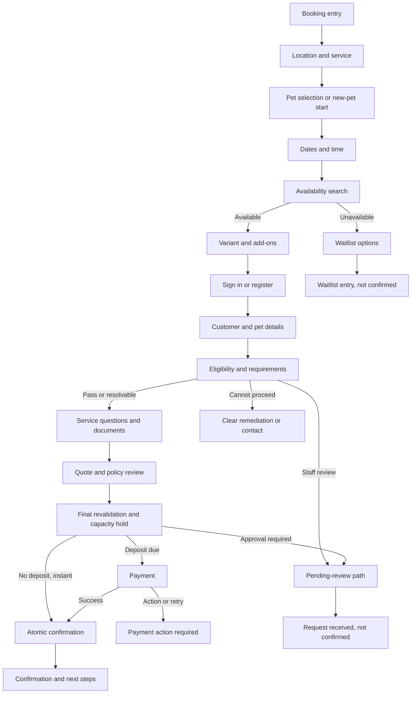

# Customer Booking Journey

- **Status:** In progress
- **MVP priority:** P0
- **Primary audience:** Visitor, customer, and household member
- **Services:** Boarding, daycare, grooming, and compatible add-ons

## Purpose

This document defines the complete customer-facing journey from a public booking entry point through confirmation, pending approval, or waitlist placement. It translates the Booking, Customer, Pet, Eligibility, Service Catalog, Capacity, Pricing, Payments, Communications, IAM, and Website specifications into one coherent experience.

It describes sequencing and interaction. Owning domains remain authoritative for calculations, state changes, access, safety, and money.

## Journey outcomes

- A customer can understand what information is needed before starting.
- New and returning customers can book without duplicating identities, households, or pets.
- Boarding, daycare, and grooming feel consistent while collecting service-specific details.
- Multi-pet bookings remain understandable at pet, service, schedule, and price levels.
- The system checks real capacity, pet eligibility, booking authority, current prices, policies, and required payment before confirmation.
- Interruptions, sign-in, payment authentication, and recoverable failures do not erase valid progress.
- Customers never mistake a draft, request, waitlist entry, or failed payment for a confirmed booking.
- Staff receive complete, trustworthy booking information rather than ambiguous free-form notes.

## Design principles

1. Ask only what is needed for the current service, pet, location, and booking state.
2. Let customers explore dates and services before requiring an account where business rules allow.
3. Authenticate before exposing saved pets, customer details, prices based on private entitlements, or a resumable private draft.
4. Use structured questions for operational and safety data; free text supports but does not replace them.
5. Keep one visible summary of pets, dates, services, add-ons, requirements, price, and amount due.
6. Explain why information is required and who can see sensitive details.
7. Revalidate anything that can change—authority, eligibility, capacity, quote, policies, and payment—before confirmation.
8. Preserve progress safely but never preserve expired capacity or price as though still valid.
9. Make each terminal result unmistakable: confirmed, pending approval, action required, waitlisted, expired, or not completed.
10. Provide a human contact path without turning an inquiry into a booking.

## Entry points

| Entry | Context carried | Expected first step |
|---|---|---|
| Public `Book Now` | Tenant | Location or service |
| Service page | Tenant, service/category, optional location | Confirm location and service |
| Location page | Tenant, location | Select service |
| Customer Portal | Tenant, authenticated customer | Select pets/service or book-again option |
| Pet profile | Tenant, authenticated customer, pet | Select service and dates |
| Past booking `Book again` | Tenant, customer, permitted pet/service hints | Review current selections under current rules |
| Waitlist offer | Tenant, customer, signed offer token | Review offered capacity and authenticate |
| Transactional reminder | Tenant, draft or action reference, purpose-bound token | Authenticate and resume allowed step |

Context is a convenience, not authority. Every value is resolved against current tenant configuration and the signed-in user's relationships.

## Journey map



The exact screen count may change after usability testing. The validation and commitment boundaries may not be removed for visual simplicity.

## Booking shell

The booking shell includes:

- Tenant logo and safe link back to the public site
- Booking title and selected location
- Step name and progress
- Save/exit behavior when available
- Contextual help and tenant contact
- Persistent or easily reachable booking summary
- Accessibility controls inherited from the platform
- Clear secure-payment handoff when applicable

Unrelated website navigation is reduced during the flow. The customer can leave, but the experience warns when current selections or capacity may not be retained.

## Step architecture

```text
1. Service
2. Pets
3. Schedule
4. Options
5. Your details
6. Pet requirements
7. Review
8. Payment (conditional)
9. Result
```

Steps combine or split responsively and by service complexity. Progress labels use customer language rather than domain names such as `capacity commitment` or `eligibility evaluation`.

## Step 1: Location and service

### Location selection

Show only active public locations that offer at least one public booking path. Each option may include:

- Location name
- City/area and address summary
- Relevant hours or drop-off guidance
- Offered service categories
- Contact path

If there is one valid location, preselect it and show it in the summary. A location passed from a public page is preselected but not trusted until resolved.

### Service selection

Use customer-facing service categories and services from the active catalog:

- Boarding
- Daycare
- Grooming
- Assessment when it is a prerequisite

Each choice shows:

- Name and concise description
- Time model such as overnight, day, or appointment
- Approved starting-price or range display when configured
- Important age, vaccine, assessment, or approval requirement summary
- Link to complete details without losing progress

Do not display paused, retired, internal-only, unavailable-channel, or unpriced MVP services as directly bookable.

### Mixed-service handling

MVP supports compatible services and add-ons within one booking model, but the customer begins with one primary service intent. Examples:

- Boarding plus pickup-day bath
- Daycare plus nail trim
- Grooming plus teeth brushing

Independent incompatible primary services create separate bookings or an explicitly linked request. The UI does not imply that unrelated schedules share one capacity commitment.

## Step 2: Pet selection

### Returning customer

After authentication, show pets for which the customer has effective booking authority.

Each pet card includes:

- Photo/fallback and name
- Species/breed summary
- Age and weight where relevant
- Eligibility attention summary
- Service-specific known restriction
- `Select` state

Pets without booking authority are not selectable. Pets with resolvable requirement issues may be selected with an explanation of later action. Pets that cannot use the selected service show the safe reason and alternative path.

### New or unauthenticated customer

Before authentication, collect only enough pet information to search relevant service options when allowed:

- Pet name or temporary label
- Species
- Approximate age/date of birth
- Breed/mix
- Weight or size range
- Sex/altered status only when required
- Initial service-specific eligibility questions

This creates draft data, not a permanent pet profile, until the user authenticates and confirms the relationship.

### Multi-pet selection

- Show which pets receive which service.
- Validate service combinations and shared-resource rules.
- Identify pet-specific add-ons and requirements separately.
- Preserve a clear per-pet schedule and subtotal.
- Explain when pets may share housing only as a request subject to business policy and operational assignment.
- Never infer sibling, household, or compatibility merely because pets share an owner.

## Step 3: Schedule and availability

### Boarding

Collect:

- Arrival date
- Available drop-off window or time
- Departure date
- Available pickup window or time
- Requested accommodation/variant when customer-selectable

Show nights, operational boundaries, holiday/peak indicators, and late pickup implications in plain language. Prevent departure before arrival and validate location-local dates and cutoff rules.

### Daycare

Collect:

- One or more attendance dates permitted by the service
- Full-day, half-day, or session variant
- Drop-off and pickup window when applicable
- Recurrence request when enabled

Recurring selections display occurrences individually before confirmation. One unavailable occurrence does not silently cancel or change the others.

### Grooming

Collect:

- Service/variant
- Preferred date
- Available appointment slot or permitted preference window
- Groomer preference only when supported and not guaranteed
- Pet size, coat, condition, or last-groom information required for duration/pricing assessment

If final duration or price requires staff assessment, the journey clearly enters request/approval rather than instant confirmation.

### Availability results

Results distinguish:

- Available
- Limited availability
- Request only
- Unavailable
- Contact required
- Data temporarily unavailable

Availability displays the time zone and location. Search results are not commitments. Selecting a result may create a short capacity hold according to Capacity rules, with a visible expiration only when meaningful to the user.

### Alternatives

When unavailable, offer only valid alternatives:

- Nearby dates
- Other valid appointment times
- Different service variant
- Another tenant location
- Waitlist
- Contact business

Alternatives never silently change dates, location, pet, service, duration, or accommodation. The user explicitly selects and reviews them.

## Step 4: Options and add-ons

Add-ons are grouped by pet and applicable date/quantity:

- Bath or grooming add-on
- Nail trim
- Individual play or enrichment
- Extra walk
- Treat or service package defined by the tenant

Each displays:

- Customer-facing description
- Applicable pet(s)
- Quantity/date basis
- Price or included status
- Capacity/eligibility limitation

Preselected paid add-ons are prohibited. Recommended options are labeled as recommendations and are not misleadingly difficult to decline.

## Authentication placement

### Returning customer

Customer Portal entries are already authenticated. Public visitors may explore services, dates, and public availability before sign-in, but sign-in is required before saved pets, private entitlements, customer-specific pricing, or permanent draft ownership appears.

### New customer registration

Collect:

- Email
- Password
- Required identity/account fields
- Required platform terms acknowledgment
- Verification step

Marketing consent is separate and optional. Registration does not bundle marketing permission with booking terms.

### Existing-email behavior

If an email belongs to an identity, the UI offers sign-in or secure recovery without revealing relationships to other businesses. It never creates a second account merely because the visitor started as new.

### Return after authentication

The system restores the intended booking draft using a purpose-bound state reference. It re-resolves tenant, location, service, and draft ownership and rejects open redirects or tampered context.

## Step 5: Customer and household details

Confirm or collect:

- Legal and preferred name
- Verified email
- Mobile/telephone number
- Address fields needed by policy or billing
- Emergency contact
- Authorized pickup details where needed
- Preferred transactional channel

Explain which values are stored on the customer profile and which are snapshotted for this booking. Updating a profile does not rewrite historical bookings.

### Booking authority

For each selected pet, the system confirms effective authority to:

- View the pet
- Edit required pet data
- Book the service
- Sign required agreements
- Pay when required

Missing authority uses the household access workflow or staff contact path. Authentication and shared surname/email do not substitute for authority.

## Step 6: Pet profile and eligibility

### Progressive pet profile

Collect only service-relevant fields, while allowing the customer to provide a complete profile:

- Identity and physical traits
- Veterinarian and emergency information
- Medical conditions and allergies
- Medications
- Feeding and dietary instructions
- Behavior, handling, escape, aggression, anxiety, and group-play information
- Grooming/coat details
- Accessibility or special-care needs

Sensitive questions explain why they matter. Customers are not encouraged to minimize risk to obtain a booking.

### Vaccinations and documents

For every required item show:

- Requirement name
- Current status: verified, pending review, expiring, missing, rejected
- Valid-through requirement relative to service dates
- Existing document or upload action
- Due date and blocking effect

Uploading a file produces `processing` or `pending review`, not instant verified status unless a trusted automation is explicitly approved. The journey states whether the booking can remain pending while staff reviews it.

### Eligibility result presentation

| Result | Customer experience |
|---|---|
| Eligible | Continue without unnecessary success ceremony |
| Eligible with action | Continue with visible required action and deadline |
| Pending review | Explain request status and expected next step |
| Assessment required | Offer assessment booking or contact path |
| Temporarily ineligible | Explain safe remediation or eligible future timing |
| Ineligible | Explain customer-safe reason and contact/alternative path |

Internal risk scores, staff-only notes, or sensitive decision logic are never exposed.

## Service-specific intake

### Boarding intake

- Feeding schedule, food source, quantities, supplements
- Medications and administration timing
- Sleep and housing preferences
- Potty routine
- Handling and separation behavior
- Group-play eligibility/preferences
- Belongings and special instructions
- Arrival/departure contacts

### Daycare intake

- Group-play assessment and history
- Energy/play style
- Rest needs
- Feeding/medications during attendance
- Pickup authority
- Recurrence details when selected

### Grooming intake

- Requested services and style
- Coat and skin condition
- Matting disclosure
- Handling sensitivities
- Prior grooming issues
- Grooming authorization boundaries
- Contact preference for price/service changes

Structured choices support staff workflow. Free text is available for nuance and is subject to length, safety, and privacy guidance.

## Waivers, policies, and acknowledgements

### Presentation

- Identify the policy or agreement by clear title.
- Provide readable content or an accessible linked view.
- Highlight material booking-specific terms such as cancellation, deposits, pickup timing, medical authorization, grooming condition changes, and group play.
- Require separate acknowledgment when policy or law requires it.
- Record policy version, actor, time, booking, and evidence.

Checkbox labels do not claim the customer read hidden content. Prechecked acceptance is prohibited.

### Policy changes during a draft

If an applicable policy changes before confirmation:

- Invalidate the old acceptance where material.
- Show that terms changed.
- Present the new version and require renewed acceptance.
- Do not compare legal text in a misleading or incomplete manner.

## Quote and booking review

### Summary structure

```text
Location and schedule
Pets
  -> Primary service
  -> Add-ons
  -> Pet-specific requirements
Charges
  -> Base charges
  -> Adjustments/add-ons
  -> Discounts/credits
  -> Fees
  -> Taxes
Total
Deposit due now
Remaining balance and due timing
Policies and acknowledgements
Required actions / review status
```

### Quote behavior

- Show quote issue/expiration when it matters.
- Explain starting estimates versus final calculated lines.
- Preserve one currency.
- Show coupon or entitlement outcome safely.
- Recalculation creates a new quote and highlights material differences.
- Do not call the deposit an added fee or additional revenue.
- A request-only service may show an estimate with explicit pending-final-review language.

### Edit behavior

Each review section has an Edit link returning to the relevant step. Changing dates, pets, services, location, or eligibility data may invalidate availability, add-ons, quote, documents, or policy acceptance. The user receives an explanation before dependent changes are discarded.

## Final revalidation

Before payment or no-payment confirmation, the system revalidates:

- Identity and booking authority
- Tenant, location, service, and channel state
- Pet eligibility and documents
- Required intake and policy acceptance
- Capacity hold/commitment
- Quote validity and price inputs
- Deposit requirement and merchant capability
- Approval requirement
- Duplicate-submit/idempotency state

### Revalidation outcomes

| Outcome | Response |
|---|---|
| No material change | Continue |
| Price changed | Show new quote and require acceptance |
| Capacity lost | Explain and offer alternatives/waitlist; do not charge |
| Requirement changed | Return to affected requirement with preserved valid data |
| Approval now required | Submit request rather than claim confirmation |
| Merchant unavailable | Preserve draft/hold according to policy and provide safe next step |

## Payment

### Payment screen

Show:

- Merchant/business being paid
- Booking summary and amount due now
- Remaining balance and due timing
- Currency
- Saved eligible methods for authenticated customer
- Secure new-method entry hosted/tokenized by processor
- Applicable policy reminder
- Submit label containing the amount when practical

Full card details never pass through ordinary PetCare application fields.

### Payment states

```text
Ready
  -> Processing
  -> Additional action required
  -> Succeeded
  -> Failed (retryable or terminal)
  -> Indeterminate/reconciling
```

### Rules

- Prevent duplicate submission while processing.
- Use an idempotency key tied to the payment purpose and booking attempt.
- Do not confirm until successful payment and booking/capacity commitment succeed together or through deterministic recovery.
- Do not show failure merely because a synchronous response timed out when processor outcome is uncertain.
- Indeterminate outcomes show `We're confirming your payment` and provide a safe status path, not a second charge button.
- Decline messages are customer-safe and actionable without exposing processor internals.
- Changing amount or quote creates a new payment request rather than reusing an incompatible attempt.

## Confirmation commitment

An instant booking becomes confirmed only when the system can atomically or recoverably finalize:

- Booking revision and status
- Customer/pet/service/authority snapshots
- Capacity commitment
- Quote and policy snapshots
- Payment reference when required
- Human-readable booking number
- Timeline event and communication trigger

### Recovery invariant

A successful deposit cannot become an unexplained orphan charge without a booking recovery record. If a downstream commitment fails, the platform must deterministically:

- Finish confirmation using the same idempotent attempt, or
- Mark the attempt for operational recovery and tell the customer the result is being confirmed, or
- Void/refund according to the failure policy and communicate the outcome

The customer is not instructed to pay again until the original attempt reaches a safe terminal state.

## Result experiences

### Confirmed

Show:

- `Booking confirmed`
- Booking number
- Location, dates/times, pets, services, and add-ons
- Amount paid and remaining balance
- Required next actions and deadlines
- Cancellation summary and policy link
- Add-to-calendar option
- View booking, upload document, or contact business actions
- Confirmation delivery status or destination summary

Celebratory treatment remains restrained and does not obscure requirements.

### Pending approval

Use `Request submitted` or equivalent, not `Booking confirmed`.

Show:

- Request number
- Requested details
- Items under review
- Whether capacity is held and until when, if customer-visible
- Whether any payment was authorized/collected and its status
- Expected response path without unsupported promise
- How to add required information or withdraw the request

### Action required

Show one prioritized list with:

- Action
- Pet/booking affected
- Due time
- Blocking effect
- Resolution control
- Contact path

### Waitlist entry

Use `Added to waitlist`, never `Reserved`.

Show:

- Requested service, pets, dates, location, and flexibility
- No guarantee language
- Offer method and response deadline policy
- Eligibility or document actions that may improve readiness without promising priority
- View and withdraw actions

### Not completed

For expired draft, lost capacity, ineligible pet, or terminal payment failure:

- State clearly that no booking was confirmed.
- State whether money moved.
- Preserve or discard draft data according to policy.
- Offer valid alternatives, waitlist, retry, or contact.

## Waitlist journey

### Entry creation

Collect:

- Customer and pets
- Desired location/service
- Preferred date/time range
- Acceptable alternatives and flexibility
- Expiration/date no longer needed
- Contact channel
- Current requirement status

Display the tenant's matching/offer policy in plain language without disclosing other customers or protected priority logic.

### Offer journey

```text
Offer received
  -> open purpose-bound link
  -> authenticate
  -> verify offer active and intended recipient
  -> review offered slot and deadline
  -> revalidate pets, requirements, quote, policies
  -> pay if required
  -> confirm booking
```

An offer is backed by a time-bounded capacity hold but remains subject to the displayed checks. Expired, declined, withdrawn, or failed offers release the hold according to Booking rules.

## Recurring daycare and grooming

### Pattern selection

- Frequency and days
- Start date
- End condition
- Time/session/appointment preference
- Pets and service

### Occurrence review

List generated occurrences with:

- Date/time
- Availability result
- Price
- Requirement exception
- Confirmation or request status

The customer can confirm eligible occurrences according to policy. The UI never hides unavailable occurrences or presents an entire series as confirmed when only some dates are committed.

## Draft persistence and resume

### Draft types

| Draft | Identity | Persistence |
|---|---|---|
| Anonymous exploration | Browser/session plus signed opaque reference | Short-lived, minimal non-sensitive data |
| Authenticated draft | Identity, tenant, and customer relationship | Saved until configured expiration |
| Payment-in-progress attempt | Identity, booking attempt, payment request | Retained through reconciliation window |
| Waitlist conversion draft | Identity and signed active offer | Until offer expiry or terminal outcome |

### Persistence rules

- Do not store full payment credentials.
- Minimize sensitive medical/behavior data before authentication.
- Encrypt sensitive draft data at rest.
- Expire abandoned drafts and release holds.
- A resumed draft revalidates tenant, user authority, service, capacity, quote, and requirements.
- A customer can discard an authenticated draft.
- Staff can diagnose draft status only under authorized support/business access.

### Cross-device resume

Authenticated customers may resume from another device after sign-in. Anonymous browser state does not automatically attach to an identity unless the signed draft and tenant context validate and the user explicitly continues.

## Timeout and expiration behavior

| Item | Expiration effect |
|---|---|
| Anonymous draft | Personal draft data deleted or minimized according to retention policy |
| Capacity hold | Availability released; selections retained as uncommitted if safe |
| Quote | New quote required; material difference shown |
| Policy acceptance | Reaccept if version or required context changed |
| Verification link | New link can be requested without losing safe authenticated draft state |
| Payment action | Reconcile first; do not create duplicate attempt blindly |
| Waitlist offer | Offer closes and hold releases; waitlist state follows policy |

Countdowns are used only where the platform genuinely enforces the deadline and can account for clock differences. They are not artificial urgency.

## Failure and recovery matrix

| Failure | Customer message | Recovery |
|---|---|---|
| Availability service unavailable | Cannot confirm availability right now | Preserve input, retry, contact; no charge |
| Capacity lost | Selected space is no longer available | Show alternatives/waitlist; no charge |
| Quote failed | Price cannot be confirmed | Preserve draft; contact or retry; never use zero |
| Eligibility dependency delayed | Requirement still being checked | Pending review or retry according to rule |
| Document upload failed | File was not received/accepted | Keep other data and retry that file |
| Authentication interrupted | Sign-in was not completed | Return to safe draft entry |
| Payment declined | Payment was not successful | Use safe decline category and retry/change method |
| Payment uncertain | Payment is being confirmed | Poll/status page; prevent duplicate charge |
| Confirmation recovery active | Final status is being confirmed | Provide reference and notify on resolution |
| Notification failed after confirmation | Booking remains confirmed | Show in portal; retry communication separately |

## Duplicate prevention

Before creating a permanent record, detect likely duplicates without exposing other accounts:

- Identity by verified authentication contact through IAM
- Customer relationship within the tenant
- Pet within the customer's authorized household
- Active booking with same tenant, pets, service, and overlapping schedule
- Active payment request for the same booking purpose

Duplicate warning does not block legitimate repeat or overlapping services automatically. It asks the customer to review and uses server-side idempotency to prevent accidental double submission.

## Privacy and security

- Resolve tenant from a trusted hostname or signed context.
- Use purpose-bound, short-lived state for email and authentication links.
- Do not include sensitive pet health details, full customer data, or payment data in URLs.
- Reauthorize every resumed draft and direct route.
- Protect state-changing browser requests against CSRF where applicable.
- Rate-limit registration, sign-in, availability, coupon, inquiry, and payment attempts.
- Sanitize free text and uploaded filenames; scan documents according to storage policy.
- Do not reveal whether an identity, customer, pet, or booking exists outside the signed-in relationship.
- Record consent separately from required transactional processing.
- Explain sensitive pet-data purpose and audience.
- Use processor-hosted/tokenized payment collection.

## Accessibility

- The journey is fully keyboard operable.
- Step changes update the page title and focus the new step heading.
- An accessible `Step X of Y` text equivalent accompanies visual progress.
- Validation provides an error summary and field-linked messages.
- Availability calendars have list/keyboard alternatives and announce selected dates.
- Price changes and asynchronous status changes are announced without excessive live-region noise.
- Payment provider controls meet the same accessible-name, focus, contrast, and error standards.
- Uploaded-document progress and rejection are announced.
- Mobile zoom, reflow, and large text do not hide booking summary or primary actions.
- Time slots, status, and urgency never rely on color alone.

## Responsive behavior

### Compact

- One primary column
- Summary in a collapsible but status-aware drawer/card
- Sticky action only when keyboard and content remain visible
- Date/time controls optimized for touch with accessible manual alternatives
- Pet and add-on cards with clear selection state
- Payment amount and merchant remain adjacent to the pay action

### Wide

- Form content plus sticky summary column
- Summary follows step edits without implying uncommitted data is confirmed
- Long requirements may use sections/tabs only when sequence remains clear
- Availability may use richer calendar presentation with list alternative

## Content guidance

### Status language

| Internal concept | Customer language |
|---|---|
| Draft | `Booking in progress` |
| Capacity hold | `Held while you finish` when shown |
| Pending approval | `Request submitted — awaiting review` |
| Action required | `More information needed` |
| Pending deposit | `Payment needed to confirm` |
| Confirmed | `Booking confirmed` |
| Waitlist active | `On the waitlist` |
| Payment indeterminate | `We're confirming your payment` |

Avoid `reservation secured`, `you're all set`, or celebratory confirmation language until the booking is actually confirmed and remaining required actions are clearly visible.

### Help text

- Explain why a requirement affects the selected dates.
- Explain `starting at` and final quote differences.
- Explain that waitlist placement is not confirmation.
- Explain whether uploaded records require staff review.
- Explain deposit versus remaining balance.
- Explain request-only services before the customer reaches payment.

## Events and measurement

### Funnel events

- `booking_flow_started`
- `booking_location_selected`
- `booking_service_selected`
- `booking_pet_selected`
- `booking_schedule_submitted`
- `booking_availability_returned`
- `booking_addon_selected`
- `booking_auth_started`
- `booking_auth_completed`
- `booking_requirement_blocked`
- `booking_quote_viewed`
- `booking_policy_accepted`
- `booking_payment_started`
- `booking_payment_succeeded`
- `booking_payment_failed`
- `booking_confirmed`
- `booking_request_submitted`
- `waitlist_entry_created`

Events contain tenant, location, service/category, channel, customer state, and safe result category where permitted. They exclude raw health responses, document contents, payment credentials, free text, and unnecessary identity data.

### Journey metrics

- Eligible booking completion rate
- Completion by service, location, new/returning customer, and device class
- Time to complete by journey path
- Drop-off by step, separated from technical failures
- Availability search success and alternative selection
- Requirement block and remediation completion
- Document review pending rate
- Quote-change rate before confirmation
- Payment failure and indeterminate-outcome rate
- Request approval and waitlist conversion
- Duplicate-submission prevention events
- Support contacts during booking

Funnel denominators use the canonical Reporting definitions. A public page view or accidental start is not automatically an eligible completed booking request.

## Screen inventory

- Booking entry
- Location selection
- Service selection
- Pet selection
- New pet quick profile
- Boarding date/time
- Daycare date/session/recurrence
- Grooming appointment/service detail
- Availability results and alternatives
- Add-ons
- Sign in
- Register and verification
- Customer/household confirmation
- Pet profile sections
- Vaccine/document requirements
- Upload and review status
- Service-specific intake
- Policies and waivers
- Quote/review
- Final-change review
- Payment method and payment action
- Payment additional authentication
- Payment reconciling
- Confirmed result
- Pending approval result
- Action-required result
- Waitlist entry and result
- Draft resume/expired
- Terminal not-completed state

## Acceptance scenarios

### CBJ-AC-001: Returning customer

**Given** an authenticated customer has two pets but booking authority for one  
**When** they start a booking  
**Then** the authorized pet is selectable, the other is unavailable with safe guidance, and no hidden pet data is exposed.

### CBJ-AC-002: New customer resumes after verification

**Given** a new customer selected a service, pet draft, and available date before registration  
**When** they verify their email and return  
**Then** the valid tenant-scoped draft is restored and capacity, quote, and eligibility are revalidated.

### CBJ-AC-003: Multi-pet boarding

**Given** two pets are selected for boarding with different medication and add-on needs  
**When** the customer reviews the booking  
**Then** services, add-ons, requirements, and charges are attributable to the correct pet and shared housing is shown only as a request.

### CBJ-AC-004: Capacity lost before payment

**Given** a search result was available but its hold expires before final validation  
**When** the customer attempts payment  
**Then** no charge is initiated, the loss is explained, and valid alternatives or waitlist are offered.

### CBJ-AC-005: Price changes

**Given** an input change or quote expiration produces a different total  
**When** the customer returns to review  
**Then** the new quote and material difference are shown and accepted before payment.

### CBJ-AC-006: Pending vaccine review

**Given** a customer uploads a required vaccine record that needs staff verification  
**When** the flow evaluates eligibility  
**Then** it shows pending review, does not claim verification, and follows the tenant's permitted pending-request path.

### CBJ-AC-007: Request-only grooming

**Given** grooming price/duration requires coat assessment  
**When** the customer submits details  
**Then** the result says request submitted, identifies review/payment expectations, and does not say confirmed.

### CBJ-AC-008: Payment uncertainty

**Given** processor confirmation times out after the customer authenticates payment  
**When** the browser receives no final result  
**Then** the UI shows reconciliation in progress, blocks duplicate payment, and resolves from authoritative status.

### CBJ-AC-009: Confirmation notification failure

**Given** booking confirmation commits but email delivery fails  
**When** the customer sees the result  
**Then** the booking remains confirmed and visible in the portal while communication retry is handled separately.

### CBJ-AC-010: Waitlist clarity

**Given** requested boarding dates are full  
**When** the customer joins the waitlist  
**Then** the result clearly states no booking is confirmed, shows preferences, and explains offer/withdrawal behavior.

### CBJ-AC-011: Expired waitlist offer

**Given** a customer opens an offer after its deadline  
**When** the system validates it  
**Then** payment and confirmation are unavailable, current waitlist state is shown safely, and new availability may be searched.

### CBJ-AC-012: Recurring partial availability

**Given** a recurring daycare request has eight dates and two are unavailable  
**When** results appear  
**Then** every occurrence is shown with its status and no message implies all eight are confirmed.

### CBJ-AC-013: Changed pet details invalidate eligibility

**Given** the customer changes a pet's age, weight, or behavior answer  
**When** it affects the selected service  
**Then** dependent availability/eligibility results are recalculated and the customer is guided to the affected step.

### CBJ-AC-014: Duplicate submission

**Given** the customer activates Confirm twice during a slow response  
**When** requests reach the server  
**Then** one idempotent booking/payment outcome is produced and no duplicate booking or charge is created.

### CBJ-AC-015: Accessible error recovery

**Given** multiple required fields are invalid  
**When** the customer continues  
**Then** an announced error summary links to each field, valid data remains, and keyboard focus follows the correction flow.

### CBJ-AC-016: Booking-again uses current rules

**Given** a customer selects Book Again from a past booking  
**When** the draft is created  
**Then** prior selections are hints, while current service, eligibility, capacity, pricing, and policies determine the new booking.

### CBJ-AC-017: Inquiry distinction

**Given** a customer sends a contact message after an unavailable result  
**When** the inquiry is received  
**Then** the UI states that the message did not create a booking or waitlist entry.

### CBJ-AC-018: Wrong-tenant resume link

**Given** a signed draft link is opened under another tenant hostname  
**When** context is resolved  
**Then** the draft is not exposed or attached and the user is safely redirected to the intended tenant or a neutral error.

## Implementation slices

### Slice 1: Instant single-pet boarding

- Public entry
- Location/service
- Existing/new customer
- One pet
- Dates and availability
- Eligibility/documents
- Quote/policies
- Deposit
- Confirmation

### Slice 2: Daycare and grooming

- Attendance/session and appointment models
- Service-specific intake
- Request/approval path
- Service add-ons

### Slice 3: Multi-pet and waitlist

- Per-pet services and requirements
- Shared-housing request
- Waitlist entry and offers
- Alternatives

### Slice 4: Recurrence and advanced recovery

- Recurring occurrences
- Cross-device resume
- Detailed payment recovery
- Booking-again and customer entitlements

Implementation slices do not change the domain model; they limit which configured paths are enabled while each vertical journey is tested.

## Open decisions

- How far anonymous visitors may progress before authentication
- When the first capacity hold begins and its customer-visible duration
- Whether one checkout can confirm mixed primary services or creates linked bookings
- Which missing documents permit pending approval versus blocking submission
- Whether new-pet profile completion occurs inside booking or in a focused account subflow
- Initial recurring daycare experience and maximum occurrences
- Exact book-again behavior for historical add-ons and retired services
- How groomer preference affects availability and copy
- Whether tips are collected at booking, checkout, or deferred entirely
- Whether saved payment methods are enabled at MVP launch
- How customers receive updates for payment reconciliation lasting more than a short interval
- Draft retention periods by anonymous/authenticated state

## Related specifications

- [Information Architecture](information-architecture.md)
- [Design System](design-system.md)
- [Identity and Access](../domains/identity-access/README.md)
- [Customer and Household](../domains/customer-household/README.md)
- [Pet and Eligibility](../domains/pet-eligibility/README.md)
- [Service Catalog](../domains/service-catalog/README.md)
- [Resource and Capacity](../domains/resource-capacity/README.md)
- [Booking and Waitlist](../domains/booking-waitlist/README.md)
- [Pricing and Policies](../domains/pricing-policies/README.md)
- [Payments and Invoicing](../domains/payments-invoicing/README.md)
- [Communications](../domains/communications/README.md)

