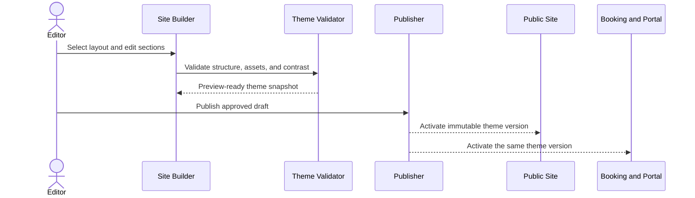

# Customer Site Builder and Theme Continuity

## Product intent

PetCare provides each tenant with a complete public business website and a connected customer application. The public site is not a thin landing page around a generic booking portal. Website visitors should experience one business identity from discovery through booking, account creation, pet setup, payment, and ongoing portal use.

The product combines two ideas:

1. A Shopify-like, section-based website builder for pet-care businesses.
2. A governed customer application whose shell and visual tokens inherit from the published website theme.

## Customer-facing experience model

```text
Tenant website
├── Public pages
│   ├── Home
│   ├── About
│   ├── Services and pricing
│   ├── Gallery and reviews
│   ├── FAQ
│   ├── Contact and locations
│   └── Custom pages, including policies
├── Booking
├── Account creation and verification
├── Pet setup and vaccination upload
└── Customer portal
    ├── Dashboard
    ├── Reservations
    ├── Pets
    ├── Documents and vaccines
    ├── Payments
    ├── Messages
    └── Report cards
```

All branches resolve one published tenant-theme snapshot. A customer must not feel redirected into a separate vendor product.

## Layout families

A layout family controls composition while theme tokens control brand expression. The initial catalog must demonstrate visibly different choices rather than recolored copies.

| Layout family | Header and logo                                                       | Typical character                 | Key variations                                         |
| ------------- | --------------------------------------------------------------------- | --------------------------------- | ------------------------------------------------------ |
| Classic       | Logo left; navigation and actions right                               | Familiar, direct, service-led     | Contained or full-width hero; stacked footer           |
| Centered      | Logo centered; navigation below or split around logo                  | Premium, editorial, image-forward | Announcement bar; centered hero; symmetrical footer    |
| Split         | Brand and copy on one side; media or navigation emphasis on the other | Modern, energetic                 | Alternating content sections; prominent booking action |
| Minimal       | Compact logo and restrained navigation                                | Calm, upscale, content-focused    | Narrow reading width; simplified cards and footer      |
| Playful       | Flexible logo position with bolder imagery and shapes                 | Friendly, family-oriented         | Illustrated accents and softer section boundaries      |

At minimum, the header editor supports logo-left, logo-center, and approved logo-right arrangements. Each arrangement defines mobile collapse behavior and cannot be positioned independently at arbitrary coordinates.

## Structured drag-and-drop editor

The editor is a governed section composer, not an unrestricted web-design canvas.

Editors can:

- Add a section from an approved library.
- Drag sections to reorder them.
- Reorder without dragging through Move Up, Move Down, and keyboard controls.
- Choose a supported variant for a section.
- Edit copy, links, calls to action, imagery, and alternative text.
- Duplicate, hide, or delete optional sections.
- Create custom pages and add them to navigation.
- Preview desktop, tablet, and mobile layouts.
- Save a draft, compare it with the published version, publish, and roll back.

Initial section library:

- Announcement bar
- Header and navigation
- Hero: centered, media-left, media-right, or full-bleed
- Rich text
- Image with text
- Service cards and service details
- Pricing summary
- Requirements and vaccination summary
- Testimonials and reviews
- Gallery
- FAQ
- Location, hours, map, and contact
- Booking call to action
- Newsletter or inquiry form
- Policy and document links
- Footer

Editors cannot inject JavaScript, arbitrary HTML, unsafe CSS, or position controls outside responsive layout constraints.

## Theme object and inheritance

The published theme snapshot includes:

- Layout-family and component-variant identifiers
- Logo assets, logo alternative text, and favicon
- Primary, secondary, accent, link, surface, and text colors
- Approved heading and body font pairing
- Button, card, field, radius, spacing-density, and image-style presets
- Header, navigation, hero, content-width, and footer choices
- Customer-flow shell settings such as compact or full header

The public site, booking flow, signup, verification, pet setup, and portal consume these values from the same versioned snapshot. They may choose an appropriate shell for the task, but they may not silently substitute a platform brand.

Safety, payment, validation, warning, success, and focus semantics remain platform-controlled and accessible.

## Customer-flow visual baseline

The supplied Happy Paws account and pet mockups define the baseline for the initial **Clean Modern** customer-flow presentation:

- White or very light neutral background
- Tenant logo and business name at the top
- Thin neutral borders and restrained corner radii
- Generous whitespace and a focused form width
- Clear horizontal progress steps
- Tenant-colored primary actions
- Simple secondary actions and links
- Optional pet photography or illustration without crowding the form
- Concise review screens before committing important information
- Responsive stacking that preserves the same hierarchy on mobile

Purple is specific to the Happy Paws example. The component system uses semantic theme tokens so another tenant can substitute its own accessible brand palette.

## Theme publishing and propagation



Draft changes appear only in authenticated preview. Publication is atomic: the website and customer application must not display different theme versions during rollout. Rollback creates and activates a new publication from a prior valid snapshot.

## Acceptance criteria

1. A business owner can select among visibly different site layouts, including left-logo and centered-logo options.
2. A business owner can reorder supported page sections with drag-and-drop and an accessible non-drag alternative.
3. A business owner can create and publish a custom policy page without writing code.
4. Changing the published logo or primary action color updates the public site, booking, signup, pet setup, and portal from one versioned theme source.
5. The account and pet flows retain the clean visual structure of the supplied reference while adopting the tenant's own brand.
6. Mobile preview exposes header, navigation, section-order, form, and overflow defects before publication.
7. Invalid contrast, missing required navigation, unsafe content, and unsupported layout combinations block publication with actionable guidance.
8. A theme rollout or rollback never changes operational data, reservations, customer accounts, or pet records.

## Implementation sequence

1. Define the versioned theme schema and inheritance contract.
2. Build the Clean Modern layout and the supplied account/pet flows as the reference implementation.
3. Add left-logo, centered-logo, and split-navigation header variants.
4. Build the structured section editor with preview, publish, and rollback.
5. Add custom pages and navigation management.
6. Add additional layout families using the same section and token contracts.
