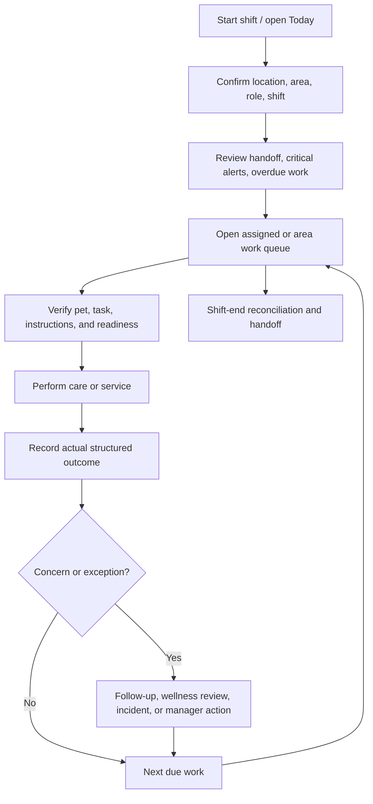
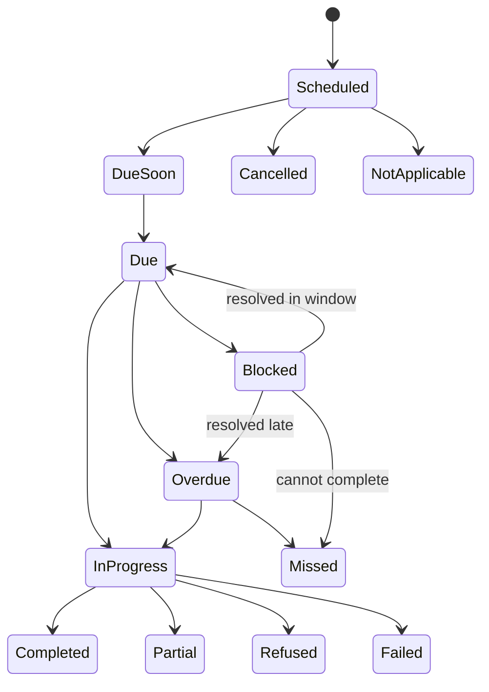
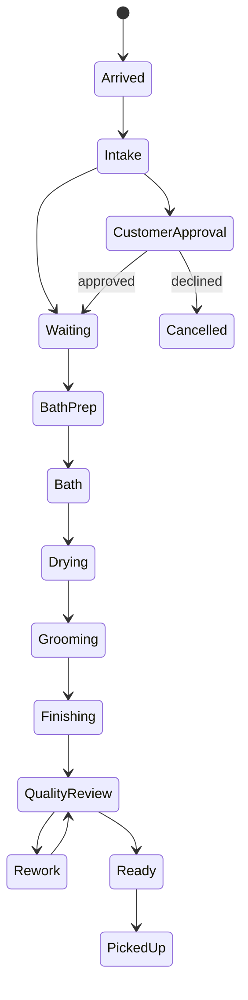

# Daily Care and Service-Execution Journey

- **Status:** In progress
- **MVP priority:** P0
- **Primary users:** Care staff, daycare attendants, groomers, front desk, and managers
- **Services:** Boarding, daycare, grooming, and compatible add-ons

## Purpose

This document defines how staff plan, find, perform, record, verify, escalate, and hand off daily pet-care and service work after check-in and before checkout. It connects boarding routines, daycare attendance and play, grooming production, feeding, medication, activities, wellness observations, incidents, report cards, cleaning, and shift handoff into one operational experience.

Operations owns execution records. Booking, Pet, Resource and Capacity, Communications, Payments, Reporting, and IAM provide authoritative context and downstream outcomes.

## Journey outcomes

- Every staff member can answer `What needs my attention now?`
- Every pet in care is identifiable, locatable, and linked to its current care-plan snapshot.
- Scheduled, due, completed, late, missed, refused, blocked, cancelled, and not-applicable work remain distinct.
- Feeding and medication are recorded pet by pet with structured outcomes.
- Boarding, daycare, and grooming use one operational foundation without flattening their different workflows.
- Safety concerns become visible exceptions, wellness reviews, or incidents rather than disappearing into notes.
- Managers can see workload, risk, capacity, and incomplete work across the current shift.
- Customers receive accurate updates and report cards derived from actual authorized records.
- Shift changes do not lose unresolved tasks, alerts, incidents, supplies, or customer follow-ups.

## Core principles

1. Pet identity and critical alerts stay visible wherever care is recorded.
2. The system prioritizes work by safety, due window, dependency, and operational effect—not by creation order alone.
3. A task checkbox never substitutes for a medication, feeding, incident, grooming, or wellness outcome.
4. Planned time, actual time, and recorded time remain separate.
5. Staff record the actual outcome, including refusal, miss, block, or partial completion.
6. Immediate pet safety comes before complete data entry, with prompt structured follow-up.
7. Bulk work may prepare or assign tasks, but safety-critical completion remains pet-specific.
8. Operational observations are facts and patterns, not veterinary diagnoses.
9. Customer-facing summaries never contradict or conceal actual care and incident records.
10. Filters may reduce clutter but never hide unresolved critical alerts for the staff member's scope.

## Operational day

The operational day is location-specific and may cross calendar midnight for boarding. The UI shows:

- Location and time zone
- Current operational day/shift
- Current time and next major care window
- Pets currently in care
- Expected arrivals/departures affecting workload
- Staffing/area context when available

Reports and work queues preserve canonical instants while displaying location-local times.

## Staff journey overview



## Today workspace

`Today` is the primary operational command center, not an executive dashboard.

### Top-level sections

- Critical and unresolved alerts
- Overdue tasks
- Due now
- Due soon
- Arrivals and departures
- Pets in care by service/status
- Grooming/daycare production exceptions
- Unassigned tasks or resources
- Incidents and manager approvals
- Shift handoff

### Role-aware defaults

| Role              | Default focus                                                      |
| ----------------- | ------------------------------------------------------------------ |
| Care staff        | Assigned/area care tasks due now                                   |
| Daycare attendant | Attendance, play/rest rotations, ratio and safety exceptions       |
| Groomer           | Ordered grooming production board                                  |
| Front desk        | Arrivals, departures, customer/payment/document blockers           |
| Manager           | Critical alerts, overdue work, staffing/load, incidents, approvals |

Users can change views within authorization. The system remembers safe preferences per location/device but does not let preferences suppress critical work.

## Work prioritization

### Priority inputs

- Safety severity
- Medication/feeding/care due window
- Current overdue duration
- Dependency blocking another task or departure
- Pet status and service phase
- Staff skill/permission/assignment
- Area/resource access
- Customer pickup or appointment timing
- Configured service-level expectation

### Queue order

```text
Critical safety action
  -> Overdue safety-critical work
  -> Due-now safety-critical work
  -> Blocking arrival/departure/service work
  -> Other overdue work
  -> Due now
  -> Due soon
  -> Flexible/ad-hoc work
```

Managers may reprioritize allowed work with a reason. Reordering does not change clinical/safety due windows or rewrite compliance.

## Work queue item

Every task row/card contains:

- Pet name, photo/fallback, and disambiguating identity
- Location/area/resource
- Task type
- Scheduled time or due window
- Current urgency and state
- Short exact instruction
- Critical allergy, medication, behavior, handling, or separation alert
- Assigned role/person
- Dependencies or blocker
- Primary valid action

Opening the item reveals full instructions, history, evidence, and allowed outcomes. Similar pets require additional identity confirmation.

## Task lifecycle



`Skipped` is not a casual shortcut. Where supported, it is an authorized outcome with a reason and maps to an explicit compliant or exception state under the task type's rules.

## Start-work flow

Before work begins:

1. Verify staff authorization and assignment/area.
2. Verify pet is currently in care and in an allowed status.
3. Verify pet identity.
4. Resolve the current effective care-plan/task version.
5. Show alerts, dependencies, and supplies.
6. Detect concurrent completion or changes.
7. Record start time only when task type benefits from it.

The interface does not let an old cached instruction override a newer approved care-plan amendment.

## Completion flow

Completion records:

- Task and current version
- Pet and visit
- Actual start/end or completion time as required
- Staff member and witness where required
- Structured outcome
- Quantity/duration/details
- Notes/evidence where required
- Exception/follow-up
- Recorded time/device/source

The final button names the action, such as `Record meal`, `Record medication`, `Finish groom`, or `Complete kennel inspection`.

## Feeding journey

### Meal worklist

Group by useful preparation context:

- Due window
- Area/resource
- Food source/storage area
- Preparation type
- Separate-feeding requirement

The worklist never groups pets in a way that hides allergy, supplement, medication dependency, or identity.

### Meal card

- Pet identity/resource
- Food source and labeled container
- Food type/brand
- Amount and unit
- Preparation instructions
- Supplements and treats
- Allergy/cross-contamination warning
- Separate-feeding/handling instructions
- Scheduled window
- Relevant medication dependency

### Preparation

Batch preparation may print/show a preparation list and record who prepared it. Each prepared meal remains individually labeled and must be verified against the pet before offering.

### Record outcome

- Amount offered
- Amount consumed: all, most, half, little, none, or measured amount
- Water status when relevant
- Appetite assessment
- Supplements administered
- Refused/partial reason when known
- Vomiting, diarrhea, choking, contamination, spill, or other reaction
- Actual time
- Notes/photo where permitted

### Feeding exception

```text
Refusal/partial/reaction/supply issue
  -> structured outcome
  -> evaluate configured threshold/history
  -> follow-up observation or reoffer task
  -> manager/wellness/incident escalation when required
  -> customer contact according to policy
```

A meal marked `refused` is never reported to a customer as `fed successfully`.

## Medication journey

Medication is a dedicated workflow and is excluded from generic bulk completion.

### Medication worklist

- Due now and overdue first
- Medication name and route visible only as needed for safe work
- Storage and food dependency indicator
- Witness requirement
- Criticality/escalation
- Pet/resource identity

### Verification

Before administration, verify:

1. Correct pet
2. Correct medication
3. Correct dose and unit
4. Correct route
5. Correct scheduled time/window
6. Current approved instruction
7. Food dependency and relevant contraindication/alert
8. Medication availability, label, condition, and storage
9. Required witness

The UI presents each item clearly without implying clinical judgment beyond staff policy.

### Outcomes

- Administered as ordered
- Partially administered
- Refused
- Held under authorized instruction
- Missed
- Vomited/lost dose
- Wrong/uncertain administration requiring immediate escalation
- Unavailable/damaged medication

Record administered dose, unit, route, actual time, administrator, witness, reaction, and allowed reason. Free text alone is insufficient.

### Escalation

Critical overdue, missed, incorrect, uncertain, refused, or adverse outcomes:

- Create immediate visible alert
- Notify manager/qualified role
- Link wellness/incident workflow
- Record customer/veterinary contact and instruction
- Preserve original task and outcome
- Create follow-up/monitoring task

Staff cannot delete or silently correct a medication record. Amendments preserve both entries and reason.

## Activity, potty, rest, and enrichment

### Activity types

- Individual walk
- Yard time
- Group play
- One-on-one play
- Enrichment/puzzle
- Swim or specialized activity when configured
- Training-like structured activity only if supported by service scope
- Rest/nap

### Record

- Actual start/end or duration
- Staff/area
- Participants for group activity
- Energy/engagement
- Behavior/handling observation
- Potty/elimination result
- Water/rest provided
- Early removal/timeout
- Media/customer-visibility selection
- Concern/follow-up

### Elimination

Structured options distinguish urination, stool consistency/range, no elimination, accident, straining, blood concern, diarrhea, and other configured observations. Staff record observation, not diagnosis.

Repeated patterns trigger thresholds using current stay history. One isolated observation does not automatically become a diagnosis or customer alarm.

## Wellness checks

### Check content

Configured by service, stay length, pet risk, and concern:

- Demeanor/energy
- Appetite and water
- Elimination
- Mobility
- Breathing/coughing
- Eyes/ears/nose
- Skin/coat/wounds
- Pain/discomfort indicators
- Temperature or other measurement only where policy, training, and equipment permit
- Sleep/rest
- Behavior/interaction

### Results

| Result                      | Next step                                           |
| --------------------------- | --------------------------------------------------- |
| Within expected range       | Record and continue                                 |
| Monitor                     | Create timed follow-up                              |
| Manager review              | Escalate with facts                                 |
| Customer contact            | Record approved summary and response                |
| Veterinary contact/referral | Follow policy and record authorization/outcome      |
| Emergency                   | Immediate safety response, then incident completion |

Trend views show observations over time without presenting a medical diagnosis.

## Boarding execution

### Boarding board

Each pet shows:

- Pet identity and alerts
- Housing/resource
- Stay day and departure timing
- Settling/active/medical hold/incident hold/ready status
- Next care tasks
- Meal/medication exception
- Activity/rest status
- Report-card/departure preparation
- Assigned area/staff

### Settling assessment

After check-in, record:

- Anxiety/stress behavior
- Barking/vocalization
- Appetite/water
- Elimination
- Interaction/handling
- Comfort in assigned resource
- Immediate safety or housing concern

Concerns generate monitoring or assignment review. Settling does not become a vague note hidden from subsequent staff.

### Housing move

1. Select pet/current assignment.
2. State reason.
3. Check destination readiness, compatibility, commitment, size, separation, and restrictions.
4. Resolve current/future tasks and belongings location.
5. Confirm actual move and staff.
6. Preserve old/new assignment and time.
7. Create cleaning/inspection work for released resource when required.

The board never rewrites history to make the pet appear continuously assigned to the new housing.

### Daily boarding rhythm

```text
Morning handoff
  -> early potty/wellness
  -> breakfast/medication
  -> activity/play
  -> midday rest/check
  -> afternoon activity/customer update
  -> dinner/medication
  -> evening potty/wellness
  -> lights-out/overnight handoff
```

The business configures actual schedules. The UI adapts to due work rather than enforcing this example universally.

### Departure preparation

Creates final care, bath/grooming, report card, belongings, medication reconciliation, invoice readiness, and condition tasks. `Ready for pickup` requires the service gate defined in the checkout journey.

## Daycare execution

### Attendance states

```text
Booked -> Arrived -> Checked in -> Evaluating / Resting / In group / One-on-one
       -> Ready for pickup -> Checked out
```

No-show, medical hold, behavior hold, incident hold, and removed-from-group are explicit exceptions.

### Daycare board

- Expected/arrived/checked-in pets
- Evaluation/playgroup eligibility
- Current group/area or rest location
- Last/next rotation
- Staff ratio and group capacity
- Meal/medication needs
- Behavior and incident alerts
- Pickup readiness

### Playgroup assignment

Before assignment evaluate:

- Current evaluation/approval
- Size/age/play style constraints
- Behavior and handling restrictions
- Group capacity
- Area readiness
- Staff-to-pet ratio
- Known pair restrictions
- Current health/medical holds
- Rest/rotation need

A recommendation does not replace staff verification. A hard constraint cannot be overridden by drag-and-drop.

### Group session

Record:

- Area
- Actual start/end
- Assigned staff
- Participating pets
- Activity/rotation type
- Water/rest breaks
- Structured observations
- Pet additions/removals with actual time
- Timeouts or one-on-one transition
- Incident links

### Removal and reentry

A pet removed for safety receives:

- Reason and observed facts
- Current safe location
- Wellness/injury check when applicable
- Manager review requirement
- Customer contact policy
- Reentry decision and approver

The pet cannot rejoin merely because a new group starts or another attendant changes the board.

## Grooming execution

### Production stages



Not every service uses every stage. Stage templates are service-configured.

### Grooming board card

- Pet identity/photo and handling alerts
- Appointment and promised/estimated timing
- Requested and approved service
- Assigned groomer/bather
- Current stage and elapsed time
- Customer approval needed
- Coat/skin/matting note
- Add-ons
- Quality/rework status
- Pickup/contact status

### Intake and change approval

Coat, skin, matting, behavior, condition, or requested-style findings may require:

- Revised service scope
- Additional time
- Controlled fee/quote delta
- Customer contact and approval
- Safety cancellation/partial service

Execution pauses at the appropriate stage until authorized approval is recorded through Booking/Pricing. A groomer cannot add a charge by marking an operational note.

### Stage execution

Record assigned staff, actual start/end, outcome, supplies/notes where relevant, pet response, exceptions, and media. The system supports reassignment while preserving prior work and timestamps.

### Quality review

Verify:

- Approved services/add-ons completed
- Requested style/result addressed
- Pet condition and safety concerns documented
- Rework needs
- Customer contact items resolved
- Photos/report content reviewed
- Belongings/medication ready
- Invoice reflects approved scope

`Ready` means operational service completion; checkout still verifies pickup and financial/custody requirements.

## Combined services

Examples:

- Boarding with departure bath
- Daycare with nail trim
- Grooming after daycare attendance

### Rules

- Each service has its own execution record and state.
- Dependencies specify order and timing.
- The pet's physical location remains current across handoffs.
- Shared care tasks remain linked to the visit, not duplicated per service.
- Add-on completion updates the booking/invoice only through approved references.
- One service failure does not automatically mark all services failed.
- Checkout waits for required combined-service outcomes.

## Incidents

### Immediate-response pattern

```text
Make pet/people/area safe
  -> request help / escalate
  -> create minimal incident record
  -> record immediate actions and current condition
  -> identify involved pets/people/witnesses
  -> customer/veterinary contact under policy
  -> collect evidence
  -> monitoring and manager review
  -> resolution and corrective action
```

The system allows minimal rapid capture first, then clearly shows missing required details. It never delays emergency action to complete a form.

### Incident creation

- Category and severity
- Location/area
- Actual occurrence time and discovery time
- Involved pets/people
- Objective initial facts
- Immediate safety actions
- Injury/illness/escape/medication/facility impact
- Witnesses and evidence
- Manager/customer/veterinary notification
- Operational holds and monitoring

### Severity changes

Original severity remains in history. Upgrade/downgrade requires actor, time, reason, and authorization. Serious incidents cannot be deleted or silently reduced.

### Customer communication

Uses an approved factual summary distinct from internal investigation. Delivery failure does not remove the requirement. A report card never substitutes for required incident contact.

## Operational exceptions

Exceptions are structured records linked to work:

- Late
- Missed
- Refused
- Blocked
- Failed
- Partial
- Supply unavailable
- Pet unavailable
- Staff/area unavailable
- Instruction discrepancy
- Dependency failure

Each exception contains severity, pet, task/service, actual time, reason category, notes, owner, required follow-up, due time, and resolution. Marking a notification read does not resolve it.

## Manager exception center

### Views

- Critical active alerts
- Overdue safety work
- Medication exceptions
- Repeated feeding/wellness concerns
- Playgroup removals and behavior holds
- Grooming approvals/customer contact
- Open incidents
- Resource and cleaning failures
- Departure blockers
- Unassigned work

### Actions

- Assign/reassign owner
- Create follow-up task
- Approve allowed exception/override
- Escalate severity
- Record contact/instruction
- Link or create incident
- Amend care plan
- Resolve with evidence

The center is a coordination surface. It invokes domain commands and cannot erase source outcomes.

## Resource cleaning and turnover

### States

```text
Occupied / In use
  -> Released
  -> Cleaning required
  -> Cleaning in progress
  -> Inspection required
  -> Ready
```

Out-of-service, biohazard/special cleaning, and maintenance hold are separate states.

### Cleaning task

- Resource/area
- Required protocol/checklist
- Products/equipment reference
- PPE/safety note
- Actual start/end
- Staff
- Checklist results
- Supply issue
- Inspection requirement
- Evidence where configured

Failed inspection returns the resource to cleaning-required state and blocks assignment. Staff cannot mark it ready through a generic resource edit.

## Customer updates

### Update sources

- Approved care outcomes
- Activities
- Selected wellness observations
- Staff-authored note
- Reviewed pet-specific media
- Service stage/readiness

### Rules

- Staff deliberately select or approve customer-visible content.
- Internal notes, restricted incidents, other pets, staff-only assessments, and sensitive detail remain excluded.
- Media is verified against the correct pet and visit.
- A generic positive update cannot contradict a refusal, missed medication, injury, or required incident communication.
- Communications owns delivery and consent/channel behavior.
- Failed delivery is visible separately from content publication.

## Report-card journey

### States

```text
Not started -> Draft -> Review required -> Approved -> Published
                                           |            |
                                           -> Rejected  -> Corrected version
```

### Composition

- Pet/service/date identity
- Customer-safe timeline/activity summary
- Feeding/appetite summary
- Medication summary with visibility policy
- Potty/wellness/behavior highlights
- Grooming results
- Selected media
- Staff narrative
- Follow-up or next-visit note

### Data integrity

- Structured summaries derive from actual operational records.
- Staff can add context but cannot change source outcomes from the report-card editor.
- Missing data is not invented.
- Internal incident investigation is excluded unless approved for disclosure.
- AI drafting is future-only and always requires staff review; it cannot record care.
- Publishing creates an immutable customer-visible version.
- Correction publishes a new version and appropriate notice.

## Shift start

### Staff start-of-shift flow

1. Authenticate and confirm location/area.
2. Review previous handoff.
3. Acknowledge critical pet alerts and current emergency/operational notices.
4. Review pets in care and resource map/list.
5. Review overdue, due-now, medication, feeding, and departure work.
6. Accept/confirm assignment where configured.
7. Identify unresolved staffing, supply, or area constraints.

Acknowledging an alert confirms awareness; it does not resolve the underlying condition.

## Shift handoff

### Generated handoff content

- Pets in care and current location/status
- Critical alerts
- Overdue/due-soon tasks
- Medication/feeding exceptions
- Wellness monitoring plans
- Open incidents and holds
- Grooming/daycare production exceptions
- Customer contact/follow-up
- Expected arrivals/departures
- Resource cleaning/maintenance holds
- Supply shortages

### Outgoing staff

- Review generated content.
- Add structured context and limited narrative.
- Identify receiving role/person/shift when configured.
- Confirm handoff time.

### Incoming staff

- Review and acknowledge.
- Accept assignments where required.
- Clarify unresolved issues.
- Escalate missing or unsafe handoff.

Handoff does not transfer authorship of existing tasks or incidents. It transfers operational awareness and responsibility where assigned.

## Concurrent work

- A task shows current worker/in-progress state where useful.
- Opening the same task on two devices does not allow duplicate completion.
- The second completion receives authoritative result and amendment path if needed.
- Assignment changes do not erase prior assignee history.
- Pet location/resource changes invalidate stale work context.
- Lists update in near real time but safety-critical submit revalidates server-side.

## Offline and connectivity behavior

MVP may support only limited offline capture. The UI distinguishes:

- Online and current
- Reconnecting
- Viewing cached read-only data
- Draft saved locally but not synced
- Conflict requiring review
- Unsupported offline action

### Offline safety rules

- Medication completion is not assumed synced until authoritative confirmation.
- The device shows unsynced work persistently.
- Duplicate conflict resolution preserves both attempts and escalates ambiguity.
- Cached care plans include visible freshness and are invalidated after known amendments.
- Sensitive local data is encrypted and expires.
- Shared-device sign-out clears tenant-sensitive local state.
- Incident emergency capture may allow minimal offline draft with prompt reconciliation.

A full downtime runbook is required before claiming offline operational support.

## Responsive behavior

### Mobile care mode

- Due-work list first
- Large pet identity and task controls
- Critical alerts fixed near task identity
- One primary workflow per screen
- Camera/media capture where permitted
- Bottom action region that avoids keyboard overlap
- Fast return to queue after authoritative completion

### Tablet area mode

- Queue plus selected task split view
- Boarding/daycare area board
- Grooming production columns or stage list
- Quick pet search
- Handoff-friendly shared display with automatic privacy timeout

### Desktop manager mode

- Multi-area exception view
- Capacity/resource context
- Filters and bulk assignment
- Incident review
- Operational metrics with drill-down

Dense boards provide list alternatives and never require drag-and-drop.

## Accessibility

- Work queues use semantic lists/tables and meaningful headings.
- Urgency/status have text and icon, not color alone.
- Pet identity is never conveyed only by photo.
- Keyboard users can open, perform, and return from tasks.
- Due-time updates and escalations announce without flooding live regions.
- Complex boards have accessible list/agenda alternatives.
- Medication fields expose exact label, value, unit, and error relationships.
- Touch targets support active-care environments.
- Focus returns to the completed/next queue position predictably.
- Timers/countdowns expose text equivalents and do not create artificial urgency.
- Media capture and signature have accessible alternatives where possible.

## Permissions presentation

| Capability               |    Front desk    |    Care staff    | Daycare attendant |        Groomer        |     Manager      |
| ------------------------ | :--------------: | :--------------: | :---------------: | :-------------------: | :--------------: |
| View assigned care plan  |     Limited      |       Yes        |        Yes        |   Grooming-relevant   |       Yes        |
| Record feeding           |   Configurable   |       Yes        |   Configurable    |     No by default     |       Yes        |
| Record medication        | Permission based | Permission based | Permission based  |     No by default     | Permission based |
| Record activity/wellness |     Limited      |       Yes        |        Yes        | Grooming observations |       Yes        |
| Manage playgroup         |        No        |   Configurable   |        Yes        |          No           |       Yes        |
| Execute grooming         |        No        |        No        |        No         |          Yes          |   Configurable   |
| Create incident          |       Yes        |       Yes        |        Yes        |          Yes          |       Yes        |
| Resolve serious incident |        No        |        No        |        No         |          No           |    Restricted    |
| Draft report card        |   Configurable   |       Yes        |        Yes        |          Yes          |       Yes        |
| Publish report card      |   Configurable   |  No by default   |   No by default   |     Configurable      |       Yes        |
| Reassign/cancel task     |     Limited      |  Assigned only   |   Assigned only   |     Assigned only     |       Yes        |

Domain state, assignment, area, skill, location, and role remain server-enforced.

## Audit and events

### Care/task events

- `operations.task_scheduled`
- `operations.task_due`
- `operations.task_started`
- `operations.task_completed`
- `operations.task_exception_recorded`
- `operations.task_amended`
- `operations.feeding_recorded`
- `operations.medication_recorded`
- `operations.wellness_observed`
- `operations.follow_up_created`

### Service events

- `operations.boarding_status_changed`
- `operations.housing_moved`
- `operations.daycare_attendance_changed`
- `operations.playgroup_started`
- `operations.playgroup_pet_removed`
- `operations.grooming_stage_changed`
- `operations.customer_approval_requested`
- `operations.service_ready`

### Safety/content events

- `operations.incident_created`
- `operations.incident_escalated`
- `operations.customer_update_approved`
- `operations.report_card_published`
- `operations.shift_handoff_created`
- `operations.resource_cleaning_failed`
- `operations.resource_ready`

Events include tenant, location, pet/visit, task/service, actor, actual and recorded times, source, state version, result category, and correlation as appropriate. Customer-facing consumers receive only approved projections.

## Metrics and guardrails

### Outcomes

- On-time eligible care-task rate
- Medication on-time rate
- Feeding completion/outcome rate
- Service on-time readiness
- Resource turnover time

### Drivers

- Task assignment latency
- Workload due by area/role
- Unassigned-task count
- Boarding settling follow-up rate
- Daycare group capacity/ratio utilization
- Grooming stage duration and rework
- Report-card completion/publication

### Guardrails

- Missed/refused/blocked task rate
- Medication exception and adverse-event rate
- Feeding refusal/reaction rate
- Incident rate per 100 pet-care days
- Playgroup removal/injury rate
- Grooming injury/cancellation/rework rate
- Resource inspection failure
- Customer update correction rate

Metrics never rank employees solely by task volume. Pet mix, service complexity, staffing, assignment, safety escalation, and actual hours affect interpretation.

## Screen inventory

### Shared operations

- Today command center
- My work / area work queue
- All tasks
- Task detail and completion
- Pet in-care workspace
- Manager exception center
- Critical alerts
- Shift start and handoff
- Resource/area view
- Cleaning/inspection worklist

### Care

- Feeding worklist and meal detail
- Meal preparation list
- Medication worklist and administration detail
- Activity/potty/rest recording
- Wellness checks and trend
- Follow-up/monitoring tasks

### Boarding

- Boarding board/list
- Settling assessment
- Housing assignment/move
- Daily stay timeline
- Departure preparation

### Daycare

- Attendance board
- Evaluation/eligibility status
- Playgroup/area assignment
- Group session
- Rotation/rest board
- Removal/timeout/reentry review

### Grooming

- Grooming production board
- Intake/condition review
- Customer approval wait
- Stage execution
- Quality review/rework
- Ready-for-pickup

### Safety and customer content

- Incident quick capture
- Incident detail and manager review
- Customer contact record
- Report-card draft/review/publish
- Media review
- Customer update composer/approval

## Acceptance scenarios

### DCS-AC-001: Priority queue

**Given** a staff member has a routine walk due, a medication overdue, and a critical wellness follow-up  
**When** they open Today  
**Then** safety-critical work is prioritized with due context and the routine walk remains visible in its proper queue.

### DCS-AC-002: Similar pet identity

**Given** two in-care pets have the same name  
**When** staff opens a feeding or medication task  
**Then** photo plus additional identity/resource details are shown and completion binds to the correct pet.

### DCS-AC-003: Batch feeding safety

**Given** staff prepare meals for several pets  
**When** each meal is offered  
**Then** pet-specific verification and outcome are required and batch preparation cannot complete every meal automatically.

### DCS-AC-004: Meal refusal threshold

**Given** a pet refuses a configured number of consecutive meals  
**When** the latest refusal is recorded  
**Then** a wellness follow-up and manager alert are created from actual history.

### DCS-AC-005: Medication overdue

**Given** a medication window passes without an outcome  
**When** it becomes overdue  
**Then** the queue escalates it, records lateness separately from completion, and does not allow generic bulk completion.

### DCS-AC-006: Medication amendment

**Given** staff record the wrong outcome and discover it  
**When** an authorized correction is made  
**Then** the original record remains, the amendment is linked with reason, and safety review occurs when required.

### DCS-AC-007: Boarding housing move

**Given** a kennel enters maintenance hold  
**When** a boarding pet is moved  
**Then** destination compatibility/readiness is checked, task/resource context updates, and assignment history is preserved.

### DCS-AC-008: Daycare ratio constraint

**Given** a playgroup is at its configured staff ratio  
**When** an attendant tries to add another pet  
**Then** the assignment is blocked or requires valid staffing change rather than a visual-only override.

### DCS-AC-009: Playgroup removal

**Given** a pet is removed for escalating behavior  
**When** a later group session starts  
**Then** the pet remains in safe hold and cannot rejoin until configured review approves it.

### DCS-AC-010: Grooming price change

**Given** severe matting requires a different service and price  
**When** the groomer records the finding  
**Then** execution pauses, customer approval uses Booking/Pricing, and the groomer cannot directly add the charge.

### DCS-AC-011: Grooming quality rework

**Given** quality review finds an incomplete approved service  
**When** the reviewer records rework  
**Then** the pet does not become ready and the additional stage/time/actor is preserved.

### DCS-AC-012: Combined service

**Given** a boarding pet has a departure bath  
**When** boarding care continues and grooming begins  
**Then** each service state is independently visible, the pet location and task dependencies stay current, and checkout waits for required outcomes.

### DCS-AC-013: Incident-first safety

**Given** a pet is injured during activity  
**When** staff responds  
**Then** they can initiate a minimal incident after making the area safe, with required facts and review completed promptly afterward.

### DCS-AC-014: Customer update integrity

**Given** a pet refused medication and a generic positive update is drafted  
**When** staff reviews customer content  
**Then** the update cannot imply successful medication and required incident/medical contact remains separate.

### DCS-AC-015: Report-card source facts

**Given** feeding and activity records exist but no afternoon photo was captured  
**When** staff creates a report card  
**Then** it may summarize actual records but cannot invent an activity or media item.

### DCS-AC-016: Failed cleaning inspection

**Given** a suite fails inspection  
**When** staff record the result  
**Then** it returns to cleaning-required, cannot be assigned, and retains inspection history.

### DCS-AC-017: Shift handoff

**Given** a shift ends with overdue medication follow-up, an open incident, and a late pickup  
**When** handoff is completed  
**Then** all three remain unresolved, appear to incoming staff, and retain their original owners/history.

### DCS-AC-018: Concurrent completion

**Given** two staff open the same care task  
**When** one records completion first  
**Then** the other receives the authoritative result and cannot create a silent duplicate.

### DCS-AC-019: Offline ambiguity

**Given** a device loses connection after staff submit medication  
**When** sync status is unknown  
**Then** the device shows unsynced/reconciling state and does not prompt a second administration as if nothing happened.

### DCS-AC-020: Unauthorized area

**Given** staff are scoped to one location/area  
**When** they use a direct link to another area's pet task  
**Then** authorization denies the request and cached information is not shown.

## Implementation slices

### Slice 1: Boarding care core

- Today/work queue
- Pet in-care workspace
- Feeding
- Medication
- Activity/potty/wellness
- Boarding board and housing
- Exceptions and handoff

### Slice 2: Grooming

- Production stages
- Intake/customer approval
- Stage execution
- Quality review and readiness

### Slice 3: Daycare

- Attendance
- Group/area assignment
- Ratio and compatibility constraints
- Sessions, rotations, rest, removal/reentry

### Slice 4: Incidents, report cards, and resilience

- Incident quick capture/review
- Customer updates/report cards/media
- Cleaning/inspection
- Enhanced offline/downtime support

## Open decisions

- Initial staff assignment model without full workforce scheduling
- Which tasks allow safe offline completion in MVP
- Medication witness rules and supported factor verification
- Exact feeding consumption scale and configurable options
- Initial daycare playgroup complexity versus simpler attendance/area model
- Facility-specific staff-ratio configuration and legal review
- Grooming stage templates and customer promised-time behavior
- Required report-card frequency by service/stay length
- Which operational media defaults to customer-visible review candidates
- Shift boundaries and handoff acknowledgement policy
- Whether resource maps are needed at MVP or lists/boards are sufficient
- Which wellness trend thresholds are configurable versus platform-defined
- Retention and access rules for operational photos/video

## Related specifications

- [Information Architecture](information-architecture.md)
- [Design System](design-system.md)
- [Check-In and Checkout Journey](check-in-checkout-journey.md)
- [Operations Domain](../domains/operations/README.md)
- [Daily Care and Tasks](../domains/operations/daily-care.md)
- [Service Execution](../domains/operations/service-execution.md)
- [Incidents, Wellness, and Report Cards](../domains/operations/incidents-report-cards.md)
- [Pet and Eligibility](../domains/pet-eligibility/README.md)
- [Resource and Capacity](../domains/resource-capacity/README.md)
- [Communications](../domains/communications/README.md)
- [Reporting](../domains/reporting/README.md)
