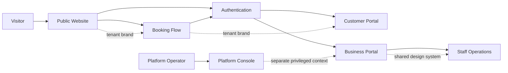
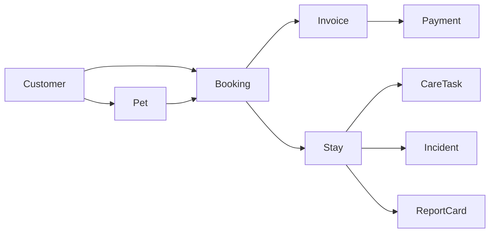

# Information Architecture and Navigation

- **Status:** In progress
- **MVP priority:** P0
- **Applies to:** Public website, booking, customer portal, business portal, staff operations, and platform console

## Purpose

This document defines how PetCare's product surfaces, navigation, routes, objects, and major screens fit together. It gives design and engineering one shared map so the public website, booking flow, customer portal, staff tools, business management, and platform administration feel intentionally connected rather than assembled as separate products.

It defines where users go and how context is preserved. Domain specifications remain authoritative for business behavior and permissions.

## Experience principles

1. **Start with today's job.** Staff land on time-sensitive arrivals, departures, care tasks, appointments, and alerts rather than a generic analytics page.
2. **Keep the customer experience light and calm.** The public website, booking, sign-in, and customer portal use a consistent tenant brand and light background.
3. **Separate business operation from platform operation.** Tenant owners manage their business in the Business Portal. PetCare operators use a visibly distinct Platform Console.
4. **Maintain explicit tenant and location context.** Users always know which business and location they are viewing.
5. **Preserve object context.** Moving from a customer to a pet, booking, invoice, or message retains a clear return path.
6. **Make exceptions visible.** Missing vaccines, failed payments, overdue medication, incidents, and publishing failures appear where action can be taken.
7. **Progressively disclose complexity.** Common tasks are easy to reach; advanced configuration appears only to authorized roles and relevant service types.
8. **Use one vocabulary.** `Booking`, `pet`, `customer`, `household`, `service`, `location`, and `resource` have stable meanings.
9. **Do not confuse visibility with permission.** Navigation adapts to access, but every route and action is enforced independently.
10. **Design mobile workflows deliberately.** Responsive behavior is task-specific, not a desktop page merely squeezed narrower.

## Product surface model



### Surface boundaries

| Surface          | Audience                                          | Primary objective                                                 | Identity context                                                |
| ---------------- | ------------------------------------------------- | ----------------------------------------------------------------- | --------------------------------------------------------------- |
| Public Website   | Anonymous visitor and customer                    | Learn, trust, and start booking                                   | Trusted tenant hostname; authentication optional                |
| Booking Flow     | Visitor or authenticated customer                 | Create a valid booking or waitlist request                        | Tenant required; customer may authenticate during flow          |
| Customer Portal  | Customer and household member                     | Manage pets, bookings, documents, payments, messages, and account | Identity plus business-scoped customer relationship             |
| Business Portal  | Owner, manager, front desk, accountant, marketing | Configure and manage the business                                 | Identity plus tenant membership, role, and location scope       |
| Staff Operations | Front desk, care staff, groomer, manager          | Execute today's pet-care work safely                              | Same membership as Business Portal with task-focused navigation |
| Platform Console | Authorized PetCare operator                       | Operate tenants and the SaaS platform                             | Platform identity and, when needed, support session             |

The Business Portal and Staff Operations may be delivered by one responsive application shell. They are distinct information-architecture modes because their priorities and default pages differ.

## Route namespaces

The final implementation may refine literal URLs, but boundaries remain stable.

| Namespace            | Purpose                     | Example                                   |
| -------------------- | --------------------------- | ----------------------------------------- |
| Tenant hostname root | Public website              | `https://happy-paws.example.com/services` |
| `/book`              | Tenant-aware booking flow   | `/book/availability`                      |
| `/account`           | Customer portal             | `/account/bookings/123`                   |
| `/app`               | Business and staff portal   | `/app/operations/today`                   |
| `/platform`          | Internal Platform Console   | `/platform/tenants/123`                   |
| `/auth`              | Authentication and recovery | `/auth/sign-in`                           |

Custom tenant domains use the same public, booking, and customer paths where supported. Internal business and platform routes use controlled application hostnames so public-domain changes cannot strand staff access.

## Tenant and location context

### Tenant selection

- Public visitors receive tenant context from a verified hostname.
- Customer users receive only businesses with active customer relationships.
- Staff users receive only active tenant memberships.
- Platform operators receive no tenant-data context from the global console until a permitted tenant or support session is selected.
- Tenant context never comes solely from a query parameter or client-stored label.

### Location selection

| Situation                      | Behavior                                                                                                     |
| ------------------------------ | ------------------------------------------------------------------------------------------------------------ |
| Single authorized location     | Location selector may be hidden, but context remains in page metadata and authorization.                     |
| Multiple authorized locations  | Persistent selector is visible in the business/staff shell.                                                  |
| All-locations report           | Selector explicitly says `All locations`; location-specific actions are disabled until a location is chosen. |
| Object belongs to one location | Object header displays that location and does not silently change it.                                        |
| Cross-location object          | Header shows participating locations and the user's effective scope.                                         |

Changing location updates list, dashboard, and creation defaults but does not mutate an already-open object's location. Unsaved work receives a warning before context changes.

## Global shell patterns

### Public and customer shell

- Tenant logo and primary navigation
- Consistent Book Now action
- Sign in or Account entry
- Location context where the tenant has multiple public locations
- Light background and tenant-approved brand tokens
- Accessible mobile menu
- Footer with contact, hours, policies, legal, and accessibility links

### Business and staff shell

- Product/tenant identity
- Persistent location selector when needed
- Role-aware primary navigation
- Global search
- Create/action launcher
- Notifications and operational alerts
- Help and support
- User, security, and sign-out menu
- Desktop sidebar plus compact responsive navigation

### Platform Console shell

- Distinct Platform Console label and styling
- Environment indicator
- Global tenant search
- Support-session status and countdown when active
- Platform alerts
- Operator identity and step-up status
- No tenant branding that could make an operator believe they are the tenant user

## Public website architecture

```text
Home
├── Services
│   ├── Boarding
│   ├── Daycare
│   ├── Grooming
│   └── Service detail
├── Pricing
├── Requirements
├── About
├── FAQ
├── Gallery
├── Policies
├── Locations / Contact
│   └── Location detail
├── Book Now
├── Sign In
└── Legal
    ├── Privacy
    ├── Terms
    └── Accessibility
```

Navigation includes only enabled, published pages. Book Now remains prominent on desktop and mobile. Service pages link into booking with permitted service and location context but never imply guaranteed availability or final price.

## Booking-flow architecture

Booking is a focused task flow, not part of general portal navigation.

```text
Booking entry
  -> Select location (when required)
  -> Select service
  -> Select pet(s) or describe new pet
  -> Choose dates/time
  -> Availability result
  -> Add-ons
  -> Customer sign-in/register (when not already authenticated)
  -> Pet details and eligibility
  -> Required questions/documents
  -> Price and policy review
  -> Deposit/payment
  -> Confirmation
```

Alternative exits:

- No availability -> waitlist offer
- Pet not eligible -> remediation or staff-review path
- Payment failure -> retry or safe saved state
- Approval required -> pending-request confirmation
- User exits -> saved progress only where consent, security, and expiry rules allow

### Booking-flow navigation rules

- A step indicator shows progress without making inaccessible future steps clickable.
- Back preserves valid entered data and recalculates dependent results when necessary.
- Browser refresh and sign-in redirects preserve a safe resumable state.
- Final pricing, availability, policies, and eligibility are revalidated before payment and confirmation.
- Tenant brand and support/contact access remain visible, but unrelated navigation is minimized.
- Confirmation provides clear next actions: view booking, add documents, add to calendar, or return home.

## Customer Portal architecture

### Primary navigation

```text
Overview
Bookings
Pets
Messages
Payments
Account
```

On mobile, the most-used destinations may appear in bottom navigation, with secondary items under `More`. Critical actions such as Book Again remain contextual rather than consuming a permanent navigation slot.

### Overview

- Upcoming booking card and next required action
- Missing or expiring pet documents
- Unpaid balance or failed payment requiring action
- Recent message or report card
- Quick actions: Book, Add Pet, Upload Document
- Household-sensitive alerts appropriate for the signed-in member

### Bookings

```text
Bookings
├── Upcoming
├── Requests / Pending approval
├── Waitlist
├── Past
└── Booking detail
    ├── Summary
    ├── Pets and services
    ├── Requirements and documents
    ├── Price, invoice, and payments
    ├── Messages and updates
    ├── Report card / media
    └── Allowed actions
```

Allowed actions may include modify request, cancel, pay balance, upload document, sign agreement, message business, or book again. Actions appear only when both authorization and booking state allow them.

### Pets

```text
Pets
├── Pet list
├── Add pet
└── Pet profile
    ├── Overview
    ├── Care
    ├── Feeding
    ├── Medications
    ├── Health and behavior
    ├── Vaccinations and documents
    ├── Bookings
    └── Access
```

Customer-facing labels use plain language. Internal-only alerts, staff notes, and risk classifications never appear simply because they relate to the pet.

### Messages

- Conversation list
- Booking-linked and general conversations
- Delivery or channel context where useful
- Attachment controls according to policy
- Unread state

Messages are not a substitute for emergency contact or a confirmed booking modification. Contextual warnings appear where necessary.

### Payments

- Balances requiring action
- Invoices and receipts
- Payment history
- Refund status
- Saved payment methods when supported by the processor

Platform subscription billing never appears here.

### Account

- Personal profile and verified contact methods
- Household members and access
- Communication preferences and consent
- Authorized pickup and emergency contacts
- Security, password, MFA, and sessions
- Privacy requests
- Sign out

## Business and Staff Portal architecture

### Primary navigation model

The desktop navigation has a small stable set of groups:

```text
Today
Calendar
Customers
Pets
Bookings
Operations
Payments
Messages
Reports
Website
Settings
```

Destinations are role-aware. A care attendant may see Today, Operations, Pets, and Messages. An accountant may see Payments and Reports but not pet medical detail. A marketing editor may see Website and approved Messages without operational access.

### Today

`Today` is the default staff landing page and action center.

- Location and current operational day
- Arrivals and departures
- Pets currently in care
- Appointments and daycare attendance
- Tasks due now, overdue, and upcoming
- Medication and feeding exceptions
- Resource/capacity summary
- Incidents and approvals requiring attention
- Payment or documentation blockers affecting today's movement
- Role-specific quick actions

The content is prioritized by urgency and role, not merely a grid of generic KPI cards.

### Calendar

- Day, week, and agenda views for MVP
- Location, service, resource, staff, and status filters as authorized
- Boarding spans, daycare attendance, grooming appointments, closures, and capacity indicators
- Create booking, open booking, move or modify through approved workflows
- Conflict and eligibility feedback

The calendar does not bypass Booking, Capacity, Pricing, or Eligibility rules. Drag-and-drop is deferred until its conflict, price, notification, and audit behavior is fully specified.

### Customers

```text
Customers
├── Search and list
├── New customer
├── Duplicate review (authorized roles)
└── Customer detail
    ├── Overview
    ├── Household and contacts
    ├── Pets
    ├── Bookings
    ├── Invoices and payments
    ├── Messages
    ├── Documents and consent
    ├── Notes and alerts
    └── Timeline
```

Customer detail is an object workspace. Related records open with a clear link back to the customer rather than reproducing every domain action inside one page.

### Pets

```text
Pets
├── Search and list
├── Eligibility attention list
└── Pet detail
    ├── Overview
    ├── Care profile
    ├── Feeding
    ├── Medication
    ├── Health and behavior
    ├── Vaccinations and documents
    ├── Bookings and stays
    ├── Operational timeline
    ├── Media and report cards
    └── Access and relationships
```

Critical safety information is summarized in the persistent object header or alert area where appropriate. It is not hidden in a remote tab.

### Bookings

```text
Bookings
├── Search and list
├── Requests / approval queue
├── Waitlist
├── Cancellations and no-shows
├── New booking
└── Booking detail
    ├── Overview and status
    ├── Customer and pets
    ├── Services, dates, and resources
    ├── Eligibility and documents
    ├── Price and policy snapshot
    ├── Invoice and payments
    ├── Communication history
    ├── Operational stay / appointment
    └── Audit timeline
```

The booking header shows status, service period, location, customer, pet count, outstanding blockers, balance, and primary valid action.

### Operations

```text
Operations
├── Arrivals
├── Departures
├── In Care
├── Boarding board
├── Daycare board
├── Grooming board
├── Care tasks
├── Feeding
├── Medication
├── Resources / housing
├── Incidents
└── Report cards
```

Role-specific default:

| Role              | Default operations view                            |
| ----------------- | -------------------------------------------------- |
| Front desk        | Arrivals and departures                            |
| Care staff        | Due care tasks                                     |
| Groomer           | Grooming board                                     |
| Daycare attendant | Daycare attendance/playgroup view when implemented |
| Manager           | Operational exceptions                             |

Operations screens prioritize rapid recording, safe confirmation, offline/error clarity, and minimal navigation steps. Medication and incident workflows use deliberate confirmation rather than one-click completion.

### Payments

```text
Payments
├── Balances due
├── Invoices
├── Transactions
├── Refunds
├── Deposits and credits
└── Reconciliation
```

Financial detail is hidden for roles without permission. Operations may see a simple `Payment required before checkout` blocker without access to processor or revenue detail.

### Messages

- Inbox and conversation filters
- Customer and booking context
- Compose using approved channels and templates
- Delivery failures and retry state
- Transactional preference/consent indicators
- Internal assignment where supported

### Reports

- Operational overview
- Occupancy and capacity
- Booking and waitlist
- Sales, invoices, payments, and reconciliation
- Customer activity
- Pet eligibility
- Care compliance and incidents
- Communication delivery
- Saved views and exports

The navigation uses business questions and roles rather than exposing a raw metric catalog.

### Website

- Site overview
- Theme and branding
- Pages and navigation
- Media
- SEO
- Domains
- Publishing readiness and history
- Inquiries

### Settings

```text
Settings
├── Business profile
├── Locations and hours
├── Services and add-ons
├── Resources and capacity
├── Pricing and policies
├── Vaccine and document requirements
├── Booking and waitlist
├── Payments
├── Communications
├── Staff and access
├── Integrations
├── Subscription and plan
└── Audit / data and privacy
```

Only relevant settings appear. For example, grooming configuration appears only when grooming is enabled or being set up. SaaS subscription settings are tenant-visible here, while platform operators manage the underlying subscription through the Platform Console.

## Platform Console architecture

```text
Platform Home
├── Tenants
│   ├── Tenant search
│   ├── Tenant summary
│   ├── Lifecycle and restrictions
│   ├── Provisioning
│   ├── Subscription and entitlements
│   ├── Support access
│   └── Administrative history
├── Subscriptions
│   ├── Plans and versions
│   ├── Billing events
│   └── Reconciliation
├── Support
│   ├── Cases
│   ├── Support sessions
│   └── Access history
├── Releases
│   ├── Feature definitions
│   ├── Rollouts and overrides
│   └── Kill switches
├── Jobs
├── Privacy Requests
├── Audit
├── Platform Notices
└── Operator Access
```

The console defaults to platform metadata. Entering tenant scope requires a deliberate selection, and opening tenant data requires the support-session process. A persistent banner shows tenant, case, scope, and time remaining.

## Global search

### Business Portal searchable objects

- Customer
- Household member
- Pet
- Booking number
- Invoice number
- Payment reference where permitted
- Staff member where permitted

Results are tenant-, role-, field-, and location-scoped before display. Search does not reveal that an unauthorized object exists.

### Search presentation

- Group results by object type
- Show the minimum identifying context needed to choose correctly
- Highlight relevant alerts without leaking sensitive detail
- Support keyboard navigation
- Preserve recent searches only under privacy policy
- Provide a full results page for larger result sets

Public-site search and Platform Console tenant search are separate implementations and indexes.

## Object workspace pattern

Customer, Pet, Booking, Invoice, and operational Stay use a shared workspace anatomy:

1. Breadcrumb or clear return context
2. Object identity and status
3. Tenant/location context where relevant
4. Critical alerts and blockers
5. Primary valid action
6. Summary facts
7. Stable tab navigation
8. Domain timeline or history
9. Secondary actions under an overflow menu

Actions are state-aware. Destructive or high-impact actions include consequence language, reason when required, and confirmation appropriate to risk.

## Cross-object navigation

Relationships use links rather than duplicate editable data:



Opening a related object preserves a navigation origin such as `Customer > Bella > Booking #1042`. A user can safely copy a canonical direct link, but returning to the origin does not depend on browser history alone.

## Create-action model

The global create launcher shows only authorized actions:

- New booking
- New customer
- New pet
- Take payment
- Create invoice adjustment where permitted
- Start check-in from eligible booking
- Record incident
- Compose message
- Invite staff

Creation starts with required context. If `New booking` is launched from a customer or pet, that context is preselected but revalidated. If launched with `All locations`, the user chooses a valid location before availability or pricing is calculated.

## Alerts and notifications architecture

### Operational alerts

Require action within the business workflow:

- Vaccine or documentation blocker
- Failed payment affecting arrival or checkout
- Overdue medication or care task
- Unassigned resource
- Incident escalation
- Failed required customer communication
- Capacity or scheduling conflict

### Personal notifications

Inform a specific user:

- Invitation accepted
- Export ready
- Assigned incident follow-up
- Website publication complete
- Support reply

### Presentation rules

- Severity, due time, object, location, and next action are explicit.
- Read/unread does not equal resolved/unresolved.
- Resolving an alert follows its owning domain workflow.
- Counts do not include inaccessible objects.
- Critical alerts cannot be dismissed without the allowed resolution or acknowledgement behavior.

## Responsive navigation

### Public and Customer Portal

- Mobile-first linear forms
- Sticky primary action when it does not cover content or keyboard input
- Bottom navigation limited to the most important customer destinations
- Secondary items under a clearly labeled menu
- No hover-only interaction

### Staff Operations

- Task lists, arrivals, pet summaries, medication recording, photos, and incidents work well on phones and tablets.
- Dense calendars and capacity boards provide mobile agenda or list alternatives.
- Desktop multi-column layouts collapse to ordered sections based on urgency.
- Critical pet alerts remain visible without horizontal scrolling.
- Large touch targets support use in active-care environments.

### Business Management

Complex configuration and reporting remain responsive, but the product may recommend a larger screen for high-density tasks. It must not silently remove essential actions on mobile.

## Empty, loading, error, and unavailable states

Every major destination specifies:

- Initial loading state
- Incremental loading state
- True empty state with next action
- Filtered-no-results state
- Permission-denied state
- Tenant or location unavailable state
- Dependency unavailable state
- Recoverable validation/error state
- Stale-data state where applicable

An empty state is not a generic illustration and `Nothing here`. It explains what the area contains, why it may be empty, and the next permitted action.

## Accessibility navigation rules

- Provide skip links and semantic landmarks.
- Use one clear page-level heading.
- Announce route and major context changes.
- Maintain logical focus after dialogs, validation, and asynchronous updates.
- Support keyboard navigation for menus, tabs, tables, calendars, and command controls.
- Do not use color, position, or icon alone to indicate status.
- Provide a list alternative to complex visual boards.
- Keep tab and navigation labels understandable outside visual context.
- Allow browser zoom and responsive reflow without hiding essential content.
- Preserve reduced-motion preferences.

## URL and deep-link behavior

- Protected canonical URLs identify the object using opaque stable IDs or safe public identifiers.
- Direct navigation re-runs authentication and authorization.
- Unauthorized and nonexistent protected objects use responses that avoid object enumeration.
- Sign-in returns only to allowlisted routes within the resolved tenant context.
- Links in email/SMS are tenant-aware, purpose-bound when sensitive, and expire when appropriate.
- Modal-only state is not the sole canonical address for important objects.
- Filters useful for sharing may be URL-encoded only when they contain no sensitive values.
- Unsaved form data is not placed in the URL.

## Role-based navigation summary

| Destination | Owner |   Manager    |     Front desk     |   Care staff    |         Groomer          | Accountant |       Marketing        |
| ----------- | :---: | :----------: | :----------------: | :-------------: | :----------------------: | :--------: | :--------------------: |
| Today       |  Yes  |     Yes      |        Yes         |       Yes       |           Yes            |  Optional  |        Optional        |
| Calendar    |  Yes  |     Yes      |        Yes         |    Assigned     |         Assigned         |  Optional  |           No           |
| Customers   |  Yes  |     Yes      |        Yes         |     Limited     |         Limited          |  Limited   |        Limited         |
| Pets        |  Yes  |     Yes      |        Yes         |       Yes       |         Assigned         |  Limited   |           No           |
| Bookings    |  Yes  |     Yes      |        Yes         |    Assigned     |         Assigned         |  Limited   |           No           |
| Operations  |  Yes  |     Yes      |        Yes         |       Yes       |         Grooming         |     No     |           No           |
| Payments    |  Yes  | Configurable |    Configurable    |       No        | Tips/assigned only later |    Yes     |           No           |
| Messages    |  Yes  |     Yes      |        Yes         |  Configurable   |       Configurable       |  Limited   |      Configurable      |
| Reports     |  Yes  | Configurable | Operational subset | Assigned subset |     Assigned subset      | Financial  | Marketing subset later |
| Website     |  Yes  | Configurable |         No         |       No        |            No            |     No     |          Yes           |
| Settings    |  Yes  | Configurable |      Limited       |       No        |            No            |  Limited   |     Website subset     |

This is a presentation guide, not the permission source of truth. IAM permissions and domain policies control actual access.

## MVP screen inventory

### Public website and authentication

- Home
- Services list
- Service detail
- Pricing
- Requirements
- About
- FAQ
- Gallery
- Policies
- Contact/location
- Inquiry confirmation
- Privacy, terms, accessibility
- Branded not-found and unavailable
- Register
- Verify email
- Sign in
- Forgot/reset password
- MFA challenge

### Booking

- Booking entry
- Location selection
- Service selection
- Pet selection/new-pet start
- Date/time and availability
- Add-ons
- Customer authentication handoff
- Customer and household confirmation
- Pet details and eligibility
- Required questions/documents
- Quote and policies
- Deposit/payment
- Pending approval
- Waitlist entry
- Confirmation
- Saved/resumable booking state

### Customer Portal

- Overview
- Booking lists and booking detail
- Waitlist detail
- Pet list, add pet, and pet detail tabs
- Vaccination/document upload and status
- Messages and conversation
- Balances, invoices, receipts, payment history
- Household members and access
- Emergency contacts and authorized pickup
- Communication preferences and consent
- Profile and addresses
- Security and sessions
- Privacy request

### Business and Staff Portal

- Today
- Calendar
- Customer list/create/detail tabs
- Duplicate-customer review
- Pet list/detail/eligibility queues
- Booking list/create/detail tabs
- Request approval queue
- Waitlist board/detail/promotion
- Cancellation and no-show queues
- Arrivals and check-in
- Departures and checkout
- In-care list
- Boarding, daycare, and grooming boards
- Care tasks
- Feeding and medication worklists and record flows
- Housing/resource assignment
- Incident list/create/detail/review
- Report-card draft/review/publish
- Invoice, payment, refund, deposit, and reconciliation views
- Messages and templates
- Report catalog and MVP reports
- Website administration screens
- Business, location, service, capacity, pricing, policy, eligibility, payment, communication, staff, subscription, and audit settings

### Platform Console

- Platform home
- Tenant search/summary/lifecycle
- Provisioning runs
- Plans, subscriptions, and entitlements
- Restrictions and reactivation
- Support cases and sessions
- Feature controls
- Administrative jobs
- Privacy requests
- Audit search/export
- Notices
- Platform operator access

The inventory identifies destinations; it is not authorization to implement every screen before workflow priorities and implementation sequencing are defined.

## Acceptance criteria

### IA-AC-001: Tenant context remains explicit

**Given** a user belongs to two businesses  
**When** they switch from Business A to Business B  
**Then** the shell clearly displays Business B, all lists and actions reload under Business B authorization, and no Business A content remains visible.

### IA-AC-002: Role-aware navigation

**Given** a care staff member lacks financial permissions  
**When** the portal loads  
**Then** financial navigation is absent, direct financial URLs are denied, and operational payment blockers reveal no unauthorized financial detail.

### IA-AC-003: Customer context handoff

**Given** a visitor begins booking boarding from a tenant service page  
**When** they register and return to the flow  
**Then** valid tenant, location, service, and entered booking context are restored without accepting untrusted redirect or tenant parameters.

### IA-AC-004: Mobile care task

**Given** a care attendant uses a phone  
**When** they open a due medication task  
**Then** pet identity, medication, dose, timing, alerts, and confirmation are usable without horizontal scrolling or hidden critical information.

### IA-AC-005: Deep-link authorization

**Given** a user bookmarks a booking detail URL and later loses access  
**When** they revisit it  
**Then** authorization is re-evaluated and the booking is not displayed from cache.

### IA-AC-006: Operational alert resolution

**Given** an overdue medication alert appears on Today  
**When** a user marks the notification read  
**Then** the underlying operational alert remains unresolved until the medication workflow records an allowed outcome.

### IA-AC-007: Object context

**Given** staff open a booking from a customer's profile  
**When** they finish reviewing it  
**Then** they have a clear route back to the same customer context without relying only on browser history.

### IA-AC-008: Platform support distinction

**Given** a platform operator opens an approved support session  
**When** tenant-scoped information is shown  
**Then** the interface displays the Platform Console identity, tenant, case, scope, and expiry and never presents the operator as tenant staff.

### IA-AC-009: Empty-state action

**Given** a new tenant has no services configured  
**When** its owner opens the service area  
**Then** the empty state explains the requirement and offers the permitted setup action rather than showing an empty table alone.

### IA-AC-010: All-locations action safety

**Given** a manager is viewing `All locations`  
**When** they start a location-specific action  
**Then** the system requires an authorized location before creating or pricing the record.

## Open decisions

- Final customer mobile bottom-navigation destinations
- Whether `Calendar` or `Today` is the owner/manager default desktop landing page
- How global search is activated on mobile
- Initial keyboard shortcut and command-launcher scope
- Whether booking remains on the tenant custom domain or a platform application hostname
- How all-location calendar information is summarized without suggesting shared capacity
- Which operational boards require tablet-specific layouts
- Whether Messages is top-level for all staff roles or appears contextually for limited roles
- When drag-and-drop scheduling becomes safe enough to add
- Which user preferences may customize navigation without making support inconsistent

## Related specifications

- [Product Vision](../product/product-vision.md)
- [MVP Scope](../product/mvp-scope.md)
- [Architecture Overview](../architecture/overview.md)
- [Identity and Access](../domains/identity-access/README.md)
- [Customer and Household](../domains/customer-household/README.md)
- [Booking and Waitlist](../domains/booking-waitlist/README.md)
- [Operations](../domains/operations/README.md)
- [Reporting](../domains/reporting/README.md)
- [Website and Content](../domains/website-content/README.md)
- [Platform Administration](../domains/platform-administration/README.md)
